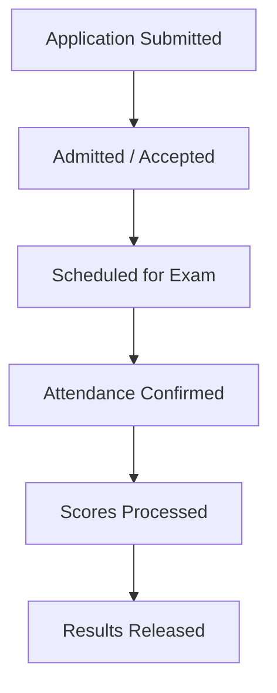

# 🛡️ SecureCAT-v2: Role-Based College Admission Testing System

[](https://laravel.com)
[](https://svelte.dev)
[](https://inertiajs.com)
[](https://tailwindcss.com)
[](https://php.net)

SecureCAT-v2 is a comprehensive, zero-trust web application specifically engineered to streamline the college admission testing pipeline for the **Guidance and Registrar Offices at the Ilocos Sur Polytechnic State College (ISPSC) Tagudin Campus**. The system handles the entire applicant lifecycle—from registration and dynamic room scheduling to proctor monitoring, automated scoring, result sheet generation, and AI-assisted counseling.

---

## 📌 Table of Contents
- [🏢 System Overview \& Architecture](#-system-overview--architecture)
- [🛠️ Existing System Features (V2 Baseline)](#️-existing-system-features-v2-baseline)
- [🔮 Planned Advanced Capstone Features (Future Roadmap)](#-planned-advanced-capstone-features-future-roadmap)
- [💾 Database Architecture \& ERD](#-database-architecture--erd)
- [💻 Technology Stack \& Environment](#-technology-stack--environment)
- [🚀 Development \& Testing Guidelines](#-development--testing-guidelines)
- [🚢 SecureCAT (NEXIAM) — Dokploy Deployment Guide](#-securecat-nexiam--dokploy-deployment-guide)

---

## 🏢 System Overview & Architecture

SecureCAT transitionally automates manual admission processes into a secured digital workflow. The core engine models a strict status pipeline for applicants.



- **Role-Based Access Control (RBAC)**: Enforces strict isolation between roles (Applicants, Registrar Staff, Registrar Admins, Test Admins, Proctors, and Super Admins) via backend policy gating and middleware route filters.
- **Application Window Boundaries**: Limits applicant registration according to active academic year configurations and scheduling windows.

---

## 🛠️ Existing System Features (V2 Baseline)

### 1. Applicant / Examinee Portal
- **Account Setup & Security**: Applicants activate accounts and configure passwords using time-limited, secure tokens.
- **Application Tracking**: A real-time visual tracker displays the milestone status of their application.
- **Admission Slip Generation**: Render and download high-quality, print-ready PDFs of customized admission slips containing room information, date, and schedule.
- **AI Companion Widget**: An embedded interactive chat helper powered by local vector document embeddings to guide examinees through test rules, requirements, and office locations.
- **Portal Notifications**: View real-time notification alerts, with support for individual mark-as-read options.
- **Self-Service Application Editing**: Update personal data and course preferences if the assigned session status allows edit access.

### 2. Registrar Portal (Staff & Admins)
- **Application Pipeline**: Streamlined review interface to accept, reject, or bulk-reopen incoming applications with custom rejection reason logging.
- **Academic Year, Room, & Course Setup**: Manage active school years, enroll courses, and map rooms with precise seat capacity tracking.
- **CSV Application Ingest Engine**: Validate and import hundreds of student applications using custom Excel/CSV templates with analysis, preview, and confirmation stages.
- **Interactive Scheduling Assistant**: An advanced algorithmic scheduling assistant helping registrars dynamically batch applicants into sessions based on room availability and proctor constraints.
- **Analytical Reporting**: Export comprehensive application analytics reports in CSV/Excel format.

### 3. Guidance Portal (Proctors & Test Admins)
- **Aptitude Component Setup**: Configure distinct testing areas (e.g., verbal, math, abstract reasoning) alongside scoring formulas.
- **Direct Score Entry**: Grade walk-in applicants instantly via custom Direct Assessment tools.
- **CSV Score Ingestion**: Ingest and map examinee test sheets using OMR machine-readable score imports with a full preview and validation flow.
- **Counseling & Result Management**: Record consultation summaries and recommendation comments based on test score percentiles.
- **Result Templates & Print Engine**: Design result sheets using customizable HTML templates, complete with dynamic watermarks and PDF/DOCX bulk downloads.
- **Custom Rating Scales**: Set up custom rating metrics mapped to specific results sheet templates.

### 4. Proctor Portal (Room Operations)
- **Session Roster & Monitoring**: View assigned test sessions, check student information, and manage rosters.
- **Proctor Attendance Dashboard**: Mark attendee presence (individually or in bulk) at the exam room door.
- **Session Lifecycle Controls**: Start, extend, close, and submit exam session lists directly to the Test Admin.

### 5. System Administration Portal
- **User & Role Administration**: Manage system user accounts, roles, and credentials.
- **Google OAuth Integration**: Secure Google sign-in config for administrative staff.
- **Security Audit Logs**: Track sensitive operations (score updates, proctor assignments, template modifications) with IP, browser metadata, and before/after database snapshots. Exportable to CSV/Excel.
- **System Settings Configuration**: Manage global settings such as default slip templates and normalized score conversions.
- **AI Knowledge Sync**: Upload and sync PDF/Markdown knowledge base files to build vector embeddings for the AI Companion.
- **Notifications Hub**: Broadcast notifications to system users and mark notifications as read in bulk.
- **Profile Self-Service**: Edit personal administrative account details and passwords.

---

## 🔮 Planned Advanced Capstone Features (Future Roadmap)

> [!NOTE]
> The advanced scope is planned for **Phase 5 of the Capstone Roadmap** to fulfill the BSIT research objectives. The primary design contracts and research specs for these features are managed under the [capstone/](./capstone/) directory (specifically in [ROADMAP.md](./capstone/ROADMAP.md) and [SYSTEM_FEATURES.md](./capstone/SYSTEM_FEATURES.md)).

### Zero-Trust Data Governance (Planned Goal)
- **Cryptographic Score Integrity**: When score entries are submitted, a SHA-256 HMAC signature lock will be calculated using a server-side secret key combined with:
  $$\text{HMAC} = \text{SHA256}(\text{Applicant UUID} + \text{Test Score} + \text{Proctor UUID}, \text{Secret Key})$$
  Any direct database tempering will trigger warning flags on the dashboard.
- **Immutable Write-Only Logs**: Security-critical actions will be committed to a dedicated, append-only log table that cannot be edited or deleted by application users.

### Offline Resilience & Computer Vision (Planned Goal)
- **Automated OMR Answer Sheet Ingestion**: Allows test admins to take a photo of shaded physical bubble sheets. An integrated computer-vision pipeline grades and imports applicant scores automatically.
- **Offline Proctor PWA**: A Progressive Web App (PWA) that allows proctors to scan examinees offline during network drops, with IndexedDB caching and background synchronization.

### AI-Powered Office Operations (Planned Goal)
- **In-Office RAG Copilot**: A secure local AI assistant for guidance counselors. Staff can query statistics (e.g. *"Identify the percentage of applicants who failed the Math component but passed the English component in Room 101"*) using natural language.
- **Automated Scheduling Agent**: An optimization algorithm that schedules applicants into exam sessions without manual room allocation conflicts.

### Multi-Tenant Scalability (Planned Goal)
- **Database Segregation**: Preconfigured database multi-tenancy, ensuring the platform can scale to separate campuses or other SUCs while keeping student records isolated under the Philippine Data Privacy Act (DPA).

---

## 💾 Database Architecture & ERD

The core data structures are designed around the following models:

| Model | Table Name | Key Associations / Purpose |
|---|---|---|
| **User** | `users` | System staff, proctors, and administrators. Associated with `roles`. |
| **Applicant** | `applicants` | The student credential entity. Belongs to `Application` and belongs to many `ExamSessions` and `GradingSessions`. |
| **Application** | `applications` | Student registration profile (names, preferences, GWA, status). |
| **ExamSession** | `exam_sessions` | Testing sessions, associated with a `Room` and an `AcademicYear`. Has many proctors (`User`) and `Applicants`. |
| **GradingSession** | `grading_sessions` | Tracks sessions ready for scoring and release. |
| **ApplicantScore** | `applicant_scores` | Scores per aptitude component. |
| **AptitudeArea** | `aptitude_areas` | Specific exam sections (Math, Verbal, Abstract, etc.) with custom weights. |
| **ConsultationSummary** | `consultation_summaries` | Guidance counseling notes and recommendation files. |
| **AuditLog** | `audit_logs` | Write-only security audit trail. |
| **KnowledgeDocument** | `knowledge_documents` | Embeddings files uploaded for the AI Companion context. |
| **ResultSheetTemplate** | `result_sheet_templates` | Customize printed result document layouts. |

---

## 💻 Technology Stack & Environment

- **Backend**: [Laravel 12](https://laravel.com) / PHP 8.4 (using constructor property promotion and explicit return type declarations)
- **Frontend**: [Inertia.js v2](https://inertiajs.com) / [Svelte 5](https://svelte.dev) / [Tailwind CSS v4](https://tailwindcss.com) / [shadcn-svelte](https://shadcn-svelte.com)
- **Database**: MySQL / MariaDB
- **Ecosystem Tools**: Laravel Prompts, Laravel Pail, Laravel Pint, PHPUnit 11
- **Local Environment**: Laragon (Windows native hosting)

---

## 🚀 Development & Testing Guidelines

### 1. Setup & Execution
Run the following commands to spin up the local development dependencies:
```bash
# Install PHP dependencies
composer install

# Install JS dependencies
npm install

# Run the local frontend compiler
npm run dev

# Run the database migration and seeder
php artisan migrate --seed
```

### 2. Code Formatting (Pint)
Before committing any backend modifications, run Laravel Pint to format files to the repository's rules:
```bash
vendor/bin/pint --dirty --format agent
```

### 3. Testing Suite (PHPUnit)
All codebase changes must be backed by testing. Run unit and feature tests using the following commands:
```bash
# Run all tests in compact mode
php artisan test --compact

# Run a specific test file
php artisan test --compact tests/Feature/ExampleTest.php

# Filter to run a specific test case
php artisan test --compact --filter=testName
```

### 4. Beads Task Tracking (bd)
Use the lightweight `bd` task tracking system to manage current capstone issues:
```bash
# Discover available tasks
bd ready

# View detailed task description
bd show <id>

# Mark a task as in-progress
bd update <id> --status in_progress

# Mark a task as completed
bd update <id> --status done
```

---

## 🚢 SecureCAT (NEXIAM) — Dokploy Deployment Guide

> Minimal deployment: App Container + MySQL. No Redis needed for demo.
> Everything is automated — migrations, seeders, and storage symlink all run on first boot.

### Stack
- **App:** Built from `Dockerfile` via Docker Compose (`compose.prod.yaml`)
- **Database:** MySQL 8.4 (provisioned automatically by Compose)
- **Persistent Storage:** Docker volume mounted at `/var/www/html/storage`

### Step 1 — Create a Compose Service in Dokploy
1. Go to your Dokploy dashboard → **Create Service** → **Compose**.
2. Connect your GitHub account and select this repository.
3. Set the **Compose File** to `compose.prod.yaml`.

### Step 2 — Set Environment Variables
In the Compose service's **Environment** tab, paste the contents of [`.env.dokploy.example`](.env.dokploy.example) and fill in these required values:

| Variable | What to put |
|---|---|
| `APP_URL` | Your public domain (e.g. `https://securecat.yourdomain.com`) |
| `APP_KEY` | Generate with `php artisan key:generate --show` and paste the output |
| `DB_PASSWORD` | Any strong password for your MySQL root user |
| `SUPER_ADMIN_PASSWORD` | Your desired admin login password |
| `OPENROUTER_API_KEY` | *(Optional)* AI Scheduling Assistant |
| `MIXEDBREAD_API_KEY` | *(Optional)* AI Knowledge Companion |

### Step 3 — Deploy
Click **Deploy**. On first boot the container will automatically:
- ✅ Wait for MySQL to be healthy
- ✅ Run all database migrations
- ✅ Seed all default data (roles, courses, rooms, rating scale, Super Admin account)
- ✅ Create the storage symlink
- ✅ Rebuild config cache

Once the logs show the container is running, open `APP_URL` in your browser and log in with your `SUPER_ADMIN_EMAIL` and `SUPER_ADMIN_PASSWORD`.

### Notes
- **Redeployments are safe** — migrations only apply new changes; seeders are idempotent.
- **Uploaded files and logs persist** across redeployments via the Docker volume.
- **LibreOffice & Chromium** are pre-installed in the Docker image. No extra setup needed for PDF generation.
- For detailed architecture notes see [`docs/superpowers/specs/2026-06-26-dokploy-deployment-design.md`](docs/superpowers/specs/2026-06-26-dokploy-deployment-design.md).

