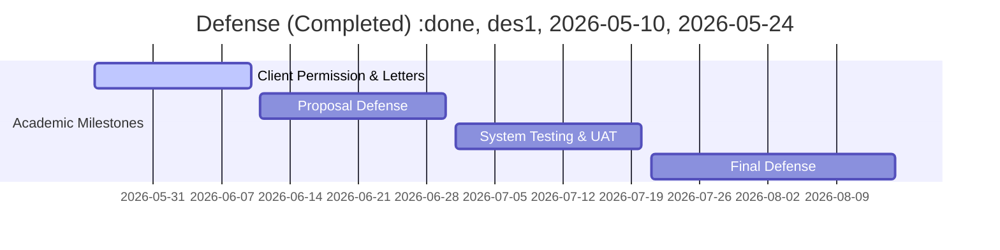

# SecureCAT-v2 Capstone Project - Complete Documentation

> **Generated:** June 2, 2026  |  **Project:** BSIT Capstone - SecureCAT-v2  |  **Team:** David (Team Lead), Christine, Jaypee

---

## 📋 Table of Contents

1. [Project Overview & Roadmap](#project-overview)
2. [System Features](#system-features)
3. [Writing Guides (GUIDE-1 through GUIDE-6)](#writing-guides)
4. [Research Materials](#research-materials)
5. [Strategy & Defense Planning](#strategy)
6. [Team Coordination & Task Management](#team-coordination)
7. [Member Direction Files](#member-directions)
8. [Self-Assessments](#self-assessments)
9. [Supporting Assets](#supporting-assets)

---


## PROJECT OVERVIEW


### 📄 README.md

# SecureCAT Capstone Directory Index

This directory serves as the centralized repository for all BSIT Capstone-related documents, guidelines, and pathways for **"SecureCAT: A Role-Based College Admission Testing System for the Guidance and Registrar Offices at ISPSC Tagudin."**

---

## Directory Structure

All files listed below are clickable links:

*   **[README.md](README.md)** — This file (main Markdown index)
*   **[ROADMAP.md](ROADMAP.md)** — Chronological milestone tracker from Title Defense to Final Defense
*   **[SYSTEM_FEATURES.md](SYSTEM_FEATURES.md)** — Canonical list of built vs. planned features
*   **[SecureCAT Letter.docx](SecureCAT%20Letter.docx)** — Formal client letter
*   **[BSIT Capstone Template.docx](BSIT%20Capstone%20Template.docx)** — Official docuCheck template (source of truth for formatting)
*   📁 **[guides/](guides/)** — Official formatting & content guides
    *   **[GUIDE-1-FORMATTING.md](guides/GUIDE-1-FORMATTING.md)** — Formatting rules (margins, fonts, spacing — matches template)
    *   **[GUIDE-2-CHAPTER1-CONTENT.md](guides/GUIDE-2-CHAPTER1-CONTENT.md)** — Chapter 1 content requirements (Background, Framework, Objectives, Scope)
    *   **[GUIDE-3-CHAPTER2-CONTENT.md](guides/GUIDE-3-CHAPTER2-CONTENT.md)** — Chapter 2 content requirements (Methodology)
    *   **[GUIDE-4-AIDLC-DEFENSE.md](guides/GUIDE-4-AIDLC-DEFENSE.md)** — Panel defense strategy for AIDLC software model
    *   **[GUIDE-5-CHECKLIST.md](guides/GUIDE-5-CHECKLIST.md)** — Complete pre-submission checklist
    *   **[GUIDE-6-CHAPTER3-ADVANCE.md](guides/GUIDE-6-CHAPTER3-ADVANCE.md)** — Chapter 3 advance guide (Findings, Conclusion, Recommendations)
    *   **[capstone-guides-agnostic.zip](guides/capstone-guides-agnostic.zip)** — Agnostic template ZIP
*   📁 **[research/](research/)** — Pre-research materials
    *   **[RESEARCH_DIRECTION_ANALYSIS.md](research/RESEARCH_DIRECTION_ANALYSIS.md)** — Research direction, thesis, and core pillars
    *   **[RESEARCH_ARGUMENT_BANK.md](research/RESEARCH_ARGUMENT_BANK.md)** — Arguments organized by task/section (Ch 1 & Ch 2)
    *   **[SEARCH_TERM_CHEAT_SHEET.md](research/SEARCH_TERM_CHEAT_SHEET.md)** — Literature search queries per section and topic
    *   **[Chapter_1_2_Drafting_Plan.md](research/Chapter_1_2_Drafting_Plan.md)** — Narrative structure and blending strategy (reference)
    *   **[Existing_and_Planned_Features.md](research/Existing_and_Planned_Features.md)** — Detailed mapping of existing vs. planned features
*   📁 **[strategy/](strategy/)** — Defense & framing strategy
    *   **[pre_proposal_defense.md](strategy/pre_proposal_defense.md)** — Tactical defense strategy (Trojan Horse framing & panel playbook)
*   📁 **[team_meta/](team_meta/)** — Team coordination & task management
    *   **[COMPREHENSIVE_TASK_REPORT.md](team_meta/COMPREHENSIVE_TASK_REPORT.md)** — Master task overview (assignments & status)
    *   **[TASK_DISTRIBUTION_PLAN.md](team_meta/TASK_DISTRIBUTION_PLAN.md)** — Detailed task breakdowns and deliverables
    *   **[TEAM_META_GUIDE_Ch1_Ch2.md](team_meta/TEAM_META_GUIDE_Ch1_Ch2.md)** — Operational manual (capability checklists & quality gates)
    *   **[TEAM_TASK_CHECKLIST.md](team_meta/TEAM_TASK_CHECKLIST.md)** — Live task tracker
    *   **[CAPTAINING_OVERVIEW.md](team_meta/CAPTAINING_OVERVIEW.md)** — Strategic assessment (historical context)
    *   📁 **[members/](team_meta/members/)** — Personal execution guides
        *   **[David's Execution Plan](team_meta/members/david/DIRECTION.md)**
        *   **[Christine's Execution Plan](team_meta/members/christine/DIRECTION.md)**
        *   **[Jaypee's Execution Plan](team_meta/members/jaypee/DIRECTION.md)**
*   📁 **[drafts/](drafts/)** — Active chapter drafts (to be populated)
*   📁 **[_archive/](_archive/)** — Superseded files (kept for historical context)
    *   **[Task_Division_Chapter1_2.md](_archive/Task_Division_Chapter1_2.md)** — Early task division (superseded)

---

## Essential Reading Order

**For ALL Team Members (before writing):**

1.  **[GUIDE-1-FORMATTING.md](guides/GUIDE-1-FORMATTING.md)** — Formatting rules (non-negotiable)
2.  **[GUIDE-2-CHAPTER1-CONTENT.md](guides/GUIDE-2-CHAPTER1-CONTENT.md)** — Chapter 1 content requirements
3.  **[GUIDE-3-CHAPTER2-CONTENT.md](guides/GUIDE-3-CHAPTER2-CONTENT.md)** — Chapter 2 content requirements
4.  **[RESEARCH_DIRECTION_ANALYSIS.md](research/RESEARCH_DIRECTION_ANALYSIS.md)** — Research direction & thesis
5.  **[RESEARCH_ARGUMENT_BANK.md](research/RESEARCH_ARGUMENT_BANK.md)** — Arguments for your assigned task
6.  **[SEARCH_TERM_CHEAT_SHEET.md](research/SEARCH_TERM_CHEAT_SHEET.md)** — Search queries for lit review
7.  **[COMPREHENSIVE_TASK_REPORT.md](team_meta/COMPREHENSIVE_TASK_REPORT.md)** — Your task assignments

**For Team Leader (David):**

*   **[pre_proposal_defense.md](strategy/pre_proposal_defense.md)** — Defense strategy
*   **[GUIDE-4-AIDLC-DEFENSE.md](guides/GUIDE-4-AIDLC-DEFENSE.md)** — AIDLC software model defense
*   **[GUIDE-5-CHECKLIST.md](guides/GUIDE-5-CHECKLIST.md)** — Final submission checklist
*   **[GUIDE-6-CHAPTER3-ADVANCE.md](guides/GUIDE-6-CHAPTER3-ADVANCE.md)** — Chapter 3 advance reference
*   **[CAPTAINING_OVERVIEW.md](team_meta/CAPTAINING_OVERVIEW.md)** — Strategic assessment (historical context)

---

## File Descriptions

### Core Documentation

| File | Purpose |
|------|---------|
| **[ROADMAP.md](ROADMAP.md)** | Chronological milestone tracker from Title Defense to Final Defense |
| **[SYSTEM_FEATURES.md](SYSTEM_FEATURES.md)** | Built features vs. "Trojan Horse" advanced features |
| **[SecureCAT Letter.docx](SecureCAT%20Letter.docx)** | Formal client letter to Campus Director |
| **[BSIT Capstone Template.docx](BSIT%20Capstone%20Template.docx)** | Official manuscript template — docuCheck validates against this |

### guides/ (Official Guides)

| File | Purpose |
|------|---------|
| **[GUIDE-1-FORMATTING.md](guides/GUIDE-1-FORMATTING.md)** | ISPSC manuscript formatting rules (margins, fonts, spacing, tables, figures) |
| **[GUIDE-2-CHAPTER1-CONTENT.md](guides/GUIDE-2-CHAPTER1-CONTENT.md)** | Chapter 1 content requirements (Background, Framework, Objectives, Scope) |
| **[GUIDE-3-CHAPTER2-CONTENT.md](guides/GUIDE-3-CHAPTER2-CONTENT.md)** | Chapter 2 content requirements (Methodology sections) |
| **[GUIDE-4-AIDLC-DEFENSE.md](guides/GUIDE-4-AIDLC-DEFENSE.md)** | Panel defense strategy for AIDLC software model |
| **[GUIDE-5-CHECKLIST.md](guides/GUIDE-5-CHECKLIST.md)** | Complete pre-submission checklist |
| **[GUIDE-6-CHAPTER3-ADVANCE.md](guides/GUIDE-6-CHAPTER3-ADVANCE.md)** | Chapter 3 advance guide (Findings, Conclusion, Recommendations) |

### research/ (Pre-Research Materials)

| File | Purpose |
|------|---------|
| **[RESEARCH_DIRECTION_ANALYSIS.md](research/RESEARCH_DIRECTION_ANALYSIS.md)** | Research direction review — thesis, priorities, and alignment |
| **[RESEARCH_ARGUMENT_BANK.md](research/RESEARCH_ARGUMENT_BANK.md)** | Key arguments organized by task/section for Chapter 1 & 2 |
| **[SEARCH_TERM_CHEAT_SHEET.md](research/SEARCH_TERM_CHEAT_SHEET.md)** | Literature search queries grouped by section and topic |
| **[Chapter_1_2_Drafting_Plan.md](research/Chapter_1_2_Drafting_Plan.md)** | Narrative structure and blending strategy (reference material) |
| **[Existing_and_Planned_Features.md](research/Existing_and_Planned_Features.md)** | Detailed mapping of existing vs. planned features (reference) |

### strategy/ (Defense & Framing)

| File | Purpose |
|------|---------|
| **[pre_proposal_defense.md](strategy/pre_proposal_defense.md)** | Tactical defense strategy — "Trojan Horse" framing & panel playbook |

### team_meta/ (Team Coordination)

| File | Purpose |
|------|---------|
| **[COMPREHENSIVE_TASK_REPORT.md](team_meta/COMPREHENSIVE_TASK_REPORT.md)** | Master task overview — every task, owner, and status |
| **[TASK_DISTRIBUTION_PLAN.md](team_meta/TASK_DISTRIBUTION_PLAN.md)** | Detailed task breakdowns with subtasks and deliverables |
| **[TEAM_META_GUIDE_Ch1_Ch2.md](team_meta/TEAM_META_GUIDE_Ch1_Ch2.md)** | Team operations manual — capability checklists, work packets, quality gates |
| **[TEAM_TASK_CHECKLIST.md](team_meta/TEAM_TASK_CHECKLIST.md)** | Live task tracker — check off as you go |
| **[CAPTAINING_OVERVIEW.md](team_meta/CAPTAINING_OVERVIEW.md)** | Strategic assessment of team composition (historical context) |

### _archive/ (Superseded)

| File | Purpose |
|------|---------|
| **[Task_Division_Chapter1_2.md](_archive/Task_Division_Chapter1_2.md)** | Early task division — replaced by TASK_DISTRIBUTION_PLAN |

---

## Instructor Submission Requirements

> "To all groups with approved title, construct your manuscript with the following contents:
> Title page, Table of Contents, Chapter 1, Chapter 2, Appendices (letter to conduct, Use Case Diagram).
> To check the formatting and template, run your document using your account in the docuCheck system as you have created in Activity 1.
> Attach here the following: Brandname.docx, Proof of running the document in the docuCheck system."

**Deadline:** June 10, 2026  
**Mode:** Google Classroom (or physical copy if required)  
**Deliverables:**
1. `Brandname.docx` — Complete manuscript named after your group's brandname
2. docuCheck proof screenshot — Evidence the document passed formatting validation

---

> [!IMPORTANT]
> **Chapter 2 is METHODOLOGY** (per the BSIT Capstone Template). It does NOT contain a "Review of Related Literature." The sections are: Research Design, Software Model, Project Plan, Project Assignment, Population and Locale, Research Instruments, Data Analysis. All literature and citations belong in Chapter 1 Background paragraphs.

> [!IMPORTANT]
> **Agent Directive:** When collaborating on capstone features, always cross-reference `ROADMAP.md` and `SYSTEM_FEATURES.md` to ensure alignment with panelist requirements and the locked title scope. For formatting, the BSIT Capstone Template.docx is the authority.

---

## Quick Access Links

*   **Start Writing:** **[TEAM_META_GUIDE_Ch1_Ch2.md](team_meta/TEAM_META_GUIDE_Ch1_Ch2.md)**
*   **Formatting Rules:** **[GUIDE-1-FORMATTING.md](guides/GUIDE-1-FORMATTING.md)**
*   **Official Template:** **[BSIT Capstone Template.docx](BSIT%20Capstone%20Template.docx)**
*   **Chapter 1 Content:** **[GUIDE-2-CHAPTER1-CONTENT.md](guides/GUIDE-2-CHAPTER1-CONTENT.md)**
*   **Chapter 2 Content:** **[GUIDE-3-CHAPTER2-CONTENT.md](guides/GUIDE-3-CHAPTER2-CONTENT.md)**
*   **Chapter 3 Advance:** **[GUIDE-6-CHAPTER3-ADVANCE.md](guides/GUIDE-6-CHAPTER3-ADVANCE.md)**
*   **Research Direction:** **[RESEARCH_DIRECTION_ANALYSIS.md](research/RESEARCH_DIRECTION_ANALYSIS.md)**
*   **Search Terms:** **[SEARCH_TERM_CHEAT_SHEET.md](research/SEARCH_TERM_CHEAT_SHEET.md)**
*   **Your Tasks:** **[COMPREHENSIVE_TASK_REPORT.md](team_meta/COMPREHENSIVE_TASK_REPORT.md)**


### 📄 ROADMAP.md

# Capstone Development Pathway & Roadmap

This document outlines the sequential phases of the BSIT Capstone timeline for **SecureCAT-v2**, helping researchers and AI agents understand past accomplishments and upcoming deliverables.

---

## 📅 Roadmap Overview



---

## 🔍 Detailed Milestones & Deliverables

### Phase 1: Title Defense (Completed)
*   **Milestone:** Successfully defended the capstone project title.
*   **Locked Title:** *"SecureCAT: A Role-Based College Admission Testing System for the Guidance and Registrar Offices at ISPSC Tagudin"*
*   **Status:** Done.

### Phase 2: Client Coordination & Data Gathering (Current Phase)
*   **Milestone:** Transmit formal request letters to the Campus Director, Registrar, and Guidance Counselor to establish institutional collaboration.
*   **Deliverables:**
    *   Signed client approval letter.
    *   Form templates (manual application forms, admission slip layouts, and OMR sheets).
    *   Workflow logs documenting the actual admission pipeline and scoring rules.
*   **Status:** 🟡 **IN PROGRESS**

### Phase 3: Requirement Modeling & UI/UX Design (Upcoming Phase)
*   **Milestone:** Prepare and compile the Software Requirements Specification (SRS) in preparation for Proposal Defense.
*   **Deliverables:**
    *   Use Case Models and System Architecture diagrams.
    *   Database Entity-Relationship Diagram (ERD).
    *   High-fidelity page flow wireframes for applicant portals and staff dashboards.
*   **Status:** ⬜ PLANNED (Pre-Proposal Defense)

### Phase 4: Proposal Defense
*   **Milestone:** Defend the proposed architecture, methodology, system scope, and design mockups before the Capstone Panel.
*   **Deliverables:**
    *   Chapters 1–3 Draft (Introduction, Literature Review, Methodology).
    *   System Prototype (SecureCAT-v2 baseline).
*   **Status:** ⬜ PLANNED

### Phase 5: System Development & V2 Code Rework (Advanced Scope)
*   **Milestone:** Implement the advanced software engineering features approved under the "Trojan Horse" strategy to ensure capstone-grade complexity.
*   **Tasks:**
    *   Backend multi-tenancy preparation (database isolation per campus/SUC).
    *   Zero-trust security implementation (HMAC score locks and immutable write-only audit trails).
    *   AI-powered operations (OMR computer-vision scanning, enhanced AI Companion with RAG for applicant guidance and course recommendations).
    *   Offline-resilient edge proctor portal (PWA).
*   **Status:** ⬜ PLANNED

### Phase 6: System Testing, Evaluation, and UAT
*   **Milestone:** Conduct rigorous verification of the system's usability and functionality with real-world users.
*   **Deliverables:**
    *   User Acceptance Testing (UAT) report with Registrar and Guidance staff.
    *   System Usability Scale (SUS) survey results.
    *   Testing reports (Unit tests, Integration tests, and Security/Penetration testing audits).
*   **Status:** ⬜ PLANNED

### Phase 7: Final Defense & System Handoff
*   **Milestone:** Defend the finalized application and hand over the software package to the beneficiaries.
*   **Deliverables:**
    *   Complete Capstone Thesis Document (Chapters 1–5).
    *   Deployed application code and user training manuals.
    *   Signed Certificate of Handoff / Acceptance.
*   **Status:** ⬜ PLANNED


### 📄 SYSTEM_FEATURES.md

# SecureCAT System Features Baseline & Advanced Scope

This document defines the baseline of features already built in **SecureCAT-v2** alongside the advanced "Trojan Horse" architecture proposed to elevate this project to top-tier capstone complexity.

---

## 🛠️ Baseline Features (Already Built in V2)

### 1. Applicant/Examinee Portal
*   **Account Activation:** Secure password configuration utilizing time-limited setup tokens.
*   **Dashboard Status Tracker:** Real-time visual tracking of the applicant's lifecycle status:
    `Application Submitted` ➔ `Admitted/Accepted` ➔ `Scheduled for Exam` ➔ `Attendance Confirmed` ➔ `Scores Processed` ➔ `Results Released`.
*   **Admission Slip Generation:** Direct rendering and PDF download of custom, print-ready Admission Slips.
*   **Direct Assessment:** Direct-entry option allowing proctors/admins to grade walk-in applicants immediately.
*   **AI Companion Widget (with RAG):** A retrieval-augmented conversational assistant inside the applicant portal. Powered by local vector embeddings (Mixedbread), it allows applicants to ask questions about admission requirements, course recommendations, exam schedules, and institutional data using natural language.

### 2. Registrar Portal (Staff & Registrar Admin)
*   **Application Pipeline:** Automated application submission review, data validation, and approval/rejection pipeline.
*   **Room & Course Management:** Admin controls to map campus rooms, seat capacities, exam buildings, and academic courses.
*   **Interactive Scheduling Assistant:** Algorithmic helper assisting Registrar Admins in assigning exam sessions.

### 3. Guidance Portal (Proctors & Test Admins)
*   **Aptitude Areas & Rating Scales:** Management of specific test components (e.g., Verbal, Math, Abstract Reasoning) and rating scales.
*   **Session Roster Management:** Real-time roster management, proctor assignment, and digital student attendance tracking.
*   **OMR Score Import:** Machine-readable score ingestion via standardized CSV files.
*   **Consultation Summaries:** Interface for counselors to write comments and recommend specific college courses based on applicant results.

---

## 🦄 Advanced Capstone Scope (The "Trojan Horse" Strategy)

To ensure the system meets high software engineering and research standards under the locked-in title, the following advanced capabilities are mapped directly to the title components:

### 1. "Role-Based" ➔ Zero-Trust Data Governance
*   **Cryptographic Score Integrity (HMAC Signature Locks):**
    *   *Mechanism:* When a test score is finalized, the system creates a SHA-256 HMAC signature using a server-side secret key combined with `Applicant UUID + Test Score + Proctor UUID`.
    *   *Tamper Detection:* If an unauthorized user modifies the database directly (e.g., changing scores via raw SQL), the HMAC signature will mismatch, immediately flagging the score as tampered in the dashboard.
*   **Immutable Write-Only Audit Logs:**
    *   Every security-sensitive action (score changes, proctor assignments, application approvals) is recorded in a ledger containing timestamp, actor IP, browser user agent, and before/after database states.
*   **Laravel Policy Route Gating:**
    *   Strict backend policy classes verify that no API routes or controller actions can be bypassed, even if HTML components are manually altered on the client side.

### 2. "Admission Testing System" ➔ Computer Vision & Offline Resilience
*   **Automated OMR Answer Sheet Ingestion:**
    *   *Mechanism:* Test Administrators scan or snap a photo of a shaded physical OMR answer sheet. A computer-vision service parses the image, detects shaded bubbles, grades the test automatically, and imports the score directly into the DB.
*   **Offline-Resilient Proctor Portal (Edge PWA):**
    *   *Mechanism:* A Progressive Web App (PWA) with Service Workers. If the campus Wi-Fi drops, proctors can continue scanning applicant QR codes at the exam room door offline. The scanned records are cached in IndexedDB and synchronized in the background once internet connectivity is restored.

### 3. "Guidance & Registrar Offices" ➔ AI-Powered Applicant Guidance and Office Operations
*   **Enhanced AI Companion with External Data Integration:**
    *   *Mechanism:* The existing applicant-facing AI Companion is enhanced with retrieval-augmented generation (RAG) using local vector embeddings (Mixedbread). Applicants can query external data sources such as course catalogs, program requirements, admission statistics, and institutional policies. The companion provides intelligent course recommendations based on applicant profiles and test results, and answers applicant questions about exam schedules, required documents, and campus information.
*   **Enhanced AI-Assisted Scheduling (Human-in-the-Loop):**
    *   *Mechanism:* The existing AI scheduling chat assistant is enhanced into a robust, suggestion-based scheduling system. An AI-powered optimization engine analyzes constraints (room capacity, proctor availability, time slots) and generates scheduling proposals. These suggestions are presented to the Registrar Admin for review and approval — no scheduling action is executed without explicit human confirmation. This maintains human oversight while leveraging AI to reduce cognitive load and scheduling conflicts.
    *   *Shared Infrastructure:* Both the AI Companion and AI-Assisted Scheduling are unified under the Laravel AI SDK, providing a consistent, scalable, and provider-agnostic AI integration layer across the system.

### 4. "ISPSC Tagudin" ➔ Multi-Tenant SaaS Architecture
*   **Isolated Database Segregation:**
    *   The backend is architected using multi-tenancy principles. While initially deployed only for ISPSC Tagudin, the system segregates tenant data to conform to the Philippine Data Privacy Act (DPA), allowing seamless expansion to other ISPSC campuses in the future.


## GUIDES


### 📄 GUIDE-1-FORMATTING.md

# GUIDE 1: MANUSCRIPT FORMATTING RULES
## ISPSC Tagudin Campus — IT Capstone Manuscript

---

Source of truth: The official BSIT Capstone Template (`capstone/BSIT Capstone Template.docx`) and the docuCheck system. When in doubt, match the template.

---

## Page Setup

| Setting | Value |
|---|---|
| Paper | **A4** (8.27 x 11.69 in) |
| Top margin | **1.5 inches** (3.81 cm / 108 pt) |
| Bottom margin | **1.0 inch** (2.54 cm / 72 pt) |
| Left margin | **1.5 inches** (3.81 cm / 108 pt) |
| Right margin | **1.0 inch** (2.54 cm / 72 pt) |
| Font | **Times New Roman** |
| Font size | **12pt** |
| Line spacing | **Double (2.0)** throughout — no extra space between paragraphs |
| Paragraph indent | **5 spaces** at start of each body paragraph (flush to margins otherwise) |
| Right indent | **None** — body text is flush to the right margin |
| Alignment | **Justified** for all body text |

---

## Header and Footer

- All header and footer content and their borders must sit **entirely within the top/bottom margins**.
- If a border line renders outside the margin, shrink the header/footer distance from the edge.
- Apply this fix to **every page of the entire manuscript**.

---

## Page Numbering

- Page numbers are **required throughout the entire manuscript**.
- Exception: **Hide the page number on the first page of each chapter** — the count continues invisibly, but no number renders on that page.

---

## Typography and Emphasis Rules

| Element | Format |
|---|---|
| Body text | Normal (no bold, no italic) |
| Subheadings | **Bold** |
| Chapter headings | **Bold** |
| Figure names/captions | **Bold** |
| Table names/captions | **Bold** |

Do not bold any body text for emphasis. Bold is reserved for structural labels only.

---

## Table Formatting

1. Table **name/caption is aligned to the left margin** (not centered).
2. Table name appears **above** the table.
3. Border: standard grid, **1pt line width**.
4. Table body text follows the same font and size rules as the rest of the manuscript.

### Sample correct table format:

```
Table 2. Respondents

| Respondents      | n  |
|------------------|----|
| Manager          | 1  |
| Owner            | 1  |
| Customers        | 50 |
| IT Experts       | 5  |
```

---

## Figure Formatting

1. Figure **name/caption is placed below the figure**.
2. Caption is **bold**.
3. Figures must be readable without dominating an entire page — scale down if needed.

---

## Title Page

- Verify the manuscript date matches the actual submission month and year.
- All title page elements follow the same margin and font rules as the rest of the manuscript.

---

## Lists and Paragraph Form Rules

- Use **numbered lists** (1, 2, 3...) inside IPO boxes for Input and Output items, and for Specific Objectives.
- **No bullet points** anywhere in the manuscript.
- Scope, Limitations, Importance of the Study, and all Methodology sections must be written in **paragraph form only** — no bullets, no numbered lists.

---

## Document Section Order (from Template)

Follow this order exactly:

1. Title Page
2. Table of Contents
3. Chapter 1 — INTRODUCTION
   - Background of the Study
   - Conceptual Framework of the Study
   - Objectives of the Study
   - Scope and Limitation of the Study
   - Importance of the Study
4. Chapter 2 — METHODOLOGY
   - Research Design
   - Software Model
   - Project Plan
   - Project Assignment
   - Population and Locale of the Study
   - Research Instruments
   - Data Analysis
5. Chapter 3 — RESULTS AND DISCUSSION (advance — see GUIDE-6)
   - Findings
   - Conclusion
   - Recommendations
6. GLOSSARY
7. REFERENCES
8. APPENDICES
   - APPENDIX A (Scan of Signed Letter to Conduct)
   - APPENDIX B (Use Case Diagram)
9. BIOGRAPHICAL SKETCH

---

## Submission Requirements (Current Round)

Per instructor announcement, the current submission requires:

1. **Brandname.docx** — the manuscript file named after your group's brandname
2. **Proof of running the document in the docuCheck system** — screenshot

The manuscript must contain at minimum:
- Title Page
- Table of Contents
- Chapter 1 (all sections)
- Chapter 2 (all sections)
- Appendices (Scan of Signed Letter to Conduct, Use Case Diagram)

---

## Common Formatting Mistakes to Avoid

- Extra line spacing between paragraphs — set "space before/after paragraph" to 0pt; rely only on double line spacing
- Header/footer borders bleeding outside the margin boundary
- Missing page numbers anywhere except chapter-first pages
- Bullet points used anywhere in the manuscript
- Bold used in body text for emphasis
- Table captions placed below the table or centered
- Figure captions placed above the figure
- Wrong margins — top and left must be 1.5 inches (not 1.0)


### 📄 GUIDE-2-CHAPTER1-CONTENT.md

# GUIDE 2: CHAPTER 1 — CONTENT REQUIREMENTS
## Introduction

---

## Literature Rule (Applies to All Sections of Chapter 1)

- All cited literature must be **published between 2022 and 2026**.
- Every citation used in the text **must appear in the References list**.
- Cross-check before submission: every reference cited in the manuscript must be present in References.

---

## Section 1: Background of the Study

### Structure: Exactly 6 Paragraphs

The Background follows a **funnel structure** — from broad (global) down to specific (local), then synthesizing, then closing.

---

### Paragraph 1 — Core Problem (No citations required)

- Written **entirely in your own words**.
- Focus explicitly on the **keywords from your system title** — name the exact problem your system solves.
- This is your IT framing paragraph. Do **not** make it sound like a public administration or management paper. State the actual technical gap: what digital intervention is missing, and why its absence causes the documented problem.
- Name the observable symptoms first (manual processes, inefficiencies, errors) then pivot to the underlying technical root cause.

---

### Paragraph 2 — Global Context (Minimum 5 citations)

- Discuss your **topic domain internationally** — how it is handled globally, what research says, what technologies exist.
- Cover market trends, efficiency findings, architectural debates, and adoption patterns relevant to your domain.
- All 5+ sources must be 2022–2026.

---

### Paragraph 3 — National Context (Minimum 5 citations)

- Discuss the **Philippine scenario** — national policies, government mandates, or sector-wide conditions that make your problem relevant at the national level.
- Name specific legislation, agency directives, or national programs that create the operational context your system addresses.
- All 5+ sources must be 2022–2026.

---

### Paragraph 4 — Local Context (Minimum 5 citations)

- Detail the **specific operational environment of your client** — the office, institution, or organization where the system will be deployed.
- Include: socioeconomic constraints, infrastructure realities, existing manual processes, and any audit or compliance pressures relevant to the locale.
- Cite studies from the same region or from comparable nearby institutions to establish local precedent.
- All 5+ sources must be 2022–2026.

---

### Paragraph 5 — Synthesis and Gap Identification

- Do **not** summarize each author one by one. **Synthesize** — group ideas, contrast findings, and show how they collectively reveal a gap.
- Explicitly name the research gap: what no existing study or system has adequately addressed.
- Distinguish what existing systems do (e.g., static information management, cloud-based records) from what your system does (e.g., dynamic real-time orchestration, offline-first operation).

**What synthesis looks like vs. summary:**

| Summary (avoid) | Synthesis (do this) |
|---|---|
| "Author A says X. Author B says Y. Author C says Z." | "While global studies confirm X (Author A, 2024), local contexts require Y due to Z constraint (Author B, 2023), a gap that existing implementations have not resolved." |

---

### Paragraph 6 — Clinching Statement

Three required components:
1. Explain **how the reviewed literature assisted in structuring the present study**.
2. State **why you selected this research topic** — include your direct observation of the problem at the client site.
3. Conclude by highlighting **why your proposed system is the critical solution** to the identified gap.

Optional but strengthens the argument: connect to a relevant Sustainable Development Goal (e.g., SDG 16 for governance, SDG 3 for health, SDG 4 for education).

---

## Section 2: Conceptual Framework of the Study

### IPO Diagram

- The diagram has three boxes: **Input → Process → Output**
- Use **numbered lists** (not bullets) inside the Input and Output boxes.
- Input should include **only the data, configurations, and parameters the system actually receives** — do not pad with vague descriptions.
- Output should include **only what the system actually produces** — do not include process verbs or activities.
- The center Process box contains your **system name and subtitle**.

### Checklist for IPO content:

**Input examples (adapt to your system):**
- User-submitted data (forms, requests, records)
- Configuration parameters (settings, rules, schedules)
- Source documents or existing records
- User roles and access levels

**Output examples (adapt to your system):**
- Generated reports or documents
- Real-time displays or notifications
- Audit logs
- Computed results or recommendations
- Stored records accessible to users

### Narrative Paragraphs

- Split into **exactly two paragraphs**.
- Paragraph 1: Explain what each input component is and why it is necessary for the system.
- Paragraph 2: Explain how the system processes those inputs and what outputs are produced as a result.
- Make the **mechanical connection explicit** — not just "inputs go in and outputs come out" but *how* the transformation happens inside the system.

---

## Section 3: Objectives of the Study

### Format

- One **general objective** paragraph naming the system and its overarching purpose.
- Specific objectives in a **numbered list** (not bullets).

### Standard three-objective structure for IT capstones:

1. **Objective 1 — Identify:** Document the existing manual processes, operational gaps, and requirements at the client site.
2. **Objective 2 — Develop:** Build the system with the specific features and architecture described in your scope.
3. **Objective 3 — Evaluate:** Assess the system using a named instrument (e.g., System Usability Scale).

### Objective 3 — Usability vs. Acceptability (choose one, commit)

You must use a single, precise term. The choice determines your instrument and analysis method.

| Term | What it measures | Correct instrument |
|---|---|---|
| **Usability** | How easily users can operate the system | System Usability Scale (SUS) |
| **Acceptability** | Whether users are willing to adopt the system | Separate survey or hybrid design |

If you are using SUS, your Objective 3 must say **"evaluate the usability"** — not "usability and acceptability," not "acceptability." SUS is a usability instrument. Mixing terms without separate instruments for each is methodologically weak and will be challenged by panelists.

---

## Section 4: Scope and Limitation of the Study

### Format Rules

- Written in **paragraph form only** — no bullets, no numbered lists.
- **Two paragraphs**: one for scope, one for limitations.

### Scope Paragraph must include:

- Authorized user types and their roles
- Modules and features included in the system
- Locale (institution name, location)
- Timeframe of development and deployment
- Principal variables the system handles
- Justification for why these boundaries were chosen

### Limitation Paragraph must include:

- What the system explicitly does **not** do (integrations excluded, data it does not handle)
- Hardware or network dependencies
- Single-site or access constraints
- Any manual processes that remain outside the system
- Data privacy boundaries — name the relevant law (e.g., RA 10173 Data Privacy Act of 2012) and describe how the system handles or avoids sensitive data

---

## Section 5: Importance of the Study

### Format Rules

- One paragraph per beneficiary group.
- Include only **direct beneficiaries** — people or institutions directly affected by the system.
- Do not include a general "new knowledge" paragraph at the end — weave contributions into each group's paragraph instead.
- Do not include vague or indirect beneficiaries.

### Standard beneficiary groups for an IT capstone:

| Group | What to address |
|---|---|
| The Community | How the system improves quality of service or access for end users |
| The Client Institution | Operational gains, reduced manual workload, improved accountability |
| The Respondents | Direct benefits experienced by those who participated and will use the system |
| The College / Department | How the capstone demonstrates practical IT application |
| The Students | Skills and knowledge gained through building the system |
| The Researchers | Competencies developed across the development lifecycle |
| Future Researchers | How this system serves as a baseline or reference for related future work |


### 📄 GUIDE-3-CHAPTER2-CONTENT.md

# GUIDE 3: CHAPTER 2 — METHODOLOGY CONTENT REQUIREMENTS

---

## Opening Paragraph (Mandatory Boilerplate)

Chapter 2 must open with this exact standard block **before any subheading**:

> "This chapter discusses the procedure that is followed in order to collect the information needed for the study and conduct the analysis that is required in the study. In this segment, we describe the research design, software model, project strategy, project assignments, population and locale, research instruments, and data analysis that are associated with the study. The details are also discussed regarding how the respondents were collected and how the research was sampled."

Use this verbatim. Do not paraphrase it.

---

## Section 1: Research Design

### Required content:

1. **Define "descriptive developmental research design"** with a citation. Use Siedlecki (2020) for the descriptive component. Find a 2022–2026 source for the developmental component — Richey & Klein (2014) is the classic reference but falls outside the required publication window, so supplement or replace it.
2. In a **second paragraph**, explain how descriptive developmental research applies **specifically to your project** — what the descriptive component does (observing and documenting existing conditions) and what the developmental component does (iteratively building and validating the system).

---

## Section 2: Software Model

### Subheading:
Use exactly **"Software Model"** — not "Software Development Model."

### Format rules:
- All discussion in **paragraph form** — no bullets, no numbered lists.
- Each phase must follow this pattern: **Phase Name. In this phase, [specific tasks and activities performed by the researcher].**
- Name specific tools, technologies, and activities actually used — generic descriptions are insufficient.

### Two valid model choices — pick one and commit:

---

### Option A: Rapid Application Development (RAD) — Standard Choice

Cite: Kendall & Kendall (2021) — note this is outside 2022–2026, so supplement with a 2022–2026 source that references or validates RAD in a similar context.

**Four phases:**

**Requirements Planning.** Describe the interviews, observations, and documentation activities you performed to define system requirements. Name the specific processes you studied at the client site. State the outputs of this phase (data schemas, architecture decisions, feature list).

**System Design.** Describe the prototyping and mockup activities. Name the interface components you designed (admin panel, user-facing screens, etc.). State that designs were iteratively refined through user feedback.

**Construction.** Name the specific technologies used in your stack. Describe the development and testing activities performed (unit testing, integration testing, debugging).

**Cutover.** Describe pilot deployment, user training, SUS evaluation administration, and documentation finalization.

---

### Option B: AI-Driven Development Lifecycle (AIDLC) — Advanced Choice

Use this if your development process involved AI agents (Cursor, Copilot, Claude, Amazon Q, etc.) as primary development tools — it accurately names what you actually did. See Guide 4 for the full defense strategy and panel scripts.

**Citation requirements:**
- Addla, N. (2026). AI-Driven Development Lifecycle (AI-DLC): Reimagining software engineering for the AI era. *International Journal of Artificial Intelligence, Data Science, and Machine Learning*, 7(1), 266–270. https://doi.org/10.63282/3050-9262.IJAIDSML-V7I1P145
- Raja, S. P. (2025, August 12). AI-driven development life cycle: Reimagining software engineering. *AWS DevOps Blog.* https://aws.amazon.com/blogs/devops/ai-driven-development-life-cycle/

**Three phases:**

**Inception.** Describe the Mob Elaboration process — how AI assistants were used to translate client-site observations into technical specifications, data schemas, and architectural decisions.

**Construction.** Describe Mob Construction — how AI agents accelerated development of your backend and frontend, including autonomous code generation, automated unit testing, and rapid iteration based on user feedback.

**Operations.** Describe pilot deployment and AI-assisted monitoring — validation of system reliability, verification of audit trails or logging, and finalization for evaluation.

---

### Required regardless of model chosen:

- Include a **figure** (diagram of the model's phases and flow).
- Figure must be readable without dominating the entire page.
- Caption placed **below** the figure, bold: **Figure [N]. [Model Name]**

---

## Section 3: Project Plan

### Requirements:

1. Present a **Gantt Chart** as a figure. Caption: **Figure [N]. Project Gantt Chart**
2. The phases in the Gantt Chart must **match exactly** the phases described in the Software Model section — no new phases, no renamed phases.
3. Write a **paragraph below the chart** that maps each phase to actual calendar weeks or months, explains any phase overlaps, and justifies the overall timeline.

---

## Section 4: Project Assignments

### Format:

Present as a table with a 1pt border. Caption aligned left, above the table.

**Table 1. Project Roles and Responsibilities**

| Roles | Name | Functions |
|---|---|---|
| Project Manager | [Name] | Coordinates project activities; communicates with adviser and stakeholders; manages timeline and resources. |
| System Analyst and Designer | [Name] | Analyzes requirements; designs system architecture and database schema; creates interface mockups. |
| Lead Developer and Programmer | [Name] | Develops all core modules; implements backend and frontend; conducts unit and integration testing. |
| Quality Assurance Tester | [Name] | Develops test cases; conducts usability evaluation; validates system reliability; documents and resolves defects. |
| Technical Writer and Documenter | [Name] | Prepares the research manuscript, technical documentation, and user manuals. |

For a solo project, list the researcher's name for every role. This demonstrates comprehensive engagement across all project functions.

---

## Section 5: Population and Locale of the Study

### Format:

- Describe the **locale** (institution name, location, population served, programs or operations relevant to your system) in paragraph form.
- Describe the **sampling technique** used to select respondents (typically purposive sampling for IT capstones) in paragraph form.
- Present respondent distribution in a **table with 1pt border**. Caption aligned left, above the table.

**Table 2. Distribution of Respondents**

| Respondents | n |
|---|---|
| [Role / Group 1] | [n] |
| [Role / Group 2] | [n] |
| [Role / Group 3] | [n] |
| **TOTAL** | **[n]** |

Standard respondent groups for a government or institutional system: administrator(s), frontline staff, and IT experts or validators.

---

## Section 6: Research Instruments

### Requirements:

- State the name of the instrument: **System Usability Scale (SUS)**.
- Describe the instrument: 10 items, 5-point Likert scale (Strongly Disagree to Strongly Agree), composite score of 0–100.
- Note the benchmark: scores above 68 are considered above average.
- If citing Brooke (1996) as the original source, it falls outside the 2022–2026 window — supplement with a 2022–2026 study that uses or validates SUS in a comparable context.
- **All literature cited in this section must be 2022–2026.**
- Written entirely in **paragraph form**.

---

## Section 7: Data Analysis

### Requirements:

- Written in **paragraph form**.
- Explicitly link each analysis method to a specific research objective. Every objective must have a named analytical approach.

**Standard linkage for a three-objective IT capstone:**

| Objective | Method |
|---|---|
| Objective 1 — Identify existing processes | Qualitative thematic analysis of interview transcripts and observational notes |
| Objective 2 — Develop the system | Design validation through iterative user feedback during development |
| Objective 3 — Evaluate usability | Descriptive statistics: mean SUS score, standard deviation, frequency distribution |

- State explicitly that **statistical significance testing is not employed** (appropriate for descriptive studies with purposive samples).
- Include the SUS score interpretation table.

**Table 3. System Usability Scale Score Interpretation** *(caption aligned left, above the table, 1pt border)*

| SUS Score Range | Grade | Adjective Rating | Acceptability |
|---|---|---|---|
| 80.3 – 100 | A | Excellent | Very Highly Acceptable |
| 68.0 – 80.2 | B | Good | Highly Acceptable |
| 52.0 – 67.9 | C | Okay | Acceptable |
| 38.0 – 51.9 | D | Poor | Marginally Acceptable |
| 0 – 37.9 | F | Awful | Not Acceptable |

---

## References Section

- Format: **APA 7th Edition**
- Order: **Alphabetical by first author's last name**
- Validation checklist before submission:
  - [ ] Every citation in Chapter 1 Background is present in References
  - [ ] Every citation in Chapter 2 Software Model is present in References
  - [ ] Every citation in Chapter 2 Research Instruments is present in References
  - [ ] All entries fall within 2022–2026 (flag any outside this range and justify or replace)
  - [ ] If AIDLC is chosen: Addla (2026) and Raja (2025) are included


### 📄 GUIDE-4-AIDLC-DEFENSE.md

# GUIDE 4: AIDLC — THE PIONEERING SOFTWARE MODEL
## Panel Defense Strategy and Documentation Requirements

This guide supports the choice of AI-Driven Development Lifecycle (AIDLC) as your software model. Read Guide 3 first — all base methodology formatting rules apply regardless of which model you choose.

Use AIDLC if your development process genuinely involved AI agents (Cursor, GitHub Copilot, Claude, Amazon Q, or similar) as the primary engine of code generation, testing, and iteration. AIDLC accurately describes that process. Choosing RAD when you used AI tools is a mismatch — AIDLC is the more honest and more defensible choice.

---

## What AIDLC Is

AIDLC is a modernized software engineering framework that replaces traditional human-only coding cycles with structured AI-human collaboration rituals. It was pioneered by AWS Labs and formally defined in peer-reviewed academic literature in 2025–2026.

It is **not** an experimental student framework. It has:
- A formal academic citation in an indexed journal (Addla, 2026)
- An industry origin at AWS with a public open-source repository
- Published real-world case studies from enterprise deployments

---

## Why AIDLC Fits AI-Assisted Capstone Development

| Dimension | RAD | AIDLC |
|---|---|---|
| Design era | 1990s — human-only sprints | 2025–2026 — AI-human collaboration |
| Code generation | Manual by developer | AI-assisted via agents |
| Testing | Manual QA cycles | AI-led automated test generation |
| Iteration speed | Days to weeks | Hours to days |
| Fit for solo developer | Good | Excellent — AI fills the roles of the rest of the team |

RAD was not designed to account for autonomous code generation, AI-led testing, or multi-agent orchestration. AIDLC was built specifically for this workflow.

---

## Required Citations

### Primary Academic Citation

> Addla, N. (2026). AI-Driven Development Lifecycle (AI-DLC): Reimagining software engineering for the AI era. *International Journal of Artificial Intelligence, Data Science, and Machine Learning*, 7(1), 266–270. https://doi.org/10.63282/3050-9262.IJAIDSML-V7I1P145

Key statistics to quote in your manuscript:
- 10–15x productivity gains
- 40–60% reduction in defects
- Based on 100+ customer experiments

### Industry Authority Citation

> Raja, S. P. (2025, August 12). AI-driven development life cycle: Reimagining software engineering. *AWS DevOps Blog.* https://aws.amazon.com/blogs/devops/ai-driven-development-life-cycle/

Supporting point to mention: the AWS Labs open-source repository at github.com/awslabs/aidlc-workflows provides actual workflow templates for the methodology — proving it is a tool-supported framework, not just a theory.

---

## The Three Phases

Draw and describe these three phases in order:

```
[ INCEPTION ] → [ CONSTRUCTION ] → [ OPERATIONS ]
```

Do **not** use the Agile scrum circle. Do **not** use a Waterfall staircase. The AIDLC diagram is a linear three-phase flow.

### Phase Description Template (adapt to your project)

**Inception.** In this phase, the development requirements were conceptualized through Mob Elaboration, wherein the researcher utilized AI assistants to rapidly translate the observed problems at [client site] into technical specifications. This involved [describe what you actually did: defining schemas, planning architecture, structuring the data model, etc.].

**Construction.** This phase utilized Mob Construction, in which AI agents accelerated development of the [backend framework] and [frontend framework]. By orchestrating multi-agent workflows, the researcher guided the autonomous generation of core modules including [name your key modules]. The AI-assisted environment provided continuous automated unit testing, enabling rapid iteration based on ongoing user feedback.

**Operations.** The final phase encompassed pilot deployment and AI-assisted monitoring. The system was deployed [describe deployment context] for testing under real conditions. AI diagnostic tools were used to validate [system reliability, logging accuracy, audit trail correctness, etc.] and finalize the system for System Usability Scale evaluation.

---

## Project Plan Alignment

Your Gantt Chart must show **three phases**: Inception, Construction, Operations — not four RAD phases.

Map each phase to your actual calendar timeline. Example structure:
- **Inception** — first 2–3 weeks (requirements, schema design, architecture planning)
- **Construction** — middle weeks (AI-assisted development, automated testing, iteration)
- **Operations** — final weeks (pilot deployment, monitoring, SUS evaluation)

---

## References to Add

Both entries are required if you choose AIDLC. Add them to your References list in alphabetical order:

```
Addla, N. (2026). AI-Driven Development Lifecycle (AI-DLC): Reimagining software
   engineering for the AI era. International Journal of Artificial Intelligence,
   Data Science, and Machine Learning, 7(1), 266–270.
   https://doi.org/10.63282/3050-9262.IJAIDSML-V7I1P145

Raja, S. P. (2025, August 12). AI-driven development life cycle: Reimagining
   software engineering. AWS DevOps Blog.
   https://aws.amazon.com/blogs/devops/ai-driven-development-life-cycle/
```

---

## Panel Defense Script

If a panelist challenges AIDLC with: *"This isn't in our textbook"* or *"Why not use RAD or Agile?"*

> "Traditional methodologies like RAD and Agile were designed for human-only coding teams. Because my system required rapid deployment by a single researcher, I utilized the AI-Driven Development Lifecycle — AIDLC. This is a recognized 2025–2026 industry standard formally defined in the *International Journal of Artificial Intelligence* by Addla (2026) and pioneered by AWS Labs. Unlike Agile, which manages human sprints, AIDLC manages AI-human collaboration rituals. Industry implementors like Wipro compressed three months of work into twenty hours using this model, and fintech company Dhan launched a production-grade application in 48 hours. By adopting AIDLC, I am not experimenting with a new theory — I am applying the current global industry standard for agentic software engineering to [describe your domain]."

### Real-world case studies to cite in defense if pressed:

- **Wipro** (enterprise system integrator): compressed 3 months of work into 20 hours using AI-DLC with Amazon Q Developer. Source: AWS DevSphere Bengaluru, August 2025.
- **Dhan** (fintech startup): launched a production-grade stock trading application in 48 hours, originally estimated at 2 months. Source: AWS Case Studies, 2025.
- **EPAM Systems**: published the "Agentic SDLC" playbook in 2026 validating the industry shift to autonomous development agents. Source: EPAM Q1 2026 documentation.

---

## Pre-Defense Checklist for AIDLC

- [ ] Subheading reads: **"Software Model"** (not "Software Development Model")
- [ ] Three phases named: Inception, Construction, Operations
- [ ] Figure shows the AIDLC three-phase linear diagram
- [ ] Figure caption placed below the figure, bold
- [ ] Addla (2026) cited in the Software Model section body
- [ ] Raja (2025) cited in the Software Model section body
- [ ] Both references present in the References list, alphabetically placed
- [ ] Gantt Chart phases show Inception, Construction, Operations (not RAD phases)
- [ ] AI tools used are named in the Construction phase narrative
- [ ] All phase descriptions written in paragraph form — no bullets, no numbered lists


### 📄 GUIDE-5-CHECKLIST.md

# GUIDE 5: PRE-SUBMISSION CHECKLIST
## Complete Review Before Printing or Defending

Run through every item below before submitting or presenting. Items marked with [→ G#] reference the relevant guide for context.

**Submission Deadline: June 10, 2026 (Google Classroom)**

**Deliverables:**
- Brandname.docx (manuscript named after your group's brandname)
- Proof of running the document in the docuCheck system (screenshot)

---

## FORMATTING [→ Guide 1]

### Margins and Page Setup
- [ ] Top margin: 1.5 inches (3.81 cm / 108 pt)
- [ ] Left margin: 1.5 inches (3.81 cm / 108 pt)
- [ ] Right margin: 1.0 inch (2.54 cm / 72 pt)
- [ ] Bottom margin: 1.0 inch (2.54 cm / 72 pt)
- [ ] Paper size: A4
- [ ] Header border fits inside the top margin — not bleeding above it
- [ ] Footer border fits inside the bottom margin — not bleeding below it
- [ ] Margin and header/footer fix applied to every page of the manuscript

### Typography
- [ ] Font: Times New Roman throughout
- [ ] Font size: 12pt throughout
- [ ] Line spacing: Double (2.0) throughout
- [ ] No extra space before or after paragraphs (space before/after = 0pt)
- [ ] Paragraph indent: 5 spaces at start of each body paragraph
- [ ] No right indent — body text flush to right margin
- [ ] Alignment: Justified for all body text

### Page Numbers
- [ ] Page numbers present throughout the manuscript
- [ ] Page number hidden on the first page of Chapter 1
- [ ] Page number hidden on the first page of Chapter 2
- [ ] Page count continues correctly through hidden pages

### Title Page
- [ ] Manuscript date is correct and matches actual submission month/year

### Tables
- [ ] All table captions aligned to the left margin
- [ ] All table captions placed above the table
- [ ] All table captions in bold
- [ ] Table border: 1pt standard grid on all tables
- [ ] No bullet points inside any table cell

### Figures
- [ ] All figure captions placed below the figure
- [ ] All figure captions in bold
- [ ] All figures readable without dominating an entire page

### Bold and Bullet Usage
- [ ] Bold used ONLY on: subheadings, chapter headings, figure captions, table captions
- [ ] No bold used in body text for emphasis
- [ ] No bullet points anywhere in the manuscript

---

## REQUIRED CONTENTS (from Instructor)

Per instructor announcement:

> "To all groups with approved title, construct your manuscript with the following contents:
> Title page, Table of Contents, Chapter 1, Chapter 2, Appendices (letter to conduct, Use Case Diagram).
> To check the formatting and template, run your document using your account in the docuCheck system as you have created in Activity 1.
> Attach here the following: Brandname.docx, Proof of running the document in the docuCheck system."

- [ ] Title Page present and filled in
- [ ] Table of Contents present (auto-generated from headings)
- [ ] Chapter 1 complete (all sections)
- [ ] Chapter 2 complete (all sections)
- [ ] Appendices present
  - [ ] APPENDIX A: Scan of Signed Letter to Conduct
  - [ ] APPENDIX B: Use Case Diagram
- [ ] File named Brandname.docx
- [ ] Run through docuCheck system
- [ ] Screenshot of docuCheck results saved

---

## CHAPTER 1 [→ Guide 2]

### Background of the Study
- [ ] Paragraph 1: Written in own words, no citations, focused on the IT problem and title keywords
- [ ] Paragraph 2: Global context, minimum 5 citations, all 2022–2026
- [ ] Paragraph 3: National/Philippine context, minimum 5 citations, all 2022–2026
- [ ] Paragraph 4: Local context (client institution and region), minimum 5 citations, all 2022–2026
- [ ] Paragraph 5: Synthesis (not a one-by-one summary), gap explicitly named
- [ ] Paragraph 6: Clinching statement covering — how literature assisted the study, why the topic was selected, why the system is the necessary solution
- [ ] All citations in Background are present in References

### Conceptual Framework
- [ ] IPO diagram present as a figure with caption below
- [ ] Input items use numbered list (not bullets)
- [ ] Output items use numbered list (not bullets)
- [ ] Input contains only what the system actually receives
- [ ] Output contains only what the system actually produces
- [ ] Narrative split into exactly two paragraphs
- [ ] Both paragraphs explain the mechanical input-process-output connection

### Objectives of the Study
- [ ] General objective: one paragraph, names the system, states overarching purpose
- [ ] Specific objectives: numbered list (not bullets)
- [ ] Objective 3: uses either "usability" or "acceptability" — one term only, not both
- [ ] Objective 3 term matches the instrument used (SUS = usability)

### Scope and Limitation
- [ ] Written entirely in paragraph form — no bullets, no numbered list
- [ ] Two paragraphs: one scope, one limitation
- [ ] Scope names all authorized user types
- [ ] Scope includes locale, timeframe, principal variables, included modules
- [ ] Limitation includes what the system does not do, hardware/network dependencies, data privacy handling
- [ ] Relevant data privacy law cited (e.g., RA 10173 if Philippines-based)

### Importance of the Study
- [ ] One paragraph per beneficiary group
- [ ] Only direct beneficiaries included
- [ ] No standalone "new knowledge" paragraph at the end — weave contributions into each group's paragraph
- [ ] All standard groups covered: Community, Client Institution, Respondents, College/Department, Students, Researchers, Future Researchers

---

## CHAPTER 2 [→ Guide 3]

### Opening Paragraph
- [ ] Mandatory boilerplate paragraph present before any subheading
- [ ] Used verbatim — not paraphrased

### Research Design
- [ ] Defines "descriptive developmental research design" with citation
- [ ] Citation for descriptive component is present in References
- [ ] Citation for developmental component is 2022–2026 or is a flagged legacy source
- [ ] Second paragraph applies the design to the specific project

### Software Model
- [ ] Subheading reads exactly: "Software Model"
- [ ] Model named and cited with a source in References
- [ ] All phases described in paragraph form — no bullets, no numbered list
- [ ] Each phase follows the format: "Phase Name. In this phase, [specific tasks]..."
- [ ] Technologies and tools actually used are named in the relevant phase
- [ ] Figure of model included, readable, not full-page
- [ ] Figure caption below figure, bold
- [ ] If RAD: 4 phases present (Requirements Planning, System Design, Construction, Cutover)
- [ ] If AIDLC: 3 phases present (Inception, Construction, Operations) — see Guide 4

### Project Plan
- [ ] Gantt Chart included as a figure with caption
- [ ] Gantt Chart phases match the Software Model phases exactly
- [ ] Narrative paragraph below the chart maps phases to actual calendar dates
- [ ] Phase overlaps explained if present

### Project Assignments
- [ ] Table 1 present with 1pt border
- [ ] Caption "Table 1. Project Roles and Responsibilities" aligned left, above table
- [ ] All five standard roles present
- [ ] For solo projects: researcher's name listed for every role

### Population and Locale
- [ ] Locale described in paragraph form
- [ ] Sampling technique described in paragraph form
- [ ] Table 2 present with 1pt border
- [ ] Caption "Table 2. Distribution of Respondents" aligned left, above table
- [ ] Total row present and correct

### Research Instruments
- [ ] System Usability Scale named
- [ ] Instrument described in paragraph form (10 items, 5-point Likert, 0–100 score)
- [ ] All cited literature in this section is 2022–2026

### Data Analysis
- [ ] Written in paragraph form
- [ ] Each research objective linked to a named analysis method
- [ ] Statistical significance testing noted as not employed (if descriptive study)
- [ ] Table 3 (SUS Score Interpretation) present with 1pt border
- [ ] Caption "Table 3. System Usability Scale Score Interpretation" aligned left, above table

---

## REFERENCES

- [ ] APA 7th Edition format applied to all entries
- [ ] Entries in strict alphabetical order by first author's last name
- [ ] Every citation from Chapter 1 Background is present
- [ ] Every citation from Chapter 2 Software Model is present
- [ ] Every citation from Chapter 2 Research Instruments is present
- [ ] All entries fall within 2022–2026 (flag and justify any outside this range)
- [ ] If AIDLC chosen: Addla (2026) present
- [ ] If AIDLC chosen: Raja (2025) present

---

## SUBMISSION CHECKLIST

- [ ] Manuscript built from the official BSIT Capstone Template
- [ ] File named Brandname.docx (your group's brandname)
- [ ] Run through docuCheck system — all checks pass
- [ ] Screenshot of docuCheck results saved
- [ ] Submitted via Google Classroom before June 10, 2026
- [ ] Physical copy prepared (if required by instructor)

---

## STRATEGIC / PANEL-READINESS

- [ ] Objective 3 uses one precise term — no ambiguity the panel can exploit
- [ ] IT-centric framing in Background Paragraph 1 — problem is an architectural gap, not just an administrative inconvenience
- [ ] Data privacy compliance addressed explicitly in Scope/Limitations
- [ ] All system boundaries defined so the panel cannot grade you on features you never intended to build
- [ ] If AIDLC: panel defense script rehearsed, case studies (Wipro, Dhan) ready to cite
- [ ] Future Researchers paragraph positions the system as a reusable baseline for related work


### 📄 GUIDE-6-CHAPTER3-ADVANCE.md

# GUIDE 6: CHAPTER 3 — RESULTS AND DISCUSSION (Advance Guide)

This guide covers Chapter 3 sections as defined in the BSIT Capstone Template. This is an **advance reference** — Chapter 3 is not required for the current submission round but will be needed for the full manuscript.

---

## Chapter Title and Heading

- Chapter heading: **Chapter 3** (bold, centered)
- Subtitle: **RESULTS AND DISCUSSION** (bold, centered)

---

## Section 1: Findings

### Purpose

Present the results of your study organized by research objective. Each finding must map directly to one of your three specific objectives from Chapter 1.

### Format

- Written in **paragraph form** — no bullets, no numbered lists.
- One sub-section per objective, each with a clear bold subheading.

### Standard structure for a three-objective IT capstone:

**Objective 1 — Findings on existing processes.** Present what you discovered during your requirements analysis at the client site. Describe the documented manual processes, identified gaps, and pain points. Reference your data collection methods (interviews, observations) and summarize themes that emerged. This section validates that the problem described in Chapter 1 was real.

**Objective 2 — Findings on the developed system.** Describe the completed system — its modules, features, and architecture. Walk through each major functional area. Present screenshots or figures as needed (caption bold, below the figure). Reference the Software Model phases from Chapter 2 to show the system was built according to plan.

**Objective 3 — Findings on usability evaluation.** Present the SUS results with descriptive statistics:
- Mean SUS score
- Standard deviation
- Frequency distribution of scores
- Grade and adjective rating (reference the SUS interpretation table from Chapter 2)

Present the raw scores in a table:

**Table [N]. SUS Scores of Respondents**

| Respondent | Role | SUS Score | Grade | Adjective Rating |
|---|---|---|---|---|
| 1 | [Role] | [Score] | [Grade] | [Rating] |
| ... | ... | ... | ... | ... |
| **Overall** | | **[Mean]** | **[Grade]** | **[Rating]** |

Write a narrative paragraph interpreting the overall result — what the score means for the system's usability and whether it meets the benchmark (above 68 = above average).

### Important rules

- Present findings **factually** — interpretation and opinion go in the Conclusion.
- Every figure and table must be numbered sequentially through the chapter.
- Tables: caption left-aligned, above the table, 1pt border.
- Figures: caption bold, below the figure.

---

## Section 2: Conclusion

### Purpose

Answer each research objective with a definitive statement backed by the findings.

### Format

- Written in **paragraph form**.
- One paragraph per objective (3 paragraphs for a standard three-objective study).
- Each paragraph must directly reference the findings from Section 1.

### Structure

**Conclusion for Objective 1.** State what was discovered about the existing processes. Confirm whether the problem identified in Chapter 1 was validated. Be direct: "The study found that..."

**Conclusion for Objective 2.** State that the system was successfully developed. Summarize what it does and confirm it meets the requirements identified in Objective 1.

**Conclusion for Objective 3.** State the overall usability assessment. Name the SUS score, grade, and adjective rating. Conclude whether the system is usable according to the SUS benchmark.

### Important rules

- Conclusions must be **supported by evidence** from the Findings section — no new data or claims.
- Do not introduce recommendations here — those go in the next section.
- Keep it concise: one paragraph per objective.

---

## Section 3: Recommendations

### Purpose

Propose actionable next steps based on what the study found and concluded.

### Format

- Written in **paragraph form** — no bullets, no numbered lists.
- Group recommendations logically (by stakeholder or by theme).

### Standard recommendation areas for an IT capstone:

**For the client institution.** Recommend adoption steps, training needs, integration with existing systems, or process changes needed to use the system effectively.

**For future researchers.** Recommend specific features or modules that could be added, technologies that could be explored, or methodological improvements for future studies.

**For system improvement.** Recommend technical enhancements — performance optimizations, additional security measures, expanded user roles, mobile responsiveness, or integration with external systems.

### Important rules

- Every recommendation must be **grounded in the findings or limitations** documented earlier in the study.
- Do not recommend things the system already does — recommend what it could do next.
- Be specific: not "improve the system" but "integrate automated email notifications for test result release."

---

## Formatting Reminders for Chapter 3

- Same formatting rules apply as Chapters 1 and 2 (see GUIDE-1).
- 5-space indent on every body paragraph.
- No bullets anywhere.
- All body text justified, 12pt Times New Roman, double-spaced.
- Figures and tables numbered sequentially (continuing from Chapter 2 numbering or restarting — check with adviser).
- Bold for subheadings and captions only.


## RESEARCH


### 📄 Chapter_1_2_Drafting_Plan.md

# Chapter 1 and Chapter 2 Drafting Plan

> **NOTE (June 2026 Update):** This document was written before Chapter 2 was restructured. Chapter 2 is now **METHODOLOGY** (per the BSIT Capstone Template) — it no longer contains "Review of Related Literature" sections. The narrative structure below for Chapter 1 remains valid. Chapter 2 content follows GUIDE-3; see TEAM_META_GUIDE_Ch1_Ch2.md and your personal DIRECTION.md for current task assignments.

This document defines the drafting sequence, narrative structure, and blending strategy for Chapter 1 and Chapter 2. It is intended to ensure that existing built features and planned research features are presented side by side without creating a structural mismatch.

## Drafting Objective
- Create a manuscript where the existing system and the future research features are presented as one coherent research narrative.
- Preserve the locked capstone title while showing the advanced system scope clearly.
- Support defense readiness by preparing coverage maps that panelists commonly expect in proposal manuscripts.

---

## Chapter 1 Overview Plan

Chapter 1 should establish the problem context, the beneficiaries, the research objectives, the research questions, the scope and delimitations, and the significance of the study.

### Narrative Structure

#### 1. Introduction
- Present the operational context of ISPSC Tagudin admission and testing workflows.
- Explain the practical problems arising from current manual or fragmented systems.
- Include both general admissions and testing operations pain points.

#### 2. Project Context and Beneficiaries
- State the General and Specific Objectives aligned with the system title.
- List primary beneficiaries: Registrar Office, Guidance Office, Proctors, Test Administrators, Applicants.
- Mention secondary beneficiaries: department heads, IT support, future campuses if multi-tenant research feature is included.

#### 3. General and Specific Objectives
- General objective should reflect the title directly.
- Specific objectives should include both implementation and research objectives.
- Use the advanced feature list to enrich Specific Objectives, not to introduce a new title.

#### 4. Research Questions
- Formulate questions covering operational needs, role-based access needs, security needs, and operational resilience needs.

#### 5. Significance of the Study
- Map significance by stakeholder.
- Highlight the DPA and data governance relevance, operational continuity, and institutional reporting value.

#### 6. Scope and Delimitations
- Clearly state what is in scope and what is excluded.
- Include explicit delimitations that allow advanced features to appear as research contributions rather than out-of-scope expansion.

---

## Chapter 2 Overview Plan

Chapter 2 should review related literature and systems relevant to the title, followed by the conceptual and technical frameworks used in the study.

### Narrative Structure

#### 1. Review of Related Literature
- Role-Based Access Control.
- Zero trust and data integrity models for assessments.
- Admission testing and automated scoring approaches.
- Natural language interfaces and applicant-facing AI assistants.
- Offline-capable mobile systems and queueing strategies.
- Philippine Data Privacy Act considerations.

#### 2. Review of Related Systems
- Existing admission systems locally and abroad.
- Electronic assessment platforms.
- OMR grading systems.
- Document generation systems in academic workflows.

#### 3. Conceptual Framework
- Input-process-output or systems view of admission testing.
- Explicitly include existing modules and planned research modules as stages of one process.

#### 4. Technical Framework
- Laravel/Inertia/Svelte stack as the implementation base.
- Security models including HMAC and audit logging.
- Vision and embedding frameworks tied to planned OMR and RAG features.

---

## Blending Strategy: Existing vs Planned Features

The key requirement is to treat built features and planned research features as components of one system story.

### Recommended Approach
1. Group content by title component rather than by “built” vs “planned.”
2. For each component, describe what the system does today, then describe what the research adds, why it is necessary, and how it aligns with the component of the title.

### Example Blend Templates

#### Role-Based
- **Existing:** policies and middleware-driven role restrictions.
- **Planned:** HMAC integrity, audit immutability, zero-trust enforcement for score governance.
- **Blend sentence:** “The role-based design is operationalized through policy-based access control and cryptographic score verification, ensuring that actions are traceable and tamper-resistant.”

#### Admission Testing System
- **Existing:** scheduling, roster, grading, direct assessment, OMR CSV import.
- **Planned:** computer vision OMR ingestion and offline-capable proctor portal.
- **Blend sentence:** “Testing operations are supported by a scheduling and grading core, while research extensions introduce image-based answer ingestion and offline-resilient proctor workflows.”

#### Guidance and Registrar Offices
- **Existing:** consultation summaries, reports, applicant records, result release.
- **Planned:** enhanced AI Companion with external data integration and course recommendations.
- **Blend sentence:** “Office operations are strengthened by optimized reporting and natural-language assistance, reducing manual cognitive load during intake and counseling.”

#### ISPSC Tagudin
- **Existing:** single-campus repository structure.
- **Planned:** tenant isolation architecture.
- **Blend sentence:** “Though deployed for Tagudin, the database architecture follows tenant isolation patterns that align with future campus expansion.”

---

## Drafting Sequence

1. Draft existing-feature平行的section first in each chapter.
2. Insert research enhancement side by side in the same section.
3. Validate that no subsection presents built features and research features as competing scopes.
4. Cross-check wording against `SYSTEM_FEATURES.md` and `ROADMAP.md`.
5. Confirm title component mapping against `pre_proposal_defense.md`.

---

## Suggested Chapter 1 Markers

- Each objective should be traceable to a system module or enhancement.
- Scope statements should include current system modules and planned research modules.

## Suggested Chapter 2 Markers

- Literature review should include at least one source per advanced feature cluster.
- Technical framework should explain how the advanced feature will fit inside the current architecture.

---

## Final Output Targets

| Section | Purpose |
|---|---|
| Chapter 1 objectives and scope | Establish a unified system narrative |
| Chapter 2 literature/framework | Provide justification for both baseline and advanced features |
| Cross-reference matrix | Map title components, existing features, planned features, chapter sections, and panel-expected justifications |

---

## Notes for Future Writers
- Avoid saying “later versions” when describing planned features; present them as part of the same research target system.
- Use present perfect or present tense when describing the implemented system.
- Use future-oriented research wording only during planning contributions and implementation-roadmap discussion.


### 📄 Existing_and_Planned_Features.md

# SecureCAT-v2: Existing vs Planned Features

This document reports the current system state and planned research/enhancement features. It is intended to support narrative alignment in Chapter 1 and Chapter 2 of the capstone manuscript.

## Executive Summary

SecureCAT-v2 is already implemented as a role-based admission testing system for ISPSC Tagudin. Advanced features have been proposed under the “Trojan Horse” strategic framing to support higher research complexity while preserving the locked title.

---

## Existing System State (as of current V2 codebase)

### Scope Boundaries
- **Primary users:** Applicants, Registrar Staff, Guidance/Proctors, Test Administrators, Super Administrators.
- **Primary workflows:** Application intake, applicant account activation, examination scheduling, proctor/roster management, score intake, consultation summary, result release, document generation.

### Role Access Model
- Role-based access is implemented through Laravel policy and route middleware groups.
- Staff/portal separation exists with distinct instructors for portal applicants and authenticated staff/admin access.

### Applicant/Examinee Features
- Web-based application intake with form validation.
- Token-based account setup and password reset workflow.
- Real-time application status lifecycle tracking.
- Admission slip generation with printable PDF rendering.
- Direct assessment workflow for walk-in grading cases.
- AI companion chat experience inside the applicant portal (RAG-powered with Mixedbread vector embeddings for course recommendations and applicant inquiries).

### Registrar Portal Features
- Application pipeline review and approval/rejection ops.
- Accept, dismiss, bulk accept, bulk dismiss, reopen ops.
- Room and course setup/management.
- Academic year setup/management.
- Bulk application import workflow including analyze, preview, and confirm stages.
- Privacy policy management.

### Guidance/Proctor Portal Features
- Aptitude area and rating scale management.
- Test component definitions such as Verbal, Math, Abstract Reasoning and formula evaluation support.
- Session roster operations and proctor assignment.
- Attendance and bulk attendance operations.
- Submission and bulk submission workflows.
- Session lifecycle controls such as start, close, extend.

### Grading Features
- Grading dashboard and grading session operations.
- Score import with CSV analysis, template export, preview, confirm, and fallback GET redirect behavior to avoid refresh errors.
- Score edit and delete operations at applicant level.

### Exam Scheduling Features
- Session CRUD plus publish, unpublish, cancel, start, reopen, assign applicants, remove applicant.
- Monitoring view.
- AI assisted scheduling chat assistant for registrar administrators.

### Release and Result Sheet Features
- Release summary management including bulk release and release all.
- Result sheet printing in single, bulk PDF, bulk DOCX modes.
- Result sheet template validation, preview, activation, deactivation.

### Notifications
- Staff notification inbox with read and read-all operations.
- Portal notification inbox for applicants.

### Reporting
- Report export endpoints.
- Audit log viewing and export for security-sensitive events.

### Integrations
- Google OAuth support for candidate or staff login.
- QR code generation.
- CSV/spreadsheet parsing.
- Document generation using DOMPDF, PHPWord/FPDI pipelines.

### Frontend Stack
- Laravel 12 with Inertia v2.
- Svelte 5.
- Tailwind 4.
- shadcn-svelte components.

### Backend Stack
- Laravel 12.
- Eloquent ORM with policies and form request validation.
- Queue-related scripts for jobs such as exam session auto-close.

---

## Planned Advanced Features (Proposed Capstone Research Scope)

The following features are planned additions to elevate the system for capstone evaluation and research depth.

### 1. Zero Trust Data Governance Model
- HMAC based score integrity model using server-side secret key bound to applicant UUID, test score, and proctor UUID.
- Tamper detection when scores are modified outside authorized workflow.
- Immutable write-only audit ledgers with metadata including timestamp, actor identity, IP, user agent, and before/after database states.
- Enforcement through backend policy classes preventing route/action bypass even if client-side UI is altered.

### 2. Computer Vision Ingestion for OMR
- Image based OMR scanning where a proctor captures or uploads a physical answer sheet.
- Bubble detection, answer extraction, and automatic scoring.
- Direct DB ingestion via service layer after grading.

### 3. Offline Resilient Proctor Portal
- PWA implementation with service worker caching for offline operation.
- QR code scanning at exam room door when network is unavailable.
- IndexedDB local caching and background sync restoration when connectivity resumes.

### 4. Enhanced AI Companion with External Data Integration
- RAG-based applicant-facing assistant using vector embeddings (Mixedbread).
- Natural language querying of course catalogs, program requirements, admission statistics, and institutional policies.
- Intelligent course recommendations based on applicant profiles and test results.
- Answers applicant questions about exam schedules, required documents, and campus information.

### 5. Enhanced AI-Assisted Scheduling (Human-in-the-Loop)
- Evolution of the existing AI scheduling chat assistant into a robust suggestion-based system.
- AI-powered constraint analysis (room capacity, proctor availability, time slots) generates scheduling proposals.
- Human-in-the-loop: all scheduling suggestions require explicit Registrar Admin approval before execution.
- Shares Laravel AI SDK infrastructure with the AI Companion for unified, scalable AI integration.
- Credit/utilization management via libraries like Laravel AI Orbit for API cost tracking across both AI features.

### 6. Multi-Tenant SaaS Architecture Preparation
- Isolated database segregation principles supporting per tenant data isolation.
- Alignment with Philippine Data Privacy Act requirements.
- Architectural readiness for future campus expansion.

---

## Mapping Title Components to Research-Enhanced Scope

| Title Component | Existing Scope | Planned Research Features |
|---|---|---|
| Role-Based | RBAC via policies and routes | Cryptographic integrity, audit immutability |
| Admission Testing System | Scheduling, roster, grading, direct assessment | OMR computer vision, offline PWA |
| Guidance and Registrar | Session management, consultation summaries, reporting | Enhanced AI Companion with RAG for applicant guidance, enhanced AI-assisted scheduling (human-in-the-loop) |
| ISPSC Tagudin | Single campus deployment | Multi-tenant database architecture |

---

## Deliverable Status Snapshot

| Item | Status |
|---|---|
| Capstone README and index | Exists |
| Roadmap timeline | Exists |
| System features baseline | Exists |
| Pre-proposal defense notes | Exists |
| Existing vs planned report | Created in this document |
| Chapter 1 drafting plan | Planned |
| Chapter 2 drafting plan | Planned |
| SRS document draft | Planned |
| ERD document draft | Planned |
| UAT report draft | Planned |

---

## Notes for Chapter Writing
- Use this document to justify each planned feature by pairing it to an already working system capability.
- Emphasize that the locked title is preserved while the engineering scope is raised.
- Reference the Trojan Horse strategy and panel interaction notes from `pre_proposal_defense.md` when framing scope justification.


### 📄 RESEARCH_ARGUMENT_BANK.md

# Research Argument Bank — SecureCAT-v2
## Structured Arguments by Chapter Section

**Purpose:** Every team member should reference this file before writing their assigned section. Each entry gives you the *argument to make*, the *evidence to cite*, and the *connection to the system*.

**Usage:** Find your task ID → Read the arguments listed → Build your paragraph around them.

> **NOTE ON CHAPTER 2 (June 2026 Update):** Chapter 2 has been restructured to match the BSIT Capstone Template and is now titled **METHODOLOGY** (Research Design, Software Model, Project Plan, Project Assignment, Population and Locale, Research Instruments, Data Analysis). The old C2-01 through C2-08 sections that previously covered "Review of Related Literature" topics (RBAC, OMR, AI/RAG, PWA, Data Architecture, Related Systems, Technical Framework, Conceptual Framework Prose) have been removed from this section. Their arguments and evidence are still valid — use them when writing **Chapter 1 Background paragraphs (P2-P4)** instead. Additionally, the old "Related Systems" comparative analysis content is useful for **C1-05 (Synthesis & Gap)**. The new METHODOLOGY tasks (C2-01 through C2-07) are described below.

---

## Chapter 1 Arguments

---

### C1-01: Core Problem Statement
**Goal:** Establish that SUC admission testing is operationally fragmented, insecure, and non-scalable — in 8-12 sentences, no citations.

| # | Argument | Detail |
|---|----------|--------|
| 1 | **Operational fragmentation** | Admission workflows are split across disconnected manual processes — paper forms, spreadsheets, physical rosters, handwritten scores. No single system manages the full lifecycle. |
| 2 | **Staff task overload without role boundaries** | Guidance counselors currently perform proctoring, attendance, scoring, AND counseling. There are no clear role separations. A counselor supervising an exam cannot simultaneously advise walk-in applicants. |
| 3 | **Applicant information asymmetry** | Applicants have no way to check their application status without physically visiting the office. This creates unnecessary foot traffic and repetitive inquiries that consume staff time. |
| 4 | **Scoring vulnerability** | Test scores pass through multiple human transcription points (paper → spreadsheet → record). Each transcription is an error-injection opportunity. There is no cryptographic verification that a score hasn't been altered. |
| 5 | **Data silo risk for multi-campus institutions** | ISPSC operates multiple campuses. A single-campus standalone system isolates Tagudin's data from the wider institutional network, preventing future cross-campus analytics and capacity sharing. |
| 6 | **Native app overhead for seasonal users** | Applicants interact with the admission system once or twice in their academic lifetime. Requiring a native mobile app installation for this brief interaction is disproportionate — especially for applicants from rural areas with budget devices and limited storage. |
| 7 | **Seasonal volume spikes** | Admission periods create predictable but intense surges. Current manual processes cannot absorb these surges without proportional staffing increases, which SUCs rarely have budget for. |
| 8 | **Lack of document automation** | Admission slips, result sheets, and consultation summaries are prepared manually. This is slow, error-prone, and inconsistent across applicants. |

**Narrative flow:** Start with observable symptoms (1, 2, 3, 7) → pivot to underlying technical root causes (4, 5, 6, 8) → frame as an IT problem, not a public administration problem.

---

### C1-02: Global Context
**Goal:** 12-15 sentences showing how this problem is addressed internationally. Min 5 APA citations (2022-2026).

| # | Argument | What to cite |
|---|----------|-------------|
| 1 | **Global shift to online admission** | Universities worldwide have transitioned to digital intake — cite efficiency gains, error reduction, applicant satisfaction studies |
| 2 | **Secure assessment platforms** | International education systems increasingly use role-based access and data integrity measures for assessment data |
| 3 | **AI in university admission guidance** | Post-2023 explosion of chatbots and AI assistants in higher education enrollment contexts |
| 4 | **Automated scoring technologies** | Global adoption of OMR, computer-aided assessment, and image-based grading — especially in resource-constrained settings |
| 5 | **Lightweight web access over native apps** | Trend toward PWAs and web-based access for institutional services — particularly for infrequent/seasonal users |
| 6 | **Scalable multi-campus systems** | How multi-site universities manage shared infrastructure while maintaining data isolation |

**Key synthesis to build toward:** "Globally, admission systems are converging toward integrated digital platforms that combine security, automation, and intelligent guidance — but this convergence has not reached Philippine state university campuses."

---

### C1-03: National Context — Philippines
**Goal:** 12-15 sentences on Philippine-specific context. Min 5 APA citations (2022-2026).

| # | Argument | What to cite |
|---|----------|-------------|
| 1 | **CHED digitization mandates** | CMO directives on HEI information systems, enrollment management, quality assurance |
| 2 | **RA 10173 (Data Privacy Act)** | Data privacy requirements for educational institutions handling applicant PII |
| 3 | **SUC digital readiness gap** | Studies showing that Philippine state universities lag behind private HEIs in IT adoption |
| 4 | **National enrollment system initiatives** | CHED's push for standardized enrollment/admission platforms |
| 5 | **Infrastructure constraints in regional SUCs** | Internet connectivity, device availability, and IT staffing challenges in provincial campuses |
| 6 | **PH education sector digitization post-pandemic** | How COVID-19 accelerated digital transformation in PH HEIs but left admission workflows behind |

**Key synthesis to build toward:** "While national policy mandates digitization, the implementation gap in regional SUCs means admission testing — a high-stakes, data-sensitive process — remains largely manual."

---

### C1-04: Local Context — ISPSC Tagudin
**Goal:** 12-15 sentences on ISPSC Tagudin specifically. Min 5 APA citations (2022-2026).

| # | Argument | Source |
|---|----------|--------|
| 1 | **ISPSC's multi-campus structure** | ISPSC has campuses across Ilocos Sur — Tagudin is one of several, each currently operating in isolation |
| 2 | **Current manual admission workflow** | Paper application → manual review → physical exam scheduling → paper-based proctoring → manual scoring → physical result release |
| 3 | **Staff multitasking burden** | Guidance counselors handle proctoring, scoring, attendance, AND counseling during admission periods |
| 4 | **Seasonal applicant volume** | Admission periods create concentrated demand spikes that exceed current staff capacity |
| 5 | **Campus infrastructure constraints** | Wi-Fi reliability, available computers, physical office space limitations |
| 6 | **No existing digital admission system** | ISPSC Tagudin does not currently have an integrated admission testing platform |
| 7 | **Regional institutional context** | Compare with nearby SUCs or Ilocos Sur institutions to establish local precedent |

**Note:** All team members are at ISPSC Tagudin — this is your direct observation context. Cite regional studies, ISPSC publications, or comparable Ilocos/Region I institution studies.

---

### C1-05: Synthesis & Gap
**Goal:** 10-12 sentences synthesizing C1-02 through C1-04. NO author-by-author listing.

**The gap statement (the most important sentence in the manuscript):**

> "While individual digital solutions exist for applicant tracking, exam scheduling, automated scoring, and institutional data management, no existing Philippine SUC admission system integrates cryptographic score verification, AI-assisted applicant guidance, automated assessment ingestion, offline-resilient proctor operations, and multi-tenant data architecture into a unified platform that addresses the full admission lifecycle within a privacy-compliant, scalable framework."

**Supporting synthesis points:**
1. Global literature confirms that digital admission systems improve efficiency — but these are designed for well-resourced institutions, not connectivity-constrained provincial campuses
2. National policy mandates digitization — but implementation at the SUC level is fragmented
3. Local observation at ISPSC Tagudin confirms the gap is operational, not just technological
4. Existing systems (see Related Systems comparative analysis) address individual concerns but none integrate all layers
5. The absence of role-separated task management, real-time applicant tracking, and tamper-proof scoring creates measurable operational risk

---

### C1-06: Clinching Statement
**Goal:** 8-10 sentences with three required components.

| Component | Argument |
|-----------|----------|
| **1. How literature structured the study** | "The reviewed literature established a convergent pattern: secure assessment platforms require role-based access governance, automated scoring reduces transcription error, AI-assisted guidance deflects repetitive applicant inquiries, lightweight PWA delivery suits seasonal users, and multi-campus institutions require scalable multi-tenant data architecture. This pattern directly informed the design of SecureCAT as an integrated system addressing all dimensions simultaneously." |
| **2. Why this topic was selected** | "The researchers' direct observation at ISPSC Tagudin during the [specific admission period] revealed [specific problems witnessed] — confirming that the gap identified in literature exists in operational practice." |
| **3. Why SecureCAT is the critical solution** | "SecureCAT addresses this integrated gap by providing a role-based, zero-trust-secured, AI-enhanced, offline-resilient, multi-tenant admission testing platform — engineered specifically for the operational realities of Philippine state university campuses." |
| **Optional: SDG tie-in** | SDG 4 (Quality Education) — by reducing administrative friction in the admission pipeline, SecureCAT contributes to more accessible and equitable higher education intake processes |

---

### C1-09: Objectives
**Standard three-objective structure:**

| Objective | Content | Notes |
|-----------|---------|-------|
| **General** | "To develop SecureCAT, a role-based college admission testing system for the Guidance and Registrar Offices at ISPSC Tagudin" | Must match title exactly |
| **Specific 1 — Identify** | Document existing manual admission processes, operational gaps, and institutional requirements at ISPSC Tagudin | Covers: current workflows, pain points, staff roles, applicant journey, infrastructure constraints |
| **Specific 2 — Develop** | Build the system with RBAC + zero-trust security, AI-assisted guidance, automated scoring capabilities, offline-resilient proctoring, and multi-tenant data architecture | Covers: all six pillars as features |
| **Specific 3 — Evaluate** | Assess the **usability** of the system using the System Usability Scale (SUS) | Use "usability" only — not "acceptability" — because SUS is a usability instrument |

---

### C1-11: Scope & Delimitations

**Scope paragraph must include:**
- User types: Applicants, Registrar Staff, Guidance Counselors, Proctors, Test Administrators, Super Administrators
- Modules: Application intake, exam scheduling, proctor/roster management, score recording (manual + CSV + OMR), AI companion, consultation summaries, result release, document generation
- Locale: ISPSC Tagudin, Tagudin, Ilocos Sur
- Timeframe: [development period]
- **PWA justification:** "Delivered as a PWA rather than a native mobile application because admission applicants are seasonal users for whom native app installation represents disproportionate overhead."
- **Multi-tenant scope:** "While the system utilizes a multi-tenant backend designed to support the entire ISPSC network, the onboarding of other campuses is beyond the scope of this study."

**Delimitations paragraph must include:**
- Cross-campus features NOT included (visualizations, applicant remapping, capacity balancing)
- External integrations excluded (CHED API, other university systems)
- Hardware dependencies (camera for OMR, network for sync)
- RA 10173 data privacy boundaries
- Manual processes that remain (physical document verification, face-to-face counseling)

---

### C1-12: Significance of the Study

| Beneficiary | Key argument |
|-------------|-------------|
| **Registrar Office Staff** | Centralized digital pipeline replacing manual paper-based review; automated application processing, bulk import, real-time status tracking, room/course management. Audit logging ensures RA 10173 compliance; role-based access prevents unauthorized data access. |
| **Guidance Office Counselors** | Streamlined test administration: session roster, proctor assignment, digital attendance. Automated scoring via OMR CSV import (+ planned CV ingestion), consultation summaries, aptitude management. Enhanced AI Companion reduces repetitive applicant inquiries. |
| **Proctors and Test Administrators** | Real-time session management, QR-based applicant verification, digital attendance confirmation. Offline-resilient PWA allows scanning even when campus WiFi is unreliable — cached data syncs automatically on reconnection. |
| **Applicants and Examinees** | Real-time status tracker from application through result release; admission slip PDF generation; token-based secure account activation; AI companion for instant guidance. Faster scoring and automated result generation reduce waiting. |
| **ISPSC Administration** | Institutional-level visibility: audit logs, automated reporting, real-time dashboards. HMAC score integrity (planned) provides tamper-evident records. Multi-tenant isolation (planned) prepares for future campus expansion while maintaining data privacy (RA 10173). |
| **Future Researchers** | SecureCAT provides a reference implementation for RBAC admission systems in Philippine SUCs — covering zero-trust governance, CV OMR, offline-resilient PWA proctoring, AI Companion with RAG, and multi-tenant isolation. |

---

## Chapter 2 Arguments — Methodology

---

### C2-01: Research Design — Descriptive Developmental
**Goal:** Establish the overall research design and justify why Descriptive-Developmental is appropriate for this capstone. 8-12 sentences.

| # | Argument | Detail |
|---|----------|--------|
| 1 | **Descriptive phase** | The study first describes the existing manual admission processes, workflows, and operational pain points at ISPSC Tagudin. This grounds the development in real institutional needs rather than assumed requirements. |
| 2 | **Developmental phase** | Based on the descriptive findings, the study develops a software solution (SecureCAT) that addresses the identified gaps. The developmental phase is iterative — build, test, refine. |
| 3 | **Why this design fits** | BSIT capstone projects are applied research — the goal is to solve a real institutional problem, not to test theoretical hypotheses. Descriptive-Developmental is the standard design for tool/system development studies in Philippine HEI capstones. |
| 4 | **Descriptive instruments** | Observation, interviews, and document analysis of current ISPSC admission workflows feed into the developmental requirements. |
| 5 | **Developmental output** | The output is a functional, deployable system — not just a prototype or proof-of-concept. SUS evaluation validates the developmental output. |

---

### C2-02: Software Model — RAD or AIDLC
**Goal:** Justify the software development methodology. 8-10 sentences.

| # | Argument | Detail |
|---|----------|--------|
| 1 | **RAD (Rapid Application Development)** | If using RAD: emphasize the iterative prototyping cycle, time-boxed development, and user feedback integration. RAD suits projects with clear functional scope and a small, co-located development team. |
| 2 | **AIDLC (Agile Iterative Development Life Cycle)** | If using AIDLC: emphasize sprint-based iterations, continuous stakeholder feedback, and adaptive planning. AIDLC suits projects where requirements may evolve during development. |
| 3 | **Justification for the chosen model** | The capstone has a fixed timeline, a small team (3 members), and well-defined functional requirements derived from the descriptive phase. The chosen model must accommodate rapid iteration with limited resources. |
| 4 | **Phases mapped to project** | Map the chosen model's phases to actual project activities: requirements gathering (descriptive phase), design, implementation (developmental phase), testing, and deployment. |
| 5 | **Risk mitigation** | The iterative nature of RAD/AIDLC allows early detection of technical risks (OMR accuracy, offline sync, AI response quality) before they compound. |

---

### C2-03: Project Plan — Gantt Chart
**Goal:** Present the project timeline as a Gantt chart. Brief explanatory paragraph.

| # | Argument | Detail |
|---|----------|--------|
| 1 | **Phase breakdown** | The Gantt chart must show major phases: requirements gathering, system design, development (by module), testing, SUS evaluation, documentation, and final presentation. |
| 2 | **Milestone markers** | Key milestones should be clearly marked — design review, alpha build, beta build, SUS administration, manuscript submission. |
| 3 | **Parallel tracks** | Development tasks may overlap (e.g., frontend and backend modules developed concurrently by different team members). Show task assignments alongside the timeline. |
| 4 | **Timeframe realism** | The plan must reflect the actual capstone semester timeline, accounting for academic breaks, exam periods, and coordination overhead. |

---

### C2-04: Project Assignment — Table 1
**Goal:** Present a table showing task-to-team-member assignments. Brief explanatory paragraph.

| # | Argument | Detail |
|---|----------|--------|
| 1 | **Task decomposition** | Break down all capstone tasks (research, development, testing, documentation) and assign each to a specific team member. |
| 2 | **Balance of workload** | Demonstrate equitable distribution — each member handles research writing AND development tasks. No member is solely a "writer" or "developer." |
| 3 | **Accountability** | Each task has a clear owner — this prevents overlap and gaps in responsibility. |
| 4 | **Format** | Use the BSIT Capstone Template "Table 1" format: Task | Assigned To | Role/Responsibility. |

---

### C2-05: Population and Locale of the Study
**Goal:** Define who will participate in the evaluation and where the study takes place. 8-10 sentences.

| # | Argument | Detail |
|---|----------|--------|
| 1 | **Population** | Define the target respondents for SUS evaluation — typically ISPSC staff (guidance counselors, registrar staff, proctors) and a sample of applicants/examinees who interact with the system. |
| 2 | **Locale** | The study is conducted at ISPSC — Main Campus, Tagudin, Ilocos Sur. Specify the offices involved (Guidance Office, Registrar Office). |
| 3 | **Sampling method** | Justify the sampling approach — purposive sampling is appropriate for usability evaluation since respondents must have direct experience with the system. |
| 4 | **Sample size** | State the intended number of respondents. For SUS, a minimum of 5-10 respondents provides usable scores, though larger samples improve reliability. |
| 5 | **Inclusion criteria** | Respondents must have actually used SecureCAT features relevant to their role (e.g., proctor must have used the proctoring module, applicant must have completed the application flow). |

---

### C2-06: Research Instruments — SUS
**Goal:** Describe the System Usability Scale as the evaluation instrument. 8-12 sentences.

| # | Argument | Detail |
|---|----------|--------|
| 1 | **Instrument description** | The System Usability Scale (SUS) is a 10-item Likert-type questionnaire that produces a composite usability score from 0 to 100. It is the most widely used usability questionnaire in industry and academia. |
| 2 | **Why SUS** | SUS is technology-agnostic, quick to administer, and produces a single quantifiable score — making it ideal for capstone-level evaluation where statistical rigor must be practical. |
| 3 | **Validity and reliability** | SUS has established validity and reliability across thousands of studies. Cite Brooke (1996) as the original source and subsequent meta-analyses confirming its psychometric properties. |
| 4 | **Administration protocol** | Describe how SUS will be administered: after respondents complete a structured interaction with SecureCAT, they fill out the 10-item questionnaire. The system should be evaluated in context — not just demonstrated. |
| 5 | **Scoring interpretation** | SUS scores are interpreted against established benchmarks: below 50 = poor, 50-70 = marginal, 70-85 = good, above 85 = excellent. A score above 68 is considered above average. |
| 6 | **Adaptation** | If any SUS items are adapted for the admission testing context, document the modifications and justify them. Otherwise, use the standard wording. |

---

### C2-07: Data Analysis
**Goal:** Describe how SUS data will be analyzed and interpreted. 6-8 sentences.

| # | Argument | Detail |
|---|----------|--------|
| 1 | **SUS score computation** | Describe the standard SUS scoring formula: sum of odd items (after subtracting 1 from each) plus sum of even items (after subtracting each from 5), multiplied by 2.5. |
| 2 | **Descriptive statistics** | Report the mean, median, and standard deviation of SUS scores per respondent group (staff vs. applicants, if applicable). |
| 3 | **Interpretive framework** | Map computed SUS scores to the adjective rating scale (Best Imaginable → Worst Imaginable) and the acceptability ranges (Acceptable / Marginal / Not Acceptable). |
| 4 | **Qualitative support** | If open-ended feedback is collected alongside SUS, summarize qualitative themes to contextualize the numeric scores. |
| 5 | **Limitations of analysis** | Acknowledge that with small sample sizes, SUS scores are indicative rather than statistically generalizable. This is acceptable for capstone-level evaluation. |

---

## Cross-Cutting Arguments

### CC-01 through CC-04 (References, Formatting QA, Narrative Consistency, Citation Cross-Check)
These are mechanical/quality tasks — no research arguments needed, but the **narrative consistency review (CC-03)** should verify that:
1. Every section supports the integration thesis
2. Existing features are present alongside advanced features (not separated)
3. The proctor role / status tracker / scheduling / bulk ops appear in at least C1-01, C1-04, and C1-12
4. Multi-tenancy appears in C1-01, C1-11, and the methodology where relevant
5. The PWA-vs-native argument appears in C1-01 and C1-11


### 📄 RESEARCH_DIRECTION_ANALYSIS.md

# Research Direction Analysis — SecureCAT-v2 Capstone
## Chapters 1 & 2 Unified Research Narrative Review (Revised)

**Perspective:** Research Specialist — evaluating whether the *collective research direction* produces a defensible, coherent manuscript  
**Date:** June 2, 2026 (Revised — v2)  
**Sources reviewed:** COMPREHENSIVE_TASK_REPORT, GUIDE-2/3, SYSTEM_FEATURES, Existing_and_Planned_Features, Chapter_1_2_Drafting_Plan, pre_proposal_defense, CAPTAINING_OVERVIEW, TASK_DISTRIBUTION_PLAN, multi-tenant strategy context, team corrections on ISPSC insider context

> **NOTE (June 2026 Update):** This analysis was written before Chapter 2 was restructured. Chapter 2 is now **METHODOLOGY** (per the BSIT Capstone Template) — it no longer contains literature review sections. The research arguments, themes, and citation strategies below are still valid and should be applied to **Chapter 1 Background paragraphs (P2-P4)**. The old C2-01 through C2-08 task IDs referenced throughout this document correspond to literature topics that now belong in Chapter 1, not Chapter 2.

> [!NOTE]
> **Revision Notes (v2):** This revision corrects several assessments from v1 based on team input:
> - Multi-tenancy upgraded from "weak link" to **strong pillar** (data silo prevention for multi-campus ISPSC network)
> - ISPSC insider context concern removed (all team members are at ISPSC Tagudin)
> - New sections added on admission digitization arguments and PWA-vs-native framing
> - Existing baseline features now woven into the research argument structure
> - All six pillars now assessed as defensible with proper framing

---

## 1. Executive Verdict

> [!IMPORTANT]
> **The research direction is ambitious, strategically sound, and now fully defensible across all six pillars.** The "Trojan Horse" strategy is not just clever — it maps to real operational problems. The key to the strongest Chapter 1 and 2 is not picking one "main" contribution, but framing all six pillars as **interconnected solutions to a single compound problem**: *Philippine SUC admission testing is fragmented, manual, insecure, and architecturally siloed — and no existing system addresses this holistically.*

### The Six Research Pillars — Revised Assessment

| # | Domain | Ch1 Tasks | Ch2 Tasks | Verdict |
|---|--------|-----------|-----------|---------|
| 1 | **RBAC + Zero-Trust + HMAC** | C1-01, C1-05, C1-06 | C2-01 | 🟢 **Strong** — well-defined, rich literature |
| 2 | **Automated Scoring / OMR / CV** | C1-05 (partial) | C2-02 | 🟢 **Strong** — frame as "automated assessment" broadly, not just OMR |
| 3 | **AI / RAG in Education** | C1-01, C1-05 | C2-03 | 🟢 **Strong** — trending topic, abundant 2022-2026 literature |
| 4 | **PWA / Offline-First Systems** | C1-01, C1-05 | C2-04 | 🟢 **Strong** — now framed with seasonal-applicant + native-app-overhead argument |
| 5 | **DPA / Multi-Tenancy** | C1-01, C1-05 | C2-05 | 🟢 **Strong** — reframed as data silo prevention for multi-campus ISPSC network |
| 6 | **Admission System Digitization** | C1-02, C1-03, C1-04 | C2-06 | 🟢 **Strong** — abundant comparatives + why-online-at-all argument |

---

## 2. What Works — Core Strengths (Unchanged from v1)

### 2.1 The "Trojan Horse" Narrative Strategy
Mapping advanced features to title keywords remains **excellent academic structure**. Keep it.

### 2.2 The Funnel Structure (C1-01 through C1-06)
Core Problem → Global → National → Local → Synthesis → Clinching is textbook correct.

### 2.3 RBAC + Zero-Trust as the Security Thesis (C2-01)
Zero-trust + HMAC score integrity + immutable audit logs = your **most technically novel** pillar. Rich 2022-2026 literature.

### 2.4 AI/RAG in Education (C2-03)
Post-ChatGPT explosion of literature. Easiest section to source.

### 2.5 The IPO Framework (C1-07, C1-08)
Mechanically clear, low-risk, blocks other tasks. Get it done early.

---

## 3. NEW — The Admission Digitization Argument (Missing from v1)

> [!WARNING]
> **This was entirely absent from the original analysis.** The manuscript currently has no planned space for the foundational question: *Why should admission processes be online at all?* This argument belongs in **C1-01 (Core Problem)** and **C1-02 (Global Context)** and forms the bedrock that every other pillar stands on.

### 3.1 The "Why Online?" Argument

This is the first-principles argument the panel expects. Before you talk about zero-trust, OMR, or AI, you need to establish:

**Why most admission processes should happen online:**
- **Reduction of physical queue bottlenecks** — walk-in application processing creates seasonal surges that overwhelm Guidance/Registrar staff
- **Data entry error elimination** — applicant-submitted data vs. staff-transcribed data has measurably different error rates
- **Status visibility** — applicants currently have no way to check where their application stands without physically visiting the office
- **Document permanence** — paper applications get lost, misfiled, or damaged; digital records persist
- **Time-to-decision compression** — online pipelines allow asynchronous review, removing the constraint of office hours

**What can and cannot be digitized (this is a nuanced argument the panel will appreciate):**

| Process | Can Be Digitized? | SecureCAT Approach |
|---------|-------------------|-------------------|
| Application form submission | ✅ Yes — fully digital intake | Web-based applicant portal with form validation |
| Requirements document submission | ⚠️ Partially — some originals must be physically verified | Digital upload for pre-screening; physical verification at exam day |
| Exam scheduling | ✅ Yes — algorithmic scheduling beats manual | AI-assisted scheduling assistant with constraint optimization |
| Exam proctoring & attendance | ⚠️ Partially — physical presence required | QR-based digital attendance tracking (with offline PWA fallback) |
| Score recording | ✅ Yes — CSV import or CV-based OMR | Multiple ingestion paths: direct entry, CSV import, image-based OMR |
| Consultation & advising | ⚠️ Partially — face-to-face counseling remains valuable | Digital consultation summaries + AI companion for FAQ-level queries |
| Result release | ✅ Yes — fully digital | Portal-based result release with PDF/DOCX generation |

**Why this matters for the manuscript:** This table doesn't go into the paper directly, but the *reasoning* behind it should permeate C1-01 and C1-02. It shows the panel that you've thought about where digitization is appropriate and where it isn't — which is exactly the kind of nuanced thinking that impresses.

### 3.2 Where This Argument Lives in the Task Map

| Task | What to add |
|------|-------------|
| **C1-01** (Core Problem) | Open with *why* admission workflows need digital transformation — not just "it's manual and inefficient" but *what specific harm* the manual process causes (seasonal overload, data loss, applicant uncertainty) |
| **C1-02** (Global Context) | Include global trends in online admission: how universities worldwide shifted to digital intake, what efficiency gains were measured, what barriers remain |
| **C1-03** (National Context) | CMO directives on HEI digitization, CHED's push for LMS/enrollment systems, the gap between policy mandate and SUC implementation |
| **C1-05** (Synthesis) | "While global evidence confirms that online admission systems reduce processing errors and improve applicant experience, Philippine SUCs — particularly those serving regional populations — lack integrated platforms that address the full admission lifecycle." |

---

## 4. NEW — PWA vs. Native Mobile: The Seasonal Applicant Argument

> [!IMPORTANT]
> **This is a strong, underappreciated argument that should appear in both C1 and C2-04.** The v1 analysis noted PWA literature was thin but missed the *killer framing* for why PWA is the right choice — not just technically, but from a user experience and institutional practicality standpoint.

### 4.1 The Core Argument

**Applicants are seasonal, one-time users.** A college admission applicant interacts with the system for a brief window — typically one to two admission cycles. Many are transferees who apply once. Requiring them to download and install a native mobile application for a one-time interaction creates:

1. **Installation overhead** — 50-100MB app download for a process that takes 15-30 minutes
2. **Storage pressure** — low-end Android devices (common among SUC applicants from rural Ilocos Sur) have limited storage
3. **Update maintenance** — native apps require ongoing updates; a seasonal system doesn't justify this
4. **Platform fragmentation** — building and maintaining separate iOS/Android versions for a seasonal tool is resource-wasteful
5. **Discovery friction** — applicants must find the app in the store, verify it's the correct one, and trust it

**A PWA eliminates all five problems:** instant access via URL, no installation, no storage overhead, automatic updates via service worker, single codebase. For a *seasonal admission system serving a regional SUC*, this is not a compromise — it's the *correct* architectural choice.

### 4.2 The Offline Resilience Add-On

On top of the PWA-vs-native argument, the **offline capability** becomes a natural extension:
- ISPSC Tagudin's campus Wi-Fi is not enterprise-grade
- On exam day, dozens of applicants + proctors hitting the network simultaneously causes congestion
- Proctors scanning QR codes at exam room doors *must not fail* due to a connectivity blip
- Service Worker + IndexedDB caching + background sync = resilience without native app overhead

### 4.3 Where This Lives in the Tasks

| Task | What to add |
|------|-------------|
| **C1-01** (Core Problem) | Mention that applicants are seasonal users — building a native app for a one-time interaction is disproportionate |
| **C1-04** (Local Context) | Reference ISPSC Tagudin's connectivity constraints and the applicant demographic (rural Ilocos Sur, likely budget Android devices) |
| **C2-04** (PWA/Offline Lit Review) | Lead with the seasonal-user argument, then support with offline resilience. Search terms: "progressive web application seasonal services" "lightweight mobile access education" "offline-capable web systems developing regions" |
| **C1-11** (Scope & Delimitations) | State explicitly: "The system is delivered as a PWA rather than a native mobile application because the seasonal nature of admission workflows makes native app installation an unnecessary overhead for applicants." |

### 4.4 Revised Citation Strategy for C2-04

The seasonal-user framing **broadens the literature pool** significantly:

| Old search (thin results) | New search (broader results) |
|--------------------------|------------------------------|
| "progressive web app education" | "lightweight mobile access higher education developing countries" |
| "PWA offline capability" | "offline-capable web applications institutional services" |
| "service worker architecture" | "connectivity-resilient systems rural education infrastructure" |
| — | "native app vs web app institutional systems cost analysis" |
| — | "progressive web applications seasonal services user adoption" |

---

## 5. NEW — Existing Features as Research Arguments (Missing from v1)

> [!WARNING]
> **The v1 analysis focused almost entirely on the "advanced" Trojan Horse features and neglected the already-built baseline system.** This is a mistake — the existing features solve real operational pain points and should be explicitly woven into the research narrative. They demonstrate that the system is not just a proposal; it's a working solution.

### 5.1 Feature-to-Research-Argument Map

| Existing Feature | Operational Problem It Solves | Research Argument | Where It Goes |
|-----------------|-------------------------------|-------------------|---------------|
| **Proctor role & session roster** | Staff task overload — Guidance counselors currently do everything (scheduling, proctoring, scoring, advising). A dedicated proctor role allows *task delegation* and *temporary staffing*. | "The system introduces role-specific task boundaries that enable institutions to distribute admission workload across temporary proctors, reducing the cognitive burden on permanent Guidance staff." | C1-01, C1-12 (Significance) |
| **Real-time status tracker** (6-stage lifecycle) | Applicant anxiety and information asymmetry — applicants currently have no visibility into their application status without visiting the office. | "Applicants gain persistent visibility into their admission lifecycle, eliminating the need for physical follow-up visits that consume both applicant time and office staff capacity." | C1-01, C1-02 |
| **AI companion (RAG)** | FAQ overload on Guidance staff — applicants repeatedly ask the same questions about requirements, schedules, courses. | "A retrieval-augmented conversational assistant handles routine inquiries, deflecting repetitive questions from overburdened Guidance staff to an always-available digital interface." | C1-01, C2-03 |
| **Bulk operations** (bulk accept, bulk import, bulk release) | Seasonal volume spikes — during admission periods, processing hundreds of applications individually is impractical. | "Batch processing capabilities allow staff to manage seasonal applicant surges without proportional staffing increases." | C1-04 (local context), C1-12 |
| **Document generation** (PDF admission slips, result sheets, DOCX export) | Manual document preparation — staff currently prepare these documents by hand or through generic templates. | "Automated document rendering eliminates manual template filling, ensuring consistency and reducing preparation time from hours to seconds." | C1-01, C2-07 |
| **Scheduling assistant** (AI-assisted + constraint optimization) | Manual exam scheduling — matching rooms, time slots, proctor availability, and applicant counts is currently done with spreadsheets or whiteboards. | "An algorithmic scheduling assistant automates constraint-based exam session planning, a task that currently consumes significant Registrar staff time during peak periods." | C1-01, C2-06 |
| **Consultation summaries** | Counselor notes are currently paper-based — not searchable, not persistent, not shareable across sessions. | "Digital consultation records create a persistent, searchable history that supports longitudinal applicant tracking and counselor continuity." | C1-04, C1-12 |
| **Score import (CSV + template)** | Manual score transcription from paper answer sheets to spreadsheets to database is error-prone and time-consuming. | "Structured score import with validation reduces transcription errors and provides a verifiable data pipeline from test administration to result release." | C2-02 (as baseline before CV-OMR) |

### 5.2 The Scalability Narrative

Your point about the **proctor role enabling institutional scaling** is a strong argument that should be explicit in the manuscript:

> *"As ISPSC Tagudin's applicant volume grows — whether through increased enrollment demand, new program offerings, or institutional consolidation — the system's role-based architecture allows the campus to scale its admission operations by assigning temporary proctors without expanding permanent staffing. This design treats personnel flexibility as a first-class system concern."*

This argument connects to:
- **C1-01** — The problem isn't just "manual processes" but "non-scalable processes"
- **C1-12** — Significance for the Client Institution (ISPSC administration)
- **C2-01** — RBAC literature (roles enable operational flexibility, not just security)

### 5.3 How to Weave Existing Features into Chapter Tasks

**The key principle:** Don't separate "existing features" from "research features" in the narrative. Instead, present the *complete system* as one solution where baseline features address *operational* problems and advanced features address *security*, *automation*, and *scalability* problems.

| Chapter Section | Existing Features to Reference |
|----------------|-------------------------------|
| **C1-01** (Core Problem) | Status tracker (information gap), proctor role (task overload), document generation (manual prep), scheduling assistant (planning burden) |
| **C1-02** (Global) | Cite how global admission systems include these features as standard — establish that ISPSC's lack of them is a measurable gap |
| **C1-04** (Local) | Bulk operations (seasonal surges), consultation summaries (paper-based records), CSV score import (current workaround) |
| **C1-05** (Synthesis) | "While individual solutions exist for scheduling, scoring, and applicant tracking, no existing Philippine SUC system integrates these into a unified, role-secured platform." |
| **C1-12** (Significance) | Proctor role → staff scalability (Client Institution), status tracker → applicant experience (Community), AI companion → reduced FAQ load (Respondents) |
| **C2-06** (Related Systems) | Compare existing features against each comparable system — "System X has scheduling but no automated scoring; System Y has scoring but no role-based access; none have AI-assisted applicant guidance." |

---

## 6. Multi-Tenancy — Revised Assessment (Upgraded from "Weak" to "Strong")

> [!NOTE]
> **The v1 analysis was wrong about multi-tenancy.** It treated multi-tenancy as a generic architectural decision. In the context of ISPSC — a multi-campus state university system — it's a **strategic engineering decision that prevents institutional data silos**.

### 6.1 The Actual Argument

ISPSC is not a single campus. It is a **multi-campus institution** with locations across Ilocos Sur. If SecureCAT is built as a single-tenant system for Tagudin:
- Tagudin's data is isolated from the rest of the ISPSC network
- Future expansion to other campuses requires rebuilding the database
- Cross-campus analytics (capacity balancing, applicant redistribution) become impossible
- Each campus would need its own system instance — violating DRY and creating maintenance nightmares

By architecting with multi-tenancy from Day 1:
- Tagudin serves as the pilot tenant
- The same codebase serves future campuses with data isolation via `tenant_id` partitioning
- Cross-campus features (applicant overflow routing, consolidated analytics) become possible *without database migration*
- RA 10173 (DPA) compliance is enforced at the architecture level through tenant-scoped data access

### 6.2 Research Literature Reframe

**Don't search for "multi-tenancy."** Search for:

| Old search (sparse) | New search (rich) |
|---------------------|-------------------|
| "multi-tenant SaaS education" | "institutional data silos higher education systems" |
| "multi-tenancy database architecture" | "scalable information systems multi-campus universities" |
| — | "data governance multi-site educational institutions" |
| — | "shared infrastructure state university systems Philippines" |
| — | "centralized vs decentralized student information systems" |
| — | "data privacy compliance multi-campus deployments RA 10173" |

**The framing:** C2-05 should be titled **"Scalable Data Architecture and Institutional Data Governance"** — not "DPA/Multi-Tenancy." This broader framing captures:
1. The data silo problem in multi-campus institutions (literature exists)
2. The scalability argument for shared infrastructure (literature exists)
3. DPA/RA 10173 compliance as the regulatory constraint (Philippine legal framework)
4. Multi-tenancy as the *engineering solution* to all three (technical implementation)

### 6.3 Key Statements for the Manuscript

**For C1-01 (Core Problem):**
> "ISPSC operates as a multi-campus institution where applicant distribution and faculty capacities fluctuate across different locations. Building a standalone, single-tenant system for one campus inadvertently creates a data silo that fragments institutional visibility."

**For C1-11 (Scope & Delimitations):**
> "While the system utilizes a multi-tenant backend designed to support the entire ISPSC network, the onboarding of other campuses is beyond the scope of this study. Advanced network-wide features — such as multi-campus data visualizations and cross-campus applicant remapping — are not included in the current development phase. The multi-tenant architecture is implemented solely as a structural foundation."

**For C2-05 (Literature Review):**
> Frame around: "How do multi-campus HEIs avoid data silos while maintaining per-campus data privacy?" → Multi-tenancy is the answer, supported by DPA compliance.

---

## 7. Revised Research Domain Priority Matrix

| Priority | Domain | Why | Tasks |
|----------|--------|-----|-------|
| **P0 — Critical** | **Core Problem + Background Funnel** | The backbone of Chapter 1. Every pillar feeds into this. | C1-01 through C1-06 |
| **P0 — Critical** | **Admission Digitization ("Why Online?")** | The foundational argument. Without it, the system has no premise. | C1-01, C1-02, C1-03 |
| **P0 — Critical** | **RBAC + Zero-Trust** | Most technically novel contribution. Concrete, measurable, defensible. | C2-01, C1-05, C1-06 |
| **P1 — High** | **Existing Features as Research Arguments** | Proctor role, status tracker, scheduling, bulk ops — these solve real problems and must be in the narrative. | C1-01, C1-04, C1-12, C2-06 |
| **P1 — High** | **AI/RAG in Education** | Strong literature, trending, easy to defend. | C2-03 |
| **P1 — High** | **Multi-Tenancy as Data Silo Prevention** | Now correctly framed as ISPSC multi-campus scalability — not a generic SaaS pattern. | C2-05 (reframed), C1-01 |
| **P1 — High** | **Admission Testing Systems (Related Systems)** | Gap analysis destination. Everything converges here. | C2-06 |
| **P2 — Medium** | **Automated Scoring / OMR** | Important but search terms need broadening. | C2-02 |
| **P2 — Medium** | **PWA as Seasonal-User Architecture** | Now strengthened with the native-app-overhead argument. | C2-04 |

---

## 8. Revised Chapter 1 — Narrative Spine

### The Central Thesis (Revised from v1)

**v1 said:** "Pick one main contribution (Zero-Trust) and treat the rest as supporting."  
**v2 says:** No — the contribution IS the integration. The thesis is:

> *"No existing system for Philippine SUC admission testing addresses the full operational lifecycle — from digital intake through secure scoring to intelligent applicant guidance — within a scalable, privacy-compliant architecture that prevents institutional data silos."*

Each pillar supports a different part of "the full operational lifecycle":
- **Admission digitization** → the intake layer
- **RBAC + Zero-Trust** → the security layer  
- **AI/RAG** → the guidance layer
- **OMR/CV** → the scoring layer
- **PWA/Offline** → the resilience layer
- **Multi-Tenancy** → the scalability layer

**The gap is not that one feature is missing — the gap is that no one has *integrated all the layers* for this context.**

### Paragraph-by-Paragraph Spine

```
C1-01 (Core Problem — No Citations):
  "College admission testing at Philippine state university campuses is 
  operationally fragmented. Guidance and Registrar offices manage applicant 
  intake, exam scheduling, score recording, and result release through 
  disconnected manual processes. Staff perform overlapping duties without 
  clear role boundaries, applicants lack visibility into their application 
  status, and test scores pass through multiple human transcription points 
  vulnerable to error. For multi-campus institutions, this fragmentation 
  compounds — each campus operates as a data silo, unable to share capacity 
  or analytics across the network. Meanwhile, requiring applicants — who 
  interact with the system only once or twice in their academic lifetime — 
  to install native mobile applications represents an overhead 
  disproportionate to their interaction frequency."

C1-02 (Global Context — 5+ citations):
  Global trends in online admission → efficiency gains documented 
  internationally → secure assessment platforms → AI-assisted student 
  guidance → lightweight web-based access patterns replacing native apps 
  for seasonal institutional services.

C1-03 (National Context — 5+ citations):
  CHED digitization mandates → RA 10173 DPA requirements → SUC enrollment 
  system adoption gaps → CMO directives on HEI information systems → 
  the gap between national policy and institutional implementation.

C1-04 (Local Context — 5+ citations):
  ISPSC Tagudin's specific workflows → manual processes in Guidance and 
  Registrar → seasonal volume surges → staff task overload (counselors 
  doing proctoring, scoring, and advising simultaneously) → 
  infrastructure constraints (campus Wi-Fi, device availability) → 
  ISPSC as multi-campus system where Tagudin data is currently siloed.

C1-05 (Synthesis & Gap):
  "While individual digital solutions exist for scheduling, scoring, and 
  applicant tracking, no existing Philippine SUC system integrates secure 
  role-based scoring verification, AI-assisted applicant guidance, 
  automated assessment ingestion, and offline-resilient operations within 
  a multi-tenant architecture designed for institutional scalability. This 
  integrated gap leaves campuses like ISPSC Tagudin dependent on manual 
  processes that cannot scale, cannot ensure data integrity, and cannot 
  share insights across the wider institutional network."

C1-06 (Clinching Statement):
  Three components: (1) how the literature structured the study, (2) direct 
  observation at ISPSC Tagudin confirming the gap, (3) SecureCAT as the 
  critical integrated solution. Optional SDG 4 (Quality Education) tie-in.
```

---

## 9. Revised Chapter 2 — Literature Architecture

### Section Structure (6 sections — all retained, C2-05 reframed)

| Section | Revised Title | Core Argument |
|---------|--------------|---------------|
| **C2-01** | RBAC, Zero-Trust Architecture, and Data Integrity in Assessment Systems | Security is not just login permissions — it's cryptographic score verification and immutable audit trails |
| **C2-02** | Automated Scoring and Computer-Aided Assessment Technologies | The evolution from manual transcription → CSV import → OMR → CV-based scoring |
| **C2-03** | AI-Assisted Guidance and RAG in Higher Education | How conversational AI deflects FAQ overload and provides personalized guidance |
| **C2-04** | Lightweight Web Access and Offline Resilience for Institutional Services | PWA as the correct architecture for seasonal users + connectivity constraints (NOT "PWA is cool") |
| **C2-05** | Scalable Data Architecture and Institutional Data Governance | How multi-campus HEIs avoid data silos; RA 10173 compliance; multi-tenancy as the engineering answer |
| **C2-06** | Review of Related Admission Systems | Comparative analysis showing no existing system integrates all layers |

### C2-06 Gap Analysis Table (for Jaypee)

The comparison table should evaluate each comparable system against SecureCAT's layers:

| Feature | System A | System B | System C | System D | **SecureCAT** |
|---------|----------|----------|----------|----------|---------------|
| Online application intake | ? | ? | ? | ? | ✅ |
| Real-time status tracking | ? | ? | ? | ? | ✅ |
| Role-based access control | ? | ? | ? | ? | ✅ |
| Cryptographic score integrity | ? | ? | ? | ? | ✅ |
| Immutable audit logs | ? | ? | ? | ? | ✅ |
| Automated scoring (OMR/CV) | ? | ? | ? | ? | ✅ |
| AI applicant guidance (RAG) | ? | ? | ? | ? | ✅ |
| Offline-capable proctoring | ? | ? | ? | ? | ✅ |
| Multi-tenant architecture | ? | ? | ? | ? | ✅ |
| Document generation (PDF/DOCX) | ? | ? | ? | ? | ✅ |

**The gap should be visually obvious**: no single system checks all boxes. SecureCAT does.

---

## 10. Tasks That Make or Break the Manuscript

### ⭐ C1-01: Core Problem (David, Jun 4)
Now more important than ever. This paragraph must establish:
1. Operational fragmentation (disconnected manual processes)
2. Staff task overload (roles not separated)
3. Applicant information asymmetry (no status visibility)
4. Data silo risk (multi-campus isolation)
5. Native app overhead for seasonal users
6. Scoring vulnerability (human transcription errors)

### ⭐ C1-05: Synthesis & Gap (David, Jun 6)
**Still the single most important paragraph.** But the gap statement is now richer:

> "No existing system integrates [security] + [AI guidance] + [automated scoring] + [offline resilience] + [scalable multi-tenant architecture] for Philippine SUC admission testing."

This is stronger than the v1 formulation because it identifies an *integration gap*, not a single-feature gap.

### ⭐ C2-01: RBAC + Zero-Trust (David, Jun 5)
Remains the flagship literature review. Should now also briefly touch on how RBAC enables *operational flexibility* (proctor role delegation) in addition to security.

### ⭐ C2-06: Related Systems (Jaypee, Jun 6)
The gap analysis table is where the entire argument converges visually. This must be thorough.

### ⭐ C2-05: Scalable Data Architecture (David, Jun 5)
Upgraded from "deprioritize" to "high." The data silo argument is strong and unique. With the reframed search terms (institutional data silos, multi-campus systems, centralized student information systems), citations will be findable.

---

## 11. Revised Citation Feasibility

| Domain | Availability | Revised Search Strategy |
|--------|-------------|------------------------|
| **Zero-Trust / RBAC** | 🟢 Abundant | "zero trust architecture education" "RBAC assessment systems" "data integrity verification education" |
| **AI / RAG in Education** | 🟢 Abundant | "retrieval augmented generation education" "AI student guidance" "chatbot higher education admission" |
| **Admission Digitization** | 🟢 Abundant | "online admission systems higher education" "digital transformation university enrollment" "paperless admission developing countries" |
| **Automated Scoring / OMR** | 🟢 Available (broadened) | "automated scoring systems education 2023" "computer-aided assessment" "image-based grading" "mobile assessment tools developing countries" |
| **PWA / Offline + Seasonal Users** | 🟢 Available (reframed) | "progressive web application seasonal services" "lightweight mobile access education" "offline-capable web systems rural infrastructure" "native app vs web app institutional services" |
| **Multi-Campus Data Governance** | 🟢 Available (reframed) | "institutional data silos higher education" "multi-campus student information systems" "data governance multi-site universities" "RA 10173 education compliance" |
| **Philippine HEI Context** | 🟢 Available | CHED publications, Philippine Journal of Education, ERIC, "state university college Philippines enrollment systems" |
| **Comparable Systems** | 🟢 Available | Google Scholar + product research, "college admission system architecture" "enrollment management software" |

---

## 12. Final Recommendations — Action Items

### Immediate (Today, June 2)

1. **Reframe C2-05 title** from "DPA/Multi-Tenancy" to **"Scalable Data Architecture and Institutional Data Governance"** — this captures the data silo prevention argument, RA 10173, and multi-tenancy as the solution.

2. **Add admission digitization arguments to C1-01 and C1-02** — the "why online at all?" and "what can/cannot be digitized" reasoning must be present in the first two background paragraphs.

3. **Add PWA-vs-native argument to C2-04 scope** — lead with "seasonal applicants don't need native apps" before discussing offline resilience.

4. **Create a research argument bank** (separate file) — a structured reference of arguments organized by chapter section, so every team member knows what points to hit.

5. **Create a search term cheat sheet** (separate file) — specific phrases for each literature review section, optimized for the revised framings.

### Before Writing Starts (June 2-3)

6. **Align on the revised central thesis:** "The gap is not one missing feature — it's that no Philippine SUC admission system integrates all the necessary layers (security + guidance + scoring + resilience + scalability) into one platform."

7. **Weave existing features into every section** — don't treat them as separate from the research features. The proctor role, status tracker, scheduling assistant, bulk ops, and document generation are all research arguments.

8. **David should write C1-01 first** (it's the foundation) → then C2-01 (anchor lit review) → then C2-05 (now strengthened) → then C2-03 (easiest) → then C2-04 (PWA, now better framed).

---

## Summary (Revised)

| Aspect | v1 Assessment | v2 Assessment |
|--------|--------------|---------------|
| **Overall direction** | 🟢 Solid | 🟢 **Strong** — all pillars now defensible |
| **Narrative coherence** | 🟢 Good | 🟢 **Better** — admission digitization argument added |
| **Central thesis clarity** | 🟡 Needed sharpening | 🟢 **Clear** — integration gap, not single-feature gap |
| **Literature feasibility** | 🟡 4/6 strong, 2 weak | 🟢 **All 6 strong** with revised search framings |
| **Existing features in narrative** | 🔴 Missing | 🟢 **Now mapped** to research arguments |
| **Multi-tenancy assessment** | 🔴 Wrong (called it weak) | 🟢 **Corrected** — data silo prevention is strong |
| **PWA argument** | 🟡 Thin | 🟢 **Strengthened** — seasonal user + native overhead |
| **Task distribution** | 🟢 Good | 🟢 Good (unchanged) |
| **Risk areas** | C2-05, C2-02, C1-04 | C2-02 (manageable with broader search), C1-04 (structured handoff needed) |

**The manuscript's strength is its integration thesis.** Each pillar is one layer of a complete solution. The gap is that no one has integrated them for this context. That's the story Chapters 1 and 2 need to tell.


### 📄 SEARCH_TERM_CHEAT_SHEET.md

# Literature Search Term Cheat Sheet — SecureCAT-v2
## Optimized Queries for Each Literature Review Section

**Purpose:** Use these exact search phrases in the databases listed. Each section provides primary and fallback queries, ordered from most specific to broadest.

**General Rules:**
- All sources must be **2022-2026** (filter by date in Google Scholar / IEEE / ERIC)
- Prefer **peer-reviewed journal articles** and **conference proceedings** over blog posts or reports
- Government circulars and official CHED publications are acceptable for Philippine context
- When Google Scholar results are thin, try IEEE Xplore, ACM Digital Library, ERIC, or ResearchGate

> **NOTE (June 2026 Update):** The search terms below were originally organized by the old Chapter 2 "Literature Review" task IDs (C2-01 through C2-06). Chapter 2 is now **METHODOLOGY** per the BSIT Capstone Template. These search terms are still valid and should be used when researching **Chapter 1 Background paragraphs (P2-P4)**. Find the topic that matches your assigned paragraph and use those queries.

---

## C2-01: RBAC + Zero-Trust + Data Integrity (David)
**Target: 5+ APA citations | Difficulty: 🟢 Easy**

### Primary Queries (Google Scholar)
```
"zero trust architecture" education 2023 OR 2024 OR 2025
"role-based access control" "assessment system" security
"HMAC" "data integrity" education OR "information system"
"zero trust" "higher education" security
"immutable audit log" "information system"
"data integrity verification" "scoring system" OR "assessment"
```

### Fallback Queries
```
"zero trust" institutional system 2024
"role-based access" "data governance" education
"cryptographic integrity" "web application" education
"audit trail" "score tampering" OR "data manipulation" education
```

### Specific Sources to Look For
- NIST Zero Trust Architecture (SP 800-207) — cite 2022+ updates or studies referencing it
- IEEE papers on RBAC in educational platforms
- Studies on assessment data integrity in e-learning or exam management systems

---

## C2-02: Automated Scoring & OMR Technologies (Christine)
**Target: 5+ APA citations | Difficulty: 🟡 Moderate — use broad search terms**

### Primary Queries (Google Scholar)
```
"automated scoring" education 2023 OR 2024 OR 2025
"computer-aided assessment" "developing countries" OR "developing regions"
"optical mark recognition" mobile OR smartphone 2023
"image-based" "answer sheet" grading OR scoring
"digital examination" scoring system education
```

### Fallback Queries (IEEE Xplore + ERIC)
```
"automated test grading" "higher education"
"OMR" "low-cost" OR "low-resource" education
"computer vision" "exam" OR "test" scoring
"bubble sheet" detection OR recognition
"assessment automation" "state university" OR "public university"
```

### Broader Category Queries (if OMR-specific results are thin)
```
"e-assessment" "automated" education 2024
"paperless examination" developing countries
"digital transformation" "examination process" higher education
"test scoring technology" education 2023
```

### Specific Sources to Look For
- IEEE conference papers on mobile OMR implementations
- Studies from Indian, Southeast Asian, or African institutions (similar resource constraints)
- ERIC papers on computer-aided assessment in public universities

---

## C2-03: AI/RAG in Education (David)
**Target: 5+ APA citations | Difficulty: 🟢 Easy — abundant post-2023 literature**

### Primary Queries (Google Scholar)
```
"retrieval augmented generation" education 2024 OR 2025
"AI chatbot" "higher education" admission OR enrollment
"conversational AI" "student guidance" OR "student advising"
"RAG" "educational" OR "academic" 2024
"AI assistant" "university admission" OR "enrollment"
```

### Fallback Queries
```
"large language model" education guidance 2024
"intelligent tutoring" "admission" OR "enrollment" system
"natural language processing" "student support" higher education
"AI-powered" "course recommendation" university
"chatbot" "frequently asked questions" university
```

### Specific Sources to Look For
- Studies on ChatGPT/LLM integration in university student services
- RAG-based educational assistants (there are many 2024-2025 papers)
- AI-driven course recommendation systems in HEIs

---

## C2-04: PWA & Offline Resilience (David)
**Target: 5+ APA citations | Difficulty: 🟡 Moderate — use the seasonal-user framing**

### Primary Queries (Google Scholar)
```
"progressive web application" education 2023 OR 2024
"offline-capable" "web application" education OR institutional
"service worker" "offline" education OR "developing countries"
"PWA" "mobile access" "higher education" OR university
"native app" vs "web app" institutional OR education
```

### Reframed Queries (seasonal-user + lightweight access)
```
"lightweight mobile access" education "developing countries"
"offline-first" application education OR institutional
"connectivity-resilient" system education OR "rural area"
"intermittent connectivity" "web application" 2024
"mobile web" vs "native application" "user adoption" education
```

### Infrastructure-Focused Queries
```
"internet connectivity" "rural campus" OR "rural university"
"mobile device constraints" education "developing countries"
"low-bandwidth" "web application" education
"background synchronization" "offline data" education
```

### Specific Sources to Look For
- Studies on PWA adoption in educational institutions (especially 2023-2025)
- Papers comparing native vs. web for infrequent-use institutional services
- Connectivity studies in Philippine or Southeast Asian educational settings
- IndexedDB/Service Worker architecture papers in education contexts

---

## C2-05: Scalable Data Architecture & Data Governance (David)
**Target: 5+ APA citations | Difficulty: 🟢 Available — use the data silo framing**

### Primary Queries (Google Scholar)
```
"data silo" "higher education" OR "university" 2023 OR 2024
"multi-campus" "student information system" OR "enrollment system"
"data governance" "educational institution" 2024
"centralized" vs "decentralized" "student information" university
"scalable architecture" "education system" multi-campus
```

### Philippine-Specific Queries
```
"RA 10173" "data privacy" education OR "higher education"
"Data Privacy Act" Philippines "information system" education
"Philippine" "state university" "information system" digital
CHED "data governance" OR "data management" university
"multi-campus" "state university" Philippines
```

### Multi-Tenancy Queries (as engineering solution)
```
"multi-tenant" "SaaS" education OR "educational institution"
"tenant isolation" "data privacy" education
"shared infrastructure" "multi-site" university OR institution
"database partitioning" "institutional" OR "educational" system
"scalable" "information system" "future expansion" education
```

### Specific Sources to Look For
- CHED circulars on data management and information systems
- NPC (National Privacy Commission) advisories for educational institutions
- Studies on multi-campus student information systems (US state university systems, Indian IIT network, etc.)
- Papers on data interoperability in educational networks

---

## C2-06: Related Systems (Jaypee)
**Target: 5+ APA citations | Difficulty: 🟢 Easy — comparative analysis**

### Queries for Finding Comparable Systems
```
"admission system" "higher education" OR university architecture
"enrollment management system" college OR university
"online admission" "developing countries" OR Philippines
"college admission" "information system" 2023 OR 2024
"automated admission" "state university" OR "public university"
```

### Queries for Specific System Types
```
"OMR scoring system" education OR exam
"UCAS" OR "Common App" admission system architecture
"student enrollment" "web-based" OR "online" system Philippines
"exam management system" university
"applicant tracking" "higher education" system
```

### Philippine-Specific System Queries
```
"Philippine" university "admission system" OR "enrollment system"
"SUC" OR "state university" Philippines "information system"
ISPSC OR "Ilocos Sur" education technology
"Region I" Philippines education "information system"
```

### Specific Systems to Research (Direct Product Research)
1. **UCAS** (UK) — Universities and Colleges Admissions Service
2. **Common App** (US) — Common Application
3. **OMRChecker** — Open-source OMR tool
4. **Scantron** — Commercial OMR/assessment
5. Philippine HEI systems — search for "admission system" on university websites of UP, PUP, TUP, Bulacan State University, Benguet State University, etc.

---

## Chapter 1 Background Queries (C1-02, C1-03, C1-04)

### C1-02: Global Context
```
"digital transformation" "university admission" global OR international
"online admission" "efficiency" OR "effectiveness" higher education
"secure assessment" "data integrity" OR "data governance" education
"AI" "admission" OR "enrollment" "higher education" 2024
"mobile access" "institutional services" OR "university services"
```

### C1-03: National Context (Philippines)
```
CHED "digitization" OR "digital transformation" "higher education" Philippines
"RA 10173" compliance "higher education" OR university
"Philippine" "state university" "information system" challenges
CMO "enrollment" OR "admission" Philippines 2023 OR 2024
"Philippine higher education" "digital readiness" OR "IT adoption"
"COVID-19" "digital transformation" "Philippine" education
```

### C1-04: Local Context (ISPSC / Region I)
```
ISPSC "admission" OR "enrollment" OR "Ilocos Sur"
"Region I" Philippines education technology OR "information system"
"provincial campus" OR "rural campus" Philippines challenges
"state university" "Ilocos" OR "Region I" digital OR technology
"multi-campus" "state university" Philippines challenges
```

---

## Databases to Use

| Database | Best for | URL |
|----------|---------|-----|
| **Google Scholar** | Everything — start here | scholar.google.com |
| **IEEE Xplore** | Technical papers (RBAC, PWA, OMR, architecture) | ieeexplore.ieee.org |
| **ACM Digital Library** | Computer science papers | dl.acm.org |
| **ERIC** | Education-specific research | eric.ed.gov |
| **ResearchGate** | Finding full-text PDFs of papers found elsewhere | researchgate.net |
| **CHED Website** | Philippine HEI policies, CMOs | ched.gov.ph |
| **NPC Website** | RA 10173 advisories | privacy.gov.ph |
| **Philippine E-Journals** | Local research context | ejournals.ph |
| **Semantic Scholar** | AI-assisted discovery | semanticscholar.org |

---

## Search Tips

1. **Use date filters aggressively** — set "Since 2022" in Google Scholar
2. **Use OR for synonyms** — `"admission" OR "enrollment"` catches both
3. **Use quotes for exact phrases** — `"zero trust architecture"` not `zero trust architecture`
4. **Try the "Cited by" chain** — find one good paper, then check what cites it
5. **Check paper reference lists** — one good 2024 survey paper can give you 5+ valid sources
6. **Don't ignore conference proceedings** — IEEE conferences often have niche topics (OMR, PWA) that journals skip
7. **For Philippine sources** — search Google Scholar with `site:edu.ph` or search ejournals.ph directly


## STRATEGY


### 📄 pre_proposal_defense.md

# Pre-Proposal Defense Strategy Notes

These notes outline the **"Trojan Horse Strategy"** for defending the current locked-in title, demonstrating how to align advanced system architecture with academic expectations.

---

## 🛡️ The Core Strategy: The Trojan Horse
*   **The Dilemma:** The title is locked as: *"SecureCAT: A Role-Based College Admission Testing System for the Guidance and Registrar Offices at ISPSC Tagudin."* The panel might perceive this as a standard CRUD application.
*   **The Solution:** We maintain this simple, compliant title for administrative purposes, but engineer an advanced system architecture underneath. During the defense, we showcase how these features solve the title's requirements in an enterprise-grade manner.

---

## 🧩 Mapping Advanced Features to Title Components

When presenting to the panel, justify the advanced technical scope by linking each feature directly back to a word in the approved title:

| Title Component | Expected Scope (Panel) | Advanced Implementation (V2) | Defense Justification / Script |
|---|---|---|---|
| **"Role-Based"** | Simple login forms and permissions. | Zero-Trust Data Governance, HMAC score signature locks, write-only audit logs. | *"To enforce strict separation of duties and comply with the DPA, we implemented cryptographic score signatures. Even database administrators cannot alter scores directly without breaking the signature."* |
| **"Admission Testing System"** | Forms for manually typing student details and test scores. | Automated OMR bubble sheet scanning via Computer Vision; Offline-resilient Proctor PWA. | *"To eliminate human entry errors, our testing system grades tests automatically via photo upload (OMR Ingestion). Additionally, proctors can scan examinee QR codes offline at the door if campus Wi-Fi fails."* |
| **"Guidance & Registrar"** | Standard tables, search bars, and printable PDFs. | Enhanced AI Companion with RAG (Mixedbread embeddings) for applicant guidance and course recommendations; Automated scheduling optimizer. | *"To support applicants navigating the admission process, we enhanced the AI Companion with retrieval-augmented generation, allowing examinees to ask about course recommendations, exam requirements, and institutional data using natural language. An automated scheduler assigns applicants to exam sessions based on room capacities."* |
| **"ISPSC Tagudin"** | A database hardcoded specifically for one campus. | Multi-Tenant Database Segregation. | *"While initially deployed exclusively for the Tagudin campus, the database is built on a Multi-Tenant SaaS architecture to facilitate future expansion to other ISPSC campuses while maintaining data isolation."* |

---

## 🎓 The Defense Room Playbook (Negotiating the Title)

During the Proposal Defense, the panel's primary role is to critique your scope. Use this to your advantage:

1.  **Do Not Propose a Title Upgrade Yourself:** Present your system's advanced features under the current title. 
2.  **Let the Panel Make the Suggestion:** When the panel realizes that your system includes Computer Vision, Offline PWAs, HMAC Security, and RAG-enhanced AI Companion, a panelist will almost certainly say: *"Your system is too advanced for this simple title. You should rename it to reflect these features."*
3.  **Accept the Recommendation:** Instantly agree, write down their exact wording, and thank them. This guarantees your title upgrade is approved without departmental friction.

---

## ✉️ Addressing Title Changes Post-Letter Approval

If you route your client permission letters using the current title and the panel later changes the title during the Proposal Defense, **the original letter remains completely valid**:

*   **Administrative vs. Academic Scope:** The Campus Director's signature grants administrative permission to conduct research on the system (**SecureCAT**) at the specific offices. Refinements to the academic subtitle do not invalidate this permission.
*   **The Appendix Convention:** In final bound thesis copies, it is standard practice to place the original signed letter (bearing the old title) in the Appendix. The deans and department chairpersons understand that titles evolve between the initial title defense and the final manuscript submission.
*   **No Re-Routing Needed:** You do not need to route a new letter for signature if the subtitle is modified by the panel, as the core system and researchers remain the same.

---

## 📝 Document (Thesis) Drafting Guidelines

*   **Chapter 1 (Objectives & Significance):** State the general objectives exactly matching the title. In the **Specific Objectives**, include tasks like: *"To design secure grading verification workflows"* and *"To implement offline-resilient applicant verification."*
*   **Chapter 3 (Methodology):** Detail the software architecture, the HMAC verification mathematical formula, the PWA service-worker lifecycle, and the vector search flow. This shifts the focus from CRUD to complex computer science.


## TEAM COORDINATION


### 📄 CAPTAINING_OVERVIEW.md

# Captaining Overview — Strategic Team Assessment
## SecureCAT-v2 Capstone | Chapters 1 & 2 Sprint

> **Purpose:** Give the Team Leader (David) a bird's-eye view for evaluating paths,
> rebalancing work, and making critical decisions as the deadline approaches.
>
> **Deadline:** June 10, 2026 (9 days from today)
> **Last updated:** June 1, 2026

---

## Current State Snapshot

```
┌───────────────────────────────────────────────────────┐
│  24 total tasks  │  75-100h estimated total effort    │
├──────────────────┼────────────────────────────────────┤
│  David:    11 tasks │  33-46h claimed  │  ~55h avail  │
│  Christine: 2 tasks │   6-9h claimed   │  ??h avail   │
│  Member 3:  0 tasks │   0h claimed     │  ??h avail   │
│  Unassigned: 11 tasks │ 35-50h                        │
└───────────────────────────────────────────────────────┘
```

### Imbalance Warning ⚠️

The current distribution is **heavily skewed**. David carries ~60-65% of estimated effort. Christine carries ~8%. This is unsustainable even with David's 55h capacity.

If Member 3 doesn't arrive or has low capacity, the unassigned 35-50h pool creates a hard bottleneck.

---

## Skill Coverage Map

This maps all 24 tasks against available team skills to show coverage gaps.

### Legend: 🟢 = YES | 🟡 = MAYBE | 🔴 = NO | ❓ = Unknown

| Skill Domain | David | Christine | Member 3 | Tasks Needing This |
|-------------|-------|-----------|----------|-------------------|
| Academic paragraph writing | 🟡 | 🟢 | ❓ | C1-01 to C1-06, C1-08, C1-12, C2-08 |
| Synthesis of multiple sources | 🟡 | 🟡 | ❓ | C1-05, C2-01 to C2-05 |
| APA 7th Ed citations | 🟡 | 🟡 | ❓ | C1-02 to C1-04, C2-01 to C2-06, CC-01 |
| Research gap identification | 🟢 | 🟡 | ❓ | C1-05 |
| Lit search (Google Scholar etc.) | 🟢 | 🟢 | ❓ | C1-02 to C1-04, C2-01 to C2-06 |
| PH education context | 🟢 | 🟢 | ❓ | C1-03, C1-04, C2-05 |
| ISPSC Tagudin familiarity | 🟢 | 🟢 | ❓ | C1-04 |
| RBAC / Zero-trust / HMAC | 🟢 | 🟡 | ❓ | C2-01 |
| OMR / Computer vision | 🟡 | 🟡 | ❓ | C2-02 |
| AI / RAG / NL querying | 🟡 | 🟡 | ❓ | C2-03 |
| PWA / Offline-first | 🟢 | 🟡 | ❓ | C2-04 |
| Laravel/Inertia/Svelte stack | 🟢 | 🟡 | ❓ | C2-07 |
| Multi-tenant DB | 🟡 | 🟡 | ❓ | C2-05 |
| System architecture (deep) | 🟢 | 🟡 | ❓ | C1-07, C1-08, C2-07, C2-08 |
| Formatting precision | 🔴 | 🟡 | ❓ | CC-01, CC-02, CC-04 |
| Proofreading / QA | 🔴 | 🟡 | ❓ | CC-02, CC-03 |
| APA reference compilation | 🔴 | 🟡 | ❓ | CC-01 |

### Critical Finding

**Formatting and QA tasks (CC-01, CC-02, CC-04) have no strong owner.** David is 🔴 on all D-skills. Christine is 🟡. Member 3 is unknown. If Member 3 also lacks formatting skills, these tasks become the team's weakest link.

---

## Decision Matrix — Paths for Redistribution

### Scenario A: Member 3 Has Strong Writing + Formatting
*Best case. Even distribution possible.*

| Member | Tasks | Hours |
|--------|-------|-------|
| David | C1-07, C1-08, C1-09, C1-11, C2-01, C2-03, C2-04, C2-05, C2-07, C2-08, CC-03 | 33-46h |
| Christine | C1-03, C1-04, C1-12, C2-02, CC-04 | 15-22h |
| Member 3 | C1-01, C1-02, C1-05, C1-06, C1-10, C2-06, CC-01, CC-02 | 24-34h |

### Scenario B: Member 3 Has Moderate Skills
*Redistribute lighter tasks to Member 3, heavier synthesis stays with David.*

| Member | Tasks | Hours |
|--------|-------|-------|
| David | C1-05, C1-06, C1-07, C1-08, C1-09, C1-11, C2-01, C2-03, C2-04, C2-05, C2-07, C2-08, CC-03 | 42-58h ⚠️ |
| Christine | C1-03, C1-04, C1-12, C2-02, CC-04 | 15-22h |
| Member 3 | C1-01, C1-02, C1-10, C2-06, CC-01, CC-02 | 17-24h |

**Risk:** David exceeds 55h capacity. Need to drop or simplify something.

### Scenario C: Member 3 Doesn't Deliver / Very Low Capacity
*Emergency mode. Two-person sprint.*

| Member | Tasks | Hours |
|--------|-------|-------|
| David | C1-05, C1-06, C1-07, C1-08, C1-09, C1-11, C2-01, C2-03, C2-04, C2-05, C2-07, C2-08, CC-03 | 42-58h ⚠️⚠️ |
| Christine | C1-01, C1-03, C1-04, C1-10, C1-12, C2-02, C2-06, CC-01, CC-02, CC-04 | 30-44h |

**Risk:** Both members maxed out. Quality may drop. Consider asking for deadline extension or scoping down.

---

## Dependency Chain — Critical Path

```
Day 1-2 (Jun 1-2):  No-dep tasks can start in parallel
├── David:     C1-09, C1-07, C1-11
├── Christine: C1-12, (C1-03, C1-04 if assigned)
└── Member 3:  C1-01, C1-02, (C2-06 if assigned)

Day 3-4 (Jun 3-4):  Dependent tasks unlock
├── C1-08 (needs C1-07)
├── C1-10 (needs C1-09)
└── Lit reviews begin (C2-01 to C2-05 — all independent)

Day 5-6 (Jun 5-6):  Synthesis layer
├── C1-05 (needs C1-02 + C1-03 + C1-04) ← CRITICAL BOTTLENECK
├── C2-07, C2-08 can proceed
└── C2-06 (independent)

Day 7 (Jun 7):  Rest / buffer

Day 8-9 (Jun 8-9):  Integration & QA
├── C1-06 (needs C1-02 to C1-05)
├── CC-01 (needs all writing)
├── CC-02 (needs all writing)
├── CC-03 (needs all writing) — David's final pass
└── CC-04 (needs all writing)
```

### Bottleneck: C1-05 (Synthesis)
This task synthesizes findings from C1-02, C1-03, and C1-04. If any of those three are late, C1-05 can't start, which delays C1-06, which delays all CC tasks. **The Background paragraph chain is the critical path.**

---

## Open Decisions

| # | Decision | Options | Deadline |
|---|----------|---------|----------|
| 1 | Christine's C2-02 scope | (a) Original OMR/CV spec, (b) PH admission systems reframe | Jun 2 |
| 2 | Christine's task ID | Confirm C1-12 (Significance), drop C1-10 from her list | Jun 1 |
| 3 | Member 3 assessment | Collect and evaluate | Jun 2 |
| 4 | Christine additional tasks | Propose C1-03, C1-04, C1-01 expansion | After hours confirmed |
| 5 | Scenario selection | Choose A, B, or C based on Member 3 assessment | Jun 2-3 |

---

## File Structure

```
capstone/team_meta/
├── TEAM_META_GUIDE_Ch1_Ch2.md          # Master task inventory + self-assessment form
├── TEAM_TASK_CHECKLIST.md              # Live task tracker (single source of truth)
├── CAPTAINING_OVERVIEW.md             # This file — strategic assessment
├── Session 1 - Meta Guide Responses/
│   ├── david_self_assessment.md
│   ├── christine_self_assessment.md
│   └── member3_self_assessment.md      # ⏳ Pending
└── members/
    ├── david/
    │   └── DIRECTION.md                # David's personalized execution guide
    ├── christine/
    │   └── DIRECTION.md                # Christine's personalized execution guide
    └── member3/
        └── DIRECTION.md                # Placeholder until assessment received
```

---

## Next Steps (Immediate)

1. **Today (Jun 1):** Start your no-dep tasks (C1-09, C1-07, C1-11).
2. **Today (Jun 1):** Message Christine — confirm task IDs and available hours.
3. **Today/Tomorrow (Jun 1-2):** Message Member 3 — send assessment form, set Jun 2 deadline.
4. **Jun 2-3:** Hold virtual assignment meeting once all assessments are in. Select scenario.
5. **Jun 3+:** Everyone executes per their DIRECTION.md guide.


### 📄 COMPREHENSIVE_TASK_REPORT.md

# Comprehensive Task Assignment Report
## SecureCAT-v2 Capstone — Chapter 1 & 2
**Report Date:** June 2, 2026  
**Project Deadline:** June 10, 2026  
**Status:** Final Assignment Distribution (Round 2 Reassignment — Balanced Workload)

---

## Executive Summary

This report provides a complete overview of all Chapter 1 and Chapter 2 capstone tasks, including assignments, deadlines, dependencies, and workload distribution. Following a **Round 2 reassignment** on June 2, 7 tasks have been moved from David to Jaypee (3 tasks) and Christine (4 tasks) to achieve a more balanced workload distribution. Chapter 2 has been restructured to match the BSIT Capstone Template (GUIDE-3): it is now titled **METHODOLOGY** and contains Research Design, Software Model, Project Plan, Project Assignment, Population and Locale, Research Instruments, and Data Analysis — NOT a Review of Related Literature.

> **Note on Literature:** The literature review topics that were originally planned for Chapter 2 (RBAC, Zero-Trust, Automated Scoring/OMR, AI/RAG, PWA/Offline, DPA/Multi-Tenancy, Related Systems, Technical/Conceptual Framework) are **not lost**. They now feed into **Chapter 1's Background paragraphs (P2–P4)** as thematic synthesis content, which is the correct placement per the BSIT template. The sources and research already gathered for those topics should be used when writing C1-02 (Global Context), C1-03 (National Context), and C1-04 (Local Context).

**Key Changes (June 2 — Round 2 Reassignment):**
- **7 tasks moved from David to Jaypee and Christine** to reduce David's overload and balance the team
- **To Jaypee (3 tasks):** C1-07 (IPO Diagram), C1-08 (Framework Narrative), C1-09 (Objectives)
- **To Christine (4 tasks):** C2-03 (Project Plan Gantt), C2-04 (Project Assignment), C2-06 (Research Instruments), CC-02 (Formatting QA)
- David reduced from 17 tasks (43-64h) to **10 tasks (~27-40h)** — sustainable workload
- Jaypee increased from 5 tasks (10-16h) to **8 tasks (~16-24h)** — balanced
- Christine increased from 1 task (2-3h) to **5 tasks (~10-15h)** — meaningful contribution
- All tasks still assigned with clear ownership, dependencies documented, no gaps

**Previous Changes (June 2 — Round 1 Realignment):**
- Chapter 2 restructured from 8 Literature Review tasks to 7 METHODOLOGY tasks matching GUIDE-3 and BSIT Capstone Template
- Jaypee moved from background paragraph writing to detail-oriented and technical significance tasks
- Christine focused on Population and Locale of the Study
- C1-12 (Significance of the Study) reassigned to Jaypee

**Project Health:** ✅ All 23 tasks assigned with clear ownership, dependencies documented, no gaps. Workload is now balanced across all three team members.

---

## Team Overview

### David — Team Leader / Product Owner / Lead Developer
| Attribute | Value |
|-----------|-------|
| **Role** | Technical architecture, background paragraphs, METHODOLOGY core tasks (Research Design, Software Model, Data Analysis), narrative consistency review |
| **Total Tasks** | 10 tasks |
| **Estimated Hours** | 27-40h |
| **Utilization** | 49-73% of ~55h available |
| **Status** | Balanced — focused on high-complexity synthesis, architecture, and METHODOLOGY core |

**Strengths Leveraged:**
- Technical architecture knowledge (Laravel, security models, PWA, AI/RAG)
- METHODOLOGY design (research design, software model selection)
- Framework design (scope, background narrative)
- Narrative consistency and quality assurance (CC-03)
- Deep system knowledge for Data Analysis (C2-07)

**Task Breakdown:**
- Chapter 1: 6 tasks (C1-01, C1-02, C1-03, C1-05, C1-06, C1-11) — 17-25h
- Chapter 2 (METHODOLOGY): 3 tasks (C2-01, C2-02, C2-07) — 9-13h
- Cross-Cutting: 1 task (CC-03) — 4-6h

---

### Christine — Team Member — METHODOLOGY Support & Formatting QA
| Attribute | Value |
|-----------|-------|
| **Role** | METHODOLOGY support tasks (Project Plan, Project Assignment, Research Instruments), Population and Locale, Formatting QA |
| **Total Tasks** | 5 tasks |
| **Estimated Hours** | 10-15h |
| **Utilization** | 18-27% of ~55h available |
| **Status** | Meaningful contributor — METHODOLOGY tables, instruments, and formatting verification |

**Strengths Leveraged:**
- ISPSC insider knowledge (population/locale context for C2-05)
- Technical writing capability (descriptive, table formatting)
- Attention to detail (formatting QA for CC-02)
- Organizational skills (Gantt chart, project assignment table)

**Task Breakdown:**
- Chapter 2 (METHODOLOGY): 4 tasks (C2-03, C2-04, C2-05, C2-06) — 7-11h
- Cross-Cutting: 1 task (CC-02) — 2-3h

---

### Jaypee — Team Member — Framework, Objectives, Research, & QA
| Attribute | Value |
|-----------|-------|
| **Role** | Local context (ISPSC Tagudin), Conceptual Framework (IPO + Narrative), Objectives, Research Questions, Significance, References & Citations |
| **Total Tasks** | 8 tasks |
| **Estimated Hours** | 16-24h |
| **Utilization** | 29-44% of ~55h available |
| **Status** | Balanced — framework, objectives, and QA tasks with full C1-09→C1-10 pipeline ownership |

**Strengths Leveraged:**
- Technical and analytical writing (detailing system features for C1-12)
- Detail-oriented work (references compilation, cross-checking)
- Research skills (web search, source evaluation)
- Organization (alphabetization, cross-checking)
- Quality assurance (citation verification)
- Framework design (IPO diagram, narrative explanation)

**Task Breakdown:**
- Chapter 1: 6 tasks (C1-04, C1-07, C1-08, C1-09, C1-10, C1-12) — 12-19h
- Cross-Cutting: 2 tasks (CC-01, CC-04) — 4-6h

---

## Complete Task Assignment Matrix

### Chapter 1 Assignments (12 Tasks)

| Task ID | Task Name | Assigned | Hours | Due | Dependencies | Sentence Count | Citations |
|---------|-----------|----------|-------|-----|--------------|----------------|-----------|
| C1-01 | Background P1 — Core Problem Statement | **David** | 2-3h | Jun 4 | None | 8-12 sentences | **None** (citation-free) |
| C1-02 | Background P2 — Global Context | **David** | 4-6h | Jun 5 | None | 12-15 sentences | Min 5 APA |
| C1-03 | Background P3 — National Context (PH) | **David** | 4-6h | Jun 5 | None | 12-15 sentences | Min 5 APA |
| C1-04 | Background P4 — Local Context (ISPSC) | **Jaypee** | 3-5h | Jun 5 | None | 12-15 sentences | Min 5 APA |
| C1-05 | Background P5 — Synthesis & Gap | **David** | 3-4h | Jun 6 | C1-02, C1-03, C1-04 | 10-12 sentences | Synthesized |
| C1-06 | Background P6 — Clinching Statement | **David** | 2-3h | Jun 7 | C1-02 through C1-05 | 8-10 sentences | Optional |
| C1-07 | Conceptual Framework — IPO Diagram | **Jaypee** | 2-3h | Jun 3 | None | Diagram | — |
| C1-08 | Conceptual Framework — Narrative | **Jaypee** | 2-3h | Jun 4 | C1-07 | Exactly 2 paragraphs | — |
| C1-09 | Objectives of the Study | **Jaypee** | 2-3h | Jun 3 | None | General + 3 specific | — |
| C1-10 | Research Questions | **Jaypee** | 1-2h | Jun 4 | C1-09 | Numbered list | — |
| C1-11 | Scope and Delimitations | **David** | 2-3h | Jun 4 | None | 2 paragraphs | — |
| C1-12 | Significance of the Study | **Jaypee** | 2-3h | Jun 5 | None | 6 paragraphs | — |

---

### Chapter 2 Assignments — METHODOLOGY (7 Tasks)

| Task ID | Task Name | Assigned | Hours | Due | Dependencies | Format | Citations |
|---------|-----------|----------|-------|-----|--------------|--------|-----------|
| C2-01 | Research Design | **David** | 3-4h | Jun 5 | None | 2 paragraphs | APA citations |
| C2-02 | Software Model (RAD or AIDLC) | **David** | 4-6h | Jun 5 | None | Multi-paragraph + figure | — |
| C2-03 | Project Plan (Gantt Chart) | **Christine** | 2-3h | Jun 6 | C2-02 | Gantt figure + narrative | — |
| C2-04 | Project Assignment | **Christine** | 1-2h | Jun 5 | None | Table 1 | — |
| C2-05 | Population and Locale of the Study | **Christine** | 2-3h | Jun 5 | None | 2 paragraphs + Table 2 | — |
| C2-06 | Research Instruments | **Christine** | 2-3h | Jun 6 | None | 1-2 paragraphs | SUS + citations |
| C2-07 | Data Analysis | **David** | 2-3h | Jun 6 | C1-09, C2-06 | Paragraphs + Table 3 | — |

> **Note:** Chapter 2 is titled **METHODOLOGY** per the BSIT Capstone Template (GUIDE-3). There is no "Review of Related Literature" section in Chapter 2. All literature content belongs in Chapter 1's Background paragraphs (P2–P4).

---

### Cross-Cutting Assignments (4 Tasks)

| Task ID | Task Name | Assigned | Hours | Due | Dependencies | Output |
|---------|-----------|----------|-------|-----|--------------|--------|
| CC-01 | References List Compilation | **Jaypee** | 3-4h | Jun 8 | All writing tasks | APA 7 alphabetized list |
| CC-02 | Formatting QA Review | **Christine** | 2-3h | Jun 8 | All writing tasks | Violations report |
| CC-03 | Narrative Consistency Review | **David** | 4-6h | Jun 9 | All writing tasks | Integrated manuscript |
| CC-04 | Citation Cross-Check | **Jaypee** | 1-2h | Jun 8 | CC-01 | Cross-check report |

---

### Appendices (Required by Instructor — 2 Items)

| Item | Appendix | Assigned | Due | Output |
|------|----------|----------|-----|--------|
| Signed Letter to Conduct (Scan/Photo) | **Appendix A** | **David** | Jun 9 | Insert/embed scan of signed client letter with signatories |
| Use Case Diagram | **Appendix B** | **David** | Jun 8 | UML diagram — all actors and use cases; figure caption below in bold |

> These appendices are explicitly required per the instructor announcement. Both must be present in `Brandname.docx` before the June 10 submission deadline.

---


## Workload Analysis

### Total Project Effort
| Metric | Value |
|--------|-------|
| **Total Tasks** | 23 tasks |
| **Total Hours** | ~53-79 hours |
| **Team Members** | 3 |
| **Average per Member** | ~18-26 hours each |
| **Actual Distribution** | David: 27-40h, Jaypee: 16-24h, Christine: 10-15h |

### Workload Distribution by Member

**David (10 tasks, 27-40h):**
- Chapter 1: 6 tasks (17-25h)
- Chapter 2 (METHODOLOGY): 3 tasks (9-13h)
- Cross-Cutting: 1 task (4-6h)

**Utilization:** 49-73% of available capacity  
**Risk:** Manageable — focused on high-complexity synthesis and architecture tasks

**Jaypee (8 tasks, 16-24h):**
- Chapter 1: 6 tasks (12-19h)
- Cross-Cutting: 2 tasks (4-6h)

**Utilization:** 29-44% of available capacity  
**Risk:** Low — C1-09→C1-10 pipeline now fully owned (same person), reducing coordination risk

**Christine (5 tasks, 10-15h):**
- Chapter 2 (METHODOLOGY): 4 tasks (7-11h)
- Cross-Cutting: 1 task (2-3h)

**Utilization:** 18-27% of available capacity  
**Risk:** Low — tasks are well-scoped and structured; cross-member dependencies with David are manageable

---

## Critical Dependencies

### High-Priority Dependencies (Blockers)

| Dependent Task | Depends On | Risk Level |
|----------------|------------|------------|
| **C1-05** (David — Synthesis) | C1-02, C1-03, C1-04 | ⚠️ MEDIUM — Jaypee's C1-04 must be on time |
| **C1-06** (David — Clinching) | C1-02 through C1-05 | ⚠️ MEDIUM — Multiple predecessors |
| **C1-08** (Jaypee — Framework Narrative) | C1-07 | ✅ LOW — Same person (Jaypee), minimal risk |
| **C1-10** (Jaypee — Research Questions) | C1-09 (Jaypee) | ✅ LOW — Same person (Jaypee), sequential pipeline |
| **C2-03** (Christine — Project Plan/Gantt) | C2-02 (David — Software Model) | ⚠️ MEDIUM — Cross-member dependency; David must deliver C2-02 by June 5 |
| **C2-07** (David — Data Analysis) | C1-09, C2-06 | ⚠️ MEDIUM — C2-06 now Christine; cross-member dependency; C1-09 Jaypee due Jun 3 |
| **CC-03** (David — Narrative Consistency) | All writing tasks | ⚠️ HIGH — Cannot start until June 9 |
| **CC-04** (Jaypee — Citation Cross-Check) | CC-01 (Jaypee) | ✅ LOW — Same person, sequential |

### Coordination Dependencies

| Task | Requires Coordination With | Details |
|------|---------------------------|---------|
| **C1-04** (Jaypee — Local Context) | Christine | Jaypee needs ISPSC context from Christine (enrolled student) |
| **C2-03** (Christine — Gantt Chart) | David | Christine needs David's C2-02 Software Model output to build Gantt chart |
| **C2-07** (David — Data Analysis) | Jaypee, Christine | David needs C1-09 from Jaypee and C2-06 from Christine |
| **CC-01** (Jaypee — References) | David, Christine | Jaypee must collect draft references from both team members by June 7 |
| **CC-02** (Christine — Formatting QA) | All members | Christine reviews all formatted outputs |

---

## Timeline Visualization

```
WEEK 1 (June 1-5)                        WEEK 2 (June 6-10)
├─────────────────────────────────────┬─────────────────────────────────────┤
│                                      │                                     │
│ Jun 3                                │ Jun 6                               │
│ ├─ C1-07 (IPO Diagram) [Jaypee]      │ ├─ C1-05 (Synthesis) [David]       │
│ └─ C1-09 (Objectives) [Jaypee]       │ ├─ C2-03 (Gantt Chart) [Christine] │
│                                      │ ├─ C2-06 (Research Instr.) [Chris] │
│ Jun 4                                │ └─ C2-07 (Data Analysis) [David]   │
│ ├─ C1-01 (P1 Core Problem) [David]  │                                     │
│ ├─ C1-08 (Framework Narrative) [J]  │ Jun 8                               │
│ ├─ C1-10 (Research Qs) [Jaypee]     │ ├─ CC-01 (References) [Jaypee]     │
│ └─ C1-11 (Scope) [David]            │ └─ CC-02 (Formatting QA) [Christine]│
│                                      │                                     │
│ Jun 5                                │ Jun 9                               │
│ ├─ C1-02 (P2 Global) [David]        │ └─ CC-03 (Narrative Consistency)   │
│ ├─ C1-03 (P3 National) [David]      │    [David]                          │
│ ├─ C1-04 (P4 Local) [Jaypee]        │                                     │
│ ├─ C1-12 (Significance) [Jaypee]    │ Jun 10                              │
│ ├─ C2-01 (Research Design) [David]  │ └─ 📦 SUBMISSION DEADLINE           │
│ ├─ C2-02 (Software Model) [David]   │                                     │
│ ├─ C2-04 (Project Assignment) [C]   │                                     │
│ └─ C2-05 (Pop. & Locale) [Christine]│                                     │
│                                      │                                     │
│ Jun 7                                │                                     │
│ └─ C1-06 (Clinching) [David]        │                                     │
│                                      │                                     │
└─────────────────────────────────────┴─────────────────────────────────────┘

LEGEND:
[D] = David    [C] = Christine    [J] = Jaypee
```

---

## Risk Assessment

### 🔴 High-Risk Items

| Risk | Impact | Mitigation |
|------|--------|------------|
| **CC-03 cannot start until June 9** (David — Narrative Consistency) | Only 1 day buffer before June 10 deadline | David should begin light reviewing earlier; flag major inconsistencies immediately |
| **Cross-member dependency chain for C2-07** | David's Data Analysis depends on Christine's C2-06 and Jaypee's C1-09 | Christine must deliver C2-06 by June 6; Jaypee delivers C1-09 by June 3 |

### 🟡 Medium-Risk Items

| Risk | Impact | Mitigation |
|------|--------|------------|
| **C1-05 blocked by C1-04** | David's synthesis depends on Jaypee's local context | Jaypee must deliver C1-04 by June 5; David can proceed with other tasks while waiting |
| **C2-03 depends on C2-02 (cross-member)** | Christine's Gantt chart depends on David's Software Model selection | David must deliver C2-02 by June 5; Christine can prepare Gantt template in advance |
| **C2-07 depends on C2-06 (cross-member)** | David's Data Analysis depends on Christine's Research Instruments | Christine must deliver C2-06 by June 6; David can draft analysis framework based on C1-09 |
| **CC-01 blocked by all team members** | Jaypee cannot compile references until David and Christine submit drafts | Set internal deadline: all draft references due June 7 (day before CC-01) |
| **Christine new to C2-03, C2-06** | Gantt chart and Research Instruments are new assignments for Christine | David must brief Christine on software model context; provide templates and examples |

### 🟢 Low-Risk Items

| Risk | Impact | Mitigation |
|------|--------|------------|
| **C1-08 dependency on C1-07** | Framework narrative depends on IPO diagram | Same person (Jaypee) completing sequentially; minimal coordination risk |
| **C1-10 dependency on C1-09** | Research questions depend on objectives | Same person (Jaypee) — full pipeline ownership; zero coordination overhead |
| **CC-04 dependency on CC-01** | Citation cross-check depends on references compilation | Same person (Jaypee); sequential |
| **C2-04 (Project Assignment)** | Simple table, low complexity | Christine can self-serve from team role information |

---

## Task Complexity Analysis

### High-Complexity Tasks (Require Synthesis + Technical Knowledge)

| Task | Complexity Factors | Assigned To | Suitability |
|------|-------------------|-------------|-------------|
| **C1-05** (Synthesis & Gap) | Must synthesize 3 other paragraphs, identify research gap, 10-12 sentences, no author-by-author listing | David | ✅ HIGH — Strong synthesis skills |
| **C1-06** (Clinching Statement) | Must integrate 3 components (literature structure, topic selection with direct observation, critical solution), 8-10 sentences | David | ✅ HIGH — Has direct ISPSC observation |
| **C2-02** (Software Model) | Must select and justify RAD or AIDLC model, multi-paragraph explanation with figure, technical architecture knowledge | David | ✅ HIGH — System architect |
| **C2-07** (Data Analysis) | Must describe analysis methods for each research objective, create Table 3 | David | ✅ HIGH — Research methodology knowledge |
| **CC-03** (Narrative Consistency) | Must read entire manuscript end-to-end, fix inconsistencies, verify paragraph lengths, unify voice | David | ✅ HIGH — Team leader, narrative owner |

### Medium-Complexity Tasks (Research + Writing)

| Task | Complexity Factors | Assigned To | Suitability |
|------|-------------------|-------------|-------------|
| **C1-02, C1-03** (Global/National Context) | 12-15 sentences, 5+ citations, thematic synthesis (not author-by-author), 2022-2026 sources only | David | ✅ MEDIUM — Research + synthesis |
| **C2-01** (Research Design) | 2 paragraphs, describe research approach with APA citations | David | ✅ MEDIUM — Methodology knowledge |
| **C2-03** (Project Plan/Gantt) | Must create Gantt chart figure with narrative, aligns with software model phases | Christine | ✅ MEDIUM — Organizational; needs David's C2-02 output |
| **C2-05** (Population and Locale of the Study) | 2 paragraphs + Table 2, describe study population and locale | Christine | ✅ MEDIUM — ISPSC insider knowledge |
| **C2-06** (Research Instruments) | 1-2 paragraphs, describe SUS and other instruments with citations | Christine | ✅ MEDIUM — Needs research on SUS; David can provide guidance |
| **C1-12** (Significance) | 6 paragraphs, one per beneficiary group, paragraph form | Jaypee | ✅ MEDIUM — Technical beneficiary analysis |
| **C1-08** (Framework Narrative) | Exactly 2 paragraphs, explain inputs + process→outputs, no synthesis | Jaypee | ✅ MEDIUM — Explanatory, follows IPO diagram |

### Low-Complexity Tasks (Clear Structure, Minimal Synthesis)

| Task | Complexity Factors | Assigned To | Suitability |
|------|-------------------|-------------|-------------|
| **C1-01** (Core Problem) | 8-12 sentences, citation-free, describe technical gap | David | ✅ LOW — Straightforward |
| **C1-07** (IPO Diagram) | Numbered lists only, 6 inputs, 9 outputs, no synthesis | Jaypee | ✅ LOW — Mechanical |
| **C1-09** (Objectives) | General objective + 3 specific (Identify/Develop/Evaluate), standard format | Jaypee | ✅ LOW — Template-based |
| **C1-10** (Research Questions) | Convert objectives to questions, cover 4 dimensions | Jaypee | ✅ LOW — Conversion task; same person owns C1-09 |
| **C1-11** (Scope & Delimitations) | 2 paragraphs, list existing + planned features, paragraph form | David | ✅ LOW — Descriptive |
| **C2-04** (Project Assignment) | Table 1, member roles and assignments | Christine | ✅ LOW — Table formatting |
| **CC-01** (References Compilation) | Collect from team, format APA 7, alphabetize, cross-check | Jaypee | ✅ LOW — Organizational |
| **CC-02** (Formatting QA) | Check GUIDE-1 rules (margins, spacing, bullets, etc.), create violations report | Christine | ✅ LOW — Checklist; attention to detail |
| **CC-04** (Citation Cross-Check) | Verify every citation has reference and vice versa, flag mismatches | Jaypee | ✅ LOW — Verification |

---

## Recommendations

### 1. Immediate Actions (This Week)

**David:**
- ✅ Start background research for C1-02, C1-03 early (sources take time to find)
- ✅ Select software model (RAD or AIDLC) for C2-02 early — it blocks Christine's C2-03 (Gantt Chart)
- ✅ Deliver C2-02 output to Christine by June 5 for C2-03
- ✅ Deliver C2-06 guidance to Christine (SUS instrument description, example format)
- ✅ Focus on high-complexity synthesis tasks (C1-05, C1-06, C2-07)

**Christine:**
- ✅ Provide ISPSC context to Jaypee by June 2 (Guidance Office processes, Registrar workflows, infrastructure constraints, peak admission challenges)
- ✅ Start C2-05 (Population and Locale) research June 2-3 — need population data and locale description
- ✅ Prepare Gantt chart template in advance for C2-03 (awaiting David's C2-02)
- ✅ Start C2-04 (Project Assignment) June 3-4 — simple table, quick completion
- ✅ Review GUIDE-1 formatting rules early for CC-02 (Formatting QA)

**Jaypee:**
- ✅ Start C1-07 (IPO Diagram) and C1-09 (Objectives) June 1-2 — foundation tasks
- ✅ C1-09→C1-10 is now a personal pipeline — complete C1-09 first, then immediately start C1-10
- ✅ Receive ISPSC context from Christine by June 2 for C1-04
- ✅ Start C1-08 (Framework Narrative) after C1-07 is complete
- ✅ Start C1-12 (Significance) research June 3-4

### 2. Risk Mitigation

**If cross-member dependencies stall:**
- C2-03 (Christine) depends on David's C2-02 — David should share software model selection early, even as draft
- C2-07 (David) depends on Christine's C2-06 — Christine should deliver C2-06 by June 6 at latest
- C2-07 (David) depends on Jaypee's C1-09 — Jaypee delivers by June 3; buffer exists

**If Christine needs support on new tasks:**
- C2-03 (Gantt Chart) — David can provide Gantt template and software model phases
- C2-06 (Research Instruments) — David can share SUS description and example format
- CC-02 (Formatting QA) — David can provide GUIDE-1 cheat sheet

**If citation/reference issues arise:**
- Jaypee runs CC-04 (Citation Cross-Check) on June 8 — one full day before deadline
- David can review flagged issues during CC-03 (Narrative Consistency)

### 3. Quality Gates

**Before Submitting Any Task:**
- [ ] Paragraph sentence count matches specification exactly
- [ ] No bullet points anywhere (except numbered lists in IPO and objectives)
- [ ] No bold body text (bold only for headings, captions)
- [ ] All citations are 2022-2026 (no exceptions without justification)
- [ ] Citations use thematic synthesis (not "Author A says X. Author B says Y.")
- [ ] Paragraph indent is exactly 5 spaces
- [ ] APA 7 format followed for all references

### 4. Communication Protocol

**Daily Updates (All Team Members):**
- Post brief updates in Discord: "Finished C1-07 IPO diagram. Starting C1-09 objectives."
- Flag blockers immediately: "Cannot find 2022-2026 sources for C1-02. Need search term suggestions."

**Weekly Coordination:**
- **June 3:** Jaypee completes C1-09 (Objectives) and begins C1-10 (Research Questions)
- **June 5:** David delivers C2-02 to Christine for C2-03; Background paragraphs (C1-01 through C1-04) complete — David begins C1-05; METHODOLOGY tasks C2-01, C2-02, C2-04, C2-05 due
- **June 6:** Christine delivers C2-06 to David for C2-07 (Data Analysis)
- **June 7:** All draft references due to Jaypee for CC-01
- **June 9:** CC-03 (Narrative Consistency) begins — David reviews full manuscript

---

## Decision Support: Current Assessment

### Workload Balance (Post Round 2)

The Round 2 reassignment has achieved a significantly better workload distribution:

| Member | Tasks | Hours | % of Total Effort | Status |
|--------|-------|-------|-------------------|--------|
| **David** | 10 | 27-40h | 51% | ✅ Balanced — focused on high-complexity tasks |
| **Jaypee** | 8 | 16-24h | 30% | ✅ Balanced — framework, objectives, QA pipeline |
| **Christine** | 5 | 10-15h | 19% | ✅ Meaningful — METHODOLOGY support + QA |

**Assessment:** The current distribution is well-balanced. David is no longer overloaded. All three members have meaningful, strength-aligned assignments. No further rebalancing is needed at this time.

### If Further Adjustments Are Needed

**Option A: Move C1-01 (Core Problem) from David to Christine**
- **Rationale:** C1-01 is low complexity (8-12 sentences, citation-free) — further reduces David's load
- **Risk:** Christine must frame it as IT/system paper — David must review
- **Recommendation:** ⚠️ Only if David shows signs of overload

**Option B: Move C1-11 (Scope & Delimitations) from David to Christine**
- **Rationale:** C1-11 is descriptive, 2 paragraphs — Christine could handle with briefing from David
- **Risk:** Christine needs to understand both existing AND planned features
- **Recommendation:** ⚠️ Only if David shows signs of overload

**Option C: Keep Current Assignment (Recommended)**
- **Rationale:** Round 2 reassignment achieved good balance; no member is overloaded
- **Risk:** Cross-member dependencies require coordination but are manageable
- **Recommendation:** ✅ Proceed with current assignment — monitor cross-member handoffs

---

## Summary Statistics

| Metric | Value |
|--------|-------|
| **Total Tasks** | 23 tasks (12 Ch1 + 7 Ch2 METHODOLOGY + 4 Cross-Cutting) |
| **Total Estimated Hours** | 53-79 hours |
| **Average Task Duration** | 2-4 hours |
| **Shortest Task** | C2-04 (1-2h), C1-10 (1-2h) |
| **Longest Task** | C2-02 (4-6h), C1-02 (4-6h), C1-03 (4-6h) |
| **Most Complex Task** | C1-05 (Synthesis), C2-02 (Software Model), CC-03 (Narrative Consistency) |
| **Highest Workload** | David (10 tasks, 27-40h) |
| **Lowest Workload** | Christine (5 tasks, 10-15h) |
| **Tasks with Citations** | 6 tasks (require APA citations) |
| **Tasks without Citations** | 17 tasks |
| **Tasks Dependent on Others** | 8 tasks |
| **Independent Tasks** | 15 tasks |
| **Same-Person Pipelines** | C1-07→C1-08 (Jaypee), C1-09→C1-10 (Jaypee), CC-01→CC-04 (Jaypee) |
| **Cross-Member Dependencies** | C2-03 (David→Christine), C2-07 (Christine→David, Jaypee→David) |
| **Critical Path Length** | 7 days (June 3-9) |
| **Days Until Deadline** | 8 days (June 2-10) |
| **Buffer Days** | 1 day |

---

## Instructor Submission Instructions

> "To all groups with approved title, construct your manuscript with the following contents:
> Title page, Table of Contents, Chapter 1, Chapter 2, Appendices (letter to conduct, Use Case Diagram).
> To check the formatting and template, run your document using your account in the docuCheck system as you have created in Activity 1.
> Attach here the following: Brandname.docx, Proof of running the document in the docuCheck system."

**Deadline:** June 10, 2026  
**Mode:** Google Classroom (or physical copy if required)  
**Deliverables:**  
- `Brandname.docx` — Complete manuscript (Title page, TOC, Ch1, Ch2, Appendices)
- docuCheck proof screenshot — Evidence of running the document through the docuCheck formatting system

---

## Conclusion

The **Round 2 reassignment** has resulted in a **well-balanced, strength-aligned distribution** with Chapter 2 correctly structured as **METHODOLOGY** per the BSIT Capstone Template (GUIDE-3):

- **David** carries the high-complexity technical and METHODOLOGY core tasks (10 tasks, 27-40h) — appropriate for team leader with deep system knowledge and research methodology understanding. Workload is now sustainable.
- **Jaypee** handles the Conceptual Framework pipeline (IPO + Narrative), Objectives→Research Questions pipeline, Local Context, Significance, and QA tasks (8 tasks, 16-24h) — benefits from same-person sequential pipelines (C1-07→C1-08, C1-09→C1-10, CC-01→CC-04) that eliminate coordination overhead.
- **Christine** provides meaningful METHODOLOGY support with tables, instruments, Gantt chart, and Formatting QA (5 tasks, 10-15h) — leverages ISPSC insider knowledge and attention to detail.

**All tasks are assigned, dependencies are documented, and deadlines are set.** The project is on track for June 10 completion provided:
1. Jaypee delivers C1-09 (Objectives) by June 3 for personal C1-10 pipeline and David's C2-07
2. David delivers C2-02 (Software Model) by June 5 for Christine's C2-03 (Gantt)
3. Christine delivers C2-06 (Research Instruments) by June 6 for David's C2-07 (Data Analysis)
4. All draft references are submitted to Jaypee by June 7
5. No critical path delays occur

**Recommended Action:** Proceed with current assignment. The distribution is now balanced — no further rebalancing is needed. Monitor cross-member handoffs (David↔Christine for C2-02→C2-03 and C2-06→C2-07) to ensure timely delivery.

---

## Appendix: File Locations

All task directions and detailed subtasks are documented in:

| File | Location | Contents |
|------|----------|----------|
| **TASK_DISTRIBUTION_PLAN.md** | `capstone/team_meta/` | Master assignment matrix, detailed subtasks for all 23 tasks |
| **DIRECTION.md (David)** | `capstone/team_meta/members/david/` | His 10 tasks with step-by-step directions |
| **DIRECTION.md (Christine)** | `capstone/team_meta/members/christine/` | Her 5 tasks with step-by-step directions |
| **DIRECTION.md (Jaypee)** | `capstone/team_meta/members/jaypee/` | His 8 tasks with step-by-step directions |
| **SYSTEM_FEATURES.md** | `capstone/` | Complete system feature documentation (existing + planned) |
| **Existing_and_Planned_Features.md** | `capstone/research/` | Baseline and research feature list |
| **GUIDE-1-FORMATTING.md** | `capstone/guides/` | Formatting rules (margins, spacing, APA 7, etc.) |
| **GUIDE-2-CHAPTER1-CONTENT.md** | `capstone/guides/` | Chapter 1 content patterns and requirements |
| **GUIDE-3-CHAPTER2-CONTENT.md** | `capstone/guides/` | Chapter 2 METHODOLOGY content patterns and requirements |

---

**Report Generated:** June 2, 2026  
**Next Review:** June 5, 2026 (after Week 1 deliverables)  
**Report Status:** ✅ Complete — Round 2 Reassignment Applied, Balanced Workload, METHODOLOGY Aligned with GUIDE-3 & BSIT Capstone Template


### 📄 TEAM_META_GUIDE_Ch1_Ch2.md

# TEAM META-GUIDE: Chapter 1 & 2 — Task Inventory & Team Coordination

## SecureCAT-v2 Capstone — Collaborative Drafting Document

This document serves three purposes:

1. **List every task** needed to complete Chapters 1 and 2, with the skills required for each task.
2. **Provide self-assessment checklists** for each team member to fill out independently.
3. **Provide an empty assignment matrix** to be filled after collecting all self-assessments.

**No roles are pre-assigned.** Members select tasks based on their own assessed capabilities. Final assignments are decided collaboratively after all checklists are collected.

> **⏰ HARD DEADLINE: June 10, 2026 — Chapters 1 & 2 must be complete.**
>
> Keep this date in mind when choosing tasks. There are **19 tasks** across Chapters 1, 2, and cross-chapter work. With 3 members and ~2 weeks remaining, each person should realistically take on **5-7 tasks**. Prioritize tasks you can finish within your availability — it's better to commit to fewer and deliver well than to overcommit and stall the team.

---

## Part 1: Task Inventory

Every task below includes:
- **Task ID** — unique identifier
- **Task Description** — what needs to be done
- **Deliverable** — what the output looks like
- **Required Skills** — capabilities needed to complete this task
- **Estimated Effort** — rough time commitment
- **Dependencies** — tasks that must be done first (if any)
- **Assigned To** — to be filled after self-assessments are collected

---

### Chapter 1 Tasks

#### Background of the Study

##### TASK-C1-01: Background Paragraph 1 — Core Problem Statement

| Field | Details |
|-------|---------|
| **Task ID** | TASK-C1-01 |
| **Description** | Write the opening paragraph of the Background of the Study. Name the exact problem SecureCAT solves. Start with observable symptoms (manual admission workflows, fragmented scoring, paper-based OMR, lack of audit trails), then pivot to the technical root cause (absence of a unified, cryptographically-secured, role-based digital platform). |
| **Deliverable** | 1 paragraph, 8-12 sentences, academic tone |
| **Required Skills** | Academic paragraph writing, understanding of IT problem framing, ability to write formally without citations |
| **Restrictions** | NO citations allowed. Own words only. No bullet points. No bold body text. |
| **Estimated Effort** | 2-3 hours |
| **Dependencies** | None (can start immediately) |
| **Assigned To** | _________ |

##### TASK-C1-02: Background Paragraph 2 — Global Context

| Field | Details |
|-------|---------|
| **Task ID** | TASK-C1-02 |
| **Description** | Write the global context paragraph covering how admission testing systems are handled internationally. Cover: digital transformation of higher education admissions, automated testing and scoring platforms, RBAC in educational systems, computer-vision-based OMR scanning, AI-assisted administrative operations, offline-first architectures, zero-trust security models. |
| **Deliverable** | 1 paragraph, 12-15 sentences, minimum 5 APA citations (all 2022-2026) |
| **Required Skills** | Literature search (Google Scholar, ResearchGate), source credibility evaluation, APA 7th Edition citation formatting, academic paragraph writing, synthesis of multiple sources into cohesive narrative |
| **Restrictions** | Synthesized writing only — no "Author A says X. Author B says Y." patterns. All sources must be 2022-2026. |
| **Estimated Effort** | 4-6 hours (includes research time) |
| **Dependencies** | None (can start immediately) |
| **Assigned To** | _________ |

##### TASK-C1-03: Background Paragraph 3 — National Context (Philippines)

| Field | Details |
|-------|---------|
| **Task ID** | TASK-C1-03 |
| **Description** | Write the Philippine national context paragraph. Cover: CHED policies on admission testing, RA 10173 (Data Privacy Act of 2012) compliance for student data, digitalization efforts in SUCs, government e-governance initiatives, connectivity challenges in Philippine higher education. |
| **Deliverable** | 1 paragraph, 12-15 sentences, minimum 5 APA citations (all 2022-2026) |
| **Required Skills** | Literature search, knowledge of Philippine education policies (or ability to research them), APA citation formatting, synthesis of policy documents and academic sources |
| **Restrictions** | Must name specific legislation, agencies, or programs (no vague references). All sources 2022-2026. |
| **Estimated Effort** | 4-6 hours (includes research time) |
| **Dependencies** | None (can start immediately) |
| **Assigned To** | _________ |

##### TASK-C1-04: Background Paragraph 4 — Local Context (ISPSC Tagudin)

| Field | Details |
|-------|---------|
| **Task ID** | TASK-C1-04 |
| **Description** | Write the local context paragraph describing ISPSC Tagudin Campus specifically. Cover: current manual admission workflow, infrastructure constraints (WiFi reliability, limited IT staff, computer labs), Guidance and Registrar office operational challenges during peak admission periods, compliance pressures specific to the institution. |
| **Deliverable** | 1 paragraph, 12-15 sentences, minimum 5 APA citations (all 2022-2026) |
| **Required Skills** | Familiarity with ISPSC Tagudin operations (or ability to research comparable SUCs), academic paragraph writing, ability to find studies from same region or comparable institutions |
| **Restrictions** | Must describe actual operational environment. If direct ISPSC studies unavailable, use comparable SUCs. All sources 2022-2026. |
| **Estimated Effort** | 3-5 hours |
| **Dependencies** | None (can start immediately) |
| **Assigned To** | _________ |

##### TASK-C1-05: Background Paragraph 5 — Synthesis and Gap Identification

| Field | Details |
|-------|---------|
| **Task ID** | TASK-C1-05 |
| **Description** | Draw from the citations in paragraphs 2-4 to synthesize findings and explicitly name the research gap. Show what existing systems do vs. what SecureCAT introduces. Use synthesis patterns: "While [finding A], [contrasting finding B]..." |
| **Deliverable** | 1 paragraph, 10-12 sentences |
| **Required Skills** | High-level synthesis ability, ability to group findings by theme rather than by author, understanding of research gap identification, deep knowledge of SecureCAT's contribution vs. existing systems |
| **Restrictions** | Must synthesize — FORBIDDEN to list authors one by one. Must explicitly name the research gap in 2-3 sentences. |
| **Estimated Effort** | 3-4 hours |
| **Dependencies** | TASK-C1-02, TASK-C1-03, TASK-C1-04 must be completed first |
| **Assigned To** | _________ |

##### TASK-C1-06: Background Paragraph 6 — Clinching Statement

| Field | Details |
|-------|---------|
| **Task ID** | TASK-C1-06 |
| **Description** | Write the closing paragraph with 3 mandatory components: (1) How the reviewed literature assisted in structuring the study, (2) Why this research topic was selected (direct observation at ISPSC Tagudin), (3) Why SecureCAT is the critical solution. Optional: connect to SDG 4 or SDG 16. |
| **Deliverable** | 1 paragraph, 8-10 sentences, 3 explicit components |
| **Required Skills** | Strategic writing, ability to connect literature to system design decisions, personal motivation framing, understanding of SDGs |
| **Estimated Effort** | 2-3 hours |
| **Dependencies** | TASK-C1-02 through TASK-C1-05 should be completed first |
| **Assigned To** | _________ |

#### Conceptual Framework

##### TASK-C1-07: Conceptual Framework — IPO Diagram

| Field | Details |
|-------|---------|
| **Task ID** | TASK-C1-07 |
| **Description** | Design the Input-Process-Output (IPO) diagram for SecureCAT. Input: numbered list of data/config the system receives (applicant data, exam configs, OMR images, role credentials, QR scans, NL queries). Process: full system title. Output: numbered list of what the system produces (status tracking, schedules, score reports, audit logs, result sheets, consultation summaries, AI Companion responses, offline records, statistical reports). |
| **Deliverable** | IPO diagram as figure with proper caption |
| **Required Skills** | Understanding of SecureCAT system architecture, ability to distinguish inputs (data received) from outputs (things produced), formatting of numbered lists |
| **Restrictions** | Inputs must be THINGS the system receives. Outputs must be THINGS the system produces. No process verbs in either list. No bullet points — numbered lists only. |
| **Estimated Effort** | 2-3 hours |
| **Dependencies** | Must reference SYSTEM_FEATURES.md and research/Existing_and_Planned_Features.md |
| **Assigned To** | _________ |

##### TASK-C1-08: Conceptual Framework — Narrative Paragraphs

| Field | Details |
|-------|---------|
| **Task ID** | TASK-C1-08 |
| **Description** | Write exactly 2 narrative paragraphs. Paragraph 1: explain what each input is and why it is necessary. Paragraph 2: explain how inputs are transformed into outputs through role-based access control, automated scoring, offline-resilient proctoring, AI-assisted operations, and cryptographic verification. |
| **Deliverable** | Exactly 2 paragraphs, academic tone |
| **Required Skills** | Technical writing, understanding of system transformation mechanisms, ability to describe both existing and planned features as one unified process |
| **Estimated Effort** | 2-3 hours |
| **Dependencies** | TASK-C1-07 (IPO diagram must exist first) |
| **Assigned To** | _________ |

#### Objectives of the Study

##### TASK-C1-09: Objectives of the Study

| Field | Details |
|-------|---------|
| **Task ID** | TASK-C1-09 |
| **Description** | Write the General Objective (1 paragraph naming the system and overarching purpose) and Specific Objectives (exactly 3 numbered items following Identify → Develop → Evaluate structure). Objective 3 must say "usability" only (not "acceptability") since SUS measures usability. |
| **Deliverable** | 1 general objective paragraph + 3 numbered specific objectives |
| **Required Skills** | Strategic alignment, understanding of standard 3-objective capstone structure, knowledge of SUS instrument, ability to name system by full title correctly |
| **Restrictions** | Objective 3 says "usability" only. Specific objectives must be numbered (not bulleted). General objective must name system by full title. |
| **Estimated Effort** | 2-3 hours |
| **Dependencies** | None |
| **Assigned To** | _________ |

#### Research Questions

##### TASK-C1-10: Research Questions

| Field | Details |
|-------|---------|
| **Task ID** | TASK-C1-10 |
| **Description** | Formulate research questions aligned with the objectives. Questions should cover operational needs, role-based access needs, security needs, and operational resilience needs. Must correspond one-to-one with the specific objectives. |
| **Deliverable** | Numbered list of research questions |
| **Required Skills** | Ability to derive questions from objectives, understanding of research question formulation |
| **Estimated Effort** | 1-2 hours |
| **Dependencies** | TASK-C1-09 (objectives must be finalized first) |
| **Assigned To** | _________ |

#### Scope and Delimitations

##### TASK-C1-11: Scope and Delimitations

| Field | Details |
|-------|---------|
| **Task ID** | TASK-C1-11 |
| **Description** | Write the scope (what is included: both existing system modules and planned research modules) and delimitations (what is excluded and why). Include explicit delimitations that allow advanced features to appear as research contributions rather than out-of-scope expansion. |
| **Deliverable** | Paragraph form (no bullets), covering scope and delimitations |
| **Required Skills** | Understanding of what is in/out of scope, ability to write boundary statements in paragraph form, knowledge of both existing and planned features |
| **Restrictions** | Must be in paragraph form only — no bullets, no numbered lists. |
| **Estimated Effort** | 2-3 hours |
| **Dependencies** | Must reference SYSTEM_FEATURES.md |
| **Assigned To** | _________ |

#### Significance of the Study

##### TASK-C1-12: Significance of the Study

| Field | Details |
|-------|---------|
| **Task ID** | TASK-C1-12 |
| **Description** | Write significance mapping by stakeholder group: Registrar Office, Guidance Office, Proctors, Test Administrators, Applicants, ISPSC administration, future researchers. Highlight DPA compliance, operational continuity, institutional reporting value. |
| **Deliverable** | Paragraph form, mapping significance per beneficiary group |
| **Required Skills** | Descriptive writing, ability to articulate impact per stakeholder, understanding of DPA and institutional context |
| **Restrictions** | Must be in paragraph form only — no bullets. |
| **Estimated Effort** | 2-3 hours |
| **Dependencies** | None |
| **Assigned To** | _________ |

---

### Chapter 2 Tasks — METHODOLOGY

> **IMPORTANT:** Chapter 2 is titled **"METHODOLOGY"** (per the BSIT Capstone Template). It does NOT contain a "Review of Related Literature" section. The sections follow the template structure exactly: Research Design, Software Model, Project Plan, Project Assignment, Population and Locale, Research Instruments, Data Analysis. See GUIDE-3 for full content requirements.

##### TASK-C2-01: Research Design

| Field | Details |
|-------|---------|
| **Task ID** | TASK-C2-01 |
| **Description** | Define "descriptive developmental research design" with citations (Siedlecki 2020 for descriptive; find 2022-2026 source for developmental). Write a second paragraph applying the design specifically to SecureCAT. |
| **Deliverable** | 2 paragraphs, academic tone, APA citations |
| **Required Skills** | Literature search, understanding of research design terminology, APA citation formatting |
| **Estimated Effort** | 3-4 hours |
| **Dependencies** | None |
| **Assigned To** | _________ |

##### TASK-C2-02: Software Model

| Field | Details |
|-------|---------|
| **Task ID** | TASK-C2-02 |
| **Description** | Choose RAD or AIDLC and write all phases in paragraph form. Each phase: "Phase Name. In this phase, [specific tasks and tools used]..." Include a figure of the model. Name specific technologies from the stack. |
| **Deliverable** | Multi-paragraph section + model figure with caption |
| **Required Skills** | Understanding of RAD or AIDLC phases, ability to name actual tools and technologies used, diagram creation |
| **Estimated Effort** | 4-6 hours |
| **Dependencies** | None |
| **Assigned To** | _________ |

##### TASK-C2-03: Project Plan (Gantt Chart)

| Field | Details |
|-------|---------|
| **Task ID** | TASK-C2-03 |
| **Description** | Present a Gantt Chart as a figure. Phases must match the Software Model section exactly. Write a narrative paragraph below mapping each phase to calendar weeks/months. |
| **Deliverable** | Gantt Chart figure + narrative paragraph |
| **Required Skills** | Ability to create Gantt Charts, timeline mapping, academic writing |
| **Estimated Effort** | 2-3 hours |
| **Dependencies** | TASK-C2-02 (Software Model phases must be finalized first) |
| **Assigned To** | _________ |

##### TASK-C2-04: Project Assignment

| Field | Details |
|-------|---------|
| **Task ID** | TASK-C2-04 |
| **Description** | Create Table 1 (Project Roles and Responsibilities) with all 5 standard roles: Project Manager, System Analyst and Designer, Lead Developer and Programmer, QA Tester, Technical Writer. Assign names from the team. |
| **Deliverable** | Table with 1pt border, caption left-aligned above table |
| **Required Skills** | Table formatting, understanding of project roles |
| **Estimated Effort** | 1-2 hours |
| **Dependencies** | None |
| **Assigned To** | _________ |

##### TASK-C2-05: Population and Locale of the Study

| Field | Details |
|-------|---------|
| **Task ID** | TASK-C2-05 |
| **Description** | Describe ISPSC Tagudin locale in paragraph form. Describe purposive sampling technique. Create Table 2 (Distribution of Respondents) with respondent groups and counts. |
| **Deliverable** | 2 paragraphs + table with 1pt border, caption left-aligned above table |
| **Required Skills** | Descriptive writing, understanding of sampling techniques, table formatting |
| **Estimated Effort** | 2-3 hours |
| **Dependencies** | None |
| **Assigned To** | _________ |

##### TASK-C2-06: Research Instruments

| Field | Details |
|-------|---------|
| **Task ID** | TASK-C2-06 |
| **Description** | Describe the System Usability Scale (SUS): 10 items, 5-point Likert, composite 0-100, benchmark above 68. Write in paragraph form. Cite Brooke (1996) supplemented with 2022-2026 sources. |
| **Deliverable** | 1-2 paragraphs, APA citations (all 2022-2026 where possible) |
| **Required Skills** | Literature search, understanding of SUS instrument, paragraph writing |
| **Estimated Effort** | 2-3 hours |
| **Dependencies** | None |
| **Assigned To** | _________ |

##### TASK-C2-07: Data Analysis

| Field | Details |
|-------|---------|
| **Task ID** | TASK-C2-07 |
| **Description** | Link each research objective to a named analysis method. Include SUS score interpretation table (Table 3). State that statistical significance testing is not employed. All in paragraph form. |
| **Deliverable** | Paragraphs + Table 3 (SUS Score Interpretation) with 1pt border |
| **Required Skills** | Understanding of descriptive statistics, ability to link objectives to methods, table formatting |
| **Estimated Effort** | 2-3 hours |
| **Dependencies** | TASK-C1-09 (objectives must be finalized), TASK-C2-06 (instruments must be named) |
| **Assigned To** | _________ |

---

### Cross-Cutting Tasks

##### TASK-CC-01: References List Compilation

| Field | Details |
|-------|---------|
| **Task ID** | TASK-CC-01 |
| **Description** | Compile all in-text citations from Chapters 1 and 2 into a single APA 7th Edition References list. Alphabetize, verify completeness (every citation has a reference, every reference has a citation), format correctly. |
| **Deliverable** | Complete References list in APA 7th format |
| **Required Skills** | APA 7th Edition formatting, attention to detail, ability to cross-check citations against text |
| **Estimated Effort** | 3-4 hours |
| **Dependencies** | All writing tasks must be substantially complete |
| **Assigned To** | _________ |

##### TASK-CC-02: Formatting QA Review

| Field | Details |
|-------|---------|
| **Task ID** | TASK-CC-02 |
| **Description** | Review the entire manuscript (both chapters) against GUIDE-1 formatting rules. Check: font, spacing, margins, no bullets, no bold body text, paragraph indents, table formatting, figure caption placement, page numbering. |
| **Deliverable** | Annotated manuscript with formatting corrections marked |
| **Required Skills** | Attention to formatting detail, ability to follow strict formatting rules precisely, proofreading |
| **Estimated Effort** | 2-3 hours |
| **Dependencies** | All writing tasks must be complete |
| **Assigned To** | _________ |

##### TASK-CC-03: Narrative Consistency Review and Integration

| Field | Details |
|-------|---------|
| **Task ID** | TASK-CC-03 |
| **Description** | Read both chapters end-to-end. Unify voice and tone across sections written by different people. Ensure transitions between sections are smooth. Verify that existing features and planned features are presented as one coherent system story. |
| **Deliverable** | Final integrated manuscript with unified voice |
| **Required Skills** | Strong writing judgment, ability to unify different writing voices, deep understanding of the system and research narrative |
| **Estimated Effort** | 4-6 hours |
| **Dependencies** | All writing tasks must be complete |
| **Assigned To** | _________ |

##### TASK-CC-04: Citation Cross-Check

| Field | Details |
|-------|---------|
| **Task ID** | TASK-CC-04 |
| **Description** | Verify that every in-text citation appears in the References list and vice versa. Flag any orphaned citations or unused references. Verify all sources are 2022-2026. |
| **Deliverable** | Cross-check report with flagged issues |
| **Required Skills** | Attention to detail, APA citation format familiarity |
| **Estimated Effort** | 1-2 hours |
| **Dependencies** | All writing tasks must be substantially complete |
| **Assigned To** | _________ |

---

### Task Summary

| Task ID | Task Name | Required Skills Summary | Effort | Dependencies |
|---------|-----------|----------------------|--------|--------------|
| TASK-C1-01 | Background P1 — Core Problem | Academic writing, IT problem framing | 2-3h | None |
| TASK-C1-02 | Background P2 — Global Context | Lit search, APA, synthesis, 5+ citations | 4-6h | None |
| TASK-C1-03 | Background P3 — National Context | Lit search, PH policy knowledge, APA | 4-6h | None |
| TASK-C1-04 | Background P4 — Local Context | ISPSC familiarity, academic writing | 3-5h | None |
| TASK-C1-05 | Background P5 — Synthesis | High-level synthesis, gap identification | 3-4h | C1-02, C1-03, C1-04 |
| TASK-C1-06 | Background P6 — Clinching | Strategic writing, SDG connection | 2-3h | C1-02 to C1-05 |
| TASK-C1-07 | Conceptual Framework — IPO | System architecture understanding | 2-3h | None |
| TASK-C1-08 | Conceptual Framework — Narrative | Technical writing, system process understanding | 2-3h | C1-07 |
| TASK-C1-09 | Objectives of the Study | Strategic alignment, SUS knowledge | 2-3h | None |
| TASK-C1-10 | Research Questions | Question formulation from objectives | 1-2h | C1-09 |
| TASK-C1-11 | Scope and Delimitations | Scope boundary writing, paragraph form | 2-3h | None |
| TASK-C1-12 | Significance of the Study | Descriptive writing, stakeholder impact | 2-3h | None |
| TASK-C2-01 | Research Design | Lit search, APA, research design | 3-4h | None |
| TASK-C2-02 | Software Model (RAD or AIDLC) | RAD/AIDLC knowledge, diagram | 4-6h | None |
| TASK-C2-03 | Project Plan (Gantt Chart) | Gantt Chart, timeline mapping | 2-3h | C2-02 |
| TASK-C2-04 | Project Assignment | Table formatting, project roles | 1-2h | None |
| TASK-C2-05 | Population and Locale | Descriptive writing, sampling | 2-3h | None |
| TASK-C2-06 | Research Instruments | SUS knowledge, lit search | 2-3h | None |
| TASK-C2-07 | Data Analysis | Descriptive stats, table formatting | 2-3h | C1-09, C2-06 |
| TASK-CC-01 | References List Compilation | APA formatting, cross-checking | 3-4h | All writing |
| TASK-CC-02 | Formatting QA Review | Formatting precision, proofreading | 2-3h | All writing |
| TASK-CC-03 | Narrative Consistency Review | Writing judgment, voice unification | 4-6h | All writing |
| TASK-CC-04 | Citation Cross-Check | Attention to detail, APA familiarity | 1-2h | All writing |

**Total estimated effort: ~65-85 hours across all tasks**

---

## Part 2: Self-Assessment Checklists

Each team member fills out their own checklist independently. Do not discuss answers with other members before submitting. The Team Leader collects all completed checklists and uses them to propose task assignments.

---

### Member Self-Assessment Form

**Name:** ________________________

**Date:** ________________________

**Hours per week available for capstone writing:** _________ hours

**Unavailable dates over the next 3 weeks:** ________________________

---

#### A. Academic Writing Skills

| # | Skill | Can Do? (YES / MAYBE / NO) | Notes |
|---|-------|---------------------------|-------|
| A1 | Write formal academic paragraphs (10-15 sentences, proper structure) | ☐ YES  ☐ MAYBE  ☐ NO | |
| A2 | Synthesize multiple sources into a cohesive narrative (NOT author-by-author listing) | ☐ YES  ☐ MAYBE  ☐ NO | |
| A3 | Format citations in APA 7th Edition | ☐ YES  ☐ MAYBE  ☐ NO | |
| A4 | Identify and name a research gap from reviewed literature | ☐ YES  ☐ MAYBE  ☐ NO | |
| A5 | Write clinching/concluding paragraphs that connect literature to the study | ☐ YES  ☐ MAYBE  ☐ NO | |

---

#### B. Research Skills

| # | Skill | Can Do? (YES / MAYBE / NO) | Notes |
|---|-------|---------------------------|-------|
| B1 | Search for academic literature using Google Scholar, ResearchGate, or similar | ☐ YES  ☐ MAYBE  ☐ NO | |
| B2 | Evaluate whether a source is credible and peer-reviewed | ☐ YES  ☐ MAYBE  ☐ NO | |
| B3 | Find sources specific to the Philippine education context (CHED, DPA, SUCs) | ☐ YES  ☐ MAYBE  ☐ NO | |
| B4 | Find sources about ISPSC Tagudin or comparable Philippine SUCs | ☐ YES  ☐ MAYBE  ☐ NO | |
| B5 | Access and use Google Scholar or any academic database | ☐ YES  ☐ MAYBE  ☐ NO | |

---

#### C. Technical Knowledge

| # | Skill | Can Do? (YES / MAYBE / NO) | Notes |
|---|-------|---------------------------|-------|
| C1 | Explain RBAC (Role-Based Access Control) in writing | ☐ YES  ☐ MAYBE  ☐ NO | |
| C2 | Explain zero-trust security and HMAC in writing | ☐ YES  ☐ MAYBE  ☐ NO | |
| C3 | Explain OMR and computer vision scoring in writing | ☐ YES  ☐ MAYBE  ☐ NO | |
| C4 | Explain PWA, service workers, and offline-first architecture in writing | ☐ YES  ☐ MAYBE  ☐ NO | |
| C5 | Explain AI/RAG for applicant-facing assistance and course recommendations in writing | ☐ YES  ☐ MAYBE  ☐ NO | |
| C6 | Describe the Laravel/Inertia/Svelte tech stack in writing | ☐ YES  ☐ MAYBE  ☐ NO | |
| C7 | Explain multi-tenant database architecture in writing | ☐ YES  ☐ MAYBE  ☐ NO | |
| C8 | Understand the SecureCAT system architecture deeply enough to write about it | ☐ YES  ☐ MAYBE  ☐ NO | |

---

#### D. Formatting and Detail Skills

| # | Skill | Can Do? (YES / MAYBE / NO) | Notes |
|---|-------|---------------------------|-------|
| D1 | Follow detailed formatting rules (margins, fonts, spacing) precisely | ☐ YES  ☐ MAYBE  ☐ NO | |
| D2 | Proofread text for formatting violations (bullets where there shouldn't be, bold in wrong places) | ☐ YES  ☐ MAYBE  ☐ NO | |
| D3 | Create and format tables with proper borders, captions, and alignment | ☐ YES  ☐ MAYBE  ☐ NO | |
| D4 | Compile and organize a reference list in alphabetical order | ☐ YES  ☐ MAYBE  ☐ NO | |
| D5 | Cross-check citations against a reference list for completeness | ☐ YES  ☐ MAYBE  ☐ NO | |

---

#### E. Logistics and Coordination

| # | Skill | Can Do? (YES / MAYBE / NO) | Notes |
|---|-------|---------------------------|-------|
| E1 | Handle scheduling, reminders, and document organization | ☐ YES  ☐ MAYBE  ☐ NO | |
| E2 | Do web searches to find specific information (institution details, dates, statistics) | ☐ YES  ☐ MAYBE  ☐ NO | |
| E3 | Willing to learn APA citation format if given a reference guide | ☐ YES  ☐ MAYBE  ☐ NO | |

---

#### F. Self-Description

In 2-3 sentences, describe your strengths and what kind of work you feel most confident doing for this capstone:

__________________________________________________________________________

__________________________________________________________________________

__________________________________________________________________________

Is there anything you would specifically prefer NOT to do?

__________________________________________________________________________

Would you prefer fewer but harder tasks, or more but simpler tasks?

☐ Fewer but harder     ☐ More but simpler     ☐ No preference

---

## Part 3: Assignment Matrix

Fill this section AFTER all self-assessments are collected and reviewed.

### Instructions

1. Collect all 3 completed self-assessment checklists.
2. For each task in Part 1, identify which member(s) have YES or MAYBE on the required skills.
3. Assign each task to the best-fit member based on:
   - Skill match (highest YES count on required skills)
   - Availability (hours/week capacity)
   - Preference (from self-description)
   - Balance (avoid overloading any single member)
4. Record the assignment in the matrix below.
5. Hold a team meeting to discuss and confirm assignments.

### Assignment Matrix

| Task ID | Task Name | Required Skills | Member 1 Match | Member 2 Match | Member 3 Match | Assigned To |
|---------|-----------|----------------|----------------|----------------|----------------|-------------|
| TASK-C1-01 | Background P1 — Core Problem | Academic writing | | | | _________ |
| TASK-C1-02 | Background P2 — Global Context | Lit search, APA, synthesis | | | | _________ |
| TASK-C1-03 | Background P3 — National Context | Lit search, PH policy, APA | | | | _________ |
| TASK-C1-04 | Background P4 — Local Context | ISPSC knowledge, writing | | | | _________ |
| TASK-C1-05 | Background P5 — Synthesis | Synthesis, gap identification | | | | _________ |
| TASK-C1-06 | Background P6 — Clinching | Strategic writing | | | | _________ |
| TASK-C1-07 | Conceptual Framework — IPO | System architecture | | | | _________ |
| TASK-C1-08 | Conceptual Framework — Narrative | Technical writing | | | | _________ |
| TASK-C1-09 | Objectives of the Study | Strategic alignment | | | | _________ |
| TASK-C1-10 | Research Questions | Question formulation | | | | _________ |
| TASK-C1-11 | Scope and Delimitations | Scope writing | | | | _________ |
| TASK-C1-12 | Significance of the Study | Descriptive writing | | | | _________ |
| TASK-C2-01 | Research Design | Lit search, APA | | | | _________ |
| TASK-C2-02 | Software Model (RAD or AIDLC) | RAD/AIDLC, diagram | | | | _________ |
| TASK-C2-03 | Project Plan (Gantt Chart) | Gantt, timeline | | | | _________ |
| TASK-C2-04 | Project Assignment | Table, roles | | | | _________ |
| TASK-C2-05 | Population and Locale | Descriptive, sampling | | | | _________ |
| TASK-C2-06 | Research Instruments | SUS, lit search | | | | _________ |
| TASK-C2-07 | Data Analysis | Stats, table formatting | | | | _________ |
| TASK-CC-01 | References Compilation | APA, cross-checking | | | | _________ |
| TASK-CC-02 | Formatting QA | Formatting precision | | | | _________ |
| TASK-CC-03 | Narrative Consistency | Writing judgment | | | | _________ |
| TASK-CC-04 | Citation Cross-Check | Attention to detail | | | | _________ |

### Workload Summary (fill after assignment)

| Member | Tasks Assigned | Total Estimated Hours | Notes |
|--------|---------------|----------------------|-------|
| Member 1 | ___ tasks | ___ hours | |
| Member 2 | ___ tasks | ___ hours | |
| Member 3 | ___ tasks | ___ hours | |

---

## Part 4: Reference Rules

### Golden Rules (from All 5 Guides)

| # | Rule | Source |
|---|------|--------|
| 1 | **Times New Roman, 12pt, double-spaced, justified** — no exceptions | Guide 1 |
| 2 | **No bullet points anywhere** — numbered lists only where explicitly allowed (IPO boxes, specific objectives) | Guide 1 |
| 3 | **Bold is ONLY for**: chapter headings, subheadings, figure captions, table captions | Guide 1 |
| 4 | **Paragraph indent = exactly 5 spaces** | Guide 1 |
| 5 | **Top margin = 1.5 inches; Left margin = 1.5 inches; Right/Bottom = 1.0 inch** (A4 paper) | Guide 1 |
| 6 | **Table captions: left-aligned, above the table, bold** | Guide 1 |
| 7 | **Figure captions: below the figure, bold** | Guide 1 |
| 8 | **All cited literature must be 2022-2026** | Guide 2 |
| 9 | **Every in-text citation MUST appear in References list** | Guide 2 |
| 10 | **Paragraph form only** for Scope, Limitations, Importance, Methodology | Guide 2 |
| 11 | **Objective 3 uses ONE term** — "usability" (SUS) or "acceptability" — never both | Guide 2 |
| 12 | **Page numbers on every page EXCEPT first page of each chapter** | Guide 1 |
| 13 | **Header/footer borders within 1-inch margins** | Guide 1 |
| 14 | **No extra spacing between paragraphs** — space before/after = 0pt | Guide 1 |

### Format Pre-Flight Checklist

```
Apply to EVERY draft before submission:
[ ] Font: Times New Roman 12pt
[ ] Line spacing: Double
[ ] Paragraph indent: 5 spaces
[ ] Alignment: Justified
[ ] No bold in body text (only headings/captions)
[ ] No bullet points (numbered lists only where allowed)
[ ] No extra space between paragraphs
[ ] Left margin: 1.5" | Top margin: 1.5" | Right/Bottom: 1.0" | Paper: A4
```

### Related Documents

- `../guides/GUIDE-1-FORMATTING.md` — Full formatting rules
- `../guides/GUIDE-2-CHAPTER1-CONTENT.md` — Chapter 1 content requirements
- `../guides/GUIDE-3-CHAPTER2-CONTENT.md` — Chapter 2 content requirements
- `../guides/GUIDE-4-AIDLC-DEFENSE.md` — AIDLC model defense strategy
- `../guides/GUIDE-5-CHECKLIST.md` — Pre-submission checklist
- `../guides/GUIDE-6-CHAPTER3-ADVANCE.md` — Chapter 3 advance guide
- `../BSIT Capstone Template.docx` — Official manuscript template (docuCheck reference)
- `../research/Existing_and_Planned_Features.md` — Existing vs. planned features
- `../ROADMAP.md` — Overall timeline and milestones

---

## Instructor Submission Instructions (Verbatim)

> "To all groups with approved title, construct your manuscript with the following contents:
> Title page, Table of Contents, Chapter 1, Chapter 2, Appendices (letter to conduct, Use Case Diagram).
> To check the formatting and template, run your document using your account in the docuCheck system as you have created in Activity 1.
> Attach here the following: Brandname.docx, Proof of running the document in the docuCheck system."

**Deadline: June 10, 2026**
**Mode of submission: Google Classroom (or physical copy if required)**

**Deliverables:**
1. Brandname.docx — the manuscript file named after your group's brandname
2. Proof of running the document in the docuCheck system (screenshot)


### 📄 TASK_DISTRIBUTION_PLAN.md

# Chapter 1 & 2 (Methodology) Task Distribution Plan
## SecureCAT-v2 Capstone | Deadline: June 10, 2026

> **Last Updated:** June 2, 2026
> **Status:** Final Assignment Distribution (Post-Reassignment Round 2)
> **Note:** Chapter 2 follows the BSIT Capstone Template and GUIDE-3 — it is titled "METHODOLOGY" (not "Review of Related Literature"). Literature previously planned for lit review sections feeds into Chapter 1 Background paragraphs P2-P4.

---

## Team Members & Roles

| Member | Role | Email/Discord | Claimed Hours | Available Capacity |
|--------|------|--------------|---------------|-------------------|
| **David** | Team Leader / Product Owner / Lead Developer | daviddatu_ | 27-40h | ~55h total |
| **Christine** | Team Member — Project Plan, Project Assignment, Research Instruments, Formatting QA, Population & Locale of the Study | Christine | 10-15h | TBD |
| **Jaypee** | Team Member — Framework (IPO Diagram, Narrative), Objectives, Local Context, Research Questions, Significance, References & Citations | Jaypee | 16-24h | TBD |

---

## Assignment Strategy

**Distribution Principles:**
1. **David** — Technical architecture, background paragraphs (P1-P3, P5-P6), methodology sections (research design, software model, data analysis), scope and delimitations, narrative consistency review
2. **Christine** — Project plan (Gantt chart), project assignment, research instruments, population and locale of the study, formatting QA review
3. **Jaypee** — Conceptual framework (IPO diagram + narrative), objectives of the study, local context (ISPSC), research questions, significance of the study, references compilation, citation cross-check

> **Note on Literature Integration:** The literature originally planned for lit review tasks (RBAC, Zero-Trust, Automated Scoring/OMR, AI/RAG, PWA/Offline, DPA/Multi-Tenancy, Related Systems) is NOT lost. It feeds directly into Chapter 1 Background paragraphs P2 (Global Context) and P3 (National Context), and to a lesser extent P4 (Local Context). The research conducted for those topics provides the citations and evidence needed in those paragraphs.

**June 2 Reassignment Round 1 (initial alignment):**
- Jaypee takes: C1-04 (Local Context), C1-10 (Research Qs), C1-12 (Significance of the Study), CC-01 (References), CC-04 (Citation Cross-Check)
- Jaypee gives up: C1-01, C1-02, C1-03 (background paragraphs), CC-02 (Formatting QA) → moved to David
- Christine gives up: C1-04 (Local Context), CC-01 (References) → moved to Jaypee
- Christine gives up: C1-12 (Significance of the Study) → moved to Jaypee to align with technical capabilities (as C1-12 requires detailing complex technical features like offline PWA caching, AI chatbot, multi-tenant DB isolation, and HMAC signatures)
- David takes on: C1-01, C1-02, C1-03, CC-02 to balance workload

**June 2 Reassignment Round 2 (workload rebalancing):**
- Jaypee takes from David: C1-07 (IPO Diagram), C1-08 (Conceptual Framework Narrative), C1-09 (Objectives of the Study)
  - C1-09 previously blocked Jaypee's C1-10 (Research Questions) — now both are Jaypee's tasks, reducing coordination risk
- Christine takes from David: C2-03 (Project Plan Gantt Chart), C2-04 (Project Assignment), C2-06 (Research Instruments), CC-02 (Formatting QA Review)
  - C2-03 depends on David's C2-02 (Software Model) — Christine must wait for David's deliverable
  - CC-02 (Formatting QA) moves from David to Christine, freeing David for CC-03 (Narrative Consistency)
- **Post-reassignment totals:** David 10 tasks (27-40h) | Jaypee 8 tasks (16-24h) | Christine 5 tasks (10-15h)

---

## Complete Task Assignment Matrix

### Chapter 1 Assignments

| Task ID | Task Name | Assigned | Est. Hours | Deadline | Dependencies |
|---------|-----------|----------|------------|----------|--------------|
| C1-01 | Background P1 — Core Problem Statement | **David** | 2-3h | Jun 4 | None |
| C1-02 | Background P2 — Global Context | **David** | 4-6h | Jun 5 | None |
| C1-03 | Background P3 — National Context (PH) | **David** | 4-6h | Jun 5 | None |
| C1-04 | Background P4 — Local Context (ISPSC) | **Jaypee** | 3-5h | Jun 5 | None |
| C1-05 | Background P5 — Synthesis & Gap | **David** | 3-4h | Jun 6 | C1-02, C1-03, C1-04 |
| C1-06 | Background P6 — Clinching Statement | **David** | 2-3h | Jun 7 | C1-02, C1-03, C1-04 |
| C1-07 | Conceptual Framework — IPO Diagram | **Jaypee** | 2-3h | Jun 3 | None |
| C1-08 | Conceptual Framework — Narrative | **Jaypee** | 2-3h | Jun 4 | C1-07 |
| C1-09 | Objectives of the Study | **Jaypee** | 2-3h | Jun 3 | None |
| C1-10 | Research Questions | **Jaypee** | 1-2h | Jun 4 | C1-09 |
| C1-11 | Scope and Delimitations | **David** | 2-3h | Jun 4 | None |
| C1-12 | Significance of the Study | **Jaypee** | 2-3h | Jun 5 | None |

### Chapter 2 Assignments — METHODOLOGY

> Chapter 2 follows the BSIT Capstone Template (GUIDE-3). It contains NO "Review of Related Literature" section. All literature is integrated into Chapter 1 Background paragraphs P2-P4.

| Task ID | Task Name | Assigned | Est. Hours | Deadline | Dependencies |
|---------|-----------|----------|------------|----------|--------------|
| C2-01 | Research Design | **David** | 3-4h | Jun 5 | None |
| C2-02 | Software Model (RAD or AIDLC) | **David** | 4-6h | Jun 5 | None |
| C2-03 | Project Plan (Gantt Chart) | **Christine** | 2-3h | Jun 6 | C2-02 |
| C2-04 | Project Assignment | **Christine** | 1-2h | Jun 5 | None |
| C2-05 | Population and Locale of the Study | **Christine** | 2-3h | Jun 5 | None |
| C2-06 | Research Instruments | **Christine** | 2-3h | Jun 6 | None |
| C2-07 | Data Analysis | **David** | 2-3h | Jun 6 | C1-09, C2-06 |

### Cross-Cutting Assignments

| Task ID | Task Name | Assigned | Est. Hours | Deadline | Dependencies |
|---------|-----------|----------|------------|----------|--------------|
| CC-01 | References List Compilation | **Jaypee** | 3-4h | Jun 8 | All writing tasks |
| CC-02 | Formatting QA Review | **Christine** | 2-3h | Jun 8 | All writing tasks |
| CC-03 | Narrative Consistency Review | **David** | 4-6h | Jun 9 | All writing tasks |
| CC-04 | Citation Cross-Check | **Jaypee** | 1-2h | Jun 8 | All writing tasks |

---

## Workload Summary

| Member | Total Tasks | Total Hours | Utilization | Status |
|--------|-------------|-------------|--------------|--------|
| **David** | 10 tasks | 27-40h | 49-73% of 55h | ✅ Balanced |
| **Christine** | 5 tasks | 10-15h | TBD capacity | ✅ Balanced |
| **Jaypee** | 8 tasks | 16-24h | TBD capacity | ✅ Balanced |

**Total Project Effort:** ~53-79 hours across all members

**Task Distribution Breakdown:**
- **David** — 6 Ch1 tasks + 3 Ch2 tasks + 1 CC task = 10 tasks, 27-40h
- **Christine** — 4 Ch2 tasks + 1 CC task = 5 tasks, 10-15h
- **Jaypee** — 6 Ch1 tasks + 2 CC tasks = 8 tasks, 16-24h

---

## Detailed Task Breakdowns

### Chapter 1 — Background of the Study

#### C1-01: Background P1 — Core Problem Statement (David)
**Effort:** 2-3 hours
**Due:** June 4
**Dependencies:** None
**Target Length:** 8-12 sentences (per TEAM_META_GUIDE)

**Detailed Subtasks:**
1. **Identify Core Problem (30 min)**
   - Read SecureCAT system description in SYSTEM_FEATURES.md
   - Identify the exact technical problem: manual admission testing with no role-based coordination between Guidance and Registrar
   - List observable symptoms: paper-based test routing, manual scoring, lack of audit trails, fragmented scoring, absence of cryptographically-secured platform

2. **Write Problem Paragraph (60-90 min)**
   - Draft 8-12 sentences in own words (no citations)
   - Structure: symptoms → technical root cause → why current systems fail
   - Start with observable symptoms (manual admission workflows, fragmented scoring, paper-based OMR, lack of audit trails), then pivot to the technical root cause (absence of a unified, cryptographically-secured, role-based digital platform)
   - Key terms to include: "manual admission testing", "role-based access control", "Guidance Office", "Registrar", "test security", "audit trail"
   - DO NOT sound like public administration — keep it technical/IT-focused

3. **Review & Refine (30 min)**
   - Check paragraph has 8-12 sentences
   - Verify no citations (P1 is citation-free per TEAM_META_GUIDE restrictions)
   - Ensure IT/system framing (not management/admin framing)
   - Confirm no bullet points, no bold body text

**Deliverable:** One 8-12 sentence paragraph, citation-free, clearly naming the technical gap

---

#### C1-02: Background P2 — Global Context (David)
**Effort:** 4-6 hours
**Due:** June 5
**Dependencies:** None
**Target Length:** 12-15 sentences (per TEAM_META_GUIDE)

**Detailed Subtasks:**
1. **Research Global Admission Testing (90 min)**
   - Search Google Scholar for: "admission testing automation", "computer-based testing systems", "educational assessment software"
   - Filter: 2022-2026, peer-reviewed journals
   - Target: 5-7 sources covering:
     - Digital transformation of higher education admissions
     - Automated testing and scoring platforms
     - RBAC in educational systems
     - Computer-vision-based OMR scanning
     - AI-assisted administrative operations
     - Offline-first architectures
     - Zero-trust security models

2. **Extract Key Findings (60 min)**
   - For each source, extract: main finding, methodology, relevance to SecureCAT
   - Group findings by theme: efficiency, security, coordination
   - Note citation details (author, year, journal, DOI/URL)

3. **Write Global Context Paragraph (90-120 min)**
   - Draft 12-15 sentences synthesizing global patterns
   - Include minimum 5 APA in-text citations (Author, Year)
   - Structure: global trends → efficiency evidence → security practices → adoption patterns
   - DO NOT list authors one-by-one — synthesize by theme
   - FORBIDDEN pattern: "Author A says X. Author B says Y." — use synthesis instead

4. **Compile Draft References (30 min)**
   - Create APA 7 references for all 5+ sources
   - Save for CC-01 (References Compilation)

**Deliverable:** One 12-15 sentence paragraph with minimum 5 citations (all 2022-2026), draft APA reference entries

---

#### C1-03: Background P3 — National Context — Philippines (David)
**Effort:** 4-6 hours
**Due:** June 5
**Dependencies:** None
**Target Length:** 12-15 sentences (per TEAM_META_GUIDE)

**Detailed Subtasks:**
1. **Research Philippine Education & Admission Systems (90 min)**
   - Search: "Philippines college admission automation", "CHED admission policies", "state universities ICT systems"
   - Filter: 2022-2026, CHED/DPA/DepEd/SUC sources
   - Target: 5-7 sources covering:
     - CHED policies on digital transformation
     - RA 10173 (Data Privacy Act of 2012) compliance for student data
     - Digitalization efforts in SUCs
     - Government e-governance initiatives
     - Connectivity challenges in Philippine higher education

2. **Extract Policy & Implementation Details (60 min)**
   - Identify specific mandates (e.g., CHED memoranda, RA citations)
   - Note agency directives relevant to admission processes
   - Document Philippine context constraints (infrastructure, budget)
   - Must name specific legislation, agencies, or programs (no vague references)

3. **Write National Context Paragraph (90-120 min)**
   - Draft 12-15 sentences connecting policy to practice
   - Include minimum 5 APA in-text citations
   - Structure: national mandates → current practices → gaps/opportunities
   - Connect policies to why SecureCAT is needed at ISPSC

4. **Compile Draft References (30 min)**
   - Create APA 7 references for all 5+ sources
   - Save for CC-01

**Deliverable:** One 12-15 sentence paragraph with minimum 5 citations (all 2022-2026), draft APA references

---

#### C1-04: Background P4 — Local Context — ISPSC Tagudin (Jaypee)
**Effort:** 3-5 hours
**Due:** June 5
**Dependencies:** None
**Target Length:** 12-15 sentences (per TEAM_META_GUIDE)

**Detailed Subtasks:**
1. **Document ISPSC Tagudin Context (60 min)**
   - Coordinate with Christine (enrolled student) for first-hand knowledge
   - Identify: Guidance Office processes, Registrar workflows, current admission testing practices
   - Note infrastructure realities (internet connectivity, computer availability, WiFi reliability, limited IT staff, computer labs)
   - Document operational challenges during peak admission periods
   - Note compliance pressures specific to the institution

2. **Research Comparable Regional Institutions (60 min)**
   - Search: "Ilocos Region university admission systems", "Philippine SUC guidance office automation"
   - Filter: 2022-2026, regional studies if available
   - Target: 5-7 sources on similar institutions or regional ICT in education
   - If direct ISPSC studies unavailable, use comparable SUCs

3. **Write Local Context Paragraph (90-120 min)**
   - Draft 12-15 sentences describing ISPSC Tagudin environment
   - Include minimum 5 citations (mix of local/regional sources)
   - Structure: ISPSC context → current manual processes → operational constraints → precedent from comparable institutions
   - Be specific about Guidance and Registrar workflows
   - Describe actual operational environment

4. **Compile Draft References (30 min)**
   - Create APA 7 references for all sources
   - Save for CC-01 (you will compile final list)

**Deliverable:** One 12-15 sentence paragraph with minimum 5 citations (all 2022-2026), specific to ISPSC Tagudin

---

#### C1-05: Background P5 — Synthesis & Gap Identification (David)
**Effort:** 3-4 hours
**Due:** June 6
**Dependencies:** C1-02, C1-03, C1-04
**Target Length:** 10-12 sentences (per TEAM_META_GUIDE)

**Detailed Subtasks:**
1. **Review All Background Paragraphs (30 min)**
   - Read P2 (global), P3 (national), P4 (local)
   - Identify recurring themes across contexts
   - Note contrasts: global tech exists, but local implementation gaps

2. **Synthesize Findings (60-90 min)**
   - Group ideas: global X + national Y + local Z → reveals gap
   - Identify what NO existing study/system addresses
   - Distinguish existing solutions from SecureCAT's unique contribution
   - Key gap to identify: role-based, multi-office admission testing coordination with offline-first PWA architecture
   - Show what existing systems do vs. what SecureCAT introduces
   - Use synthesis patterns: "While [finding A], [contrasting finding B]..."

3. **Write Synthesis Paragraph (60-90 min)**
   - Draft 10-12 sentences synthesizing (NOT summarizing)
   - Structure: grouped ideas → revealed gap → what SecureCAT does differently
   - DO NOT list authors — weave findings into themes
   - FORBIDDEN to list authors one by one
   - Must explicitly name the research gap in 2-3 sentences

**Deliverable:** One 10-12 sentence synthesis paragraph explicitly naming the research gap

---

#### C1-06: Background P6 — Clinching Statement (David)
**Effort:** 2-3 hours
**Due:** June 7
**Dependencies:** C1-02 through C1-05
**Target Length:** 8-10 sentences, 3 explicit components (per TEAM_META_GUIDE and GUIDE-2)

**Detailed Subtasks:**
1. **Component 1: How Literature Structured the Study (30 min)**
   - Explain how the reviewed literature (P2-P5) assisted in structuring the present study
   - Note which findings influenced system features and research design decisions

2. **Component 2: Why This Topic Was Selected (30 min)**
   - State why you selected this research topic
   - Must include direct observation of the problem at ISPSC Tagudin
   - Describe specific manual processes witnessed firsthand

3. **Component 3: Why SecureCAT Is the Critical Solution (30 min)**
   - Conclude by highlighting why the proposed system is the critical solution to the identified gap
   - Connect the system's capabilities to the problem documented in P1

4. **Write Clinching Paragraph (30-60 min)**
   - Draft 8-10 sentences incorporating all three components above
   - Optional but recommended: connect to SDG 4 (Quality Education) or SDG 16 (Peace, Justice and Strong Institutions)
   - Ensure all three components are explicitly present and identifiable

**Deliverable:** One 8-10 sentence clinching paragraph with 3 explicit components: (1) how literature structured the study, (2) why topic was selected with direct observation, (3) why SecureCAT is the critical solution

---

### Chapter 1 — Conceptual Framework

#### C1-07: Conceptual Framework — IPO Diagram (Jaypee)
**Effort:** 2-3 hours
**Due:** June 3
**Dependencies:** Must reference SYSTEM_FEATURES.md and research/Existing_and_Planned_Features.md

**Detailed Subtasks:**
1. **List System Inputs (30-45 min)**
   - Use numbered list (not bullets)
   - Identify ONLY what system actually receives (data/config the system receives):
     1. Applicant data
     2. Exam configurations
     3. OMR images/scans
     4. Role credentials
     5. QR scans
     6. Natural language queries
   - Reference SYSTEM_FEATURES.md and TEAM_META_GUIDE C1-07 description exactly

2. **Define Process (15-30 min)**
   - Process box text: "SecureCAT: A Role-Based College Admission Testing System for the Guidance and Registrar Offices at ISPSC Tagudin" (full system title)

3. **List System Outputs (30-45 min)**
   - Use numbered list (not bullets)
   - Identify ONLY what system produces (things the system produces):
     1. Status tracking displays
     2. Exam schedules
     3. Score reports
     4. Audit logs
     5. Result sheets/PDFs
     6. Consultation summaries
     7. AI Companion responses (course recommendations, applicant inquiries)
     8. Offline-cached records
     9. Statistical reports
   - Reference SYSTEM_FEATURES.md and TEAM_META_GUIDE C1-07 description exactly

4. **Format Diagram (30-45 min)**
   - Create three-box diagram: Input → Process → Output
   - Ensure readable on standard page
   - Use simple formatting (boxes, arrows, numbered lists inside)
   - Figure caption placed BELOW the figure, bold

**Deliverable:** Clean, readable IPO diagram with Input (numbered, 6 items) → Process (full system title) → Output (numbered, 9 items)

---

#### C1-08: Conceptual Framework — Narrative (Jaypee)
**Effort:** 2-3 hours
**Due:** June 4
**Dependencies:** C1-07

**Detailed Subtasks:**
1. **Write Paragraph 1 — Inputs (45-60 min)**
   - Explain what each input component from C1-07 is and why it is necessary
   - Cover all 6 inputs: applicant data, exam configurations, OMR images/scans, role credentials, QR scans, natural language queries
   - Connect inputs to SecureCAT's role-based design

2. **Write Paragraph 2 — Process & Output (45-60 min)**
   - Explain how inputs are transformed into outputs through:
     - Role-based access control
     - Automated scoring
     - Offline-resilient proctoring
     - AI-assisted operations
     - Cryptographic verification
   - Make the mechanical connection explicit — not just "inputs go in and outputs come out" but how the transformation happens
   - Describe each output and its purpose
   - Present both existing and planned features as one unified process

3. **Review Against Diagram (15-30 min)**
   - Verify narrative matches IPO diagram exactly
   - Ensure no new inputs/outputs introduced in text that are not in the diagram

**Deliverable:** Exactly 2 paragraphs explaining inputs (P1) and process→outputs (P2)

---

### Chapter 1 — Objectives & Research Questions

#### C1-09: Objectives of the Study (Jaypee)
**Effort:** 2-3 hours
**Due:** June 3
**Dependencies:** None

**Detailed Subtasks:**
1. **Write General Objective (30-45 min)**
   - One paragraph naming SecureCAT by full title and overarching purpose
   - Include: system name, target offices (Guidance & Registrar), main goal
   - General objective must name system by full title

2. **Write Specific Objectives (60-90 min)**
   - Use numbered list (not bullets)
   - Standard three-objective structure:
     1. Identify — existing processes, gaps, requirements at ISPSC Tagudin
     2. Develop — SecureCAT with specific features (name key features from both existing and planned)
     3. Evaluate — usability using System Usability Scale (SUS)
   - **CRITICAL:** Use ONLY "evaluate the usability" (not "usability and acceptability") — SUS measures usability only

3. **Verify Objective Alignment (15-30 min)**
   - Ensure objectives align with Chapter 2 methodology
   - Check that Objective 3 uses SUS terminology correctly
   - Verify general objective names system by full title

> **Dependency Note:** C1-09 unblocks C1-10 (Research Questions) which is also assigned to Jaypee. Since both tasks are now with the same person, coordination risk is eliminated — Jaypee can proceed directly from objectives to research questions without waiting on another team member.

**Deliverable:** One general objective paragraph + 3-item numbered specific objectives list

---

#### C1-10: Research Questions (Jaypee)
**Effort:** 1-2 hours
**Due:** June 4
**Dependencies:** C1-09

**Detailed Subtasks:**
1. **Review Objectives (15 min)**
   - Read C1-09 specific objectives
   - Each objective should have a corresponding research question

2. **Draft Research Questions (30-60 min)**
   - Convert objectives to question form (typically 3 questions)
   - Questions must cover these four dimensions (per TEAM_META_GUIDE):
     - **Operational needs:** What are the existing processes, gaps, and requirements?
     - **Role-based access needs:** How should role-based access be designed for multi-office coordination?
     - **Security needs:** How can data integrity and cryptographic verification be ensured?
     - **Operational resilience needs:** How can the system operate reliably under connectivity constraints?
   - Must correspond one-to-one with the specific objectives

3. **Refine Question Wording (15-30 min)**
   - Ensure questions are clear, specific, and answerable
   - Check alignment with methodology (e.g., RQ3 → SUS evaluation)

**Deliverable:** Numbered list of research questions covering operational needs, role-based access needs, security needs, and operational resilience needs

---

### Chapter 1 — Scope & Significance

#### C1-11: Scope and Delimitations (David)
**Effort:** 2-3 hours
**Due:** June 4
**Dependencies:** Must reference SYSTEM_FEATURES.md

**Detailed Subtasks:**
1. **Write Scope Paragraph (60-90 min)**
   - Paragraph form ONLY (no bullets, no numbered lists per GUIDE-1)
   - Must cover BOTH existing system modules AND planned research modules:
     - **Existing system modules:** application intake, scheduling, roster, grading, OMR CSV import, consultation summaries, result release, document generation, audit logs, notifications, AI companion (RAG-powered), AI scheduling assistant
     - **Planned research modules:** HMAC integrity, CV-based OMR, offline PWA, enhanced AI Companion with external data integration and course recommendations, auto-scheduling agent, multi-tenant architecture
   - Include: authorized user types, locale (ISPSC Tagudin, Ilocos Sur), timeframe, principal variables
   - Justification for boundaries
   - Include explicit delimitations that allow advanced features to appear as research contributions rather than out-of-scope expansion

2. **Write Delimitations Paragraph (60-90 min)**
   - Paragraph form ONLY
   - Include:
     - What system does NOT do (no LMS integration, no payment processing, etc.)
     - Hardware/network dependencies (internet for PWA sync, device requirements)
     - Single-site constraint (ISPSC Tagudin only)
     - Manual processes remaining (test content creation, policy decisions)
     - Data privacy: name RA 10173 (Data Privacy Act of 2012), describe compliance

**Deliverable:** Two-paragraph scope + delimitations section, paragraph-form only, covering both existing and planned features

---

#### C1-12: Significance of the Study (Jaypee)
**Effort:** 2-3 hours
**Due:** June 5
**Dependencies:** None

**Detailed Subtasks:**
1. **Identify Beneficiary Groups (30 min)**
   - List direct beneficiaries per TEAM_META_GUIDE (NOT generic groups):
     1. Registrar Office staff
     2. Guidance Office counselors
     3. Proctors / Test Administrators
     4. Applicants / Examinees
     5. ISPSC Administration
     6. Future Researchers
   - DO NOT use generic groups like "The Community", "The College/Department", "The Students (Researchers)"
   - These must be system-specific beneficiaries

2. **Write One Paragraph Per Group (90-120 min)**
   - Each paragraph explains specific benefits to that group
   - DO NOT include generic "new knowledge" paragraph — weave contributions into each group
   - For Registrar Office: streamlined workflows, role-based access, audit trails, operational efficiency
   - For Guidance Office: consultation summaries, enhanced AI Companion for applicant guidance, reduced manual cognitive load
   - For Proctors/Test Administrators: offline-resilient scanning, roster management, QR-based attendance
   - For Applicants/Examinees: improved service, faster results, transparent status tracking
   - For ISPSC Administration: institutional reporting value, DPA compliance, operational continuity
   - For Future Researchers: baseline/reference for related future work
   - Highlight DPA compliance, operational continuity, institutional reporting value throughout

3. **Review for Direct Beneficiaries Only (15-30 min)**
   - Ensure all groups are DIRECT beneficiaries of the system
   - Remove vague or indirect beneficiaries
   - Verify no bullet points used (paragraph form only)

**Deliverable:** 6 paragraphs, one per beneficiary group (Registrar Office staff, Guidance Office counselors, Proctors/Test Administrators, Applicants/Examinees, ISPSC Administration, Future Researchers), focused on direct benefits

---

### Chapter 2 — METHODOLOGY

> **Note:** Per the BSIT Capstone Template (GUIDE-3), Chapter 2 is titled "METHODOLOGY" and contains the following sections: Research Design, Software Model, Project Plan, Project Assignment, Population and Locale of the Study, Research Instruments, and Data Analysis. There is NO "Review of Related Literature" section. All literature is woven into Chapter 1 Background paragraphs P2-P4.

#### C2-01: Research Design (David)
**Effort:** 3-4 hours
**Due:** June 5
**Dependencies:** None

**Detailed Subtasks:**
1. **Research Appropriate Methodologies (60-90 min)**
   - Review GUIDE-3 requirements for Research Design section
   - Identify the correct research paradigm for a software development capstone (e.g., descriptive-developmental, applied research)
   - Search for similar BSIT capstone methodology references
   - Target: 3-5 sources supporting the chosen research design
   - Ensure alignment with the three specific objectives (identify, develop, evaluate)

2. **Write Research Design Section (60-90 min)**
   - Describe the research design used in the study
   - Explain why this design is appropriate for developing SecureCAT
   - Reference the objectives: identify requirements → develop system → evaluate usability (SUS)
   - Include citations for methodology references (minimum 3 APA citations, 2022-2026)
   - Use formal academic language appropriate for a BSIT capstone
   - Structure: research type → justification → alignment with objectives

3. **Review Against Objectives (30 min)**
   - Verify research design aligns with C1-09 (Objectives of the Study)
   - Ensure the methodology supports all three specific objectives
   - Confirm terminology matches GUIDE-3 expectations

4. **Compile Draft References (15 min)**
   - Create APA 7 references for all methodology sources
   - Save for CC-01 (References Compilation)

**Deliverable:** 1-2 paragraph Research Design section explaining the study's research paradigm, justification, and alignment with objectives, minimum 3 APA citations (2022-2026)

---

#### C2-02: Software Model — RAD or AIDLC (David)
**Effort:** 4-6 hours
**Due:** June 5
**Dependencies:** None

**Detailed Subtasks:**
1. **Select Software Development Model (60 min)**
   - Evaluate appropriate models for this capstone: Rapid Application Development (RAD) vs. Agile Iterative Development Life Cycle (AIDLC)
   - Consider: project timeline, team size, iterative nature of SecureCAT development
   - Review GUIDE-3 for any model preference or requirements
   - Search for sources supporting the chosen model in educational software development contexts
   - Target: 3-5 sources

2. **Describe the Software Model (60-90 min)**
   - Explain the chosen software development life cycle model in detail
   - Describe each phase/stage of the model as it applies to SecureCAT
   - For RAD: requirements planning → user design → rapid construction → cutover
   - For AIDLC: iteration planning → design → build → test → review → repeat
   - Map each phase to SecureCAT's actual development activities
   - Include minimum 3 APA citations (2022-2026)

3. **Write Software Model Section (60-90 min)**
   - Draft 1-2 paragraphs explaining the model and its application
   - Structure: model selection rationale → phase descriptions → mapping to SecureCAT
   - Include a visual representation if GUIDE-3 requires it (diagram of the model phases)
   - Use formal academic language
   - Ensure the model supports iterative development of both existing and planned features

4. **Compile Draft References (15 min)**
   - Create APA 7 references for all software model sources
   - Save for CC-01

**Deliverable:** 1-2 paragraph Software Model section with detailed phase descriptions mapped to SecureCAT, minimum 3 APA citations (2022-2026), optional model diagram

---

#### C2-03: Project Plan — Gantt Chart (Christine)
**Effort:** 2-3 hours
**Due:** June 6
**Dependencies:** C2-02 (Software Model — must wait for David's deliverable to plan phases)

**Detailed Subtasks:**
1. **Identify Project Phases and Activities (45-60 min)**
   - Based on the chosen software model from C2-02, list all development phases
   - Break down into specific activities/tasks with realistic durations
   - Include: requirements gathering, design, development (per module), testing, deployment, evaluation
   - Map to SecureCAT's actual feature development timeline

2. **Create Gantt Chart (45-60 min)**
   - Build a Gantt chart showing all project phases and activities
   - Include: task names, start dates, end dates, durations, milestones
   - Use a clear, readable format (table or visual chart)
   - Table caption: left-aligned, above the table, bold (per GUIDE-1)
   - Table borders: 1pt line width
   - Ensure the timeline is realistic and aligns with the capstone deadline

3. **Write Accompanying Narrative (30-45 min)**
   - Write 1 paragraph briefly describing the project timeline and key milestones
   - Reference the Gantt chart
   - Explain any overlapping phases or iterative cycles

4. **Format and Review (15-30 min)**
   - Verify Gantt chart formatting matches GUIDE-1 requirements
   - Ensure all phases from the software model (C2-02) are represented
   - Check date ranges are realistic

> **Dependency Note:** C2-03 depends on David's C2-02 (Software Model). Christine must coordinate with David to receive the finalized software model before building the Gantt chart. Plan to start after David delivers C2-02 by June 5.

**Deliverable:** Gantt chart (formatted table or visual) showing all project phases with timeline, plus 1 paragraph narrative description

---

#### C2-04: Project Assignment (Christine)
**Effort:** 1-2 hours
**Due:** June 5
**Dependencies:** None

**Detailed Subtasks:**
1. **Document Team Member Roles (30-45 min)**
   - List all team members with their assigned roles in the project
   - Map each member to specific tasks/modules they are responsible for
   - Include: David (Lead Developer / Team Leader), Christine, Jaypee
   - Reference the actual module assignments from SecureCAT development

2. **Write Project Assignment Section (30-45 min)**
   - Write 1 paragraph describing how responsibilities are distributed
   - Include a table showing member → role → assigned modules/features
   - Table caption: left-aligned, above the table, bold (per GUIDE-1)
   - Table borders: 1pt line width
   - Structure: member names → roles → specific task assignments

3. **Review and Format (15-30 min)**
   - Verify formatting matches GUIDE-1 requirements
   - Ensure table is clean and readable
   - Check that all team members and their roles are accurately represented

**Deliverable:** 1 paragraph with assignment table showing team members, roles, and module/feature responsibilities

---

#### C2-05: Population and Locale of the Study (Christine)
**Effort:** 2-3 hours
**Due:** June 5
**Dependencies:** None

**Detailed Subtasks:**
1. **Research Population and Locale Requirements (30-45 min)**
   - Review GUIDE-3 requirements for this section
   - Identify the study population: who will participate in system evaluation (e.g., ISPSC staff, Guidance Office personnel, Registrar Office staff, proctors, IT personnel)
   - Identify the locale: ISPSC Tagudin Campus, Ilocos Sur
   - Determine sampling method and sample size (if applicable, e.g., purposive sampling)
   - Search for sources on evaluation populations for similar systems
   - Target: 2-3 supporting sources

2. **Write Population Section (45-60 min)**
   - Describe the study participants and their characteristics
   - Explain why this population is appropriate for evaluating SecureCAT
   - Include: number of respondents, their roles, selection criteria
   - Describe the locale in detail (ISPSC Tagudin Campus location, context)
   - Structure: locale description → population description → sampling rationale
   - Include minimum 2 APA citations (2022-2026)

3. **Review Against Objectives (15-30 min)**
   - Verify population aligns with C1-09 Objective 3 (evaluate usability using SUS)
   - Ensure respondents match the system's target users
   - Confirm locale description is specific and accurate

4. **Compile Draft References (15 min)**
   - Create APA 7 references for all sources
   - Save for CC-01 (References Compilation)

**Deliverable:** 1-2 paragraph Population and Locale section describing study participants, locale, and sampling approach, minimum 2 APA citations (2022-2026)

---

#### C2-06: Research Instruments (Christine)
**Effort:** 2-3 hours
**Due:** June 6
**Dependencies:** None

**Detailed Subtasks:**
1. **Identify Research Instruments (45-60 min)**
   - Determine the primary instrument for data collection: System Usability Scale (SUS)
   - Review SUS questionnaire structure and scoring methodology
   - Identify any supplementary instruments (e.g., interview guides, observation checklists)
   - Search for sources validating SUS in software evaluation contexts
   - Target: 3-5 sources on SUS methodology and similar evaluation instruments
   - Ensure instruments align with research questions and objectives

2. **Describe Each Instrument (45-60 min)**
   - Write detailed description of SUS: 10-item questionnaire, 5-point Likert scale, scoring formula
   - Explain how the instrument will be administered (online survey, paper-based, etc.)
   - Describe how results will be interpreted (SUS score ranges: poor → excellent)
   - If supplementary instruments are used, describe each with equal detail
   - Structure: instrument name → description → administration → scoring → interpretation
   - Include minimum 3 APA citations (2022-2026)

3. **Write Research Instruments Section (30-45 min)**
   - Draft 1-2 paragraphs describing all instruments
   - Ensure clear connection between each instrument and its corresponding research question
   - Use formal academic language
   - Reference the instrument's validity and reliability where applicable

4. **Compile Draft References (15 min)**
   - Create APA 7 references for all instrument sources
   - Save for CC-01

**Deliverable:** 1-2 paragraph Research Instruments section describing SUS and any supplementary instruments, minimum 3 APA citations (2022-2026)

---

#### C2-07: Data Analysis (David)
**Effort:** 2-3 hours
**Due:** June 6
**Dependencies:** C1-09 (Objectives — to know what is being analyzed), C2-06 (Research Instruments — to know how data is collected)

**Detailed Subtasks:**
1. **Determine Data Analysis Methods (45-60 min)**
   - Based on research instruments (C2-06) and objectives (C1-09), identify analysis methods
   - For SUS: compute SUS scores, interpret using established benchmarks
   - Determine if additional statistical methods are needed (e.g., mean, standard deviation, frequency counts)
   - Search for sources on SUS data analysis methodology
   - Target: 2-3 sources on data analysis for usability studies
   - Map each research question to its corresponding analysis method

2. **Write Data Analysis Section (45-60 min)**
   - Describe how data from each instrument will be analyzed
   - For SUS: explain scoring formula, score interpretation (0-100 scale with benchmarks)
   - For qualitative data (if any): describe thematic analysis or content analysis approach
   - Structure: data preparation → analysis method per instrument → interpretation framework
   - Include minimum 2 APA citations (2022-2026)
   - Ensure analysis methods align with all three specific objectives

3. **Review Against Research Questions (15-30 min)**
   - Verify each research question from C1-10 has a corresponding analysis approach
   - Ensure data analysis supports answering all research questions
   - Confirm methodology is appropriate for the data type (quantitative vs. qualitative)

4. **Compile Draft References (15 min)**
   - Create APA 7 references for all data analysis sources
   - Save for CC-01

> **Dependency Note:** C2-07 depends on C2-06 (now Christine's Research Instruments). David must coordinate with Christine to receive her finalized instruments before completing data analysis methodology.

**Deliverable:** 1-2 paragraph Data Analysis section describing analysis methods for each instrument and research question, minimum 2 APA citations (2022-2026)

---

### Cross-Cutting Tasks

#### CC-01: References List Compilation (Jaypee)
**Effort:** 3-4 hours
**Due:** June 8
**Dependencies:** All writing tasks

**Detailed Subtasks:**
1. **Collect All References from Team (60 min)**
   - Gather draft references from all task owners
   - Compile into master list

2. **Format All References in APA 7 (90-120 min)**
   - Ensure alphabetical order by first author surname
   - Check hanging indent format
   - Verify: Author, A. A. (Year). Title. *Source*, vol(issue), pages. DOI/URL
   - All sources must be 2022-2026

3. **Cross-Check Citations (30-60 min)**
   - Verify every in-text citation has a reference entry
   - Verify every reference entry is cited in text
   - Flag any 2022-2026 violations (sources outside range)

**Deliverable:** Complete, alphabetized APA 7 References list, cross-checked against all citations

---

#### CC-02: Formatting QA Review (Christine)
**Effort:** 2-3 hours
**Due:** June 8
**Dependencies:** All writing tasks

**Detailed Subtasks:**
1. **Review Formatting Guide (30 min)**
   - Read GUIDE-1-FORMATTING.md thoroughly
   - Key rules to verify:
     - Top margin: 1.5 inches (for binding)
     - Left margin: 1.5 inches
     - Right/Bottom margins: 1.0 inch
     - Paper size: A4
     - Font: Times New Roman, 12pt
     - Spacing: Double-spaced, no extra spaces between paragraphs
     - Page numbers: top-right, continuous (except first page of each chapter)

2. **Check All Formatting Rules (60-90 min)**
   - **No bullet points ANYWHERE in manuscript** — numbered lists only where explicitly allowed (IPO boxes, specific objectives)
   - **No bold body text for emphasis** — bold is ONLY for chapter headings, subheadings, figure captions, table captions
   - **Paragraph indent: exactly 5 spaces**
   - **Table captions: left-aligned, above the table, bold**
   - **Figure captions: below the figure, bold**
   - **Tables: 1pt border line width**
   - **Header/footer borders must sit entirely within the 1-inch bottom margin**
   - **No extra spacing between paragraphs** — space before/after = 0pt

3. **Create Formatting Checklist (15-30 min)**
   - Mark which formatting rules passed/failed
   - List corrections needed
   - Use the Format Pre-Flight Checklist from TEAM_META_GUIDE Part 4

**Deliverable:** Formatting QA report with checklist of violations/corrections per GUIDE-1 rules

---

#### CC-03: Narrative Consistency Review and Integration (David)
**Effort:** 4-6 hours
**Due:** June 9
**Dependencies:** All writing tasks

**Detailed Subtasks:**
1. **Read All Chapters End-to-End (60-90 min)**
   - Chapter 1: Background → Framework → Objectives → Research Questions → Scope → Significance
   - Chapter 2: Research Design → Software Model → Project Plan → Project Assignment → Population and Locale → Research Instruments → Data Analysis

2. **Check Consistency Across Sections (90-120 min)**
   - Background problem aligns with objectives
   - Objectives align with research questions
   - Research questions align with methodology (Chapter 2)
   - Research design supports the chosen software model
   - Research instruments match the evaluation approach in objectives
   - Data analysis methods answer all research questions
   - Scope aligns with features described
   - Existing features and planned features are presented as one coherent system story
   - Citations are consistent (author/year matches references)
   - Terminology consistent (e.g., "SecureCAT" used consistently)

3. **Fix Inconsistencies (60-90 min)**
   - Unify voice and tone across sections written by different people
   - Ensure transitions between sections are smooth
   - Align terminology throughout
   - Ensure logical progression from problem → solution → methodology → evaluation

**Deliverable:** Final integrated manuscript with unified voice, consistent narrative, and smooth transitions

---

#### CC-04: Citation Cross-Check (Jaypee)
**Effort:** 1-2 hours
**Due:** June 8
**Dependencies:** All writing tasks, CC-01

**Detailed Subtasks:**
1. **Extract All In-Text Citations (30-45 min)**
   - Scan document for all (Author, Year) citations
   - List each citation with location

2. **Verify Against References (30-45 min)**
   - Check each citation has matching reference entry
   - Check each reference entry is cited in text
   - Flag mismatches
   - Verify all sources are 2022-2026

3. **Create Cross-Check Report (15-30 min)**
   - List missing citations
   - List orphaned references
   - List citation/reference mismatches

**Deliverable:** Citation cross-check report with mismatches flagged

---

## Timeline Overview

> **Note:** Reflects June 2 realigned assignment (Round 2). David — 10 tasks | Christine — 5 tasks | Jaypee — 8 tasks.

### Week 1: June 1-3 (Foundation)
- **Focus:** Framework, objectives, early methodology
- **Jaypee:** C1-07 (IPO Diagram), C1-09 (Objectives) — both due Jun 3
- **David:** Begin C1-01 (Core Problem Statement)
- **Christine:** Review C2-05 requirements; start C2-04 (Project Assignment)

### Week 1: June 4-5 (Background + Methodology)
- **Focus:** Background paragraphs, methodology sections
- **David:** C1-01, C1-02, C1-03 (Core Problem, Global Context, National Context); C1-11 (Scope); C2-01, C2-02 (Research Design, Software Model)
- **Jaypee:** C1-04 (Local Context, ISPSC); C1-08 (Framework Narrative — after C1-07); C1-10 (Research Questions — after C1-09); C1-12 finalize (Significance)
- **Christine:** C2-04 (Project Assignment); C2-05 (Population and Locale)

### Week 2: June 6-7 (Remaining Methodology + Synthesis)
- **Focus:** Background synthesis, remaining methodology sections
- **David:** C1-05, C1-06 (Synthesis, Clinching); C2-07 (Data Analysis — after C2-06)
- **Christine:** C2-03 (Project Plan/Gantt — after David's C2-02); C2-06 (Research Instruments)
- **All members:** Submit draft references to Jaypee by June 7

### Week 2: June 8 (QA & References)
- **Focus:** Appendices, references, QA
- **Christine:** CC-02 (Formatting QA Review)
- **Jaypee:** CC-01 (References Compilation), CC-04 (Citation Cross-Check)
- **David:** Appendix B (Use Case Diagram)

### Week 2: June 9 (Final Review)
- **Focus:** Narrative consistency, docuCheck run
- **David:** CC-03 (Narrative Consistency Review); assemble Brandname.docx; run docuCheck

### Deadline: June 10
- **Submit:** Brandname.docx + docuCheck proof screenshot via Google Classroom

---

## Communication & Coordination

### Daily Check-ins (Brief)
- Each member posts progress in team Discord/group
- Flag blockers immediately
- Share draft references as they're created

### Milestone Reviews
- **June 3:** Framework & Objectives complete (Jaypee: C1-07, C1-09)
- **June 5:** Background paragraphs + Methodology foundations complete (David/Christine/Jaypee)
- **June 6:** All Methodology sections complete (David/Christine)
- **June 8:** QA tasks begin (Christine/Jaypee)
- **June 9:** Final review (David)

### File Sharing
- Deliverable naming convention: `[TaskID]_[Member]_Draft.md`
- Example: `C1-01_David_Core_Problem.md`, `C1-04_Jaypee_Local_Context.md`, `C1-07_Jaypee_IPO_Diagram.md`, `C2-03_Christine_Gantt_Chart.md`
- Share files with team via Discord or Google Drive; no specific `drafts/` subdirectory required

---

## Formatting Quick Reference (from GUIDE-1)

| Rule | Value |
|------|-------|
| Top margin | 1.5 inches |
| Left margin | 1.5 inches |
| Right margin | 1.0 inch |
| Bottom margin | 1.0 inch |
| Paper size | A4 |
| Font | Times New Roman, 12pt |
| Line spacing | Double throughout |
| Paragraph indent | Exactly 5 spaces |
| Alignment | Justified |
| Bullet points | NONE anywhere in manuscript |
| Bold | ONLY for headings, subheadings, figure captions, table captions |
| Table captions | Left-aligned, above the table, bold |
| Figure captions | Below the figure, bold |
| Table borders | 1pt line width |
| Page numbers | Every page except first page of each chapter |
| Header/footer borders | Within 1-inch margins |
| Space between paragraphs | 0pt (no extra spacing) |

---

## Risk Mitigation

| Risk | Mitigation | Owner |
|------|------------|-------|
| Jaypee unclear on task directions | Create detailed per-member DIRECTION.md files | David |
| Christine overloaded / Not technical | Keep her focused on structured tasks with clear templates (Gantt chart, assignment table, SUS description, formatting checklist) | David |
| C2-03 blocked by David's C2-02 | David prioritizes C2-02 completion by Jun 5; Christine starts C2-04/C2-05 while waiting | David/Christine |
| C2-07 blocked by Christine's C2-06 | Christine prioritizes C2-06 by Jun 6; David uses C2-06 SUS details for analysis methodology | Christine/David |
| Literature search returns few 2022-2026 sources | Use broader search terms, supplement with earlier sources if justified | All |
| References compilation becomes chaotic | All members submit draft references with their tasks | Jaypee |
| Formatting violations discovered late | Christine runs formatting QA on Jun 8 with correct GUIDE-1 rules | Christine |
| Paragraph lengths don't match spec | Verify sentence counts during CC-03 narrative review | David |

---

## Paragraph Length Quick Reference

| Task | Paragraph | Target Sentences | Citations Required |
|------|-----------|------------------|--------------------|
| C1-01 | P1 — Core Problem | 8-12 sentences | None (citation-free) |
| C1-02 | P2 — Global Context | 12-15 sentences | Minimum 5 (2022-2026) |
| C1-03 | P3 — National Context | 12-15 sentences | Minimum 5 (2022-2026) |
| C1-04 | P4 — Local Context | 12-15 sentences | Minimum 5 (2022-2026) |
| C1-05 | P5 — Synthesis & Gap | 10-12 sentences | Draw from P2-P4 |
| C1-06 | P6 — Clinching | 8-10 sentences, 3 components | None required |

---

## Success Criteria

- ✅ All 23 tasks assigned with clear deadlines
- ✅ All tasks have detailed subtasks (3-6 steps each)
- ✅ Workload balanced across team members
- ✅ Dependencies mapped and respected
- ✅ Clear deliverables defined for each task
- ✅ Communication plan established
- ✅ Risk mitigation strategies defined
- ✅ Paragraph lengths match TEAM_META_GUIDE exactly
- ✅ IPO inputs/outputs grounded in SYSTEM_FEATURES.md
- ✅ Significance beneficiaries are system-specific (not generic)
- ✅ Chapter 2 follows BSIT Capstone Template (GUIDE-3) — METHODOLOGY, not Literature Review
- ✅ Research Design aligns with Objectives (identify, develop, evaluate)
- ✅ Software Model mapped to SecureCAT development phases
- ✅ Research Instruments centered on SUS evaluation
- ✅ Data Analysis methods answer all research questions
- ✅ Population and Locale specific to ISPSC Tagudin
- ✅ Scope covers both existing and planned features
- ✅ Research questions cover operational, role-based, security, and resilience dimensions
- ✅ Formatting rules match GUIDE-1 exactly (1.5" top + left margins, A4 paper, no bullets, 5-space indent)
- ✅ Literature integrated into Chapter 1 Background P2-P4 (not lost)

---

**Next Steps:**
1. ✅ Create per-member DIRECTION.md files (with detailed task directions)
2. ✅ Create interactive Gantt chart HTML
3. ✅ Update DIRECTION.md files to reflect Round 2 reassignment
4. Share this plan with team members
5. Begin Week 1 tasks immediately


### 📄 TEAM_TASK_CHECKLIST.md

# Team Task Checklist — Chapters 1 & 2
## SecureCAT-v2 Capstone | Hard Deadline: June 10, 2026

> This is the single source of truth for task ownership and progress.
> Updated by the Team Leader after each member check-in.
>
> **Final assignment (June 2, 2026 - Round 2 Realigned):** David — 10 tasks | Christine — 5 tasks | Jaypee — 8 tasks
>
> ⚠️ **ROUND 2 REASSIGNMENT NOTICE (WORKLOAD BALANCE):** Seven tasks reassigned from **David** to **Jaypee** and **Christine** to redistribute workload. David was at 78-116% capacity on the original plan.
>>
> **To Jaypee (3 tasks):** C1-07 (IPO Diagram), C1-08 (Framework Narrative), C1-09 (Objectives)
> **To Christine (4 tasks):** C2-03 (Project Plan Gantt), C2-04 (Project Assignment), C2-06 (Research Instruments), CC-02 (Formatting QA)
>
> ⚠️ **ROUND 1 REASSIGNMENT NOTICE (CAPABILITY BALANCE):** Task **C1-12 (Significance of the Study)** was reassigned from **Christine** to **Jaypee** to align with technical capabilities. Christine focuses on **C2-05 (Population and Locale of the Study)**.

---

## Status Key

| Symbol | Meaning |
|--------|---------|
| ⬜ | Not started |
| 🟡 | In progress |
| 🟢 | Draft complete |
| ✅ | Reviewed & accepted |
| 🔴 | Blocked / needs help |

---

## Chapter 1 Tasks

| Task ID | Task | Assigned | Status | Due | Notes |
|---------|------|----------|--------|-----|-------|
| C1-01 | Background P1 — Core Problem Statement | **David** | ⬜ | Jun 4 | No deps — can start now. 8-12 sentences, no citations |
| C1-02 | Background P2 — Global Context | **David** | ⬜ | Jun 5 | Min 5 APA citations (2022-2026), 12-15 sentences |
| C1-03 | Background P3 — National Context (PH) | **David** | ⬜ | Jun 5 | Min 5 APA citations (2022-2026), 12-15 sentences |
| C1-04 | Background P4 — Local Context (ISPSC) | **Jaypee** | ⬜ | Jun 5 | Min 5 APA citations; get ISPSC context from Christine |
| C1-05 | Background P5 — Synthesis & Gap | **David** | ⬜ | Jun 6 | Blocked by C1-02, C1-03, C1-04 |
| C1-06 | Background P6 — Clinching Statement | **David** | ⬜ | Jun 7 | Blocked by C1-02 through C1-05 |
|| C1-07 | Conceptual Framework — IPO Diagram | **Jaypee** | ⬜ | Jun 3 | No deps — start now |
|| C1-08 | Conceptual Framework — Narrative | **Jaypee** | ⬜ | Jun 4 | Blocked by C1-07 (Jaypee) |
|| C1-09 | Objectives of the Study | **Jaypee** | ⬜ | Jun 3 | No deps — unblocks C1-10, C2-01, C2-06, C2-07 |
|| C1-10 | Research Questions | **Jaypee** | ⬜ | Jun 4 | Blocked by C1-09 (Jaypee — same person, low risk) |
| C1-11 | Scope and Delimitations | **David** | ⬜ | Jun 4 | No deps — can start now |
| C1-12 | Significance of the Study | **Jaypee** | ⬜ | Jun 5 | No deps — 6 paragraphs, system-specific groups |

---

## Chapter 2 Tasks — METHODOLOGY

> Chapter 2 is titled **METHODOLOGY** per the BSIT Capstone Template. Sections: Research Design, Software Model, Project Plan, Project Assignment, Population and Locale, Research Instruments, Data Analysis.

| Task ID | Task | Assigned | Status | Due | Est. | Deliverable | Notes |
|---------|------|----------|--------|-----|------|-------------|-------|
| C2-01 | Research Design | **David** | ⬜ | Jun 5 | 3-4h | 2 paragraphs | APA citations; depends C1-09 |
| C2-02 | Software Model (RAD or AIDLC) | **David** | ⬜ | Jun 5 | 4-6h | Multi-paragraph + figure | Unblocks C2-03 |
|| C2-03 | Project Plan (Gantt Chart) | **Christine** | ⬜ | Jun 6 | 2-3h | Gantt figure + narrative | Blocked by C2-02 (David) |
|| C2-04 | Project Assignment | **Christine** | ⬜ | Jun 5 | 1-2h | Table 1 (5 roles) | No deps |
| C2-05 | Population and Locale | **Christine** | ⬜ | Jun 8 | 3-4h | 2 paragraphs + Table 2 | ISPSC Tagudin locale + purposive sampling |
|| C2-06 | Research Instruments | **Christine** | ⬜ | Jun 6 | 2-3h | 1-2 paragraphs | SUS; depends C1-09 (Jaypee) |
|| C2-07 | Data Analysis | **David** | ⬜ | Jun 6 | 2-3h | Paragraphs + Table 3 | Blocked by C1-09, C2-06 (Christine) |

---

## Cross-Cutting Tasks

| Task ID | Task | Assigned | Status | Due | Notes |
|---------|------|----------|--------|-----|-------|
| CC-01 | References List Compilation | **Jaypee** | ⬜ | Jun 8 | Collect from all members by Jun 7; APA 7 alphabetized |
|| CC-02 | Formatting QA Review | **Christine** | ⬜ | Jun 8 | Full GUIDE-1 check on assembled manuscript |
| CC-03 | Narrative Consistency Review | **David** | ⬜ | Jun 9 | Final voice/tone pass — blocked by all writing |
| CC-04 | Citation Cross-Check | **Jaypee** | ⬜ | Jun 8 | Blocked by CC-01; verify every citation ↔ reference |

---

## Appendices

> Required by instructor: "Appendices (letter to conduct, Use Case Diagram)" — must be included before June 10 submission.

| Item | Assigned | Status | Due | Notes |
|------|----------|--------|-----|-------|
| Appendix A — Signed Letter to Conduct (Scan/Photo) | **David** | ⬜ | Jun 9 | Insert/embed scan of signed client letter with signatories |
| Appendix B — Use Case Diagram | **David** | ⬜ | Jun 8 | UML diagram showing actor-system interactions; figure caption below, bold |

---

## Submission Deliverables

| Deliverable | Owner | Status | Due |
|-------------|-------|--------|-----|
| `Brandname.docx` — complete manuscript (Title page, TOC, Ch1, Ch2, Appendices A+B) | **David** | ⬜ | Jun 10 |
| docuCheck proof screenshot — document passed formatting validation | **David** | ⬜ | Jun 10 |

---

## Workload Summary (Round 2 — June 2 Reassignment)

|| Member | Tasks Assigned | Est. Hours | Status |
|--------|---------------|------------|--------|
| **David** | 10 tasks (C1-01/02/03/05/06/11 + C2-01/02/07 + CC-03) | 27-40h | ✅ Assigned |
| **Christine** | 5 tasks (C2-03/04/05/06 + CC-02) | 10-15h | ✅ Assigned |
| **Jaypee** | 8 tasks (C1-04/07/08/09/10/12 + CC-01/04) | 16-24h | ✅ Assigned |

> **Risk note:** Workload is now more balanced. New cross-member dependencies exist: C2-03 depends on C2-02 (David → Christine), C2-07 depends on C2-06 (Christine → David), C2-06 depends on C1-09 (Jaypee → Christine). Coordinate handoffs promptly.

---

## Critical Dependencies (Blockers)

| Task | Blocked By | Risk |
|------|-----------|------|
| C1-05 (David) | C1-02, C1-03, C1-04 | ⚠️ Jaypee must finish C1-04 by Jun 5 |
|| C1-06 (David) | C1-02 through C1-05 | ⚠️ Multiple predecessors |
|| C1-10 (Jaypee) | C1-09 (Jaypee) | Same person — sequential, low risk |
|| C2-03 (Christine) | C2-02 (David) | ⚠️ Cross-member dependency — MEDIUM risk; David must deliver C2-02 by Jun 5 |
|| C2-06 (Christine) | C1-09 (Jaypee) | ⚠️ Cross-member dependency — MEDIUM risk; Jaypee must deliver C1-09 by Jun 3 |
|| C2-07 (David) | C1-09 (Jaypee), C2-06 (Christine) | ⚠️ Cross-member dependency — MEDIUM risk; two upstream owners |
|| CC-01 (Jaypee) | All writing tasks | All draft refs due to Jaypee by Jun 7 |
|| CC-02 (Christine) | Assembled manuscript | Blocked until David completes CC-03 |
|| CC-03 (David) | All writing tasks | ⚠️ Cannot start until Jun 9 — minimal buffer |
|| CC-04 (Jaypee) | CC-01 (Jaypee) | Sequential — same person |

---

## Open Action Items

- [ ] **Jaypee:** Deliver C1-09 (Objectives) to Christine and David by June 3 so C1-10, C2-01, C2-06 can start
- [ ] **Jaypee:** Complete C1-07 (IPO Diagram) by June 3 to unblock C1-08
- [ ] **Christine:** Provide ISPSC context (Guidance Office, Registrar workflows, WiFi/infrastructure) to Jaypee by June 2
- [ ] **Christine:** Share OMR/scoring sources with David for C1-02/C1-03 background paragraphs
- [ ] **David:** Deliver C2-02 (Software Model) to Christine by June 5 so C2-03 (Gantt) can start
- [ ] **Christine:** Deliver C2-06 (Research Instruments) to David by June 6 so C2-07 (Data Analysis) can start
- [ ] **All members:** Submit draft references to Jaypee by June 7 (needed for CC-01)
- [ ] **David:** Scan and embed/insert signed Letter to Conduct for Appendix A
- [ ] **David:** Produce Use Case Diagram for Appendix B (by June 8)
- [ ] **David:** Assemble final `Brandname.docx` and run through docuCheck before June 10
- [ ] **Christine:** Perform Formatting QA Review (CC-02) on assembled manuscript by June 8


## MEMBER DIRECTIONS


### 📄 DIRECTION.md

# Member Task Direction — David
## Team Leader / Product Owner / Lead Developer

> **Role:** Technical architecture, background paragraphs (P1-P3), Chapter 2 METHODOLOGY sections (Research Design, Software Model, Data Analysis), narrative consistency
> **Total Claimed Tasks:** 10 tasks
> **Estimated Effort:** 27-40 hours (out of ~55h available)
> **Focus:** Full workload — technical writing, methodology design, quality assurance

> **IMPORTANT — Literature from Old Lit Reviews:** The literature previously gathered for the old Chapter 2 literature review tasks (RBAC, AI/RAG, PWA, DPA) is NOT lost. It feeds directly into Chapter 1 Background paragraphs P2 (Global Context) and P3 (National Context). Use relevant findings and citations from those research efforts when writing C1-02 and C1-03.

---

## Instructor Submission Instructions

> "To all groups with approved title, construct your manuscript with the following contents:
> Title page, Table of Contents, Chapter 1, Chapter 2, Appendices (letter to conduct, Use Case Diagram).
> To check the formatting and template, run your document using your account in the docuCheck system as you have created in Activity 1.
> Attach here the following: Brandname.docx, Proof of running the document in the docuCheck system."
>
> **Deadline:** June 10, 2026. **Mode:** Google Classroom (or physical copy).
> **Margins:** Top 1.5", Left 1.5", Right/Bottom 1.0". **Paper:** A4.

---

## Your Tasks at a Glance

### Chapter 1
| Task ID | Task | Hours | Due | Dependencies |
|---------|------|-------|-----|--------------|
| C1-01 | Background P1 — Core Problem Statement | 2-3h | Jun 4 | None |
| C1-02 | Background P2 — Global Context | 4-6h | Jun 5 | None |
| C1-03 | Background P3 — National Context (PH) | 4-6h | Jun 5 | None |
| C1-05 | Background P5 — Synthesis and Gap Identification | 3-4h | Jun 6 | C1-02, C1-03, C1-04 |
| C1-06 | Background P6 — Clinching Statement | 2-3h | Jun 7 | C1-02 through C1-05 |
| C1-11 | Scope and Delimitations | 2-3h | Jun 4 | None |

### Chapter 2 — METHODOLOGY
| Task ID | Task | Hours | Due | Dependencies |
|---------|------|-------|-----|--------------|
| C2-01 | Research Design — Descriptive Developmental | 3-4h | Jun 5 | C1-09 (Jaypee) |
| C2-02 | Software Model — RAD or AIDLC | 3-4h | Jun 5 | None |
| C2-07 | Data Analysis — Methods and SUS Interpretation | 3-4h | Jun 6 | C2-06 (Christine), C1-09 (Jaypee) |

### Cross-Cutting
| Task ID | Task | Hours | Due | Dependencies |
|---------|------|-------|-----|--------------|
| CC-03 | Narrative Consistency Review and Integration | 4-6h | Jun 9 | All writing tasks |

---

## Summary of June 2 Reassignment

**Round 1 — Added tasks:**
- C1-01 (Background P1 — Core Problem) — from Jaypee
- C1-02 (Background P2 — Global Context) — from Jaypee
- C1-03 (Background P3 — National Context) — from Jaypee
- CC-02 (Formatting QA Review) — from Jaypee

**Chapter 2 restructured (new METHODOLOGY tasks):**
- C2-01: Research Design (replaces old Lit Review — RBAC)
- C2-02: Software Model — RAD or AIDLC (new task)
- C2-03: Project Plan — Gantt Chart (replaces old Lit Review — AI/RAG)
- C2-04: Project Assignment (replaces old Lit Review — PWA)
- C2-06: Research Instruments — SUS (replaces old Lit Review — DPA)
- C2-07: Data Analysis (replaces old Technical Framework)

**Old tasks REMOVED:** C2-01 (RBAC lit review), C2-03 (AI/RAG lit review), C2-04 (PWA lit review), C2-05 (DPA lit review), C2-07 (Technical Framework), C2-08 (Conceptual Framework Prose)

**Literature reuse note:** Literature gathered for the removed lit review tasks feeds into Chapter 1 Background P2 (Global) and P3 (National).

**Jaypee's focus:** Local context (C1-04), research questions (C1-10), significance of the study (C1-12), references (CC-01), citations (CC-04)

**Christine's focus:** Population and Locale of the Study (C2-05 in new scheme)

**Round 2 — Reassigned OUT (June 2, later):**
- C1-07 (IPO Diagram) → Jaypee
- C1-08 (Framework Narrative) → Jaypee
- C1-09 (Objectives of the Study) → Jaypee
- C2-03 (Project Plan — Gantt Chart) → Christine
- C2-04 (Project Assignment — Table 1) → Christine
- C2-06 (Research Instruments — SUS) → Christine
- CC-02 (Formatting QA Review) → Christine

**David retains 10 tasks:** C1-01, C1-02, C1-03, C1-05, C1-06, C1-11, C2-01, C2-02, C2-07, CC-03

---

## Detailed Task Directions

### Week 1 (June 1-5): Background Tasks + Foundation

#### C1-01: Background P1 — Core Problem Statement (June 4)

**Priority:** HIGH — First paragraph of Chapter 1, sets the tone for the entire manuscript

**Target:** 1 paragraph, **8-12 sentences**, citation-free

**What to Do:**

1. **Identify the Core Problem (30 min):**
   - Read `SYSTEM_FEATURES.md` and `research/Existing_and_Planned_Features.md` to understand what SecureCAT does.
   - The core problem: ISPSC Tagudin currently handles admission testing through manual, paper-based workflows with no unified digital platform. Specifically:
     - **Manual admission workflows:** Test papers are physically routed between the Guidance Office and Registrar with no digital coordination.
     - **Fragmented scoring:** Scores are computed manually using answer keys; there is no automated scoring pipeline.
     - **Paper-based OMR:** Answer sheets are processed by hand (no computer-vision or automated OMR scanning).
     - **Lack of audit trails:** No record of who accessed what data, who changed a score, or when an action was performed.
     - **No role-based access control:** Anyone with system access can view or modify anything — no permission boundaries between offices.

   The **technical root cause** is the **absence of a unified, cryptographically-secured, role-based digital platform** for admission testing.

2. **Write the Problem Paragraph (60-90 min):**
   - Write **8-12 sentences** in your own words. **NO CITATIONS ALLOWED** — this is the only citation-free paragraph.
   - **Structure:**
     - **Sentences 1-4:** Name the observable symptoms — manual admission workflows, paper-based test routing between Guidance Office and Registrar, manual scoring using answer keys, fragmented processes, no audit trails, no role-based access.
     - **Sentences 5-8:** Pivot to the technical root cause — the absence of a unified, cryptographically-secured, role-based digital platform. Explain why the current manual approach creates vulnerabilities in test security, delays in result processing, and no accountability mechanism.
     - **Sentences 9-12 (if needed):** State what technical intervention is needed — a role-based admission testing system with automated scoring, offline resilience, and cryptographic data integrity.
   - **Key terms to include:** "manual admission testing", "role-based access control", "Guidance Office", "Registrar", "test security", "audit trail", "cryptographically-secured", "unified digital platform"
   - **Critical framing rule:** Make it sound like an **IT/system paper**, NOT a public administration or management paper. State the actual technical gap.

3. **Review & Refine (30 min):**
   - [ ] Count sentences: must be **8-12** (not 7, not 13)
   - [ ] Verify NO citations — P1 is the only citation-free paragraph
   - [ ] Verify IT/system framing (not management/admin framing)
   - [ ] Verify no bullet points or bold body text
   - [ ] Verify the paragraph names the specific problem SecureCAT solves

**Deliverable:** `C1-01_David_Core_Problem.md` — 1 paragraph, 8-12 sentences, citation-free

---

#### C1-02: Background P2 — Global Context (June 5)

**Priority:** HIGH — Global foundation with 5+ citations

**Target:** 1 paragraph, **12-15 sentences**, minimum 5 APA citations (all 2022-2026)

**What to Do:**

1. **Research Global Admission Testing (90 min):**
   - Search Google Scholar for: "admission testing automation", "computer-based testing systems", "educational assessment software"
   - Filter: **2022-2026 only**, peer-reviewed journals
   - Target: 5-7 sources covering:
     - Digital transformation of higher education admissions
     - Automated testing and scoring platforms
     - RBAC in educational systems
     - Computer-vision-based OMR scanning
     - AI-assisted administrative operations
     - Offline-first architectures
     - Zero-trust security models

2. **Extract Key Findings (60 min):**
   - For each source, extract: main finding, methodology, relevance to SecureCAT
   - Group findings by theme (not author-by-author):
     - Theme 1: Efficiency gains from automated admission systems
     - Theme 2: Security architectures (RBAC, zero-trust, cryptographic integrity)
     - Theme 3: Emerging technologies (CV-based OMR, AI assistants, offline-first PWA)

3. **Write Global Context Paragraph (90-120 min):**
   - Write **12-15 sentences** synthesizing global patterns. Include **minimum 5 in-text citations** (Author, Year).
   - **Structure:**
     - **Sentences 1-3:** Global trends in digital transformation of higher education admissions (2-3 citations)
     - **Sentences 4-7:** Automated testing/scoring platforms, RBAC in education, zero-trust security models (2-3 citations)
     - **Sentences 8-11:** Emerging technologies — CV-based OMR, AI-assisted operations, offline-first architectures (1-2 citations)
     - **Sentences 12-15:** How global context sets the stage for local implementation needs (optional citations)
   - **FORBIDDEN pattern:** ❌ "Author A says X. Author B says Y. Author C says Z."
   - **Required synthesis pattern:** ✅ "Global studies demonstrate that automated admission testing systems reduce processing time significantly compared to manual methods (Author A, 2024; Author B, 2023), while role-based access controls have become a standard security practice for test administration (Author C, 2025; Author D, 2024)."

4. **Compile Draft References (30 min):**
   - Create APA 7 draft references for all 5+ sources. Format: `Author, A. A. (Year). Title. *Source*, vol(issue), pages. DOI/URL`
   - Save for Jaypee's CC-01 (References Compilation).
   - **Literature reuse:** Incorporate relevant findings from old RBAC, AI/RAG, PWA, and DPA literature reviews where they fit the global context.

**Reference docs:** `guides/GUIDE-2-CHAPTER1-CONTENT.md` Section 1 Paragraph 2

**Deliverable:** `C1-02_David_Global_Context.md` — 1 paragraph (12-15 sentences, 5+ APA citations, all 2022-2026) + draft APA reference entries

---

#### C1-03: Background P3 — National Context (Philippines) (June 5)

**Priority:** HIGH — Philippine context with 5+ citations

**Target:** 1 paragraph, **12-15 sentences**, minimum 5 APA citations (all 2022-2026)

**What to Do:**

1. **Research Philippine Education & Admission Systems (90 min):**
   - Search: "Philippines college admission automation", "CHED admission policies", "state universities ICT systems"
   - Filter: 2022-2026, CHED/DPA/DepEd/SUC sources
   - Target: 5-7 sources covering:
     - CHED policies on digital transformation
     - RA 10173 (Data Privacy Act of 2012) compliance for student data
     - Digitalization efforts in SUCs
     - Government e-governance initiatives
     - Connectivity challenges in Philippine higher education

2. **Extract Policy & Implementation Details (60 min):**
   - Identify specific mandates (e.g., CHED memoranda, RA citations, agency directives)
   - Note agency directives relevant to admission processes
   - Document Philippine context constraints (infrastructure, budget)
   - Must name specific legislation, agencies, or programs (no vague references)

3. **Write National Context Paragraph (90-120 min):**
   - Write **12-15 sentences** connecting policy to practice. Include **minimum 5 APA in-text citations**.
   - **Structure:**
     - **Sentences 1-4:** National mandates and policies (CHED directives, RA 10173, government e-governance programs) (2-3 citations)
     - **Sentences 5-8:** Current SUC practices and digitalization efforts (1-2 citations)
     - **Sentences 9-11:** Connectivity challenges and infrastructure constraints in Philippine higher education (1-2 citations)
     - **Sentences 12-15:** How national context creates the need for SecureCAT at ISPSC (bridge to local context)

4. **Compile Draft References (30 min):**
   - Create APA 7 references for all 5+ sources
   - Save for Jaypee's CC-01
   - **Literature reuse:** Incorporate relevant DPA/RA 10173 findings from old DPA literature review.

**Reference docs:** `guides/GUIDE-2-CHAPTER1-CONTENT.md` Section 1 Paragraph 3

**Deliverable:** `C1-03_David_National_Context.md` — 1 paragraph (12-15 sentences, 5+ APA citations, all 2022-2026) + draft APA references

---

### Week 1 (June 3-5): Chapter 2 METHODOLOGY Tasks (Part 1)

#### C2-01: Research Design — Descriptive Developmental (June 5)
**Priority:** HIGH — Opens Chapter 2, sets methodological foundation

**What to Do:**

1. **Research Descriptive Developmental Research Design (60-90 min):**
   - Search Google Scholar for: "descriptive developmental research design", "descriptive developmental methodology IT capstone", "developmental research design software engineering"
   - Filter: **2022-2026 only**, peer-reviewed journals and methodological references
   - Target: 3-5 sources covering:
     - Definition of descriptive developmental research design
     - Application to software/information technology projects
     - How descriptive methods pair with developmental outputs
     - Methodological frameworks for systems development research

2. **Draft Research Design Paragraph (60-90 min):**
   - Write **1-2 paragraphs** in paragraph form (no bullets, no numbered lists)
   - **Structure:**
     - Define "descriptive developmental" research design — cite methodological sources
     - Explain the "descriptive" component: the study describes the current manual admission testing processes at ISPSC Tagudin to identify operational gaps and requirements
     - Explain the "developmental" component: the study develops SecureCAT as a software product to address the identified gaps
     - Connect to the study's three objectives (identify, develop, evaluate) from C1-09 (Jaypee's task — request this from Jaypee)
   - **Minimum 3 in-text citations (Author, Year)**, all 2022-2026
   - Use synthesis writing — explain how this design applies to SecureCAT specifically

3. **Review and Refine (30 min):**
   - [ ] Paragraph form only — no bullets or numbered lists in body text
   - [ ] Descriptive component clearly explained with ISPSC context
   - [ ] Developmental component clearly explained with SecureCAT as the product
   - [ ] Connections to specific objectives (C1-09) are explicit
   - [ ] Minimum 3 methodological citations, all 2022-2026
   - [ ] No bold body text (bold only for section heading)

4. **Compile References (15 min):**
   - Create draft APA 7 references for all sources
   - Save for Jaypee's CC-01 (References Compilation)

**Reference:** `guides/GUIDE-3-CHAPTER2-CONTENT.md` (Research Design section)

**Deliverable:** `C2-01_David_Research_Design.md` with 1-2 paragraphs defining descriptive developmental research design, applying it to SecureCAT, minimum 3 APA citations + draft references

---

#### C2-02: Software Model — RAD or AIDLC (June 5)
**Priority:** HIGH — Defines the development methodology and phases for the project

**What to Do:**

1. **Research RAD and AIDLC Models (60-90 min):**
   - Search Google Scholar for: "Rapid Application Development RAD methodology", "Agile Iterative Development Life Cycle AIDLC", "RAD vs AIDLC software development", "software development models for IT capstone"
   - Filter: **2022-2026 only**, peer-reviewed journals
   - Target: 3-5 sources covering:
     - Rapid Application Development (RAD) — phases, principles, advantages
     - Agile Iterative Development Life Cycle (AIDLC) — phases, principles, advantages
     - Comparison of RAD and AIDLC for web application development
     - Application to educational/institutional software

2. **Choose the Software Model (30 min):**
   - Evaluate both RAD and AIDLC against SecureCAT's characteristics:
     - SecureCAT has clear modules (scheduling, OMR, AI companion, PWA offline, RBAC)
     - Development involves iterative feature delivery (existing system + planned modules)
     - Requirements may evolve during development
   - Select the model that best fits the project's iterative, module-based nature
   - Document your rationale in 2-3 sentences

3. **Draft Software Model Description (60-90 min):**
   - Write **1-2 paragraphs** in paragraph form describing the chosen model and its phases
   - **Structure:**
     - Name the chosen model (RAD or AIDLC) and cite the source
     - Describe each phase of the model in paragraph form:
       - If RAD: Requirements Planning → User Design → Rapid Construction → Cutover
       - If AIDLC: Planning → Analysis → Design → Implementation → Testing → Deployment (with iteration)
     - Explain how each phase applies to SecureCAT's development
     - Minimum 3 in-text citations (Author, Year), all 2022-2026
   - **Paragraph form ONLY** — no bullets or numbered lists in body text
   - FORBIDDEN: listing phases as bullet points or numbered items in body text

4. **Create Software Model Figure (30 min):**
   - Create a visual diagram showing the phases of the chosen model
   - Show iteration loops where applicable
   - Figure caption: **"Figure X. [Model Name] Phases"** — placed BELOW the figure, bold
   - Keep the diagram clean and readable on A4 paper

5. **Review and Refine (30 min):**
   - [ ] Model is clearly named and cited
   - [ ] All phases described in paragraph form (no bullets)
   - [ ] Each phase is connected to SecureCAT's development activities
   - [ ] Figure included with correct caption format (below figure, bold)
   - [ ] Minimum 3 citations, all 2022-2026
   - [ ] Paragraph form only — no bold body text

6. **Compile References (15 min):**
   - Create draft APA 7 references for all sources
   - Save for Jaypee's CC-01

**Reference:** `guides/GUIDE-3-CHAPTER2-CONTENT.md` (Software Model section), `SYSTEM_FEATURES.md`

**Deliverable:** `C2-02_David_Software_Model.md` with 1-2 paragraphs describing chosen model (RAD or AIDLC) in paragraph form, figure showing phases, minimum 3 APA citations + draft references

---

### Week 1-2 (June 3-4): Chapter 1 Scope Task

#### C1-11: Scope and Delimitations (June 4)
**Priority:** HIGH — System boundaries

**What to Do:**

1. **Write Scope Paragraph (60-90 min):**
   - **Paragraph form ONLY** (no bullets, no numbered lists per GUIDE-1)
   - Must cover BOTH existing system modules AND planned research modules:
     - **Existing system modules:** application intake, scheduling, roster, grading, OMR CSV import, consultation summaries, result release, document generation, audit logs, notifications, AI companion (RAG-powered), AI scheduling assistant
     - **Planned research modules:** HMAC integrity, CV-based OMR, offline PWA, enhanced AI Companion with external data integration and course recommendations, auto-scheduling agent, multi-tenant architecture
   - Include: authorized user types (Applicants, Registrar Staff, Guidance/Proctors, Test Administrators, Super Administrators), locale (ISPSC Tagudin, Ilocos Sur, Philippines), timeframe of development and deployment, principal variables (test data, student records, role assignments, test configurations)
   - Justification for why these boundaries were chosen
   - Include explicit delimitations that allow advanced features to appear as research contributions rather than out-of-scope expansion

2. **Write Delimitations Paragraph (60-90 min):**
   - **Paragraph form ONLY**
   - Include:
     - What system does NOT do: no LMS integration, no payment processing, no test content generation (tests are pre-configured)
     - Hardware/network dependencies: internet connection for PWA sync, modern web browser, device requirements (desktop/tablet)
     - Single-site constraint: ISPSC Tagudin only (no multi-campus deployment in current scope)
     - Manual processes remaining: test content creation, policy decisions, student eligibility determination
     - Data privacy: complies with RA 10173 (Data Privacy Act of 2012); system stores only necessary student data; access controlled via role-based permissions; multi-tenant architecture prepares for future campus expansion while maintaining data isolation
   - Write delimitations that frame planned features as research contributions, not as scope violations

**Reference:** `guides/GUIDE-2-CHAPTER1-CONTENT.md` Section 4, `SYSTEM_FEATURES.md`, `research/Existing_and_Planned_Features.md`

**Deliverable:** `C1-11_David_Scope_Delimitations.md` with 2 paragraphs (scope + delimitations), paragraph-form only, covering both existing and planned features

---

### Week 1-2 (June 5-6): Chapter 2 METHODOLOGY Tasks (Part 2)

#### C2-07: Data Analysis — Methods and SUS Interpretation (June 6)
**Priority:** HIGH — Links objectives to analysis methods, defines how SUS data is interpreted

**Dependencies:** C2-06 (Research Instruments — SUS, now Christine's task) and C1-09 (Objectives — now Jaypee's task). Coordinate with Christine to get her C2-06 output, and with Jaypee to get C1-09.

**What to Do:**

1. **Map Objectives to Analysis Methods (45-60 min):**
   - Review C1-09 (Objectives of the Study — Jaypee's task) — 3 specific objectives. Request from Jaypee if not yet delivered.
   - For each objective, define the corresponding data analysis method:
     - **Objective 1 (Identify):** Qualitative analysis of gathered requirements — describe how needs assessment data, process documentation, and gap analysis results will be organized and analyzed (thematic analysis or descriptive summary)
     - **Objective 2 (Develop):** Development process documentation — describe how the development process follows the chosen software model (from C2-02) and how outputs are validated against requirements
     - **Objective 3 (Evaluate):** SUS statistical analysis — describe how SUS scores will be computed and interpreted using the SUS scale
   - **NO significance testing** — the study uses descriptive interpretation of SUS scores, not hypothesis testing

2. **Draft Data Analysis Description (60-90 min):**
   - Write **1-2 paragraphs** in paragraph form describing data analysis methods
   - **Structure:**
     - Paragraph 1: Link each specific objective to its corresponding analysis method (identify → qualitative description, develop → development validation, evaluate → SUS scoring)
     - Paragraph 2: Describe the SUS interpretation framework — how raw scores are converted to 0-100 scale and what score ranges mean (reference Table 3)
   - **Minimum 2-3 in-text citations** for SUS interpretation methodology
   - **Paragraph form ONLY** — no bullets or numbered lists in body text

3. **Create Table 3 — SUS Interpretation Scale (30-45 min):**
   - Create **Table 3** showing the SUS score interpretation:

     | SUS Score Range | Adjective Rating | Interpretation |
     |-----------------|-------------------|----------------|
     | 0-25 | Worst Imaginable | Not acceptable |
     | 25-39 | Poor | Marginal |
     | 39-52 | OK | Marginal |
     | 52-73 | Good | Acceptable |
     | 73-85 | Excellent | Acceptable |
     | 85-100 | Best Imaginable | Acceptable |

   - Adjust ranges based on your cited source (Bangor et al., 2009 or Brooke, 1996)
   - Table caption: **"Table 3. SUS Score Interpretation"** — placed ABOVE the table, left-aligned, bold
   - Table borders: 1pt line width

4. **Review and Refine (30 min):**
   - [ ] Each specific objective (C1-09) is linked to a data analysis method
   - [ ] SUS interpretation is described in paragraph form with Table 3 reference
   - [ ] **NO significance testing** mentioned (no t-test, ANOVA, p-values, etc.)
   - [ ] Table 3 has correct caption format (above, left-aligned, bold) and 1pt borders
   - [ ] Minimum 2-3 citations for SUS methodology
   - [ ] Paragraph form only — no bullets in body text
   - [ ] Descriptive analysis only — SUS scores interpreted via adjective ratings

5. **Compile References (15 min):**
   - Create draft APA 7 references for all sources
   - Save for Jaypee's CC-01

**Reference:** `guides/GUIDE-3-CHAPTER2-CONTENT.md` (Data Analysis section), C1-09 Objectives (Jaypee), C2-06 Research Instruments (Christine)

**Deliverable:** `C2-07_David_Data_Analysis.md` with 1-2 paragraphs linking objectives to analysis methods + Table 3 (SUS interpretation), no significance testing, minimum 2-3 citations + draft references

---

### Week 1-2 (June 5-7): Chapter 1 Synthesis Tasks

#### C1-05: Background P5 — Synthesis and Gap Identification (June 6)
**Priority:** HIGH — Depends on C1-02, C1-03 (yours) and C1-04 (Jaypee's)

**What to Do:**

1. **Review All Background Paragraphs (30 min):**
   - Read your P2 (global context) and P3 (national context)
   - Read Jaypee's P4 (local context)
   - Identify recurring themes: automation trends, security needs, coordination gaps, connectivity challenges
   - Note contrasts: global tech exists, but local implementation gaps persist

2. **Synthesize Findings (60-90 min):**
   - **DO NOT summarize author-by-author** — FORBIDDEN to list authors one by one
   - Group ideas thematically:
     - Global: Admission testing digitization trends + security architectures
     - National: Philippine mandates + current practices in SUCs
     - Local: ISPSC manual processes + operational constraints
   - Identify the **research gap**: what no existing study or system has adequately addressed
   - Key gap: Role-based, multi-office (Guidance + Registrar) admission testing coordination with offline-first PWA architecture, AI-assisted scheduling, cryptographic data integrity, and multi-tenant compliance
   - Use synthesis patterns: "While [finding A], [contrasting finding B]..."

3. **Write Synthesis Paragraph (60-90 min):**
   - **10-12 sentences** synthesizing (NOT summarizing)
   - Structure: Grouped ideas → Revealed gap → What SecureCAT does differently
   - Must explicitly name the research gap in 2-3 sentences
   - Example: "While global studies demonstrate the efficiency of automated admission testing (Author A, 2024; Author B, 2023) and national mandates emphasize digital transformation in Philippine SUCs (Author C, 2025), local implementations at institutions like ISPSC Tagudin remain manual and uncoordinated between offices. This gap — the lack of role-based, multi-office coordination with offline-first capability and cryptographic data integrity — is what SecureCAT addresses through its PWA architecture, AI-assisted workflows, and HMAC-secured score verification."

**Reference:** `guides/GUIDE-2-CHAPTER1-CONTENT.md` Section 1, Paragraph 5

**Deliverable:** `C1-05_David_Synthesis_Gap.md` with 1 synthesis paragraph of **10-12 sentences** explicitly naming the research gap

---

#### C1-06: Background P6 — Clinching Statement (June 7)
**Priority:** HIGH — Depends on C1-02 through C1-05

**What to Do:**

1. **Component 1: How Literature Structured the Study (30 min):**
   - Explain how the reviewed literature (P2-P5) assisted in structuring the present study
   - Note which findings influenced system features and research design decisions
   - Example: studies on PWA for low-connectivity contexts informed the offline-first architecture; RBAC literature guided role-based design; AI/RAG research shaped the applicant-facing AI Companion feature

2. **Component 2: Why This Topic Was Selected (30 min):**
   - State why you selected this research topic
   - Must include **direct observation of the problem at ISPSC Tagudin**
   - Describe specific manual processes witnessed firsthand (paper-based test routing between Guidance and Registrar offices, lack of audit trails, vulnerability to scoring errors, fragmented coordination during peak admission periods)

3. **Component 3: Why SecureCAT Is the Critical Solution (30 min):**
   - Conclude by highlighting why the proposed system is the critical solution to the identified gap
   - Connect the system's capabilities (role-based coordination, offline-first testing, AI-assisted scheduling, HMAC-secured data integrity) to the problems documented in P1
   - Frame SecureCAT as the necessary intervention, not just a convenience

4. **Write Clinching Paragraph (30-60 min):**
   - **8-10 sentences** incorporating all three components above
   - The three components must be explicitly present and identifiable in the text
   - **Optional but recommended:** Connect to SDG 4 (Quality Education) or SDG 16 (Peace, Justice and Strong Institutions)

**Reference:** `guides/GUIDE-2-CHAPTER1-CONTENT.md` Section 1, Paragraph 6

**Deliverable:** `C1-06_David_Clinching.md` with 1 clinching paragraph of **8-10 sentences** containing 3 explicit components: (1) how literature structured the study, (2) why topic was selected with direct observation at ISPSC, (3) why SecureCAT is the critical solution. Optional SDG 4 or SDG 16 connection.

---

### Week 2 (June 8-9): QA Task

#### CC-03: Narrative Consistency Review and Integration (June 9)

**Priority:** CRITICAL — Final review before submission

**What to Do:**

1. **Read All Chapters End-to-End (60-90 min):**
   - Chapter 1: Background (P1-P6) → Framework (IPO + Narrative) → Objectives → Research Questions → Scope → Significance
   - Chapter 2: Research Design → Software Model → Project Plan → Project Assignment → Population and Locale → Research Instruments → Data Analysis
   - Read as a continuous narrative, not isolated sections

2. **Check Consistency Across Sections (90-120 min):**
   - **Background problem alignment:**
     - Background problem matches objectives
     - Objectives align with research questions
   - **Framework alignment:**
     - Framework aligns with methodology
     - IPO inputs/outputs match system description
   - **Methodology alignment:**
     - Research design matches the descriptive-developmental approach
     - Software model phases match Gantt chart phases (C2-02 ↔ C2-03, Christine's task — coordinate with her)
     - Research instruments (SUS, Christine's C2-06) match evaluation objective (C1-09 Objective 3, Jaypee's task)
     - Data analysis methods link back to each specific objective
     - No significance testing mentioned anywhere in data analysis
   - **Scope alignment:**
     - Scope matches features described in methodology
     - Delimitations match what system does and does not do
     - Both existing and planned features presented coherently
   - **Citation consistency:**
     - All (Author, Year) citations match reference entries
     - No orphaned citations or references
     - All sources within 2022-2026 range (except foundational like Brooke 1996)
   - **Terminology consistency:**
     - "SecureCAT" used consistently throughout
     - System title consistent across all mentions

3. **Fix Inconsistencies (60-90 min):**
   - Edit text to ensure narrative flow
   - Unify voice and tone across sections written by different people
   - Ensure transitions between sections are smooth
   - Align terminology throughout
   - Ensure logical progression from problem → solution → evaluation
   - Fix citation/reference mismatches
   - Verify existing features and planned features are presented as one coherent system story

4. **Verify Paragraph Lengths (30 min):**
   - Check all paragraph sentence counts against TEAM_META_GUIDE specifications:
     - C1-01: 8-12 sentences
     - C1-02: 12-15 sentences
     - C1-03: 12-15 sentences
     - C1-04: 12-15 sentences
     - C1-05: 10-12 sentences
     - C1-06: 8-10 sentences with 3 explicit components
     - C1-08: exactly 2 paragraphs

**Reference:** All Chapter 1 and Chapter 2 guides

**Deliverable:** Final integrated manuscript with unified voice, consistent narrative, smooth transitions, correct paragraph lengths, and verified citations

---

## Your Week-by-Week Schedule

### Week 1 (June 1-4): Foundation Tasks
- [ ] **June 2-3:** C1-01 (Core Problem) — write 8-12 sentence citation-free paragraph
- [ ] **June 3-4:** C1-11 (Scope and Delimitations) — 2 paragraphs covering existing AND planned features

### Week 1 (June 3-5): Background + Methodology Foundation
- [ ] **June 3-4:** C1-02 (Global Context) — 12-15 sentences with 5+ citations (reuse old RBAC/AI/PWA lit)
- [ ] **June 3-4:** C1-03 (National Context) — 12-15 sentences with 5+ citations (reuse old DPA lit)
- [ ] **June 3-5:** C2-01 (Research Design) — define descriptive developmental, 3+ citations
- [ ] **June 3-5:** C2-02 (Software Model) — choose RAD or AIDLC, describe phases in paragraph form, include figure
- [ ] **June 5:** C1-01, C1-02, C1-03, C1-11, C2-01, C2-02 due

### Week 1-2 (June 5-7): Methodology + Synthesis
- [ ] **June 5-6:** C2-07 (Data Analysis) — link objectives to methods, Table 3 SUS interpretation, NO significance testing. **Depends on Christine's C2-06 and Jaypee's C1-09.**
- [ ] **June 5-6:** C1-05 (Synthesis and Gap) — 10-12 sentences, wait for Jaypee's C1-04
- [ ] **June 6-7:** C1-06 (Clinching) — 8-10 sentences with 3 explicit components
- [ ] **June 7:** C2-07, C1-05, C1-06 due

### Week 2 (June 8-9): QA
- [ ] **June 9:** CC-03 (Narrative Consistency) — read entire manuscript, fix inconsistencies, verify methodology alignment

### Week 2 (June 10): Submission
- [ ] **June 10:** Final manuscript assembled as Brandname.docx
- [ ] **June 10:** Run document through docuCheck system
- [ ] **June 10:** Submit via Google Classroom: Brandname.docx + docuCheck proof

---

## Communication Responsibilities

1. **Daily Progress Updates:**
   - Post brief updates in group Discord
   - Example: "Finished C1-01 core problem paragraph (10 sentences, no citations). Starting C2-01 Research Design."
   - Flag blockers immediately

2. **Coordinate with Jaypee:**
   - **Request C1-09 (Objectives) from Jaypee** — needed for your C2-01 (Research Design) and C2-07 (Data Analysis)
   - Wait for Jaypee's C1-04 (Local Context) before starting C1-05 (Synthesis)
   - Ask for Jaypee's CC-01 (References) by June 8 for citation checks
   - Coordinate with Jaypee on C1-12 (Significance of the Study) if he needs technical details on AI Companion or HMAC signatures

3. **Coordinate with Christine:**
   - **Request C2-06 (Research Instruments — SUS) from Christine** — needed for your C2-07 (Data Analysis)
   - Provide Christine with Chapter 2 methodology context for her tasks (C2-03 Gantt Chart, C2-04 Project Assignment, C2-06 SUS)
   - Ensure C2-05 (Population and Locale — Christine's task) aligns with your C2-01 Research Design

4. **Submit Draft References:**
   - Your draft references for C1-02, C1-03, C2-01, C2-02, C2-07 should be ready by June 6
   - Send these to Jaypee for CC-01 (References Compilation)

---

## Summary of Your 10 Tasks

**Chapter 1 (6 tasks):**
- C1-01: Background P1 — Core Problem — 8-12 sentences, citation-free
- C1-02: Background P2 — Global Context — 12-15 sentences, 5+ citations
- C1-03: Background P3 — National Context — 12-15 sentences, 5+ citations
- C1-05: Synthesis and Gap — 10-12 sentences
- C1-06: Clinching Statement — 8-10 sentences
- C1-11: Scope and Delimitations — 2 paragraphs

**Chapter 2 — METHODOLOGY (3 tasks):**
- C2-01: Research Design — descriptive developmental, 3+ citations
- C2-02: Software Model — RAD or AIDLC, paragraph form, figure
- C2-07: Data Analysis — objectives-to-methods mapping, Table 3 SUS interpretation, no significance testing

**Cross-Cutting (1 task):**
- CC-03: Narrative Consistency — final integration review, verify methodology alignment

**Total estimated effort: 27-40 hours**

---

## Pre-Submission Checklist

Before June 10 submission:

- [ ] All Chapter 1 tasks (yours) complete and reviewed
- [ ] All Chapter 2 METHODOLOGY tasks (yours) complete and reviewed
- [ ] Software model phases (C2-02) match Gantt chart phases (C2-03, Christine's)
- [ ] Research instruments (C2-06 SUS, Christine's) match evaluation objective (C1-09 Objective 3, Jaypee's)
- [ ] Data analysis methods (C2-07) link back to each specific objective
- [ ] No significance testing anywhere in data analysis section
- [ ] Narrative consistency review complete (CC-03)
- [ ] Formatting QA complete (CC-02, Christine's)
- [ ] Title page included
- [ ] Table of Contents included
- [ ] Appendices included (Signed Letter to Conduct scan/photo, Use Case Diagram)
- [ ] Margins: Top 1.5", Left 1.5", Right/Bottom 1.0"
- [ ] Paper: A4
- [ ] Font: Times New Roman 12pt, double-spaced
- [ ] No bullet points anywhere in manuscript
- [ ] No bold body text
- [ ] All figure captions below figure, bold
- [ ] All table captions above table, left-aligned, bold
- [ ] Document saved as Brandname.docx
- [ ] Document run through docuCheck system
- [ ] Proof of docuCheck run captured
- [ ] Both files attached on Google Classroom

---

You are carrying the team's technical architecture and narrative consistency workload. Focus on methodology accuracy, technical consistency across chapters, and narrative flow. Your role is to ensure all pieces fit together into a coherent manuscript that clearly presents SecureCAT as the solution to ISPSC Tagudin's admission testing challenges, with a properly structured METHODOLOGY chapter that aligns research design, software model, and evaluation approach. Coordinate closely with Jaypee (C1-09, C1-04) and Christine (C2-06) for task dependencies.


### 📄 DIRECTION.md

# Member Task Direction — Christine
## Team Member — Population & Locale Specialist; Project Plan, Project Assignment, Research Instruments, Formatting QA

> **Role:** Population and locale description of the study; Gantt chart authoring; project assignment documentation; SUS research instruments; formatting QA reviewer
> **Total Claimed Tasks:** 5 tasks
> **Estimated Effort:** 10-15 hours
> **Focus:** ISPSC Tagudin locale description, purposive sampling, respondent distribution, Gantt chart, project assignment table, SUS research instruments, manuscript formatting QA

---

> [!IMPORTANT]
> **REASSIGNMENT ALERT (June 2):** Four tasks have been reassigned from **David** to you to balance workload across the team:
> - **C2-03** (Project Plan — Gantt Chart)
> - **C2-04** (Project Assignment — Table 1)
> - **C2-06** (Research Instruments — SUS)
> - **CC-02** (Formatting QA Review)
>
> Your original task **C2-05 (Population and Locale of the Study)** remains assigned to you and is unchanged.
>
> **Updated task count:** 5 tasks (was 1). **Updated estimated effort:** 10-15 hours (was 2-3h). Plan your schedule accordingly — several tasks have early due dates (Jun 5-6).

## Your Tasks at a Glance

### Chapter 2
| Task ID | Task | Hours | Due | Dependencies |
|---------|------|-------|-----|--------------|
| C2-03 | Project Plan — Gantt Chart | 2-3h | Jun 6 | C2-02 (David's Software Model) |
| C2-04 | Project Assignment — Table 1 | 1-2h | Jun 5 | None |
| C2-05 | Population and Locale of the Study | 3-4h | Jun 8 | None |
| C2-06 | Research Instruments — SUS | 2-3h | Jun 6 | None |

### Cross-Chapter
| Task ID | Task | Hours | Due | Dependencies |
|---------|------|-------|-----|--------------|
| CC-02 | Formatting QA Review | 2-3h | Jun 8 | All writing tasks |

---

## Formatting Rules (Apply to ALL Your Deliverables)

These rules come from `GUIDE-1-FORMATTING.md` and are non-negotiable. Every file you produce must comply:

- Top margin: 1.5 inches. Left margin: 1.5 inches. Right margin: 1.0 inch. Bottom margin: 1.0 inch. Paper: A4.
- Font: Times New Roman, 12pt. Line spacing: Double throughout.
- Paragraph indent: Exactly 5 spaces at the start of each paragraph.
- Alignment: Justified for all body text.
- No bullet points anywhere in any deliverable. No bold body text. Bold is reserved for structural labels (headings, table/figure captions) only.
- No extra line spacing between paragraphs. Set "space before/after paragraph" to 0pt; rely only on double line spacing.
- All cited literature must be published 2022-2026. No exceptions without justification.

---

## Important Note: Your Previous OMR/Scoring Research

Your earlier research on automated scoring, OMR technologies, and computer vision answer sheet processing is NOT wasted. That work feeds directly into **Chapter 1, Background paragraphs P2-P4**, which cover the global, national, and local context of automated testing and scoring. Those paragraphs require APA citations on automated scoring and OMR topics — exactly the sources you already gathered.

Action: Share your compiled OMR/scoring sources and draft references with whoever is writing Chapter 1 Background (P2-P4). Your research on automated scoring methods, OMR technologies, and manual vs. automated accuracy comparisons will strengthen those contextual paragraphs with proper APA-cited evidence.

---

## Detailed Task Directions

### Priority Tier 1 — Earliest Deadlines (Jun 5-6)

#### C2-04: Project Assignment — Table 1 (June 5)
**Priority:** HIGH — Chapter 2 METHODOLOGY section (Project Assignment)
**Chapter 2 Section:** "Project Assignment"
**Effort:** 1-2 hours

**What to Do:**

1. **Document Team Member Roles** (20 min):
   - List the 5 standard capstone roles: Project Manager, Lead Developer, Backend Developer, Frontend Developer, QA/Tester (adjust titles to match your team's actual role designations).
   - Map each role to the correct team member: David, Jaypee, and Christine.

2. **Draft the Project Assignment Table** (30 min):
   - Create a table with columns: Name, Role, Task Assignment.
   - Task assignments MUST reflect the NEW distribution:
     - **David:** 10 tasks
     - **Jaypee:** 8 tasks
     - **Christine:** 5 tasks
   - List specific task IDs and brief descriptions under each person's Task Assignment.
   - Table formatting requirements:
     - 1pt border on all cells (no exceptions).
     - Table caption: "Table 1" in bold, descriptive title in regular weight — placed ABOVE the table, left-aligned.
     - Use Times New Roman, 12pt inside the table.

3. **Write 1 Narrative Paragraph Introducing Table 1** (15 min):
   - Write 1 paragraph in paragraph form (no bullets) that introduces the project assignment.
   - Explain how tasks were distributed among team members based on expertise and workload balance.
   - Reference Table 1 within the paragraph.

4. **Format-Check** (10 min):
   - Verify table has 1pt borders on all cells.
   - Verify caption is above the table, left-aligned, with "Table 1" in bold.
   - Verify no bullets, no bold body text, paragraph indent 5 spaces.

**Deliverable:** `C2-04_Christine_Project_Assignment.md`

---

#### C2-03: Project Plan — Gantt Chart (June 6)
**Priority:** HIGH — Chapter 2 METHODOLOGY section (Project Plan)
**Chapter 2 Section:** "Project Plan"
**Effort:** 2-3 hours
**Dependencies:** Wait for David's C2-02 (Software Model) — the Gantt chart phases must match.

**What to Do:**

1. **Review Software Model Phases from David's C2-02** (30 min):
   - Obtain David's completed C2-02 (Software Model) deliverable.
   - Identify the development phases and milestones David defined.
   - Your Gantt chart phases MUST match the phases in C2-02 exactly.

2. **Define Project Timeline and Milestones** (30 min):
   - Map out the project timeline from start to finish.
   - Identify key milestones for each phase from C2-02.
   - Determine start dates, end dates, and durations for each phase.

3. **Draft 1 Narrative Paragraph Describing the Project Plan** (30 min):
   - Write 1 paragraph in paragraph form (no bullets) that describes the project plan.
   - Summarize the phases, timeline, and overall approach.
   - Reference the Gantt chart figure within the paragraph.

4. **Create the Gantt Chart Figure** (60 min):
   - Create a Gantt chart figure that visually represents the project timeline.
   - Phases in the chart MUST match the phases from David's C2-02 Software Model.
   - Include task bars, milestones, and phase labels.
   - The Gantt chart is a FIGURE — use figure caption conventions (caption below, bold).

5. **Figure Caption** (5 min):
   - Place the caption BELOW the Gantt chart figure.
   - Format: "Figure X" in bold, descriptive title in regular weight.
   - Example: **Figure 3** Gantt Chart of the Project Plan

**Reference:** David's `C2-02_David_Software_Model.md`; `GUIDE-3-CHAPTER2-CONTENT.md` (Project Plan section)

**Deliverable:** `C2-03_Christine_Gantt_Chart.md`

---

#### C2-06: Research Instruments — SUS (June 6)
**Priority:** HIGH — Chapter 2 METHODOLOGY section (Research Instruments)
**Chapter 2 Section:** "Research Instruments"
**Effort:** 2-3 hours

**What to Do:**

1. **Research the System Usability Scale (SUS)** (45-60 min):
   - Research the System Usability Scale (SUS) developed by Brooke (1996).
   - Find at least 2 recent sources (2022-2026) that discuss SUS in the context of software/system usability evaluation.
   - Focus on understanding: 10 items, 5-point Likert scale, scoring range 0-100, interpretation guidelines.

2. **Draft 1-2 Paragraphs Describing SUS** (45 min):
   - Write 1-2 paragraphs in paragraph form (no bullets) describing the SUS as the research instrument.
   - Explain: what SUS is, its structure (10 items, 5-point Likert), scoring method (0-100 scale), and why it is appropriate for evaluating SecureCAT.
   - **DO NOT reproduce SUS items verbatim** — they are copyrighted. Describe the instrument in general terms only.

3. **Citations** (15 min):
   - Cite Brooke (1996) as the foundational source.
   - Cite at least 2 recent sources (2022-2026).
   - Minimum 3 citations total in the text.
   - All in APA 7 format.

4. **Compile Draft References** (15 min):
   - Compile the full APA 7 reference entries for all cited sources.
   - Share these with Jaypee for CC-01 (References compilation).

**Reference:** `GUIDE-3-CHAPTER2-CONTENT.md` (Research Instruments section)

**Deliverable:** `C2-06_Christine_Research_Instruments.md`

---

### Week 1-2 (June 1-10): Population & Locale

#### C2-05: Population and Locale of the Study (June 8)
**Priority:** HIGH — Chapter 2 METHODOLOGY section (Population and Locale)
**Chapter 2 Section:** "Population and Locale of the Study"

**What to Do:**

1. **Describe the ISPSC Tagudin Locale** (60 min):
   - Write 1-2 paragraphs describing the Ilocos Sur Polytechnic State College (ISPSC) Tagudin campus as the study's locale.
   - Write in paragraph form only — no bullets, no numbered lists.
   - Include the following details:
     - Geographic location of ISPSC Tagudin (municipality, province, region)
     - Nature of the institution (state college, programs offered relevant to the study)
     - Context of the admission testing process at ISPSC Tagudin (how entrance exams are currently administered, paper-based testing, manual scoring)
     - Infrastructure context (computer labs, WiFi availability, technology constraints that SecureCAT addresses)
   - Use your firsthand knowledge as an ISPSC Tagudin student — you are the team's insider on this.
   - Keep the tone formal, academic, third-person.

2. **Describe the Purposive Sampling Technique** (45 min):
   - Write 1 paragraph explaining that the study uses purposive (judgmental) sampling.
   - Define purposive sampling in academic terms: respondents are selected based on specific criteria relevant to the study's objectives.
   - Explain WHY purposive sampling is appropriate for this study:
     - Respondents must be directly involved in or affected by the college admission testing process.
     - Respondents must have knowledge of or experience with the current manual admission workflow at ISPSC Tagudin.
   - Cite at least 1 methodology source (2022-2026) on purposive sampling in educational technology or systems development research.

3. **Create Table 2: Distribution of Respondents** (60-90 min):
   - Construct a table showing the respondent groups and their counts.
   - The table must include these respondent groups (adjust counts as needed based on actual ISPSC Tagudin data):
     - Registrar Office staff
     - Guidance Office counselors
     - Proctors and Test Administrators
     - Applicants and Examinees
     - ISPSC Administration
     - IT Experts / Evaluators (if applicable)
   - Table formatting requirements:
     - 1pt border on all cells (no exceptions).
     - Table caption: "Table 2. Distribution of Respondents" — left-aligned, placed ABOVE the table.
     - Use Times New Roman, 12pt inside the table.
     - Example structure:

   ```
   Table 2
   Distribution of Respondents

   +----------------------------------------------+----------+
   | Respondent Group                             |   Count  |
   +----------------------------------------------+----------+
   | Registrar Office Staff                       |        _ |
   +----------------------------------------------+----------+
   | Guidance Office Counselors                   |        _ |
   +----------------------------------------------+----------+
   | Proctors and Test Administrators             |        _ |
   +----------------------------------------------+----------+
   | Applicants and Examinees                     |        _ |
   +----------------------------------------------+----------+
   | ISPSC Administration                         |        _ |
   +----------------------------------------------+----------+
   | IT Experts / Evaluators                      |        _ |
   +----------------------------------------------+----------+
   | Total                                        |        _ |
   +----------------------------------------------+----------+
   ```

   - Fill in actual counts. If exact numbers are unavailable, use reasonable estimates and note them as estimated. Consult Jaypee or the team for actual data.
   - The caption "Table 2" is bold; the descriptive title "Distribution of Respondents" is in regular weight. Both are left-aligned above the table.

4. **Write a Brief Interpretive Paragraph After the Table** (30 min):
   - After Table 2, write 1 short paragraph in paragraph form that:
     - States the total number of respondents.
     - Briefly notes the distribution (which group is largest, why).
     - Connects the respondent selection back to the purposive sampling rationale.

5. **Review for Compliance** (15 min):
   - Verify locale description is in paragraph form — no bullets.
   - Verify Table 2 has 1pt borders on all cells.
   - Verify table caption is left-aligned above the table.
   - Verify sampling explanation is in paragraph form with at least 1 citation.

**Reference:** `GUIDE-3-CHAPTER2-CONTENT.md` (Population and Locale section); `SYSTEM_FEATURES.md` (ISPSC context); `Existing_and_Planned_Features.md`

**Deliverable:** `C2-05_Christine_Population_Locale.md` with locale paragraphs, purposive sampling paragraph, Table 2 (Distribution of Respondents), and interpretive paragraph.

---

### Cross-Chapter — Final QA Pass

#### CC-02: Formatting QA Review (June 8)
**Priority:** HIGH — Cross-chapter quality assurance
**Effort:** 2-3 hours
**Dependencies:** All writing tasks should be substantially complete before starting this review.

**What to Do:**

1. **Review GUIDE-1 Formatting Rules Thoroughly** (30 min):
   - Read `guides/GUIDE-1-FORMATTING.md` from start to finish.
   - Create a mental (or written) checklist of every formatting rule.

2. **Check ALL Formatting Rules on the Manuscript** (90-120 min):
   - Review the entire compiled manuscript for compliance with these key rules:
     - **Margins:** Top 1.5", Left 1.5", Right 1.0", Bottom 1.0"
     - **Paper size:** A4
     - **Font:** Times New Roman, 12pt throughout
     - **Line spacing:** Double-spaced throughout
     - **Paragraph indent:** Exactly 5 spaces
     - **No bullet points** anywhere in the manuscript
     - **No bold body text** — bold is for structural labels only (headings, captions)
     - **Table captions:** Above the table, left-aligned, bold label
     - **Figure captions:** Below the figure, bold label
     - **Table borders:** 1pt on all cells
     - **Page numbers:** On all pages EXCEPT the first page of each chapter
     - **Alignment:** Justified for body text
     - **No extra spacing** between paragraphs (0pt before/after)

3. **Create Formatting Report** (30 min):
   - Create a formatting report listing any violations found.
   - For each violation, note:
     - Location (page/section/paragraph)
     - Rule violated
     - Suggested fix
   - If the manuscript is fully compliant, state that explicitly.

**Reference:** `guides/GUIDE-1-FORMATTING.md`

**Deliverable:** `CC-02_Christine_Formatting_QA.md` — formatting compliance report with violations listed and fixes suggested.

---

## Your Week-by-Week Schedule

### Week 1 (June 1-5): Project Assignment + Gantt Chart + SUS Research
- [ ] June 1-2: Review all 5 task requirements; gather context from guides and team
- [ ] June 2-3: **C2-04** (Project Assignment) — document roles, draft table, write narrative paragraph (Due Jun 5)
- [ ] June 3-4: **C2-06** (Research Instruments — SUS) — research SUS, draft paragraphs, compile references (Due Jun 6)
- [ ] June 4-5: **C2-03** prep — ping David for C2-02 Software Model if not yet received
- [ ] June 5: Submit **C2-04** deliverable

### Week 1-2 (June 5-8): Gantt Chart + Population & Locale + Formatting QA
- [ ] June 5-6: **C2-03** (Gantt Chart) — review David's C2-02, define timeline, create Gantt chart figure, write narrative (Due Jun 6)
- [ ] June 6: Submit **C2-03** and **C2-06** deliverables; share SUS draft references with Jaypee for CC-01
- [ ] June 6-7: **C2-05** (Population and Locale) — write locale description and purposive sampling paragraph
- [ ] June 7-8: **C2-05** (Population and Locale) — create Table 2 (Distribution of Respondents), write interpretive paragraph, finalize
- [ ] June 8: Submit **C2-05** deliverable
- [ ] June 8: **CC-02** (Formatting QA Review) — review full manuscript against GUIDE-1 rules, create formatting report
- [ ] June 8: Submit **CC-02** deliverable

### Week 2 (June 8-10): Buffer + Final Touches
- [ ] June 8-10: Address any formatting violations found in CC-02
- [ ] June 8-10: Share OMR/scoring sources with Chapter 1 Background writer
- [ ] June 8-10: Coordinate with team on any revision requests

---

## Communication Responsibilities

1. **Get David's C2-02 for C2-03 (Gantt Chart):**
   - Your C2-03 Gantt Chart depends on David's C2-02 Software Model.
   - Message David as soon as possible to get his C2-02 deliverable or at minimum the list of development phases.
   - Your Gantt chart phases MUST match David's C2-02 phases exactly.

2. **Share OMR/Scoring Sources for Chapter 1:**
   - Your previously compiled OMR/scoring research sources should be shared with whoever is writing Chapter 1 Background P2-P4.
   - Those paragraphs need APA citations on automated testing/scoring topics — your sources are directly relevant.

3. **Provide ISPSC Context:**
   - Jaypee will need your first-hand knowledge of ISPSC Tagudin for C1-04 (Local Context).
   - Share what you know about Guidance Office processes, Registrar workflows, infrastructure constraints (WiFi, computer labs), and peak admission period challenges.
   - Your C2-05 locale description will also inform Jaypee's C1-04 work — coordinate to avoid duplication.

4. **Share SUS Draft References with Jaypee:**
   - After completing C2-06 (Research Instruments), share your compiled APA 7 reference entries with Jaypee for CC-01 (References compilation).

5. **Coordinate Respondent Counts:**
   - For Table 2 (Distribution of Respondents), verify actual or estimated respondent counts with the team.
   - Check if Jaypee or David have already determined sample sizes from their tasks.

6. **Ask for Clarifications:**
   - If you are unsure about table formatting (1pt borders, caption alignment), ask David or consult `GUIDE-1-FORMATTING.md`.
   - If you are unsure about the Chapter 2 METHODOLOGY structure, refer to `GUIDE-3-CHAPTER2-CONTENT.md`.

7. **Daily Progress Updates:**
   - Post brief updates in the group Discord.
   - Flag blockers immediately (e.g., cannot confirm respondent counts, David's C2-02 not yet available, unclear locale details).

---

## Your Strengths (Lean Into These)

Based on your self-assessment:

- ISPSC familiarity: You are enrolled at ISPSC Tagudin — use this insider knowledge for the locale description (C2-05) and to help Jaypee with C1-04 context.
- Research skills: You can evaluate sources and cite properly in APA format — critical for C2-06 (Research Instruments) which requires Brooke (1996) + 2 recent sources.
- Firsthand institutional knowledge: You can describe the ISPSC Tagudin campus, its admission processes, and its infrastructure better than anyone else on the team.
- Attention to detail: Your detail-oriented approach is essential for CC-02 (Formatting QA Review) — catching every margin, spacing, and caption violation.

Focus on what you know: ISPSC Tagudin locale, admission testing context, benefits to specific stakeholders, thorough formatting compliance.

---

## What to Avoid (Tasks Assigned to Others)

- Background global and national context paragraphs (P2-P4) — David's tasks. (But share your OMR/scoring sources with them!)
- Local context writing — Jaypee's task (with your guidance).
- IPO diagram, objectives, scope — David's tasks.
- Software Model (C2-02) — David's task. Wait for his deliverable; do NOT create your own software model phases.
- Data Analysis — assigned to another team member.
- References compilation (CC-01) — Jaypee's task. You share your draft references with him; you do NOT compile the final reference list.
- Other Chapter 2 METHODOLOGY sections not listed in your tasks above.

Your focus: C2-03 (Gantt Chart), C2-04 (Project Assignment), C2-05 (Population & Locale), C2-06 (Research Instruments — SUS), CC-02 (Formatting QA Review).

---

## Quick Reference: Your Guides

- Formatting: `guides/GUIDE-1-FORMATTING.md` (especially APA 7 references, margins, paragraph rules — critical for CC-02)
- Chapter 1 Content: `guides/GUIDE-2-CHAPTER1-CONTENT.md`
- Chapter 2 Content: `guides/GUIDE-3-CHAPTER2-CONTENT.md` (METHODOLOGY — Project Plan, Project Assignment, Population and Locale, Research Instruments)
- System Features: `SYSTEM_FEATURES.md` (to understand SecureCAT's impact on ISPSC)
- Existing vs Planned: `research/Existing_and_Planned_Features.md` (baseline and research features)
- Task Distribution: `TASK_DISTRIBUTION_PLAN.md`

---

## Success Criteria for You

- C2-04 (Project Assignment) completed by June 5 — roles documented, Table 1 with Name/Role/Task Assignment reflecting David: 10, Jaypee: 8, Christine: 5, narrative paragraph, table caption above left-aligned bold, 1pt borders.
- C2-03 (Gantt Chart) completed by June 6 — phases matching David's C2-02, narrative paragraph, Gantt chart figure with caption below bold.
- C2-06 (Research Instruments — SUS) completed by June 6 — 1-2 paragraphs describing SUS, Brooke (1996) + 2 recent citations (min 3 total), NO verbatim SUS items, draft references shared with Jaypee.
- C2-05 (Population and Locale of the Study) completed by June 8 — locale description paragraphs, purposive sampling paragraph with citation, Table 2 (Distribution of Respondents) with 1pt borders and left-aligned caption above table, interpretive paragraph after table.
- CC-02 (Formatting QA Review) completed by June 8 — full manuscript reviewed against GUIDE-1, formatting report listing all violations with fixes.
- OMR/scoring sources shared with Chapter 1 Background writer for P2-P4.
- No bullet points, no bold body text, paragraph indent 5 spaces in any deliverable.

---

## Instructor Submission Instructions

> "To all groups with approved title, construct your manuscript with the following contents:
> Title page, Table of Contents, Chapter 1, Chapter 2, Appendices (letter to conduct, Use Case Diagram).
> To check the formatting and template, run your document using your account in the docuCheck system as you have created in Activity 1.
> Attach here the following: Brandname.docx, Proof of running the document in the docuCheck system."

**Deadline:** June 10, 2026. **Mode:** Google Classroom (or physical copy).

---

## Pre-Submission Formatting Checklist

- [ ] All paragraphs: justified, 5-space indent, no bullets, no bold body text
- [ ] Font: Times New Roman 12pt, double-spaced throughout
- [ ] Margins: Top 1.5", Left 1.5", Right 1.0", Bottom 1.0" (A4 paper)
- [ ] Table 1 (C2-04): 1pt borders, caption above, left-aligned, "Table 1" bold
- [ ] Table 2 (C2-05): 1pt borders on all cells, caption left-aligned above table
- [ ] Table 2 caption format: "Table 2" in bold, "Distribution of Respondents" in regular weight
- [ ] Gantt chart figure (C2-03): caption below, bold label
- [ ] All in-text citations in APA 7 format (Author, Year), sources from 2022-2026
- [ ] C2-06: minimum 3 citations (Brooke 1996 + 2 recent), NO verbatim SUS items
- [ ] C2-04 deliverable: narrative paragraph + Table 1 + format-check
- [ ] C2-05 deliverable: locale paragraphs + sampling paragraph + Table 2 + interpretive paragraph
- [ ] C2-06 deliverable: SUS description paragraphs + draft references for Jaypee
- [ ] CC-02 deliverable: formatting report with violations and suggested fixes
- [ ] Draft references compiled and shared for Chapter 1 Background P2-P4
- [ ] Document passes docuCheck formatting validation

---

You are the ISPSC Tagudin locale expert, project plan author, research instruments specialist, and formatting QA reviewer. Your firsthand knowledge of the campus, its admission testing process, and its stakeholders makes you uniquely qualified to describe the study's population and locale. Combined with your ability to create structured Gantt charts, document project assignments, research usability instruments, and meticulously review formatting compliance, you are a versatile contributor across multiple methodology sections. Keep all descriptions specific, system-specific, and directly tied to SecureCAT's features and ISPSC Tagudin's context.


### 📄 DIRECTION.md

# Member Task Direction — Jaypee
## Team Member — Local Context, Conceptual Framework, Objectives, Research Questions, References & Citations

> **Role:** Local context (ISPSC Tagudin), conceptual framework (IPO diagram & narrative), objectives of the study, research questions, significance of the study, references compilation, citation cross-check
> **Total Assigned Tasks:** 8 tasks (C1-04, C1-07, C1-08, C1-09, C1-10, C1-12, CC-01, CC-04)
> **Estimated Effort:** 16-24 hours
> **Focus:** Detail-oriented tasks requiring research, organization, analytical significance framing, conceptual framework design, and quality assurance
> **Hard Deadline:** June 10, 2026

---

> [!IMPORTANT]
> **REASSIGNMENT ALERT (June 2):** Three tasks have been reassigned from **David** to **Jaypee** to balance workload:
> - **C1-07 (Conceptual Framework — IPO Diagram):** Due Jun 3, no dependencies
> - **C1-08 (Conceptual Framework — Narrative):** Due Jun 4, depends on C1-07
> - **C1-09 (Objectives of the Study):** Due Jun 3, no dependencies
>
> These tasks were previously assigned to David but are now YOUR responsibility. Deliverable filenames use your name (e.g., `C1-07_Jaypee_IPO_Diagram.md`).
>
> Additionally, **C1-12 (Significance of the Study)** was previously reassigned from **Christine** to you.

---

## Your Tasks at a Glance

### Chapter 1
| Task ID | Task | Sentences | Citations | Hours | Due | Dependencies |
|---------|------|-----------|-----------|-------|-----|--------------|
| C1-04 | Background P4 — Local Context (ISPSC Tagudin) | **12-15** | **Min 5 APA** | 3-5h | Jun 5 | None |
| C1-07 | Conceptual Framework — IPO Diagram | — | None | 2-3h | Jun 3 | None |
| C1-08 | Conceptual Framework — Narrative | **2 paragraphs** | None | 2-3h | Jun 4 | C1-07 |
| C1-09 | Objectives of the Study | — | None | 2-3h | Jun 3 | None |
| C1-10 | Research Questions | — | None | 1-2h | Jun 4 | C1-09 (yourself) |
| C1-12 | Significance of the Study | — | None | 2-3h | Jun 5 | None |

### Cross-Cutting
| Task ID | Task | Hours | Due | Dependencies |
|---------|------|-------|-----|--------------|
| CC-01 | References List Compilation | 3-4h | Jun 8 | All writing tasks |
| CC-04 | Citation Cross-Check | 1-2h | Jun 8 | All writing tasks, CC-01 |

> **Note:** Jaypee has NO Chapter 2 tasks. Chapter 2 is titled "METHODOLOGY" — its tasks are assigned to David (C2-01, C2-02, C2-07) and Christine (C2-03, C2-04, C2-05, C2-06).

---

## CRITICAL RULES — Read Before Starting Any Task

1. **Paragraph sentence counts are FIXED.** Do not deviate:
   - C1-04: exactly **12-15 sentences** (NOT 10-15, NOT 15-20)
   - If someone tells you "10-15 sentences," ignore them. Follow this guide.

2. **No bullet points ANYWHERE in any manuscript text.** All content must be in paragraph form.

3. **No bold body text.** Bold is ONLY for structural labels (headings, subheadings, figure captions, table captions).

4. **All citations must be 2022-2026.** No exceptions.

5. **Synthesize, never summarize.** FORBIDDEN pattern: "Author A says X. Author B says Y." Weave findings into themes instead.

6. **For CC-01 (References):** You must collect references from ALL team members (David, Christine, yourself) and compile one final alphabetized APA 7 list.

---

## Detailed Task Directions

### Week 1 (June 1-5): IPO Diagram, Objectives, Framework Narrative, Local Context & Significance

#### C1-07: Conceptual Framework — IPO Diagram (June 3)

**Priority:** HIGH — Foundation for C1-08 narrative
**Effort:** 2-3 hours
**Dependencies:** Must reference `SYSTEM_FEATURES.md` and `research/Existing_and_Planned_Features.md`

##### Step 1: List System Inputs (30-45 min)

- Use **numbered list** (NOT bullets)
- Identify ONLY what the system actually receives (data/config the system receives):
  1. Applicant data
  2. Exam configurations
  3. OMR images/scans
  4. Role credentials
  5. QR scans
  6. Natural language queries
- Reference `SYSTEM_FEATURES.md` and `TEAM_META_GUIDE` C1-07 description exactly

##### Step 2: Define Process (15-30 min)

- Process box text: **"SecureCAT: A Role-Based College Admission Testing System for the Guidance and Registrar Offices at ISPSC Tagudin"** (full system title)

##### Step 3: List System Outputs (30-45 min)

- Use **numbered list** (NOT bullets)
- Identify ONLY what the system produces (things the system produces):
  1. Status tracking displays
  2. Exam schedules
  3. Score reports
  4. Audit logs
  5. Result sheets/PDFs
  6. Consultation summaries
  7. AI Companion responses (course recommendations, applicant inquiries)
  8. Offline-cached records
  9. Statistical reports
- Reference `SYSTEM_FEATURES.md` and `TEAM_META_GUIDE` C1-07 description exactly

##### Step 4: Format Diagram (30-45 min)

- Create three-box diagram: Input → Process → Output
- Ensure readable on standard page
- Use simple formatting (boxes, arrows, numbered lists inside)
- Figure caption placed BELOW the figure, **bold**

**Deliverable:** `C1-07_Jaypee_IPO_Diagram.md` — Clean, readable IPO diagram with Input (numbered, 6 items) → Process (full system title) → Output (numbered, 9 items)

---

#### C1-09: Objectives of the Study (June 3)

**Priority:** HIGH — C1-10 (Research Questions) depends on this
**Effort:** 2-3 hours
**Dependencies:** None

##### Step 1: Write General Objective (30-45 min)

- One paragraph naming SecureCAT by full title and overarching purpose
- Include: system name, target offices (Guidance & Registrar), main goal
- General objective must name system by full title

##### Step 2: Write Specific Objectives (60-90 min)

- Use **numbered list** (NOT bullets)
- Standard three-objective structure:
  1. **Identify** — existing processes, gaps, requirements at ISPSC Tagudin
  2. **Develop** — SecureCAT with specific features (name key features from both existing and planned)
  3. **Evaluate — usability** using System Usability Scale (SUS)
- **⚠️ CRITICAL:** Use ONLY "evaluate the usability" (NOT "usability and acceptability") — SUS measures usability only

##### Step 3: Verify Objective Alignment (15-30 min)

- Ensure objectives align with Chapter 2 methodology
- Check that Objective 3 uses SUS terminology correctly
- Verify general objective names system by full title

**Deliverable:** `C1-09_Jaypee_Objectives.md` — One general objective paragraph + 3-item numbered specific objectives list

---

#### C1-08: Conceptual Framework — Narrative (June 4)

**Priority:** HIGH — Depends on C1-07
**Effort:** 2-3 hours
**Dependencies:** C1-07 (your IPO Diagram)
**Target:** Exactly **2 paragraphs**

##### Step 1: Write Paragraph 1 — Inputs (45-60 min)

- Explain what each input component from C1-07 is and why it is necessary
- Cover all 6 inputs: applicant data, exam configurations, OMR images/scans, role credentials, QR scans, natural language queries
- Connect inputs to SecureCAT's role-based design

##### Step 2: Write Paragraph 2 — Process & Output (45-60 min)

- Explain how inputs are transformed into outputs through:
  - Role-based access control
  - Automated scoring
  - Offline-resilient proctoring
  - AI-assisted operations
  - Cryptographic verification
- Make the mechanical connection explicit — not just "inputs go in and outputs come out" but how the transformation happens
- Describe each output and its purpose
- Present both existing and planned features as one unified process

##### Step 3: Review Against Diagram (15-30 min)

- Verify narrative matches IPO diagram exactly
- Ensure no new inputs/outputs introduced in text that are not in the diagram

**Deliverable:** `C1-08_Jaypee_Framework_Narrative.md` — Exactly 2 paragraphs explaining inputs (P1) and process→outputs (P2)

---

#### C1-04: Background P4 — Local Context (ISPSC Tagudin) (June 5)

**Priority:** HIGH — Local foundation for the study

**Target:** 1 paragraph, **12-15 sentences**, minimum 5 APA citations (all 2022-2026)

#### Step 1: Get ISPSC Context from Christine (30 min)

- Ask Christine for first-hand knowledge of ISPSC Tagudin
- What you need to know:
  - Guidance Office processes: How do they schedule tests? What do they do manually?
  - Registrar workflows: How do they record scores? How do they process results?
  - Infrastructure: How reliable is WiFi? Are there enough computers? How many IT staff?
  - Peak admission challenges: What bottlenecks happen when hundreds of applicants arrive?
  - Compliance pressures: Does ISPSC need to follow RA 10173? How do they handle student data privacy?

#### Step 2: Research Comparable Regional Institutions (60 min)

- Go to **Google Scholar** (scholar.google.com). Search terms:
  - "Ilocos Region university admission systems"
  - "Philippine SUC guidance office automation"
  - "state university admission testing Philippines"
  - "manual admission workflow Philippine higher education"

- Filter: Date 2022-2026, peer-reviewed articles.

- If regional studies are scarce, broaden to:
  - "Philippine university admission processes"
  - "guidance office information systems Philippines"
  - "digital transformation Philippine SUCs"

- Target: **5 or more sources** on comparable institutions or regional ICT in education.

#### Step 3: Write Local Context Paragraph (90-120 min)

Write **12-15 sentences** describing ISPSC Tagudin's specific operational environment.

**Structure:**
- **Sentences 1-3:** ISPSC Tagudin context — location, student population, programs offered, institutional mandate.
- **Sentences 4-7:** Current manual processes in the Guidance Office and Registrar Office — describe the actual admission testing workflow, paper-based scheduling, manual score recording, disconnected systems between offices, and the lack of audit trails.
- **Sentences 8-11:** Operational constraints — WiFi reliability issues, limited IT staff, computer lab availability, and how these constraints compound during peak admission periods when both offices face heavy workloads simultaneously.
- **Sentences 12-15:** Compliance pressures and precedent from comparable institutions — RA 10173 compliance challenges with manual data handling, and what other Philippine SUCs are doing to modernize admission testing.

**Include minimum 5 in-text citations** (Author, Year) — mix of local/regional sources.

**Be specific:** Name actual processes, constraints, and institutions.

**Example sentence:** "At ISPSC Tagudin, the Guidance Office manually schedules admission tests using paper forms, while the Registrar separately records scores in spreadsheets, a process that results in delayed results and no audit trail (Author, 2024)."

#### Step 4: Compile Draft References (30 min)

- Create APA 7 draft references for all sources.
- Format: `Author, A. A. (Year). Title. *Source*, vol(issue), pages. DOI/URL`
- Save these for CC-01 (you will compile the final list yourself).

**Reference docs:** `guides/GUIDE-2-CHAPTER1-CONTENT.md` Section 1, Paragraph 4; `SYSTEM_FEATURES.md` for system context

**Deliverable:** `C1-04_Jaypee_Local_Context.md` — 1 paragraph (12-15 sentences, 5+ APA citations, all 2022-2026) + draft APA reference entries

---

#### C1-10: Research Questions (June 4)

**Priority:** MEDIUM — Aligns with specific objectives

**Target:** Numbered list of research questions

#### Step 1: Use Your Own C1-09 (Objectives) (due June 3)

- Since C1-09 is now YOUR task, you do NOT need to wait for David.
- Complete C1-09 first, then use your own specific objectives for C1-10.
- Each specific objective must have a **one-to-one corresponding** research question.

#### Step 2: Convert Objectives to Questions (30-60 min)

Read your C1-09 specific objectives (typically 3 objectives in Identify → Develop → Evaluate structure). Convert each to question form.

**Per TEAM_META_GUIDE, your questions MUST cover these four dimensions:**
1. **Operational needs:** What are the existing processes, gaps, and requirements?
2. **Role-based access needs:** How should role-based access be designed for multi-office coordination?
3. **Security needs:** How can data integrity and cryptographic verification be ensured?
4. **Operational resilience needs:** How can the system operate reliably under connectivity constraints?

**Standard 3-question structure:**
- RQ1 (from Objective 1 — Identify): "What are the existing admission testing processes, operational gaps, and system requirements at ISPSC Tagudin that necessitate a role-based digital platform?" — covers operational needs + role-based access needs
- RQ2 (from Objective 2 — Develop): "What are the features, security mechanisms, and architectural components required to develop a role-based, cryptographically-secured admission testing system with offline resilience?" — covers security needs + operational resilience needs
- RQ3 (from Objective 3 — Evaluate): "What is the usability level of the developed system as evaluated using the System Usability Scale (SUS) by intended users?" — covers evaluation

**Key rule:** RQ3 must say **"usability"** (not "acceptability") because SUS measures usability.

#### Step 3: Refine Question Wording (15-30 min)

- Ensure questions are clear, specific, and answerable
- Verify one-to-one correspondence with specific objectives
- Verify coverage of all four dimensions (operational, role-based, security, resilience)
- Check alignment with Chapter 2 methodology

**Deliverable:** `C1-10_Jaypee_Research_Questions.md` — numbered list of research questions, one-to-one with specific objectives, covering all four required dimensions

---

#### C1-12: Significance of the Study (June 5)
**Priority:** HIGH — Beneficiary impact description

**What to Do:**

1. **Identify Beneficiary Groups** (30 min):
   - The beneficiary groups are system-specific and directly tied to SecureCAT's operational context. These are the ONLY groups to include:
     - Registrar Office staff
     - Guidance Office counselors
     - Proctors and Test Administrators
     - Applicants and Examinees
     - ISPSC Administration
     - Future Researchers
   - Do NOT include generic groups such as "The Community," "The College/Department," "The Students," or "The Researchers."
   - Do NOT include a generic "new knowledge" paragraph — weave contributions into each group's paragraph instead.

2. **Write One Paragraph Per Beneficiary Group** (90-120 min):
   - Exactly 6 paragraphs, one per beneficiary group listed above.
   - Each paragraph must be in paragraph form only — no bullets, no numbered lists, no bold body text.
   - Each paragraph structure:
     - First sentence: Name the beneficiary group specifically.
     - Middle sentences: Explain specific benefits they receive from SecureCAT, grounded in system features.
     - Last sentence: Connect to broader impact or institutional value.
   - Key themes to weave across paragraphs:
     - DPA compliance — how SecureCAT's role-based access, audit logging, and data handling support RA 10173 requirements.
     - Operational continuity — how the system ensures admission workflows continue functioning even under infrastructure constraints (offline PWA, cached data).
     - Institutional reporting value — how automated scoring, audit trails, and real-time dashboards improve reporting and decision-making.

   - Content guidance per group:

     **Registrar Office staff.** SecureCAT provides a centralized digital application pipeline replacing manual paper-based review and approval workflows. Staff benefit from automated application processing, bulk import capabilities, real-time status tracking, and room and course management tools. The system's audit logging ensures accountability and compliance with RA 10173, while role-based access prevents unauthorized data access. This reduces manual data entry errors, accelerates processing during peak admission periods, and provides a verifiable record trail for institutional reporting.

     **Guidance Office counselors.** The system streamlines test administration through session roster management, proctor assignment, and digital attendance tracking. Counselors benefit from automated scoring via OMR CSV import (and planned computer vision ingestion), consultation summary documentation, and aptitude area management. The enhanced AI Companion (planned) will provide applicants with course recommendations and admission guidance via natural language, reducing repetitive applicant inquiries and allowing counselors to focus on student guidance rather than administrative overhead.

     **Proctors and Test Administrators.** SecureCAT equips proctors with real-time session management tools, digital attendance confirmation, and QR-based applicant verification. The planned offline-resilient PWA allows proctors to continue scanning applicant QR codes at exam room doors even when campus WiFi is unreliable, with data cached locally and synchronized automatically upon reconnection. Computer vision-based OMR answer sheet processing (planned) will enable instant automated scoring, eliminating manual grading and reducing turnaround time for result release.

     **Applicants and Examinees.** Applicants benefit from a transparent, real-time status tracker showing their progression from application submission through exam scheduling, attendance, score processing, and result release. The system provides admission slip generation with printable PDF rendering, reducing the need for physical office visits. Token-based account activation ensures secure access to personal records, while the AI companion chatbot provides instant guidance on application status and requirements. Faster score processing and automated result generation mean applicants receive outcomes more quickly and reliably.

     **ISPSC Administration.** The administration gains institutional-level visibility into admission operations through automated reporting, audit logs, and real-time dashboards. The system's role-based architecture ensures data governance aligned with RA 10173, while cryptographic score integrity (planned HMAC signatures) provides tamper-evident records for institutional accountability. Multi-tenant database isolation (planned) prepares the institution for future campus expansion without compromising data privacy. These capabilities strengthen the institution's capacity for evidence-based decision-making, regulatory compliance, and operational reporting.

     **Future Researchers.** SecureCAT serves as a reference implementation for role-based admission testing systems in Philippine state universities. The system's architecture — including RBAC with zero-trust data governance, computer vision OMR processing, offline-resilient PWA proctoring, applicant-facing AI Companion with RAG, and multi-tenant database isolation — provides a comprehensive baseline for future studies in educational technology, automated assessment, and institutional digital transformation. Future researchers can build upon the design patterns, security models, and architectural decisions documented in this study.

3. **Review for Compliance** (15-30 min):
   - Verify all 6 paragraphs are in paragraph form only — no bullets, no bold body text.
   - Verify each paragraph names a specific, direct beneficiary group.
   - Verify DPA compliance, operational continuity, and institutional reporting value are addressed across the paragraphs.
   - Remove any vague or indirect beneficiaries.

**Reference:** `GUIDE-2-CHAPTER1-CONTENT.md` Section 5; `SYSTEM_FEATURES.md`; `Existing_and_Planned_Features.md`

**Deliverable:** `C1-12_Jaypee_Significance.md` with 6 paragraphs (one per beneficiary group, paragraph form only)

---

### Week 2 (June 8): References & Citations

#### CC-01: References List Compilation (June 8)

**Priority:** HIGH — Final references for all chapters

**Target:** Complete alphabetized APA 7th Edition References list

#### Step 1: Collect All References from Team (60 min)

You need to gather draft references from ALL team members:
- **David:** C1-01, C1-02, C1-03 (background paragraphs), C1-05 (synthesis), C1-06 (clinching statement), C1-11 (scope), C2-01 through C2-04, C2-06, C2-07 (Chapter 2 METHODOLOGY tasks)
- **Christine:** C2-05 (Population and Locale)
- **Yourself:** C1-04 (Local Context), C1-07 (IPO Diagram), C1-08 (Framework Narrative), C1-09 (Objectives), C1-10 (Research Questions), C1-12 (Significance)

**Ask team members to submit their draft references by June 7.**

Create a master list of all sources.

#### Step 2: Format All References in APA 7th Edition (90-120 min)

- **Alphabetical order:** Sort by first author's surname (A-Z).
- **APA 7 Format templates:**
  - **Journal Article:** Author, A. A., and Author, B. B. (Year). Title of article. *Title of Periodical, xx*(x), pp-pp. https://doi.org/xxxxx
  - **Book:** Author, A. A. (Year). *Title of work*. Publisher. DOI/URL
  - **Website:** Author, A. A. (Year). *Title of work*. Site Name. URL
- **Hanging indent:** First line flush left, subsequent lines indented.
- **Italics:** Italicize journal titles, volume numbers, and book titles.
- **Capitalization:** Sentence case for article titles, title case for journal and book titles.

#### Step 3: Cross-Check Citations Against References (30-60 min)

**Check 1 — Every citation has a reference:**
- Take each in-text citation and find its matching entry in the References list
- Flag: "Chapter 1, P3: (Doe, 2023) cited but no reference entry — MISSING REFERENCE"

**Check 2 — Every reference has a citation:**
- Go through References list alphabetically
- For each entry, search the manuscript for its in-text citation
- Flag: "References list: (Lee, 2022) exists but never cited in text — ORPHANED REFERENCE"

**Check 3 — Year and name consistency:**
- Verify author names match exactly between citation and reference
- Verify years match exactly
- Flag: "Chapter 2: (Smith, 2024) in text but reference says (Smith, 2023) — YEAR MISMATCH"

**Check 4 — All sources are 2022-2026:**
- Flag any source outside this range
- Example: "Reference (Johnson, 2021) is outside 2022-2026 range — REPLACE"

#### Step 4: Create Final References List (30 min)

- Compile all verified references into a single alphabetized list.
- Save as `CC-01_References_List.md`.
- This will be inserted into the final manuscript.

**Reference:** `guides/GUIDE-1-FORMATTING.md` (APA 7 reference formatting); `guides/GUIDE-3-CHAPTER2-CONTENT.md` (References section requirements)

**Deliverable:** `CC-01_Jaypee_References_Compiled.md` with complete alphabetized APA 7th Edition References list

---

#### CC-04: Citation Cross-Check (June 8)

**Priority:** MEDIUM — Ensures citation-reference integrity

**Target:** Cross-check report with flagged issues

#### Step 1: Wait for CC-01 Completion

CC-04 should be done AFTER CC-01, since you'll use the references list you just compiled.

#### Step 2: Extract All In-Text Citations (30-45 min)

Scan ALL chapters (Chapter 1 and Chapter 2) for in-text citations. Look for:
- `(Author, Year)` format
- `(Author, Year, p. X)` format
- Narrative citations like "Author (Year) found that..."

For each citation, record:
- Author name
- Year
- Location (chapter, section, paragraph)
- Example: "Chapter 1, Background P2: (Smith, 2024)"

#### Step 3: Verify Against References (30-45 min)

**Check 1 — Every citation has a reference:**
- Take each in-text citation and find its matching entry in the References list
- Flag: "Chapter 1, P3: (Doe, 2023) cited but no reference entry — MISSING REFERENCE"

**Check 2 — Every reference has a citation:**
- Go through References list alphabetically
- For each entry, search the manuscript for its in-text citation
- Flag: "References list: (Lee, 2022) exists but never cited in text — ORPHANED REFERENCE"

**Check 3 — Year and name consistency:**
- Verify author names match exactly between citation and reference
- Verify years match exactly
- Flag: "Chapter 2: (Smith, 2024) in text but reference says (Smith, 2023) — YEAR MISMATCH"

**Check 4 — All sources are 2022-2026:**
- Flag any source outside this range
- Example: "Reference (Johnson, 2021) is outside 2022-2026 range — REPLACE"

#### Step 4: Create Cross-Check Report (15-30 min)

Organize findings into categories:
- **Missing references** (citations without reference entries)
- **Orphaned references** (references without citations)
- **Year mismatches** (citation year ≠ reference year)
- **Name mismatches** (citation name ≠ reference name)
- **Out-of-range sources** (pre-2022 or post-2026)

**Deliverable:** `CC-04_Jaypee_Citation_Cross_Check.md` — cross-check report organized by issue category

---

## Schedule: Week-by-Week

### Week 1 (June 1-5): IPO Diagram, Objectives, Framework Narrative, Local Context & Significance
- [ ] **June 1-2:** Get ISPSC context from Christine
- [ ] **June 2-3:** Research regional institutions for C1-04
- [ ] **June 2-3:** C1-07 (IPO Diagram) — numbered inputs (6), process (full title), numbered outputs (9)
- [ ] **June 2-3:** C1-09 (Objectives) — general objective paragraph + 3 numbered specific objectives
- [ ] **June 3-4:** C1-08 (Framework Narrative) — 2 paragraphs (inputs, process→outputs), review against C1-07
- [ ] **June 3-4:** C1-10 (Research Questions) — convert your own C1-09 objectives to questions covering all 4 dimensions
- [ ] **June 3-5:** Write C1-04 (Local Context) — 12-15 sentences with 5+ citations
- [ ] **June 4-5:** C1-12 (Significance of the Study) — draft 6 beneficiary paragraphs in paragraph form
- [ ] **June 5:** Final review and polish of all Week 1 deliverables

### Week 2 (June 6-8): References & Citations
- [ ] **June 6:** Light day — review all Week 1 deliverables, begin organizing sources
- [ ] **June 7:** Collect draft references from David and Christine
- [ ] **June 8 (morning):** CC-01 (References Compilation) — format in APA 7, cross-check, finalize
- [ ] **June 8 (afternoon):** CC-04 (Citation Cross-Check) — verify every citation has a reference and vice versa

---

## Communication Responsibilities

1. **Daily Progress Updates:**
   - Post brief updates in group Discord
   - Example: "Finished C1-07 IPO diagram (6 inputs, 9 outputs). Starting C1-09 objectives."
   - Flag blockers immediately

2. **Coordinate with Christine:**
   - Ask Christine for ISPSC context by June 2 (she's enrolled there)
   - What you need: Guidance Office processes, Registrar workflows, infrastructure constraints, peak admission challenges

3. **Coordinate with David:**
   - David no longer owns C1-07, C1-08, or C1-09 — those are now YOUR tasks
   - Ask David for help if unsure about task directions
   - David still owns: C1-01, C1-02, C1-03, C1-05, C1-06, C1-11, all C2 tasks

4. **C1-09 → C1-10 Self-Coordination:**
   - Since you now own BOTH C1-09 (Objectives) and C1-10 (Research Questions), you do NOT need to wait for David
   - Complete C1-09 first (due Jun 3), then immediately use it for C1-10 (due Jun 4)
   - No inter-person coordination needed for this dependency

5. **Collect References for CC-01:**
   - Ask David and Christine for their draft references by June 7
   - David has: C1-01, C1-02, C1-03, C1-05, C1-06, C1-11, C2-01, C2-02, C2-03, C2-04, C2-06, C2-07
   - Christine has: C2-05 (Population and Locale of the Study)
   - You have: C1-04, C1-07, C1-08, C1-09, C1-10, C1-12

6. **Ask for Help Early:**
   - If you're stuck finding sources, ask David or Christine for search term suggestions
   - If unsure about APA formatting, consult `guides/GUIDE-1-FORMATTING.md` or ask David
   - Don't guess — ask and get it right the first time

---

## Teammate Awareness: Who Has What

### Chapter 1 Tasks

| Task | Assigned To |
|------|-------------|
| C1-01 Background P1 — Introduction | **David** |
| C1-02 Background P2 — Global Context | **David** |
| C1-03 Background P3 — National Context | **David** |
| C1-04 Background P4 — Local Context (ISPSC) | **Jaypee** (you) |
| C1-05 Background P5 — Synthesis & Gap | **David** |
| C1-06 Background P6 — Clinching Statement | **David** |
| C1-07 Conceptual Framework — IPO Diagram | **Jaypee** (you) |
| C1-08 Conceptual Framework — Narrative | **Jaypee** (you) |
| C1-09 Objectives of the Study | **Jaypee** (you) |
| C1-10 Research Questions | **Jaypee** (you) |
| C1-11 Scope and Delimitations | **David** |
| C1-12 Significance of the Study | **Jaypee** (you) |

### Chapter 2 METHODOLOGY Tasks (NOT your responsibility)

All Chapter 2 tasks are now METHODOLOGY tasks (not literature review). These are assigned as follows:

- **David:** C2-01 (Research Design), C2-02 (Software Model), C2-03 (Project Plan), C2-04 (Project Assignment), C2-06 (Research Instruments), C2-07 (Data Analysis)
- **Christine:** C2-05 (Population and Locale of the Study)

You do NOT need to write anything for Chapter 2. However, any research you previously gathered for related systems review can still be useful — see the note below.

### Reusing Previous Related Systems Research

> If you previously began researching related admission systems, comparison platforms, or assessment tools for what was formerly C2-06, do not discard that work. Relevant findings about ISPSC's operational environment, comparable Philippine SUCs, or regional ICT adoption can be woven into **C1-04 (Background P4 — Local Context)** as supporting evidence in sentences 12-15. This strengthens the local context paragraph by showing awareness of what similar institutions are doing.

---

## Your Strengths (Lean Into These)

Based on your preferred tasks:

- **Detail-oriented work:** You prefer focused tasks with clear deliverables (references, citations, diagrams, objectives)
- **Research skills:** You can use Google Scholar and evaluate sources
- **Organization:** You can compile and alphabetize reference lists systematically
- **Quality assurance:** You can spot inconsistencies in citations and references
- **Structured thinking:** IPO diagrams and objectives require clear logical structure — your strength

Focus on what you're good at: research, organization, structured analysis, and quality checks.

---

## What to Avoid (Tasks Assigned to Others)

- Background global and national context paragraphs — David's tasks (C1-01, C1-02, C1-03)
- Background synthesis and clinching statement — David's tasks (C1-05, C1-06)
- Scope and delimitations — David's task (C1-11)
- Formatting QA — David's task (CC-02)
- All Chapter 2 METHODOLOGY tasks — David (C2-01 through C2-04, C2-06, C2-07) and Christine (C2-05)
- OMR/CV literature review — Christine's tasks

**Your tasks NOW include:** IPO diagram (C1-07), framework narrative (C1-08), objectives (C1-09), local context (C1-04), research questions (C1-10), significance (C1-12), references compilation (CC-01), citation cross-check (CC-04).

---

## Quick Reference: Your Guides

- Formatting: `guides/GUIDE-1-FORMATTING.md` (especially APA 7 references, margins, paragraph rules)
- Chapter 1 Content: `guides/GUIDE-2-CHAPTER1-CONTENT.md` (Background P4, Conceptual Framework, Objectives, Research Questions)
- Chapter 2 Content: `guides/GUIDE-3-CHAPTER2-CONTENT.md` (METHODOLOGY structure, References)
- System Features: `SYSTEM_FEATURES.md` (to understand SecureCAT's features for IPO diagram, narrative, objectives, and significance)
- Existing vs Planned: `research/Existing_and_Planned_Features.md` (baseline and research features — essential for C1-07 and C1-08)
- Task Distribution: `TASK_DISTRIBUTION_PLAN.md`

---

## Success Criteria for You

- [ ] C1-07 (IPO Diagram) completed by June 3 — three-box diagram with 6 numbered inputs, full system title as process, 9 numbered outputs, figure caption below in bold.
- [ ] C1-09 (Objectives) completed by June 3 — general objective paragraph naming SecureCAT by full title + 3 numbered specific objectives (Identify, Develop, Evaluate usability using SUS). Objective 3 says "usability" ONLY, not "usability and acceptability."
- [ ] C1-08 (Framework Narrative) completed by June 4 — exactly 2 paragraphs (P1: explain all 6 inputs, P2: explain process→outputs), reviewed against C1-07 diagram.
- [ ] C1-04 (Local Context) completed by June 5 — 12-15 sentences, 5+ APA citations, covers manual workflow, infrastructure constraints, Guidance/Registrar challenges, compliance pressures.
- [ ] C1-10 (Research Questions) completed by June 4 — numbered list covering all 4 dimensions (operational, role-based, security, resilience).
- [ ] C1-12 (Significance of the Study) completed by June 5 — 6 paragraphs in paragraph form only, system-specific beneficiary groups (Registrar Office staff, Guidance Office counselors, Proctors/Test Administrators, Applicants/Examinees, ISPSC Administration, Future Researchers), highlights DPA compliance, operational continuity, institutional reporting value.
- [ ] Draft references submitted by June 7 (from yourself, David, Christine).
- [ ] CC-01 (References Compilation) completed by June 8 — APA 7th Edition, alphabetized, every citation matched to a reference and vice versa, all sources 2022-2026.
- [ ] CC-04 (Citation Cross-Check) completed by June 8 — cross-check report organized by issue category.
- [ ] No bullet points, no bold body text, paragraph indent 5 spaces in any deliverable.

---

## Instructor Submission Instructions

> To all groups with approved title, construct your manuscript with the following contents:
> Title page, Table of Contents, Chapter 1, Chapter 2, Appendices (letter to conduct, Use Case Diagram).
> To check the formatting and template, run your document using your account in the docuCheck system as you have created in Activity 1.
> Attach here the following: Brandname.docx, Proof of running the document in the docuCheck system.
>
> **Deadline:** June 10, 2026
> **Mode:** Google Classroom (or physical copy)
> **Margins:** Top 1.5", Left 1.5", Right/Bottom 1.0"
> **Paper:** A4

---

You are the local context researcher, conceptual framework designer, objectives writer, references specialist, and citation quality assurer. Your attention to detail will ensure the conceptual framework is precise, objectives are well-aligned, and the References list is complete and accurate. Coordinate with Christine for ISPSC context, and collect references from all team members for CC-01.


## SELF-ASSESSMENTS


### 📄 david_self_assessment.md

# SecureCAT-v2 Capstone — Member Self-Assessment Form
## TEAM_META_GUIDE Ch1 & Ch2 — Part 2

**Name:** David
**Date:** May 31, 2026
**Role:** Team Leader / Product Owner / Lead Developer
**Total available hours before deadline (June 10):** ~55 hours

### Working Schedule

| Date | Day | Est. Hours |
|---|---|---|
| Jun 1 | Mon | ~5h |
| Jun 2 | Tue | ~5h |
| Jun 3 | Wed | ~5h |
| Jun 4 | Thu | ~10h |
| Jun 5 | Fri | ~10h |
| Jun 6 | Sat | ~10h |
| Jun 7 | Sun | ❌ rest |
| Jun 8 | Mon | ~5h |
| Jun 9 | Tue | ~5h (buffer/final push) |

---

## A. Academic Writing Skills

| # | Skill | Answer | Notes |
|---|---|---|---|
| A1 | Write formal academic paragraphs (10-15 sentences, proper structure) | MAYBE | AI/search-aided; not fully independent |
| A2 | Synthesize multiple sources into cohesive narrative | MAYBE | AI-aided; can direct synthesis |
| A3 | Format citations in APA 7th Edition | MAYBE | AI-aided |
| A4 | Identify and name a research gap from reviewed literature | YES | Can critically assess and frame |
| A5 | Write clinching/concluding paragraphs that connect literature to study | YES | Can orchestrate this type of writing |

---

## B. Research Skills

| # | Skill | Answer | Notes |
|---|---|---|---|
| B1 | Search for academic literature (Google Scholar, ResearchGate, etc.) | YES | |
| B2 | Evaluate whether a source is credible and peer-reviewed | YES | |
| B3 | Find sources specific to Philippine education context (CHED, DPA, SUCs) | YES | |
| B4 | Find sources about ISPSC Tagudin or comparable Philippine SUCs | YES | Enrolled at ISPSC Tagudin Campus |
| B5 | Access and use Google Scholar or any academic database | YES | |

---

## C. Technical Knowledge

| # | Skill | Answer | Notes |
|---|---|---|---|
| C1 | Explain RBAC (Role-Based Access Control) in writing | YES | |
| C2 | Explain zero-trust security and HMAC in writing | YES | |
| C3 | Explain OMR and computer vision scoring in writing | MAYBE | Familiar but not deep |
| C4 | Explain PWA, service workers, and offline-first architecture in writing | YES | |
| C5 | Explain AI Companion (RAG + MixedBread embeddings, course recommendations, applicant inquiries) in writing | MAYBE | Familiar with the concept; not deep on internals |
| C6 | Describe the Laravel/Inertia/Svelte tech stack in writing | YES | Primary developer on SecureCAT-v2 |
| C7 | Explain multi-tenant database architecture in writing | MAYBE | Wants to take this task but acknowledges partial depth |
| C8 | Understand SecureCAT system architecture deeply enough to write about it | YES | Product owner + lead developer |

---

## D. Formatting and Detail Skills

| # | Skill | Answer | Notes |
|---|---|---|---|
| D1 | Follow detailed formatting rules (margins, fonts, spacing) precisely | NO | Delegating to teammates |
| D2 | Proofread text for formatting violations | NO | Delegating to teammates |
| D3 | Create and format tables with proper borders, captions, alignment | NO | Delegating to teammates |
| D4 | Compile and organize a reference list alphabetically | NO | Delegating to teammates |
| D5 | Cross-check citations against a reference list | NO | Delegating to teammates |

---

## E. Logistics and Coordination

| # | Skill | Answer | Notes |
|---|---|---|---|
| E1 | Handle scheduling, reminders, and document organization | YES | Team leader and orchestrator |
| E2 | Do web searches to find specific information | YES | |
| E3 | Willing to learn APA citation format if given a reference guide | YES | |

---

## F. Self-Description

Strong in system architecture, full-stack development (Laravel 12 / Inertia v2 / Svelte 5), and deep knowledge of SecureCAT's technical design and system features. Most confident in technical and structural tasks — IPO diagrams, framework writing, scope, and objectives. Academic writing is manageable but AI/search-aided. Serving as team leader — will handle end-to-end narrative consistency review and overall task coordination across members.

**Would prefer NOT to do:** Background paragraphs (C1-01 to C1-06), references compilation, formatting QA, citation cross-check.

**Task preference:** Fewer but harder tasks.

---

## Claimed Tasks

| Task ID | Task Name | Est. Effort |
|---|---|---|
| C1-07 | Conceptual Framework — IPO Diagram | 2-3h |
| C1-08 | Conceptual Framework — Narrative | 2-3h |
| C1-09 | Objectives of the Study | 2-3h |
| C1-11 | Scope and Delimitations | 2-3h |
| C2-01 | Lit Review — RBAC + Zero-Trust Security | 4-6h |
| C2-03 | Lit Review — AI Companion with RAG (Applicant-Facing) | 4-6h |
| C2-04 | Lit Review — PWA + Offline-First Systems | 4-6h |
| C2-05 | Lit Review — DPA + Multi-Tenancy | 3-5h |
| C2-07 | Technical Framework | 3-4h |
| C2-08 | Conceptual Framework Prose (Ch2 Expansion) | 2-3h |
| CC-03 | Narrative Consistency Review + Integration | 4-6h |

**Total claimed effort: ~33-46 hours**

---

## Tasks Delegated to Teammates

C1-01, C1-02, C1-03, C1-04, C1-05, C1-06 (Background paragraphs), C1-10 (Research Questions), C1-12 (Significance of the Study), C2-02 (OMR/CV Scoring), C2-06 (Review of Related Systems), CC-01 (References Compilation), CC-02 (Formatting QA), CC-04 (Citation Cross-Check)


### 📄 christine_self_assessment.md

# SecureCAT-v2 Capstone — Member Self-Assessment
## TEAM_META_GUIDE Ch1 & Ch2 — Part 2

**Pangalan:** Christine
**Petsa:** May 31, 2026
**Role:** Team Member — Local Literature at Significance

---

## Mga Claimed Tasks

| Task ID | Task Name | Est. Effort |
|---|---|---|
| C2-02 | Local Literature — Admission at Guidance Systems sa Pilipinas | 4-6h |
| C1-10 / C1-12 | Significance of the Study *(i-confirm ang tamang task ID kay David)* | 2-3h |

**Total: ~6-9 hours**

---

## A. Academic Writing — Kaya ba?

| # | Skill | Sagot | Notes |
|---|---|---|---|
| A1 | Magsulat ng maayos na academic paragraph | YES | Kaya niya, especially local context |
| A2 | Pag-isahin ang maraming sources sa iisang narrative | MAYBE | Kailangan ng gabay sa structure |
| A3 | APA 7th Edition citations | MAYBE | Maaaring mag-refer sa guide |
| A4 | Ma-identify ang research gap | MAYBE | |
| A5 | Magsulat ng clinching/concluding paragraph | YES | |

---

## B. Research Skills — Alam ba?

| # | Skill | Sagot | Notes |
|---|---|---|---|
| B1 | Google Scholar at iba pang academic sources | YES | |
| B2 | Makilala kung credible ang source | YES | |
| B3 | Philippine education context — CHED, DPA, SUCs | YES | Familiar sa ISPSC Tagudin context |
| B4 | Local admission systems research | YES | Ito ang pangunahing focus niya |
| B5 | Ma-access ang academic database | YES | |

---

## C. Technical Knowledge — Nauunawaan ba?

| # | Skill | Sagot | Notes |
|---|---|---|---|
| C1 | RBAC | MAYBE | Basic level lang |
| C2 | Zero-trust + HMAC | MAYBE | |
| C3 | OMR + Computer Vision | MAYBE | |
| C4 | PWA + Offline-first | MAYBE | |
| C5 | AI Companion + RAG | MAYBE | |
| C6 | Laravel/Inertia/Svelte stack | MAYBE | Hindi kailangan in-depth para sa kanya |
| C7 | Multi-tenant DB | MAYBE | |
| C8 | SecureCAT overall architecture | MAYBE | General understanding lang |

> Hindi kailangan ng malalim na technical knowledge para sa kanyang mga tasks — mas kailangan ay maunawaan ang impact ng SecureCAT sa Guidance at Registrar ng ISPSC Tagudin.

---

## D. Formatting at Details

| # | Skill | Sagot | Notes |
|---|---|---|---|
| D1 | Sundin ang formatting rules (margins, fonts, spacing) | MAYBE | |
| D2 | Mag-proofread ng formatting | MAYBE | |
| D3 | Gumawa ng tables na may tamang format | MAYBE | |
| D4 | Mag-compile ng reference list alphabetically | MAYBE | |
| D5 | Cross-check citations vs reference list | MAYBE | |

---

## E. Logistics

| # | Skill | Sagot | Notes |
|---|---|---|---|
| E1 | Scheduling at document organization | YES | |
| E2 | Web search para sa specific info | YES | |
| E3 | Handang matuto ng APA kung may guide | YES | |

---

## F. Sariling Paglalarawan

Si Christine ay confident sa pag-research ng local context — partikular ang kung paano makakatulong ang SecureCAT sa Guidance Office at Registrar ng ISPSC Tagudin. Kaya niya ang local literature review at ang pagsulat ng significance ng pag-aaral. Hindi kailangan ng malalim na technical background para sa kanyang mga tasks — mas important ang pag-unawa sa impact ng sistema sa actual na gumagamit nito.

---

## Delegated / Hindi Kina-claim

Lahat ng technical framework, IPO diagram, lit reviews ng RBAC/PWA/AI, at formatting QA — kay David at sa ikatlong miyembro na.

---

> ⚠️ **Action item:** I-confirm kay Christine kung C1-10 (Research Questions) o C1-12 (Significance of the Study) ang gusto niyang kunin — baka nagkamali lang ng task ID.


---

## 📁 Supporting Assets (Referenced)

### 📊 index.html - Interactive Dashboard & Gantt Chart

**Location:** `capstone/index.html`

A single-page HTML application providing:
- **Task Timeline & Gantt Chart**: Visualizes task distribution across the writing sprint (June 1–10, 2026)
- **Team Task Cards**: Color-coded by assignee:
  - David: Blue (#3b82f6)
  - Christine: Green (#10b981)
  - Jaypee: Orange (#f59e0b)
- **Chapter Organization**: Tasks grouped by Chapter 1, Chapter 2, and Cross-Chapter work
- **Interactive Elements**: Clickable task bars, status filtering, responsive desktop/mobile views

The Gantt chart displays project timeline with daily granularity, showing task bars, deadlines, and progress tracking.

### 📄 Template Documents

- **BSIT Capstone Template.docx**: Official BSIT capstone manuscript template
- **SecureCAT Letter.docx**: Project documentation/letter

*Note: Binary files (.docx) and the interactive HTML dashboard are referenced for context but not included in this markdown compilation.*

---

**End of SecureCAT-v2 Capstone Documentation Compilation**
