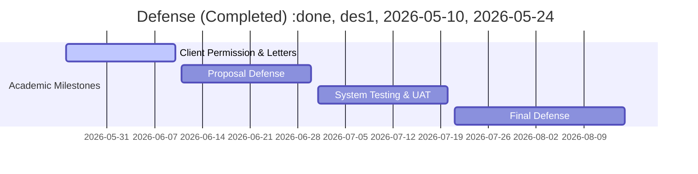

# Capstone Development Pathway & Roadmap

This document outlines the sequential phases of the BSIT Capstone timeline for **SecureCAT-v2**, helping researchers and AI agents understand past accomplishments and upcoming deliverables.

**Capstone Adviser:** Sir Zeus

---

## 📅 Roadmap Overview

> **DISCLAIMER — Dates in this roadmap are planning projections, not confirmed deadlines.**
> As of June 2026, the only confirmed facts are:
> - Capstone 1 (current subject) runs during the mid-year academic period, commencing May 2026.
> - Title Defense was completed (confirmed event).
> - Chapter 1 & Chapter 2 papers are due **June 10, 2026** (confirmed deadline from class).
> - The **Proposal Defense** follows after Ch1 & Ch2 submission, but its exact date has **not yet been scheduled or advised** by the panel/institution.
> - Exact end dates, defense scheduling, and phase boundaries beyond the above are **projected estimates** subject to change once the panel or institution advises the official academic calendar and defense schedule.
>
> Treat the gantt chart below as a suggested sequencing, not a commitment.

---

## 🔍 Detailed Milestones & Deliverables

### Phase 1: Title Defense (Completed)
*   **Milestone:** Successfully defended the capstone project title.
*   **Locked Title:** *"SecureCAT: A Role-Based College Admission Testing System for the Guidance and Registrar Offices at ISPSC Tagudin"*
*   **Status:** Done.

### Phase 2: Client Coordination & Data Gathering (Current Phase)
*   **Milestone:** Transmit formal request letters to the Campus Director, Registrar, and Guidance Counselor to establish institutional collaboration.
*   **Deliverables:**
    *   Signed client approval letter.
    *   Form templates (manual application forms, admission slip layouts, and OMR sheets).
    *   Workflow logs documenting the actual admission pipeline and scoring rules.
*   **Status:** 🟡 **IN PROGRESS**

### Phase 3: Requirement Modeling & UI/UX Design (Upcoming Phase)
*   **Milestone:** Prepare and compile the Software Requirements Specification (SRS) in preparation for Proposal Defense.
*   **Deliverables:**
    *   Use Case Models and System Architecture diagrams.
    *   Database Entity-Relationship Diagram (ERD).
    *   High-fidelity page flow wireframes for applicant portals and staff dashboards.
*   **Status:** ⬜ PLANNED (Pre-Proposal Defense)

### Phase 4: Proposal Defense
*   **Milestone:** Defend the proposed architecture, methodology, system scope, and design mockups before the Capstone Panel.
*   **Deliverables:**
    *   Chapters 1–3 Draft (Introduction, Literature Review, Methodology).
    *   System Prototype (SecureCAT-v2 baseline).
*   **Status:** ⬜ PLANNED

### Phase 5: System Development & V2 Code Rework (Advanced Scope)
*   **Milestone:** Implement the advanced software engineering features approved under the "Trojan Horse" strategy to ensure capstone-grade complexity.
*   **Tasks:**
    *   Backend multi-tenancy preparation (database isolation per campus/SUC).
    *   Zero-trust security implementation (HMAC score locks and immutable write-only audit trails).
    *   AI-powered operations (OMR computer-vision scanning, enhanced AI Companion with RAG for applicant guidance and course recommendations).
    *   Offline-resilient edge proctor portal (PWA).
*   **Status:** ⬜ PLANNED

### Phase 6: System Testing, Evaluation, and UAT
*   **Milestone:** Conduct rigorous verification of the system's usability and functionality with real-world users.
*   **Deliverables:**
    *   User Acceptance Testing (UAT) report with Registrar and Guidance staff.
    *   System Usability Scale (SUS) survey results.
    *   Testing reports (Unit tests, Integration tests, and Security/Penetration testing audits).
*   **Status:** ⬜ PLANNED

### Phase 7: Final Defense & System Handoff
*   **Milestone:** Defend the finalized application and hand over the software package to the beneficiaries.
*   **Deliverables:**
    *   Complete Capstone Thesis Document (Chapters 1–5).
    *   Deployed application code and user training manuals.
    *   Signed Certificate of Handoff / Acceptance.
*   **Status:** ⬜ PLANNED
