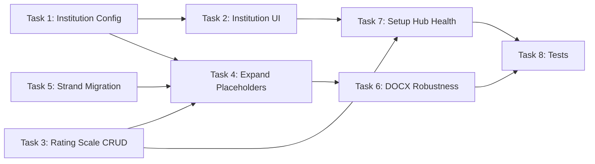

# 🏗️ DOCX Result Sheet Robustness — Mega Execution Plan

> **Source Plans:**
> - [docx-result-sheet-robustness-plan.md](file:///d:/Projects/SecureCAT-v2/docs/plans/docx-result-sheet-robustness-plan.md)
> - [docx-template-gap-analysis.md](file:///d:/Projects/SecureCAT-v2/docs/plans/docx-template-gap-analysis.md)

> [!IMPORTANT]
> **8 tasks, ~40 steps, ~10 hours.** Each step is a single atomic edit with verification. Steps marked with 🧪 require running tests. Steps marked with 🔗 have dependencies on prior steps.

---

## Execution Order (Dependency Graph)



**Parallel-safe groups:** Tasks 1, 3, 5 can start independently. Task 4 needs all three done. Task 6 needs Task 4. Tasks 7 and 8 are last.

---

## Task 1: Institution Config File (15 min, 3 steps)

> **Goal:** Create `config/institution.php` that reads from `.env`, add `.env.example` entries, add `SystemSetting::institution()` resolver.

### Step 1.1 — Create `config/institution.php`

**File:** `config/institution.php` (NEW)

```php
<?php

return [
    // ── Institution Profile ──
    'name'            => env('INSTITUTION_NAME', 'My Institution'),
    'campus'          => env('INSTITUTION_CAMPUS', ''),
    'address'         => env('INSTITUTION_ADDRESS', ''),
    'contact_number'  => env('INSTITUTION_CONTACT_NUMBER', ''),
    'email'           => env('INSTITUTION_EMAIL', ''),
    'website'         => env('INSTITUTION_WEBSITE', ''),

    // ── Exam Branding ──
    'exam_name'       => env('INSTITUTION_EXAM_NAME', 'College Admission Test'),
    'exam_acronym'    => env('INSTITUTION_EXAM_ACRONYM', 'CAT'),

    // ── Key Personnel (static display data for templates & documents) ──
    // NOT admin/user accounts — just names that appear on printed documents.
    'personnel' => [
        'guidance_counselor' => [
            'name'        => env('INSTITUTION_GUIDANCE_COUNSELOR', ''),
            'title'       => env('INSTITUTION_GUIDANCE_COUNSELOR_TITLE', 'Guidance Counselor'),
            'credentials' => env('INSTITUTION_GUIDANCE_COUNSELOR_CREDENTIALS', ''),
        ],
        'registrar' => [
            'name'        => env('INSTITUTION_REGISTRAR', ''),
            'title'       => env('INSTITUTION_REGISTRAR_TITLE', 'Registrar'),
            'credentials' => env('INSTITUTION_REGISTRAR_CREDENTIALS', ''),
        ],
        'college_president' => [
            'name'        => env('INSTITUTION_COLLEGE_PRESIDENT', ''),
            'title'       => env('INSTITUTION_COLLEGE_PRESIDENT_TITLE', 'College President'),
            'credentials' => env('INSTITUTION_COLLEGE_PRESIDENT_CREDENTIALS', ''),
        ],
        'campus_director' => [
            'name'        => env('INSTITUTION_CAMPUS_DIRECTOR', ''),
            'title'       => env('INSTITUTION_CAMPUS_DIRECTOR_TITLE', 'Campus Director'),
            'credentials' => env('INSTITUTION_CAMPUS_DIRECTOR_CREDENTIALS', ''),
        ],
        'vp_academic_affairs' => [
            'name'        => env('INSTITUTION_VP_ACADEMIC_AFFAIRS', ''),
            'title'       => env('INSTITUTION_VP_ACADEMIC_AFFAIRS_TITLE', 'VP for Academic Affairs'),
            'credentials' => env('INSTITUTION_VP_ACADEMIC_AFFAIRS_CREDENTIALS', ''),
        ],
        'dean' => [
            'name'        => env('INSTITUTION_DEAN', ''),
            'title'       => env('INSTITUTION_DEAN_TITLE', 'Dean'),
            'credentials' => env('INSTITUTION_DEAN_CREDENTIALS', ''),
        ],
        'testing_coordinator' => [
            'name'        => env('INSTITUTION_TESTING_COORDINATOR', ''),
            'title'       => env('INSTITUTION_TESTING_COORDINATOR_TITLE', 'Testing Coordinator'),
            'credentials' => env('INSTITUTION_TESTING_COORDINATOR_CREDENTIALS', ''),
        ],
    ],
];
```

**Verify:** `php artisan config:show institution` — should dump all keys with defaults.

### Step 1.2 — Add `.env.example` entries

**File:** `.env.example` — append at end

```env
# ── Institution Configuration ──────────────────────────────
# Appear on result sheets, admission slips, homepage, and reports.
# Can be overridden from Setup > Institution in admin UI.
# NOTE: Academic year is managed separately via Admin > Academic Years CRUD.

# Profile
INSTITUTION_NAME="ISPSC"
INSTITUTION_CAMPUS="Tagudin Campus"
INSTITUTION_ADDRESS=""
INSTITUTION_CONTACT_NUMBER=""
INSTITUTION_EMAIL=""
INSTITUTION_WEBSITE=""

# Exam branding
INSTITUTION_EXAM_NAME="ISPSC College Admission Test"
INSTITUTION_EXAM_ACRONYM="ICAT"

# Key Personnel — static names/titles for documents (NOT admin accounts)
INSTITUTION_GUIDANCE_COUNSELOR="RAVEENA GALOPE, RGC, RPm"
INSTITUTION_GUIDANCE_COUNSELOR_TITLE="Guidance Counselor"
INSTITUTION_GUIDANCE_COUNSELOR_CREDENTIALS="RGC, RPm"
INSTITUTION_REGISTRAR=""
INSTITUTION_REGISTRAR_TITLE="Registrar"
INSTITUTION_COLLEGE_PRESIDENT=""
INSTITUTION_COLLEGE_PRESIDENT_TITLE="College President"
INSTITUTION_CAMPUS_DIRECTOR=""
INSTITUTION_CAMPUS_DIRECTOR_TITLE="Campus Director"
INSTITUTION_VP_ACADEMIC_AFFAIRS=""
INSTITUTION_VP_ACADEMIC_AFFAIRS_TITLE="VP for Academic Affairs"
INSTITUTION_DEAN=""
INSTITUTION_DEAN_TITLE="Dean"
INSTITUTION_TESTING_COORDINATOR=""
INSTITUTION_TESTING_COORDINATOR_TITLE="Testing Coordinator"
```

**Verify:** Visually confirm `.env.example` has the new block.

### Step 1.3 — Add `SystemSetting::institution()` helper

**File:** [app/Models/SystemSetting.php](file:///d:/Projects/SecureCAT-v2/app/Models/SystemSetting.php)

**Edit:** Add new static method after `enableNormalizedScores()` (line ~110):

```php
/**
 * Resolve an institution config value: admin override → .env default.
 *
 * Supports dot-notation for nested personnel keys:
 *   SystemSetting::institution('name')
 *   SystemSetting::institution('personnel.guidance_counselor.name')
 */
public static function institution(string $key, mixed $default = null): mixed
{
    return self::get("institution.{$key}") ?? config("institution.{$key}", $default);
}
```

**Verify:** `php artisan tinker --execute "echo App\Models\SystemSetting::institution('name');"` → should output `My Institution` (or ISPSC if .env set).

**Design rationale:** This single resolver gives us a clean API. Admin UI writes to `system_settings` table with key `institution.name` etc. The resolver checks the DB first, falls back to config (which reads .env). This means:
- Fresh install: uses `.env` defaults
- Admin tweaks in UI: writes to DB, overrides `.env`
- "Reset to defaults" button: just deletes the DB rows

---

## Task 2: Institution Settings Page (1.5 hr, 5 steps)

> **Goal:** Admin UI for viewing/editing institution profile + key personnel. Two-card layout under Setup hub. 🔗 *Depends on Task 1.*

### Step 2.1 — Create `InstitutionController`

**File:** `app/Http/Controllers/Admin/InstitutionController.php` (NEW)

**Create via artisan:** `php artisan make:class App/Http/Controllers/Admin/InstitutionController --no-interaction`

```php
<?php

declare(strict_types=1);

namespace App\Http\Controllers\Admin;

use App\Http\Controllers\Controller;
use App\Models\SystemSetting;
use App\Services\AuditService;
use Illuminate\Http\RedirectResponse;
use Illuminate\Http\Request;
use Inertia\Inertia;
use Inertia\Response;

class InstitutionController extends Controller
{
    /**
     * Show institution profile + personnel settings.
     */
    public function index(): Response
    {
        $profileKeys = ['name', 'campus', 'address', 'contact_number', 'email', 'website', 'exam_name', 'exam_acronym'];
        $profile = [];
        foreach ($profileKeys as $key) {
            $profile[$key] = [
                'value'      => SystemSetting::institution($key, ''),
                'env_default' => config("institution.{$key}", ''),
                'overridden' => SystemSetting::get("institution.{$key}") !== null,
            ];
        }

        $personnelRoles = array_keys(config('institution.personnel', []));
        $personnel = [];
        foreach ($personnelRoles as $role) {
            foreach (['name', 'title', 'credentials'] as $field) {
                $dotKey = "personnel.{$role}.{$field}";
                $personnel[$role][$field] = [
                    'value'      => SystemSetting::institution($dotKey, ''),
                    'env_default' => config("institution.{$dotKey}", ''),
                    'overridden' => SystemSetting::get("institution.{$dotKey}") !== null,
                ];
            }
        }

        return Inertia::render('Admin/Institution/Index', [
            'profile'        => $profile,
            'personnel'      => $personnel,
            'personnelRoles' => $personnelRoles,
        ]);
    }

    /**
     * Save institution overrides to system_settings.
     */
    public function update(Request $request): RedirectResponse
    {
        $request->validate([
            'profile'   => ['nullable', 'array'],
            'profile.*' => ['nullable', 'string', 'max:500'],
            'personnel' => ['nullable', 'array'],
            'personnel.*.*' => ['nullable', 'string', 'max:500'],
        ]);

        $changed = 0;

        // Profile fields
        foreach ($request->input('profile', []) as $key => $value) {
            $settingKey = "institution.{$key}";
            $envDefault = config("institution.{$key}", '');
            if ((string) $value !== (string) $envDefault) {
                SystemSetting::set($settingKey, $value);
                $changed++;
            } else {
                // Remove override if it matches .env (revert to default)
                SystemSetting::where('key', $settingKey)->delete();
            }
        }

        // Personnel fields
        foreach ($request->input('personnel', []) as $role => $fields) {
            foreach ($fields as $field => $value) {
                $settingKey = "institution.personnel.{$role}.{$field}";
                $envDefault = config("institution.personnel.{$role}.{$field}", '');
                if ((string) $value !== (string) $envDefault) {
                    SystemSetting::set($settingKey, $value);
                    $changed++;
                } else {
                    SystemSetting::where('key', $settingKey)->delete();
                }
            }
        }

        app(AuditService::class)->log('institution.updated', SystemSetting::class, null, [], [
            'fields_changed' => $changed,
        ]);

        return back()->with('success', "Institution settings saved ({$changed} override(s) updated).");
    }

    /**
     * Reset all institution overrides — revert to .env defaults.
     */
    public function resetDefaults(): RedirectResponse
    {
        $deleted = SystemSetting::where('key', 'like', 'institution.%')->delete();

        app(AuditService::class)->log('institution.reset', SystemSetting::class, null, [], [
            'overrides_deleted' => $deleted,
        ]);

        return back()->with('success', "All institution overrides cleared ({$deleted} removed). Using .env defaults.");
    }
}
```

**Key design decisions:**
- Each field tracks `value`, `env_default`, and `overridden` — this powers the UI badges showing whether a field is using .env or admin override
- On save, if the value matches the .env default, we DELETE the override row (clean DB)
- `resetDefaults()` bulk-deletes all `institution.*` rows

**Verify:** File created without syntax errors.

### Step 2.2 — Register routes

**File:** [routes/web.php](file:///d:/Projects/SecureCAT-v2/routes/web.php)

**Edit 1:** Add import at top (after line 18, near other Admin imports):
```php
use App\Http\Controllers\Admin\InstitutionController;
```

**Edit 2:** Add routes inside the Setup Hub group (after line 133, inside the `role:super_admin,registrar_administrator,test_administrator` middleware group):
```php
Route::get('setup/institution', [InstitutionController::class, 'index'])->name('setup.institution.index');
Route::put('setup/institution', [InstitutionController::class, 'update'])->name('setup.institution.update');
Route::post('setup/institution/reset', [InstitutionController::class, 'resetDefaults'])->name('setup.institution.reset');
```

**Verify:** `php artisan route:list --name=institution` — should show 3 routes.

### Step 2.3 — Create Svelte page

**File:** `resources/js/Pages/Admin/Institution/Index.svelte` (NEW)

> [!NOTE]
> Follow existing Setup page patterns. Two-card layout: Institution Profile + Key Personnel. Each field shows `.env` / `✏️ Override` badge. "Reset to Defaults" button at bottom.

**Full component structure:**
- Props: `profile`, `personnel`, `personnelRoles` (from controller)
- Form: Uses Inertia `useForm` with `put` to `route('admin.setup.institution.update')`
- Reset: Separate `post` to `route('admin.setup.institution.reset')` with confirmation dialog
- Layout: `AdminLayout` with breadcrumbs `Setup > Institution`
- Cards: Profile card with 8 text inputs, Personnel card with collapsible sections per role (3 fields each: name, title, credentials)
- Badges: Each input shows a subtle indicator of whether it's using `.env` default or admin override
- Empty personnel slots: Show as dimmed with "Not configured" placeholder

**Key UI elements to implement:**
1. Header with breadcrumbs: `Setup > Institution`
2. **Institution Profile** card — 8 fields in a 2-column responsive grid
3. **Key Personnel** card — 7 collapsible role sections, each with name/title/credentials
4. Footer: `[Reset to Defaults]` (secondary, with confirm dialog) + `[Save Changes]` (primary)
5. Flash message display for success/error

**Verify:** Navigate to `/admin/setup/institution` in browser — page renders without JS errors.

### Step 2.4 — Add institution link to Setup hub card grid

**File:** [resources/js/Pages/Admin/Setup/Index.svelte](file:///d:/Projects/SecureCAT-v2/resources/js/Pages/Admin/Setup/Index.svelte)

**Edit:** Add an "Institution" card to the grid, linking to `route('admin.setup.institution.index')`.

- Icon: 🏛️ or building icon
- Label: "Institution"
- Description: "Institution profile, exam branding, and key personnel for documents"
- Link: `/admin/setup/institution`

**Verify:** Setup hub shows new Institution card.

### Step 2.5 — Add audit events to AuditService

**File:** [app/Services/AuditService.php](file:///d:/Projects/SecureCAT-v2/app/Services/AuditService.php)

**Edit:** Add `institution.updated` and `institution.reset` to the event/category mapping arrays (follow existing pattern).

**Verify:** Check that audit log entries appear after saving institution settings.

---

## Task 3: Rating Scale CRUD (2 hr, 7 steps)

> **Goal:** Configurable percentile→rating mapping so DOCX templates can show "Outstanding", "Above Average" etc. per domain. Independent of Tasks 1-2.

### Step 3.1 — Create migration for `rating_scales` table + FK on `result_sheet_templates`

**Create via artisan:** `php artisan make:migration create_rating_scales_table --no-interaction`

**Schema:**
```php
Schema::create('rating_scales', function (Blueprint $table) {
    $table->id();
    $table->string('name');              // "ISPSC Standard", "DepEd K-12"
    $table->json('ranges');              // [{min, max, label}, ...]
    $table->boolean('is_default')->default(false);
    $table->timestamps();
});
```

**Create second migration:** `php artisan make:migration add_rating_scale_id_to_result_sheet_templates_table --no-interaction`

```php
Schema::table('result_sheet_templates', function (Blueprint $table) {
    $table->foreignId('rating_scale_id')->nullable()->constrained('rating_scales')->nullOnDelete();
});
```

**Verify:** `php artisan migrate` runs without errors. `php artisan migrate:rollback --step=2` also works.

### Step 3.2 — Create `RatingScale` model

**Create via artisan:** `php artisan make:model RatingScale --no-interaction`

**File:** `app/Models/RatingScale.php`

```php
<?php

declare(strict_types=1);

namespace App\Models;

use Illuminate\Database\Eloquent\Model;

class RatingScale extends Model
{
    protected $fillable = ['name', 'ranges', 'is_default'];

    protected function casts(): array
    {
        return [
            'ranges'     => 'array',
            'is_default' => 'boolean',
        ];
    }

    /**
     * Get descriptive rating label for a given percentile.
     */
    public function ratingFor(int $percentile): string
    {
        foreach ($this->ranges as $range) {
            if ($percentile >= $range['min'] && $percentile <= $range['max']) {
                return $range['label'];
            }
        }

        return '—';
    }

    /**
     * Get the default rating scale, or null if none set.
     */
    public static function default(): ?self
    {
        return self::where('is_default', true)->first();
    }
}
```

**Also update `ResultSheetTemplate` model** — add relationship:
```php
public function ratingScale(): BelongsTo
{
    return $this->belongsTo(RatingScale::class);
}
```
And add `'rating_scale_id'` to its `$fillable` array.

**Verify:** `php artisan tinker --execute "new App\Models\RatingScale;"` — no errors.

### Step 3.3 — Create seeder with ISPSC defaults

**Create via artisan:** `php artisan make:seeder RatingScaleSeeder --no-interaction`

**File:** `database/seeders/RatingScaleSeeder.php`

```php
RatingScale::updateOrCreate(['name' => 'ISPSC Standard'], [
    'ranges' => [
        ['min' => 90, 'max' => 100, 'label' => 'Outstanding'],
        ['min' => 75, 'max' => 89,  'label' => 'Above Average'],
        ['min' => 50, 'max' => 74,  'label' => 'Average'],
        ['min' => 25, 'max' => 49,  'label' => 'Below Average'],
        ['min' => 0,  'max' => 24,  'label' => 'Needs Improvement'],
    ],
    'is_default' => true,
]);
```

**Verify:** `php artisan db:seed --class=RatingScaleSeeder` — 1 row created.

### Step 3.4 — Create `RatingScaleController`

**Create via artisan:** `php artisan make:class App/Http/Controllers/Admin/RatingScaleController --no-interaction`

**File:** `app/Http/Controllers/Admin/RatingScaleController.php`

**Methods:**
- `index()` — Render `Admin/RatingScales/Index.svelte` with all rating scales
- `create()` — Render `Admin/RatingScales/Create.svelte`
- `store(Request $request)` — Validate name (required, unique), ranges (required, array, each entry has min/max/label), is_default. If is_default, unset all others. Redirect with success.
- `edit(RatingScale $ratingScale)` — Render `Admin/RatingScales/Edit.svelte`
- `update(Request $request, RatingScale $ratingScale)` — Same validation as store. Update.
- `destroy(RatingScale $ratingScale)` — Delete. If it was default, warn.

**Validation rules for `ranges`:**
```php
'ranges'           => ['required', 'array', 'min:1'],
'ranges.*.min'     => ['required', 'integer', 'min:0', 'max:100'],
'ranges.*.max'     => ['required', 'integer', 'min:0', 'max:100'],
'ranges.*.label'   => ['required', 'string', 'max:100'],
```

**Additional validation:** Ensure ranges don't overlap and cover 0-100 completely (or at minimum, don't overlap). This can be a custom rule or after_validation check.

**Audit:** Log `rating_scale.created`, `rating_scale.updated`, `rating_scale.deleted` via AuditService.

**Verify:** File created without syntax errors.

### Step 3.5 — Register routes

**File:** [routes/web.php](file:///d:/Projects/SecureCAT-v2/routes/web.php)

**Edit 1:** Add import:
```php
use App\Http\Controllers\Admin\RatingScaleController;
```

**Edit 2:** Add inside the Setup Hub middleware group (same group as institution routes, `role:super_admin,registrar_administrator,test_administrator`):
```php
Route::resource('setup/rating-scales', RatingScaleController::class)
    ->except('show')
    ->parameters(['rating-scales' => 'rating_scale']);
```

**Verify:** `php artisan route:list --name=rating-scale` — should show 5 resource routes (index, create, store, edit, update, destroy).

### Step 3.6 — Create Svelte pages (Index, Create, Edit)

**Files (all NEW):**
- `resources/js/Pages/Admin/RatingScales/Index.svelte`
- `resources/js/Pages/Admin/RatingScales/Create.svelte`
- `resources/js/Pages/Admin/RatingScales/Edit.svelte`

**Pattern:** Follow existing AptitudeAreas CRUD pages for consistent style.

**Index page:**
- Table with columns: Name, Ranges (preview: "5 ranges: Outstanding → Needs Improvement"), Default (badge), Actions (Edit, Delete)
- "Create Rating Scale" button in header
- Breadcrumbs: `Setup > Rating Scales`

**Create/Edit pages:**
- Name input
- `is_default` toggle
- **Ranges repeater** — the key UI element:
  - Table with columns: Min %, Max %, Label, Actions (remove row)
  - "Add Range" button at bottom
  - Rows are sortable/reorderable (drag or up/down buttons)
  - Visual indicator if ranges overlap or have gaps
- Save / Cancel buttons

**Verify:** Navigate to `/admin/setup/rating-scales` — page renders, CRUD operations work.

### Step 3.7 — Add Rating Scale card to Setup hub + audit events

**File:** `resources/js/Pages/Admin/Setup/Index.svelte`

**Edit:** Add "Rating Scales" card:
- Icon: ⭐ or chart-bar icon
- Label: "Rating Scales"
- Description: "Percentile-to-rating mappings for result sheets (e.g., Outstanding, Above Average)"
- Link: `/admin/setup/rating-scales`

**File:** `app/Services/AuditService.php`

**Edit:** Add `rating_scale.created`, `rating_scale.updated`, `rating_scale.deleted` to event/category mapping.

**Verify:** Setup hub shows new card. Audit events log correctly.

---

## Task 4: Expand Placeholder System (2 hr, 7 steps)

> **Goal:** Add 12+ new placeholders (identity, academic, counselor, institution, personnel, per-domain rating) to both HTML and DOCX template modes. 🔗 *Depends on Tasks 1, 3, 5.*

### Step 4.1 — Update eager loading in fetch methods

**File:** [app/Services/ResultSheetTemplateService.php](file:///d:/Projects/SecureCAT-v2/app/Services/ResultSheetTemplateService.php)

**Edit `fetchApplicantsForSession()` (line ~386-389):**

Change the `->with('application')` to eagerly load the new relationships:
```php
->with([
    'application.coursePreference1',
    'consultationSummary.recommendedCourse',
    'consultationSummary.counselor',
])
```

**Edit `fetchApplicantsAgnostic()` (line ~410-412):**

Change `->with('application', 'gradingSessions.examSession.room')` to:
```php
->with([
    'application.coursePreference1',
    'consultationSummary.recommendedCourse',
    'consultationSummary.counselor',
    'gradingSessions.examSession.room',
])
```

**Verify:** No N+1 queries. Run existing tests to confirm no regressions.

### Step 4.2 — Expand `buildApplicantDataArray()`

**File:** [app/Services/ResultSheetTemplateService.php](file:///d:/Projects/SecureCAT-v2/app/Services/ResultSheetTemplateService.php) (line ~459-484)

**Replace the return array** to include all new fields:

```php
protected function buildApplicantDataArray(Applicant $applicant, ?GradingSession $session, array $scores): array
{
    $app = $applicant->application;
    $summary = $applicant->consultationSummary;

    $overallPct = count($scores) > 0
        ? (int) round(collect($scores)->avg('pct'))
        : 0;

    $name = '—';
    if ($app) {
        $name = trim(implode(' ', array_filter([
            $app->first_name, $app->middle_name, $app->last_name, $app->suffix,
        ]))) ?: '—';
    }

    return [
        'id'                 => $applicant->id,
        // Identity — split fields for DOCX
        'name'               => $name,
        'family_name'        => $app?->last_name ?? '—',
        'first_name'         => $app?->first_name ?? '—',
        'middle_name'        => $app?->middle_name ?? '—',
        'suffix'             => $app?->suffix ?? '',
        'sex'                => $app?->sex ?? '—',
        'gwa'                => $app?->gwa ?? '—',
        // Academic
        'course_applied'     => $app?->coursePreference1?->name ?? '—',
        'strand'             => $app?->strand ?? $app?->last_school_enrolled ?? '—',
        'applicant_type'     => $app?->applicant_type ?? '—',
        // Exam context
        'reference'          => $app?->reference_number ?? '—',
        'exam_date'          => $session?->examSession?->date?->format('F j, Y') ?? '—',
        'exam_time'          => $session?->examSession?->start_time
                                 ? \Carbon\Carbon::parse($session->examSession->start_time)->format('g:i A')
                                 : '—',
        'room_name'          => $session?->examSession?->room?->name ?? '—',
        // Scores
        'scores'             => $scores,
        'overall_pct'        => $overallPct,
        // Counselor / release
        'recommended_course' => $summary?->recommendedCourse?->name ?? '—',
        'counselor_comments' => $summary?->counselor_comments ?? '—',
        'counselor_name'     => $summary?->counselor?->name ?? '—',
    ];
}
```

**Key change:** The `strand` field falls back to `last_school_enrolled` if no explicit strand is set (graceful degradation for existing data).

**Verify:** Run existing tests — no regressions.

### Step 4.3 — Expand `buildReplacements()` with new fields

**File:** [app/Services/ResultSheetTemplateService.php](file:///d:/Projects/SecureCAT-v2/app/Services/ResultSheetTemplateService.php) (line ~301-333)

**Edit:** Inside the `foreach ([1 => 0, 2 => 1])` loop, after the existing 6 replacements (name, reference, exam_date, room_name, scores_rows, overall_pct), add:

```php
// New identity/academic/counselor fields
$newFields = [
    'family_name', 'first_name', 'middle_name', 'suffix',
    'sex', 'gwa', 'course_applied', 'strand', 'applicant_type',
    'exam_time',
    'recommended_course', 'counselor_comments', 'counselor_name',
];
foreach ($newFields as $field) {
    $replacements["{$field}{$suffix}"] = (string) ($data[$field] ?? '—');
}
```

Also add the same fields in the `else` (no-data) branch with `'—'` defaults.

**After the loop** (after line ~330, before `addPerDomainReplacements`), add institution placeholders:

```php
// Institution profile (not per-applicant — same for all sheets)
$replacements['institution_name']         = SystemSetting::institution('name', '—');
$replacements['institution_campus']       = SystemSetting::institution('campus', '—');
$replacements['institution_address']      = SystemSetting::institution('address', '—');
$replacements['institution_contact']      = SystemSetting::institution('contact_number', '—');
$replacements['institution_email']        = SystemSetting::institution('email', '—');
$replacements['institution_website']      = SystemSetting::institution('website', '—');
$replacements['institution_exam_name']    = SystemSetting::institution('exam_name', '—');
$replacements['institution_exam_acronym'] = SystemSetting::institution('exam_acronym', '—');

// Key personnel — auto-mapped from all configured roles
$personnel = config('institution.personnel', []);
foreach ($personnel as $role => $defaults) {
    foreach (['name', 'title', 'credentials'] as $field) {
        $dotKey = "personnel.{$role}.{$field}";
        $val = SystemSetting::institution($dotKey) ?? ($defaults[$field] ?? '');
        $replacements["personnel_{$role}_{$field}"] = $val ?: '—';
    }
}
```

**Add import** at top of file: `use App\Models\SystemSetting;`

**Verify:** Run existing tests — no regressions.

### Step 4.4 — Add per-domain descriptive rating

**File:** [app/Services/ResultSheetTemplateService.php](file:///d:/Projects/SecureCAT-v2/app/Services/ResultSheetTemplateService.php)

**Edit `addPerDomainReplacements()` (line ~342-364):**

After line 361 (`$replacements[$slug.'_raw'.$suffix] = $raw;`), add rating lookup:

```php
// Descriptive rating from template's rating scale (or hardcoded fallback)
$rating = $this->percentileToRating((int) $pct, $ratingScale);
$replacements[$slug.'_rating'.$suffix] = $rating;
```

**Add `$ratingScale` parameter** to `addPerDomainReplacements()` signature:
```php
protected function addPerDomainReplacements(
    array &$replacements,
    array $applicants,
    array $sample,
    bool $useSampleData,
    ?RatingScale $ratingScale = null,
): void
```

**Add new private helper:**
```php
/**
 * Convert percentile to descriptive rating using scale or hardcoded fallback.
 */
private function percentileToRating(int $pct, ?RatingScale $ratingScale = null): string
{
    if ($ratingScale) {
        return $ratingScale->ratingFor($pct);
    }

    // Hardcoded fallback when no rating scale is configured
    return match (true) {
        $pct >= 90 => 'Outstanding',
        $pct >= 75 => 'Above Average',
        $pct >= 50 => 'Average',
        $pct >= 25 => 'Below Average',
        default    => 'Needs Improvement',
    };
}
```

**Update all callers** of `addPerDomainReplacements()` to pass a `$ratingScale` parameter. The rating scale comes from `RatingScale::default()` (or from the template's `rating_scale_id` when available). Add `use App\Models\RatingScale;` import.

**Verify:** Sample data preview shows rating columns populated.

### Step 4.5 — Update `PLACEHOLDERS` constant

**File:** [app/Services/ResultSheetTemplateService.php](file:///d:/Projects/SecureCAT-v2/app/Services/ResultSheetTemplateService.php) (line ~22-26)

**Replace:**
```php
public const PLACEHOLDERS = [
    // Core identity
    'applicant_name', 'applicant_reference',
    'family_name', 'first_name', 'middle_name', 'suffix',
    'sex', 'gwa', 'course_applied', 'strand', 'applicant_type',
    // Exam context
    'exam_date', 'exam_time', 'room_name',
    // Scores
    'scores_rows', 'overall_pct',
    // Counselor
    'recommended_course', 'counselor_comments', 'counselor_name',
    // Slot 2 (crosswise/dual)
    'applicant_name_2', 'applicant_reference_2',
    'family_name_2', 'first_name_2', 'middle_name_2', 'suffix_2',
    'sex_2', 'gwa_2', 'course_applied_2', 'strand_2', 'applicant_type_2',
    'exam_date_2', 'exam_time_2', 'room_name_2',
    'scores_rows_2', 'overall_pct_2',
    'recommended_course_2', 'counselor_comments_2', 'counselor_name_2',
    // Institution (not per-slot)
    'institution_name', 'institution_campus', 'institution_address',
    'institution_contact', 'institution_email', 'institution_website',
    'institution_exam_name', 'institution_exam_acronym',
];
```

### Step 4.6 — Update `buildAllKnownPlaceholders()`

**File:** Same file (line ~530-543)

**Edit:** After the existing domain slug loop, add `_rating` variants:

```php
foreach ($domains as $domain) {
    $slug = $this->aptitudeAreaSlug($domain->name);
    $placeholders[] = $slug;
    $placeholders[] = $slug.'_raw';
    $placeholders[] = $slug.'_rating';     // NEW
    $placeholders[] = $slug.'_2';
    $placeholders[] = $slug.'_raw_2';
    $placeholders[] = $slug.'_rating_2';   // NEW
}

// Personnel placeholders (auto-generated from config)
$personnelRoles = array_keys(config('institution.personnel', []));
foreach ($personnelRoles as $role) {
    foreach (['name', 'title', 'credentials'] as $field) {
        $placeholders[] = "personnel_{$role}_{$field}";
    }
}
```

**Verify:** DOCX validation now recognizes all new placeholder names.

### Step 4.7 — Update `sampleApplicantData()`

**File:** Same file (line ~564-593)

**Add sample values** for all new fields so preview works with realistic data:

```php
protected function sampleApplicantData(): array
{
    return [
        'name'               => 'Juan M. Dela Cruz',
        'family_name'        => 'Dela Cruz',
        'first_name'         => 'Juan',
        'middle_name'        => 'M.',
        'suffix'             => '',
        'sex'                => 'Male',
        'gwa'                => '1.50',
        'course_applied'     => 'BS Information Technology',
        'strand'             => 'STEM',
        'applicant_type'     => 'Freshman',
        'reference'          => 'ICAT-2026-00042',
        'exam_date'          => now()->format('F j, Y'),
        'exam_time'          => '8:00 AM',
        'room_name'          => 'Conference Hall A - Seat 12',
        'recommended_course' => 'BS Information Technology',
        'counselor_comments' => 'Strong aptitude in numerical and logical reasoning. Recommended for IT/CS programs.',
        'counselor_name'     => 'Maria Santos',
        'scores'             => [
            ['domain' => 'Spatial Awareness', 'raw' => 20, 'max' => 25, 'pct' => 80],
            ['domain' => 'Numerical Ability', 'raw' => 22, 'max' => 25, 'pct' => 88],
            ['domain' => 'Verbal Reasoning', 'raw' => 19, 'max' => 25, 'pct' => 76],
            ['domain' => 'Abstract Reasoning', 'raw' => 16, 'max' => 20, 'pct' => 80],
            ['domain' => 'Logical Reasoning', 'raw' => 21, 'max' => 25, 'pct' => 84],
            ['domain' => 'Perceptual Speed & Accuracy', 'raw' => 17, 'max' => 20, 'pct' => 85],
        ],
        'overall_pct'        => 82,
        // Slot 2 sample
        'name_2'             => 'Maria L. Santos',
        'family_name_2'      => 'Santos',
        'first_name_2'       => 'Maria',
        'middle_name_2'      => 'L.',
        'suffix_2'           => '',
        'sex_2'              => 'Female',
        'gwa_2'              => '1.75',
        'course_applied_2'   => 'BS Accountancy',
        'strand_2'           => 'ABM',
        'applicant_type_2'   => 'Freshman',
        'reference_2'        => 'ICAT-2026-00043',
        'exam_time_2'        => '8:00 AM',
        'room_name_2'        => 'Conference Hall A - Seat 13',
        'recommended_course_2' => 'BS Accountancy',
        'counselor_comments_2' => 'Excellent numerical aptitude. Well-suited for business programs.',
        'counselor_name_2'   => 'Maria Santos',
        'scores_2'           => [
            ['domain' => 'Spatial Awareness', 'raw' => 18, 'max' => 25, 'pct' => 72],
            ['domain' => 'Numerical Ability', 'raw' => 24, 'max' => 25, 'pct' => 96],
            ['domain' => 'Verbal Reasoning', 'raw' => 21, 'max' => 25, 'pct' => 84],
            ['domain' => 'Abstract Reasoning', 'raw' => 14, 'max' => 20, 'pct' => 70],
            ['domain' => 'Logical Reasoning', 'raw' => 19, 'max' => 25, 'pct' => 76],
            ['domain' => 'Perceptual Speed & Accuracy', 'raw' => 15, 'max' => 20, 'pct' => 75],
        ],
        'overall_pct_2'      => 79,
    ];
}
```

**Also update `renderDocxFile()` (line ~257-273)** to include new sample fields in the manual replacement map built there.

**Verify:** 🧪 Preview a DOCX template — all new placeholders fill with sample data.

---

## Task 5: Strand Field Migration (45 min, 5 steps)

> **Goal:** Add `strand` column to `applications` table. Wire through model, validation requests, import, and forms. Independent of Tasks 1-3.

### Step 5.1 — Create migration

**Create via artisan:** `php artisan make:migration add_strand_to_applications_table --no-interaction`

```php
public function up(): void
{
    Schema::table('applications', function (Blueprint $table) {
        $table->string('strand')->nullable()->after('last_school_enrolled');
    });
}

public function down(): void
{
    Schema::table('applications', function (Blueprint $table) {
        $table->dropColumn('strand');
    });
}
```

**Verify:** `php artisan migrate` runs clean. `php artisan migrate:rollback --step=1` also works.

### Step 5.2 — Update `Application` model

**File:** [app/Models/Application.php](file:///d:/Projects/SecureCAT-v2/app/Models/Application.php)

**Edit:** Add `'strand'` to the `$fillable` array (after `'last_school_enrolled'`).

**Verify:** `php artisan tinker --execute "App\Models\Application::query()->first()?->strand;"` — returns null (no error).

### Step 5.3 — Update validation requests

**File:** [app/Http/Requests/StoreApplicationRequest.php](file:///d:/Projects/SecureCAT-v2/app/Http/Requests/StoreApplicationRequest.php)

**Edit:** Add after line 28 (`'last_school_enrolled'`):
```php
'strand' => ['nullable', 'string', 'max:100'],
```

**File:** [app/Http/Requests/UpdateApplicationRequest.php](file:///d:/Projects/SecureCAT-v2/app/Http/Requests/UpdateApplicationRequest.php)

**Edit:** Add after line 28 (`'last_school_enrolled'`):
```php
'strand' => ['nullable', 'string', 'max:100'],
```

**Verify:** Submit application with strand value — no validation errors.

### Step 5.4 — Update application import mapping

**File:** `app/Services/ApplicantImportService.php` (or wherever import column mapping lives)

**Edit:** Add `'strand'` to the column mapping array so CSV/Excel imports with a "Strand" column map to the new field.

**Verify:** Import a CSV with a "Strand" column — data populates correctly.

### Step 5.5 — Update application create/edit forms + detail view

**Frontend files:**
- `resources/js/Pages/Applications/Create.svelte` (public apply form)
- `resources/js/Pages/Admin/Applications/Create.svelte` (admin create)
- `resources/js/Pages/Admin/Applications/Edit.svelte` (admin edit)
- `resources/js/Pages/Admin/Applications/Show.svelte` (admin detail view)
- `resources/js/Pages/Portal/Application/Show.svelte` (portal detail)

**Edit for each:**
- Add "Strand" text input field after "Last School Enrolled" in the form
- Add "Strand" display field in the detail/show views
- Label: "SHS Strand / Previous Course"
- Placeholder: "e.g., STEM, ABM, HUMSS, GAS"

**Also update controllers** that pass application data to ensure `strand` is included in the Inertia props.

**Verify:** Create an application with strand "STEM" — appears in detail view and edit form.

---

## Task 6: DOCX Rendering Robustness (1.5 hr, 4 steps)

> **Goal:** Error handling, value sanitization, DOCX download endpoint (print-accurate), and audit logging. 🔗 *Depends on Task 4.*

### Step 6.1 — Add try-catch error handling to `ResultSheetDocxService`

**File:** [app/Services/ResultSheetDocxService.php](file:///d:/Projects/SecureCAT-v2/app/Services/ResultSheetDocxService.php) (line ~28-64)

**Replace `renderDocxFromFullPath()`** with robust error handling:

```php
public function renderDocxFromFullPath(string $fullPath, array $replacements): string
{
    if (! is_file($fullPath)) {
        return '<p class="text-destructive">DOCX file not found.</p>';
    }

    $tempDir = storage_path('app/temp/phpword');
    if (! is_dir($tempDir) && ! mkdir($tempDir, 0755, true)) {
        // fall back to system temp
    } else {
        Settings::setTempDir($tempDir);
    }

    $tempDocx = null;
    $tempHtml = null;

    try {
        $processor = new TemplateProcessor($fullPath);
        $processor->setMacroChars('{{', '}}');

        // Sanitize replacement values — prevent injection of placeholder syntax
        $sanitized = array_map(function ($value) {
            $v = (string) $value;
            return str_replace(['{{', '}}'], ['{ {', '} }'], $v);
        }, $replacements);

        foreach ($sanitized as $key => $value) {
            $processor->setValue($key, $value);
        }

        $tempDocx = tempnam($tempDir, 'rst_') . '.docx';
        $processor->saveAs($tempDocx);

        $phpWord = IOFactory::load($tempDocx);
        $tempHtml = tempnam($tempDir, 'rst_') . '.html';
        $writer = IOFactory::createWriter($phpWord, 'HTML');
        $writer->save($tempHtml);
        $html = file_get_contents($tempHtml);

        return $html ?: '<p class="text-muted-foreground">Failed to convert DOCX to HTML.</p>';
    } catch (\PhpOffice\PhpWord\Exception\Exception $e) {
        Log::error('DOCX render failed', ['path' => $fullPath, 'error' => $e->getMessage()]);
        return '<p class="text-destructive">Failed to process DOCX template: '
               . htmlspecialchars($e->getMessage()) . '</p>';
    } catch (\Throwable $e) {
        Log::error('DOCX render unexpected error', ['path' => $fullPath, 'error' => $e->getMessage()]);
        return '<p class="text-destructive">Unexpected error rendering template.</p>';
    } finally {
        if ($tempDocx && is_file($tempDocx)) {
            @unlink($tempDocx);
        }
        if ($tempHtml && is_file($tempHtml)) {
            @unlink($tempHtml);
        }
    }
}
```

**Add import:** `use Illuminate\Support\Facades\Log;`

**Key improvements:**
1. Try-catch with specific PhpWord exception + generic Throwable fallback
2. Sanitization of replacement values (strips `{{` / `}}` to prevent injection)
3. Guaranteed temp file cleanup — variables declared before try block
4. Error messages are HTML-safe (uses `htmlspecialchars`)

**Verify:** Intentionally pass a corrupt .docx path — should show error message instead of crashing.

### Step 6.2 — Add DOCX download endpoint (print-accurate output)

**File:** [app/Http/Controllers/Release/ReleasePrintController.php](file:///d:/Projects/SecureCAT-v2/app/Http/Controllers/Release/ReleasePrintController.php)

**Add new method:**

```php
/**
 * Download a filled DOCX file directly — bypasses HTML conversion for print-perfect output.
 */
public function downloadDocx(GradingSession $grading_session, Applicant $applicant): SymfonyResponse
{
    $template = ResultSheetTemplate::where('is_active', true)
        ->where('mode', ResultSheetTemplate::MODE_DOCX)
        ->first();

    if (! $template || ! $template->docx_path) {
        abort(404, 'No active DOCX template found.');
    }

    $fullPath = Storage::path($template->docx_path);
    if (! is_file($fullPath)) {
        abort(404, 'DOCX template file not found on disk.');
    }

    // Build applicant data
    $applicantsWithScores = $this->templateService->fetchApplicantsWithScores(
        [$applicant->id],
        $grading_session->id,
    );

    if (empty($applicantsWithScores)) {
        abort(404, 'Applicant data not found.');
    }

    $replacements = $this->templateService->buildReplacements($applicantsWithScores, false);

    // Fill template and save to temp file
    $tempDir = storage_path('app/temp/phpword');
    if (! is_dir($tempDir)) {
        mkdir($tempDir, 0755, true);
    }

    $processor = new TemplateProcessor($fullPath);
    $processor->setMacroChars('{{', '}}');

    // Sanitize values
    $sanitized = array_map(fn ($v) => str_replace(['{{', '}}'], ['{ {', '} }'], (string) $v), $replacements);
    foreach ($sanitized as $key => $value) {
        $processor->setValue($key, $value);
    }

    $tempFile = tempnam($tempDir, 'docx_download_') . '.docx';
    $processor->saveAs($tempFile);

    // Audit log
    app(AuditService::class)->log('result_sheet.downloaded_docx', ResultSheetTemplate::class, $template->id, [], [
        'applicant_id'    => $applicant->id,
        'grading_session' => $grading_session->id,
    ]);

    $filename = sprintf('Result-Sheet-%s.docx',
        Str::slug($applicant->application?->last_name ?? $applicant->id)
    );

    return response()->download($tempFile, $filename, [
        'Content-Type' => 'application/vnd.openxmlformats-officedocument.wordprocessingml.document',
    ])->deleteFileAfterSend(true);
}
```

**Add imports** at top of controller: `use PhpOffice\PhpWord\TemplateProcessor;`, `use Illuminate\Support\Facades\Storage;`, `use Illuminate\Support\Str;`

**Note:** This method needs `fetchApplicantsWithScores` and `buildReplacements` to be public or have a public wrapper. Currently `fetchApplicantsWithScores` is `protected` — either make it public or add a public facade method to `ResultSheetTemplateService`. Recommended: add a `buildReplacementsForApplicant(int $applicantId, ?int $gradingSessionId)` public method that wraps fetch + build.

**Verify:** Download .docx for an applicant — opens in Word with all fields filled.

### Step 6.3 — Register DOCX download route

**File:** [routes/web.php](file:///d:/Projects/SecureCAT-v2/routes/web.php)

**Edit:** Inside the `print` prefix group (line ~296-305), add:

```php
Route::get('{grading_session}/applicants/{applicant}/docx', [ReleasePrintController::class, 'downloadDocx'])->name('result-sheet-docx');
```

**Also add a "Download DOCX" button** to the result sheet preview page:
- **File:** The Svelte component that renders the individual result sheet view
- **Edit:** Add a secondary action button next to the existing print/PDF buttons:
  ```html
  <a href={route('admin.release.print.result-sheet-docx', [gradingSession.id, applicant.id])}
     class="btn btn-outline">
     📄 Download DOCX
  </a>
  ```

**Verify:** Route exists: `php artisan route:list --name=result-sheet-docx`. Button appears and downloads work.

### Step 6.4 — Add render audit logging

**File:** [app/Services/ResultSheetTemplateService.php](file:///d:/Projects/SecureCAT-v2/app/Services/ResultSheetTemplateService.php)

**Edit:** At the end of `buildSheetsForApplicantIds()` (line ~106-110), after building sheets, add audit log:

```php
app(AuditService::class)->log('result_sheet.rendered', ResultSheetTemplate::class, $template->id, [], [
    'applicant_ids' => $applicantIds,
    'mode'          => $template->mode,
    'count'         => count($applicantIds),
]);
```

**Add import:** `use App\Services\AuditService;`

**Also add to `buildRawSheetsForApplicantIds()`** (the PDF batch variant).

**File:** `app/Services/AuditService.php`

**Edit:** Add `result_sheet.rendered`, `result_sheet.downloaded_docx` to event/category mapping.

**Verify:** Generate result sheets → check audit log for new entries.

---

## Task 7: Setup Hub Integration (30 min, 2 steps)

> **Goal:** Health checks for institution config + rating scales in Setup dashboard. 🔗 *Depends on Tasks 2, 3.*

### Step 7.1 — Add `checkInstitution()` health check

**File:** [app/Http/Controllers/Admin/SetupController.php](file:///d:/Projects/SecureCAT-v2/app/Http/Controllers/Admin/SetupController.php)

**Edit 1:** Add import at top:
```php
use App\Models\RatingScale;
```

**Edit 2:** Add to `computeHealth()` `$categories` array (line ~52-61), after `$this->checkStaffAccounts()`:
```php
$this->checkInstitution(),
$this->checkRatingScales(),
```

**Edit 3:** Add new methods before `countUsersWithRole()`:

```php
/**
 * Institution: verify critical fields are configured.
 *
 * @return array{key: string, label: string, href: string, checks: list<array>}
 */
private function checkInstitution(): array
{
    $name = SystemSetting::institution('name');
    $examName = SystemSetting::institution('exam_name');
    $counselorName = SystemSetting::institution('personnel.guidance_counselor.name');

    return [
        'key'   => 'institution',
        'label' => 'Institution Profile',
        'href'  => '/admin/setup/institution',
        'checks' => [
            [
                'key'      => 'institution_name',
                'label'    => 'Institution name is configured',
                'passed'   => ! empty($name) && $name !== 'My Institution',
                'severity' => 'important',
                'message'  => ! empty($name) && $name !== 'My Institution'
                    ? "Institution: {$name}"
                    : 'Institution name is still the default. Update in Setup > Institution.',
            ],
            [
                'key'      => 'institution_exam_name',
                'label'    => 'Exam name is configured',
                'passed'   => ! empty($examName) && $examName !== 'College Admission Test',
                'severity' => 'important',
                'message'  => ! empty($examName) && $examName !== 'College Admission Test'
                    ? "Exam: {$examName}"
                    : 'Exam name is still the default. Update for result sheets.',
            ],
            [
                'key'      => 'institution_counselor',
                'label'    => 'Guidance counselor name is set',
                'passed'   => ! empty($counselorName),
                'severity' => 'optional',
                'message'  => ! empty($counselorName)
                    ? "Counselor: {$counselorName}"
                    : 'Guidance counselor name is blank. Needed for result sheet signatures.',
            ],
        ],
    ];
}
```

**Verify:** Setup hub shows Institution health category with 3 checks.

### Step 7.2 — Add `checkRatingScales()` health check

**Same file**, add after `checkInstitution()`:

```php
/**
 * Rating Scales: verify at least one exists and a default is set.
 *
 * @return array{key: string, label: string, href: string, checks: list<array>}
 */
private function checkRatingScales(): array
{
    $count = RatingScale::count();
    $hasDefault = RatingScale::where('is_default', true)->exists();

    return [
        'key'   => 'rating_scales',
        'label' => 'Rating Scales',
        'href'  => '/admin/setup/rating-scales',
        'checks' => [
            [
                'key'      => 'rating_scale_exist',
                'label'    => 'At least one rating scale created',
                'passed'   => $count > 0,
                'severity' => 'important',
                'message'  => $count > 0
                    ? "{$count} rating scale(s) configured."
                    : 'No rating scales. Needed for descriptive ratings on result sheets.',
            ],
            [
                'key'      => 'rating_scale_default',
                'label'    => 'A default rating scale is set',
                'passed'   => $hasDefault,
                'severity' => 'optional',
                'message'  => $hasDefault
                    ? 'Default rating scale is assigned.'
                    : ($count > 0
                        ? 'Rating scales exist but none is marked as default.'
                        : 'No scales to set as default.'),
            ],
        ],
    ];
}
```

**Verify:** 🧪 Setup hub shows Rating Scales health checks. Run `php artisan test --compact --filter=SetupHealth` if existing tests cover the health endpoint.

---

## Task 8: Tests (2 hr, 5 steps)

> **Goal:** Feature tests covering all new functionality — institution config, rating scales, placeholder expansion, DOCX robustness, strand migration. 🔗 *Depends on all prior tasks.*

### Step 8.1 — `InstitutionControllerTest`

**Create via artisan:** `php artisan make:test InstitutionControllerTest --no-interaction`

**File:** `tests/Feature/Admin/InstitutionControllerTest.php`

**Test cases:**
1. `test_institution_page_loads_for_super_admin` — GET `/admin/setup/institution` returns 200
2. `test_institution_page_blocked_for_non_admin` — non-admin gets 403
3. `test_institution_shows_env_defaults` — page props contain config defaults
4. `test_institution_update_creates_overrides` — PUT with changed values creates `system_settings` rows
5. `test_institution_update_clears_matching_defaults` — PUT with value matching .env default deletes the override row
6. `test_institution_reset_clears_all_overrides` — POST reset endpoint deletes all `institution.*` rows
7. `test_institution_override_takes_precedence` — Set DB override, verify `SystemSetting::institution()` returns override
8. `test_institution_fallback_to_env` — No DB override, verify fallback to config value
9. `test_institution_personnel_update` — Update personnel fields, verify DB state

**Verify:** `php artisan test --compact tests/Feature/Admin/InstitutionControllerTest.php` — all pass.

### Step 8.2 — `RatingScaleControllerTest`

**Create via artisan:** `php artisan make:test RatingScaleControllerTest --no-interaction`

**File:** `tests/Feature/Admin/RatingScaleControllerTest.php`

**Test cases:**
1. `test_index_lists_rating_scales` — create 2 scales, GET index, verify both appear
2. `test_create_rating_scale_with_valid_ranges` — POST store with valid data, verify created
3. `test_create_validates_ranges` — POST store with overlapping/invalid ranges, verify 422
4. `test_update_rating_scale` — PUT update, verify changes saved
5. `test_setting_default_unsets_previous_default` — Create two, set second as default, verify first's `is_default` is false
6. `test_delete_rating_scale` — DELETE, verify soft-deleted or removed
7. `test_rating_for_method` — Unit-style: create scale, call `ratingFor(85)`, verify "Above Average"
8. `test_rating_for_out_of_range` — `ratingFor(101)` returns fallback `'—'`

**Verify:** `php artisan test --compact tests/Feature/Admin/RatingScaleControllerTest.php` — all pass.

### Step 8.3 — `ResultSheetPlaceholderTest`

**Create via artisan:** `php artisan make:test ResultSheetPlaceholderTest --no-interaction`

**File:** `tests/Feature/ResultSheetPlaceholderTest.php`

**Test cases:**
1. `test_build_applicant_data_includes_all_fields` — Create applicant with application + consultation summary, call `buildApplicantDataArray()`, verify all 20+ keys exist
2. `test_build_replacements_includes_identity_fields` — Build replacements, verify `family_name`, `first_name`, `sex`, `gwa` etc. are present
3. `test_build_replacements_includes_institution_fields` — Verify `institution_name`, `institution_campus` etc. are present
4. `test_build_replacements_includes_personnel_fields` — Verify `personnel_guidance_counselor_name` etc. are present
5. `test_per_domain_rating_included` — Verify `{slug}_rating` keys exist in replacements
6. `test_rating_uses_configured_scale` — Set a rating scale, verify ratings come from it
7. `test_rating_fallback_when_no_scale` — No scale configured, verify hardcoded fallback works
8. `test_sample_data_includes_all_new_fields` — Call `sampleApplicantData()`, verify all new keys present
9. `test_strand_fallback_to_last_school` — Application with no strand but has `last_school_enrolled`, verify fallback
10. `test_counselor_fields_populated` — Application with consultation summary, verify counselor name/comments filled

**Verify:** `php artisan test --compact tests/Feature/ResultSheetPlaceholderTest.php` — all pass.

### Step 8.4 — `DocxRenderTest`

**Create via artisan:** `php artisan make:test DocxRenderTest --no-interaction`

**File:** `tests/Feature/DocxRenderTest.php`

**Test cases:**
1. `test_render_returns_error_for_missing_file` — Pass non-existent path, verify HTML error message returned
2. `test_render_sanitizes_placeholder_injection` — Pass replacement value containing `{{evil}}`, verify it's escaped to `{ {evil} }`
3. `test_download_docx_endpoint_returns_file` — Create a minimal DOCX template, call download endpoint, verify response is a file download with correct content type
4. `test_download_docx_404_when_no_active_template` — No active DOCX template, verify 404
5. `test_render_audit_log_created` — Generate result sheets, verify audit log entry exists with correct event

**Note:** Tests 3-4 require a test DOCX fixture. Create a minimal `.docx` file in `tests/Fixtures/` with a few `{{applicant_name}}` placeholders.

**Verify:** `php artisan test --compact tests/Feature/DocxRenderTest.php` — all pass.

### Step 8.5 — `StrandMigrationTest` + update existing `ApplicationControllerTest`

**File:** `tests/Feature/ApplicationControllerTest.php` (existing)

**Edit:** Add/update test cases:
1. `test_store_application_with_strand` — Submit application with `strand => 'STEM'`, verify stored
2. `test_update_application_strand` — Update existing application's strand, verify changed
3. `test_strand_nullable` — Submit without strand, verify no validation error
4. `test_import_with_strand_column` — Import CSV with Strand column, verify data mapped

**Verify:** `php artisan test --compact tests/Feature/ApplicationControllerTest.php` — all pass.

---

## Final Verification Checklist

After all 8 tasks are complete:

1. **Run full test suite:** `php artisan test --compact` — all green
2. **Run Pint:** `vendor/bin/pint --dirty --format agent` — no style violations
3. **Manual smoke test:**
   - [ ] Navigate to Setup > Institution — form loads with .env defaults
   - [ ] Save institution overrides — values persist
   - [ ] Reset to defaults — overrides cleared
   - [ ] Navigate to Setup > Rating Scales — CRUD works
   - [ ] Create an application with strand field
   - [ ] Preview a DOCX template — all 30+ placeholders fill
   - [ ] Download DOCX — file opens in Word correctly
   - [ ] Check Setup hub health — institution + rating scale checks appear
   - [ ] Check audit log — new events logged
4. **Commit:** `git add -A && git commit -m "feat: DOCX result sheet robustness — institution config, rating scales, expanded placeholders, strand field, DOCX download"`
