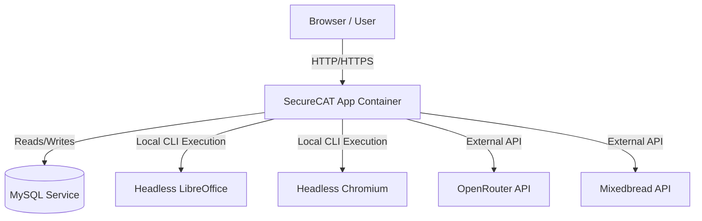

# Spec: SecureCAT v2 Dokploy Deployment Design

This document details the minimal architecture and configuration required to deploy SecureCAT v2 on Dokploy using Docker.

## 1. Architecture Overview

To achieve a simple and low-resource footprint setup for demonstration purposes, we use a minimal architecture consisting of two main services managed inside the private Dokploy network.

### Services
1. **Web Application Container (SecureCAT App):**
   * Built directly from the repository's `Dockerfile`.
   * Automatically executes database migrations and creates the storage symlink on boot.
   * Leverages built-in PDF/Office tool binaries (Chromium, LibreOffice, PDFUnite) pre-installed in the Docker image.
2. **MySQL Database Service:**
   * Handled by a standard MySQL database service created inside Dokploy.

---

## 2. Dynamic Secrets vs. Static Defaults

To minimize setup friction, we split configurations into static defaults (built into the project) and dynamic secrets (defined in the Dokploy UI).

### A. Non-Secret Production Defaults
The following environment configurations are pre-defined in `.env.dokploy.example` and automatically configured inside the application context for the Docker runtime:
* **Drivers:** Cache, Session, and Queue drivers are set to `database`.
* **Tool Paths:** 
  * Chromium (PDF): `/usr/bin/chromium` (No Sandbox)
  * LibreOffice (DOCX to PDF): `/usr/bin/libreoffice`
  * PDFUnite: `/usr/bin/pdfunite`

### B. Dynamic Secrets (To Be Defined in Dokploy UI)
Only the following variables must be configured in the Dokploy Application "Environment" tab:
* `APP_KEY` — Unique cryptographic key for the application.
* `APP_URL` — Your application's public domain.
* `DB_HOST`, `DB_DATABASE`, `DB_USERNAME`, `DB_PASSWORD` — MySQL service credentials.
* `SUPER_ADMIN_EMAIL`, `SUPER_ADMIN_PASSWORD` — Root administrator login (seeded automatically on first boot).
* `OPENROUTER_API_KEY`, `MIXEDBREAD_API_KEY` (Optional AI keys).

---

## 3. Automated Setup Helpers

### A. APP_KEY Setup Logger
If the container starts in production and detects that the `APP_KEY` is missing:
1. It automatically prints a newly generated 32-character base64 key directly into the Dokploy container logs.
2. It displays a setup warning message and exits gracefully.
3. Users can copy the key from the logs and paste it into their Dokploy UI to complete the setup.

### B. Boot Auto-Migrations
The app container automatically runs:
* `php artisan migrate --force`
* `php artisan db:seed --force` (runs initial seeders and creates the Super Admin account)
* `php artisan storage:link`

---

## 4. Persistent Storage (Crucial)

To prevent file loss during container updates/redeployments, mount a persistent volume inside the App Service settings in Dokploy:
* **Mount Path in Container:** `/var/www/html/storage/app`
* **Volume Type:** Local Docker volume (managed automatically by Dokploy).

---

## 5. Dokploy Step-by-Step Setup Guide

### Step 1: Create the MySQL Database
1. Go to your Dokploy dashboard.
2. Click **Databases** → **Create Database** → Select **MySQL**.
3. Note the database credentials (Host, Database Name, Username, Password).

### Step 2: Create and Configure the Application
1. Click **Applications** → **Create Application**.
2. Connect your GitHub account and select the **SecureCAT-v2** repository.
3. Under **Build Provider**, select **Dockerfile**.
4. In the application **Environment** tab, copy the template from `.env.dokploy.example` and fill in the dynamic secrets (specifically `DB_HOST`, `DB_PASSWORD`, `SUPER_ADMIN_PASSWORD`, etc.).
5. Under **Mounts**, create a persistent directory mount mapping a volume to `/var/www/html/storage/app`.

### Step 3: Deploy and Retrieve Key (If needed)
1. Click **Deploy**.
2. If you did not supply an `APP_KEY`, open the **Logs** tab in Dokploy to copy the auto-generated key, paste it into the **Environment** tab, and redeploy.
3. Once completed, your database will be seeded, and you can log in at your configured domain using the `SUPER_ADMIN_EMAIL` and `SUPER_ADMIN_PASSWORD`.
